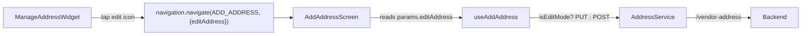

# TRD -- Address Edit Feature

## 1. Overview

Add **edit functionality** to the address list by reusing the existing
**Add Address screen** for both create and edit operations.

The feature allows users to modify an existing address directly from the
address list by tapping an **edit icon**. The same screen used for
adding addresses will support **dual-purpose mode (create/edit)**.

A new **PUT endpoint** will be added to the address service for updating
addresses.

---

## 2. Problem Statement

Currently, users cannot modify an existing address from the address
list.  
If an address contains incorrect information, the user must **delete the
address and create a new one**, which creates a poor user experience.

**Goal:**  
Allow users to directly edit an address from the address list while
maintaining the existing Add Address flow.

---

## 3. High-Level Solution

- Add an **edit icon** to each address item.
- Reuse the **AddAddressScreen** for editing.
- Pass the selected address via **navigation params**.
- Prefill the form with existing data.
- Call a **PUT API** instead of POST when editing.

---

## 4. Data Flow




---

## 5. API Contract

### Endpoint

```
PUT /vendor-address
```

### Request Body Example

```json
{
  "aid": 123,
  "name": "John Doe",
  "phone": "9876543210",
  "pincode": "110001",
  "addressLine1": "Street 1",
  "addressLine2": "Apartment 22",
  "city": "Delhi",
  "state": "Delhi"
}
```

### Response

```
{
  "success": true,
  "message": "Address updated successfully"
}
```

---

# 6. Implementation Tasks

## Service Layer --- Add editAddress method

**File:**  
`src/resources/address/service/Address.service.ts`

Add method:

```
editAddress(request: AddAddressRequest): Promise<AddAddressResponse>
```

Details:

- Same endpoint as add
- Method changes from **POST → PUT**
- Same request and response models

---

## Request Layer --- Add addressId

**File:**  
`src/resources/address/request/AddAddress.request.ts`

Changes:

- Add optional field

```{=html}
<!-- -->
```

```
addressId?: number
```

Update `toJson()`:

```
aid: this.addressId
```

Include only when editing.

---

## Route Params --- Extend AddAddressScreenParams

**File:**  
`src/components/address/add-address/AddAddressScreen.tsx`

Add parameter:

```
editAddress?: Address
```

Behavior:

- If present → **Edit Mode**
- If absent → **Create Mode**

Header title:

- Edit mode → **Edit Address**
- Create mode → **Set Location**

---

## Hook --- Support Edit Mode

**File:**  
`src/components/address/add-address/hooks/useAddAddress.ts`

Changes:

### Detect Edit Mode

```
const isEditMode = editAddress != null
```

### Prefill Address

Initialize state with `editAddress` instead of empty address.

### Pincode Handling

On mount:

- If pincode length is 6
- Call `fetchCityStateFromPinCode`
- Populate city/state/area
- Lock pincode field

### Submit Logic

```
if (isEditMode) {
    AddressService.editAddress(request)
} else {
    AddressService.addNewAddress(request)
}
```

Pass `editAddress.id` as `addressId`.

---

## AddressListItem --- Add Edit Icon

**File:**  
`src/components/address/manage-address/AddressListItem.tsx`

Add props:

```
isEditAllowed?: boolean
onEditClick?: () => void
```

UI behavior:

- Show edit icon when `isEditAllowed === true`
- Icon appears next to delete icon
- Clicking triggers `onEditClick`

---

## ManageAddressWidget --- Wire Edit Callback

**File:**  
`src/components/address/manage-address/ManageAddressWidget.tsx`

Add props:

```
isEditAllowed: boolean
onEditAddress: (item: Address) => void
```

Pass to AddressListItem:

```
onEditClick={() => onEditAddress(item)}
```

---

## useManageAddress Hook --- Add Navigation

**File:**  
`src/components/address/manage-address/hooks/useManageAddress.ts`

Add logic:

```
isEditAllowed = activeTab.addressTag === SHIPPING || STORE
```

Navigation:

```
navigation.navigate(Routes.ADD_ADDRESS, {
  editAddress: item,
  addressType,
  isCollectCustomerInfo,
  isLeaf: false
})
```

Also set:

```
shouldRefreshOnFocusRef.current = true
```

---

## ManageAddressScreen --- Pass Props

**File:**  
`src/components/address/manage-address/ManageAddressScreen.tsx`

Pass from hook:

```
isEditAllowed
onEditAddress
```

To:

```
ManageAddressWidget
```

---

## Localization

**File:**  
`src/resources/address/address.l10n.ts`

Add:

```
editAddress: "Edit Address"
```

---

## Asset Requirement

Ensure edit icon exists:

```
src/assets/images/ic_edit.png
```

If not available:

- Copy from Flutter assets
- Or create following existing icon standards.

---

# 7. Edge Cases

- Editing **default address**
- Editing **store address**
- **Pincode API failure**
- **Network error** during PUT request
- **Invalid address ID**
- Address deleted by another device

---

# 8. Acceptance Criteria

- Edit icon visible for **Shipping** and **Store** addresses
- Clicking edit opens **AddAddressScreen in edit mode**
- Form fields are **prefilled**
- Pincode auto-fetch triggers on mount
- Submit triggers **PUT API**
- Address list **refreshes after successful edit**
- Error messages shown on failure

---

# 9. Key Design Decisions

- **No new route required**
- Existing `ADD_ADDRESS` route reused
- Edit mode determined by **presence of `editAddress` param**
- Shared screen reduces duplicate UI logic

---

