# Detailed Application Flow Diagrams - Flutter Supersale

Based on my analysis of the codebase, here are the comprehensive flow diagrams covering all major scenarios in the application.---

## 1. App Initialization and Launch Flow

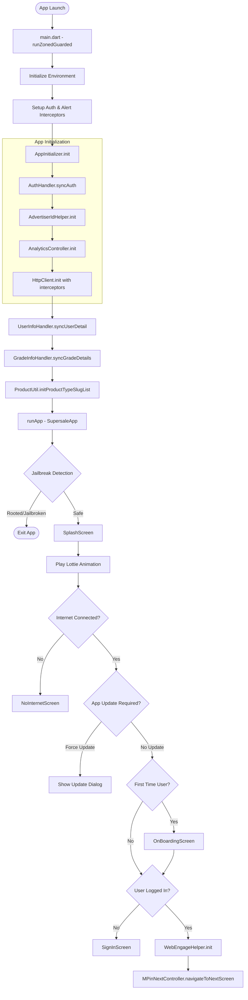

---

## 2. Authentication Flow

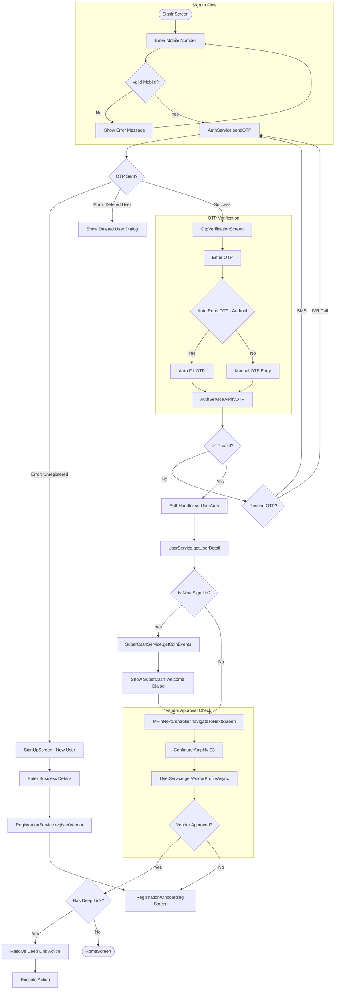

---

## 3. Vendor Onboarding/Registration Flow

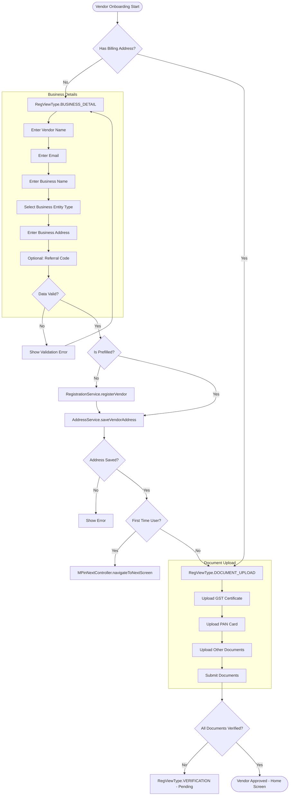

---

## 4. Home Screen and Navigation Flow

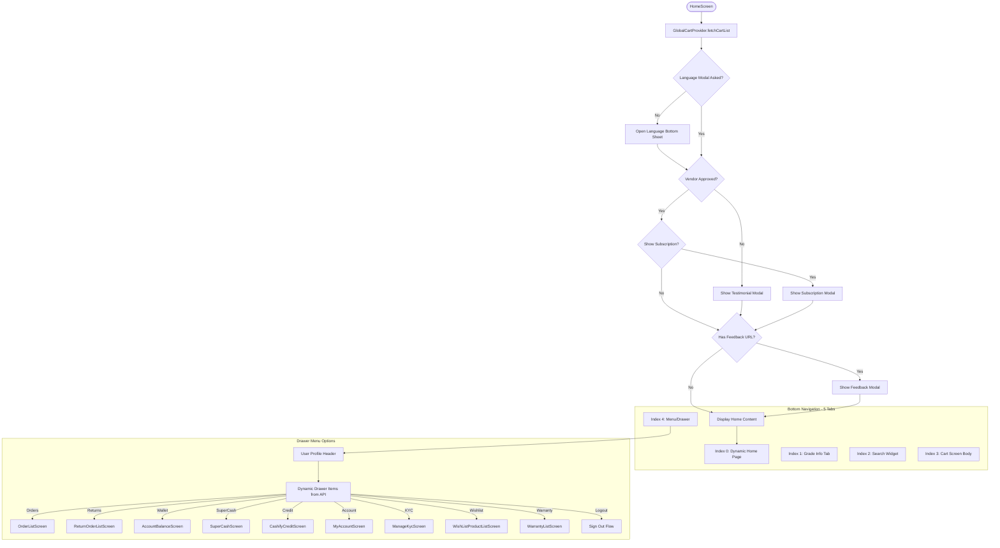

---

## 5. Product Types and Browsing Flow

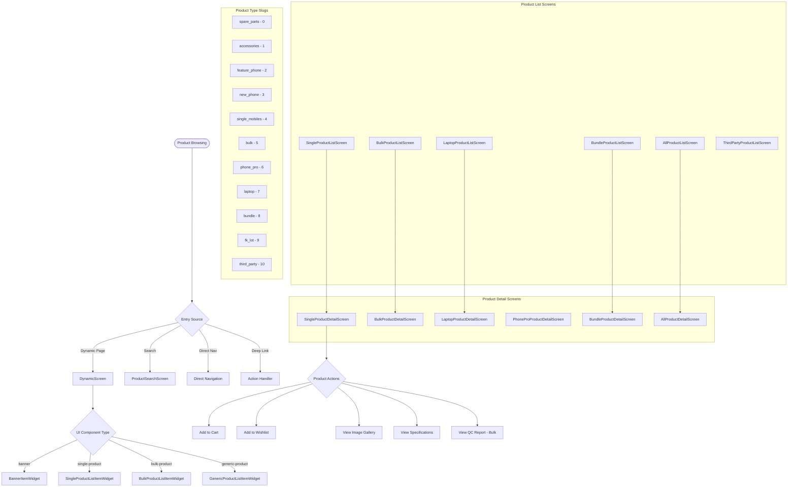

---

## 6. Cart and Checkout Flow

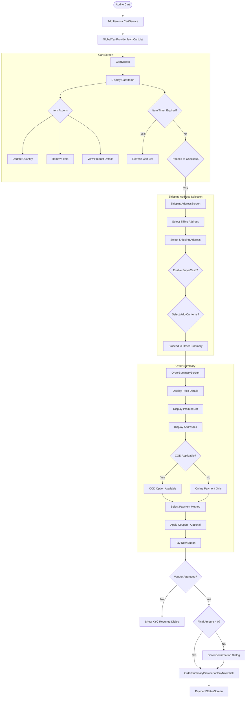

---

## 7. Payment Flow

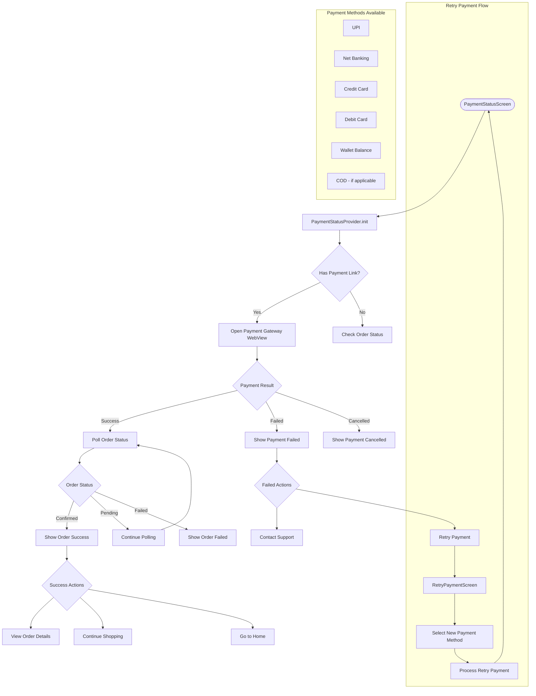

---

## 8. Order Management Flow

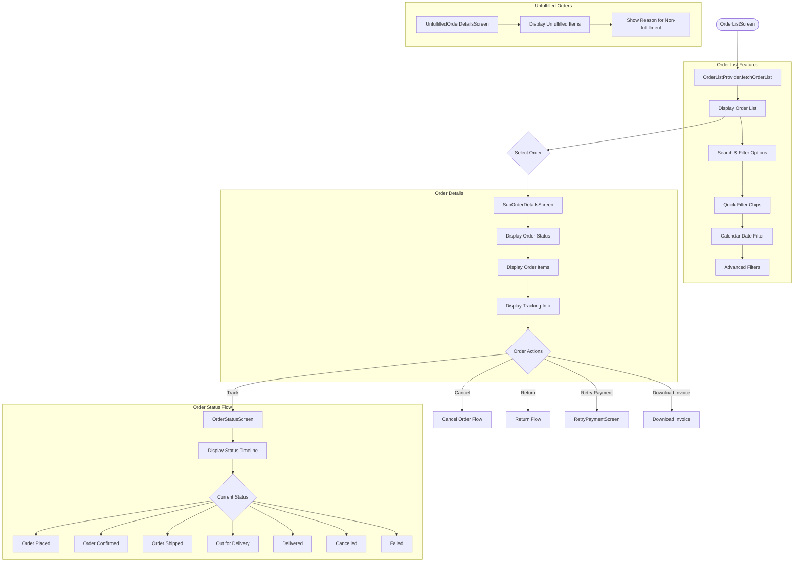

---

## 9. Return Management System (RMS) Flow

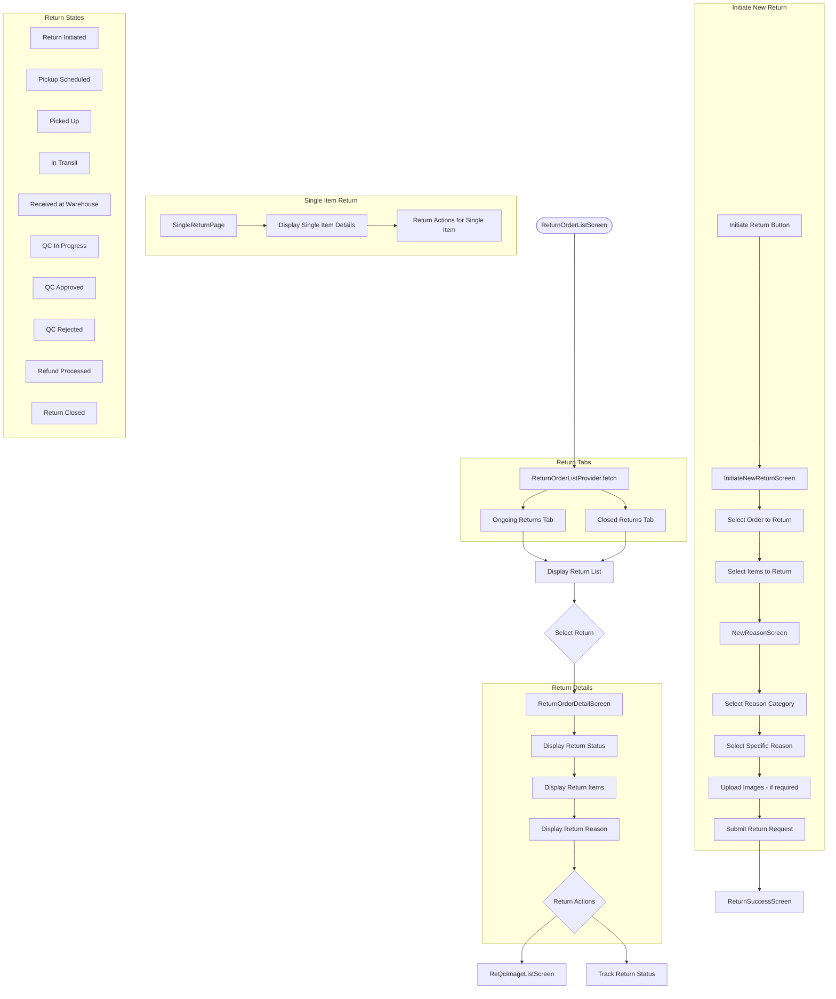

---

## 10. Account Management Flow

```mermaid
flowchart TD
    Account([MyAccountScreen]) --> ProfileSection[Profile Section]
    
    subgraph profile [Profile Management]
        ProfileSection --> ViewProfile[View Profile Details]
        ViewProfile --> EditProfile[Edit Profile]
        EditProfile --> UpdateProfile[Save Profile Changes]
    end
    
    subgraph addresses [Address Management]
        ManageAddress[ManageAddressScreen]
        ManageAddress --> ListAddresses[List All Addresses]
        ListAddresses --> AddAddress[AddAddressScreen]
        ListAddresses --> EditAddress[Edit Address]
        ListAddresses --> DeleteAddress[Delete Address]
        ListAddresses --> SetDefault[Set as Default]
    end
    
    subgraph kyc [KYC Management]
        ManageKYC[ManageKycScreen]
        ManageKYC --> ViewDocuments[View Uploaded Documents]
        ViewDocuments --> UploadNew[Upload New Documents]
        ViewDocuments --> DocumentStatus[View Document Status]
    end
    
    subgraph wallet [Wallet/Balance]
        AccountBalance[AccountBalanceScreen]
        AccountBalance --> ViewBalance[View Current Balance]
        ViewBalance --> ViewTransactions[View Transaction History]
        ViewTransactions --> LedgerDetails[LedgerDetailScreen]
    end
    
    subgraph bank [Bank Details]
        BankDetails[BankDetailsScreen]
        BankDetails --> ViewBankAccounts[View Bank Accounts]
        ViewBankAccounts --> AddBankAccount[Add Bank Account]
        ViewBankAccounts --> VerifyBank[Verify Bank Account]
    end
    
    subgraph supercash [SuperCash]
        SuperCashScreen[SuperCashScreen]
        SuperCashScreen --> ViewSuperCash[View SuperCash Balance]
        ViewSuperCash --> ViewEarnings[View Earnings]
        ViewEarnings --> HowToEarn[How to Earn More]
    end
    
    subgraph warranty [Warranty]
        WarrantyList[WarrantyListScreen]
        WarrantyList --> ViewWarranties[View Registered Warranties]
        ViewWarranties --> RegisterWarranty[RegisterWarrantyScreen]
        RegisterWarranty --> ScanBarcode[BarcodeScannerScreen]
    end
```

---

## 11. Deep Link and Action Handling Flow

```mermaid
flowchart TD
    DeepLink([Deep Link Received]) --> ParseURL[Parse URL]
    ParseURL --> ResolveAction[UserService.resolveDeepLinkAction]
    ResolveAction --> GetActionType[Get ActionType from Response]
    
    GetActionType --> ActionSwitch{Action Type}
    
    ActionSwitch -->|single_mobile| SingleMobileList[SingleProductListScreen]
    ActionSwitch -->|bulk_mobiles| BulkMobileList[BulkProductListScreen]
    ActionSwitch -->|laptop_list| LaptopList[LaptopProductListScreen]
    ActionSwitch -->|bundle_list| BundleList[BundleProductListScreen]
    ActionSwitch -->|single_product| SingleProductPage[SingleProductDetailScreen]
    ActionSwitch -->|lot_product| BulkProductPage[BulkProductDetailScreen]
    ActionSwitch -->|laptop_product| LaptopProductPage[LaptopProductDetailScreen]
    ActionSwitch -->|phone_pro_product| PhoneProPage[PhoneProProductDetailScreen]
    ActionSwitch -->|odetail| OrderDetail[SubOrderDetailsScreen]
    ActionSwitch -->|order_history| OrderHistory[OrderListScreen]
    ActionSwitch -->|ss_return_product| Returns[ReturnOrderListScreen]
    ActionSwitch -->|ss_cart| Cart[CartScreen]
    ActionSwitch -->|manage_wallet| Wallet[AccountBalanceScreen]
    ActionSwitch -->|ss_kyc| KYC[ManageKycScreen]
    ActionSwitch -->|ss_credit| Credit[CashifyCreditScreen]
    ActionSwitch -->|super_cash_page| SuperCash[SuperCashScreen]
    ActionSwitch -->|dynamic_page| DynamicPage[DynamicScreen]
    ActionSwitch -->|wishlist| Wishlist[WishListProductListScreen]
    ActionSwitch -->|collection| Collection[Manual/Auto Collection]
    ActionSwitch -->|vendor_categorisation| VendorCat[VendorCategorisationScreen]
    ActionSwitch -->|grade_list| GradeList[GradeListScreen]
    ActionSwitch -->|grade_detail| GradeDetail[GradeDetailsScreen]
    ActionSwitch -->|warranty_reg| Warranty[WarrantyRegistrationScreen]
    ActionSwitch -->|csh_chat_bot| ChatBot[CshChatBotScreen]
    ActionSwitch -->|ss_pass| Subscription[SubscriptionPlanListScreen]
    ActionSwitch -->|third_party_list| ThirdParty[ThirdPartyProductListScreen]
    ActionSwitch -->|ilink| InternalURL[Internal WebView]
    ActionSwitch -->|elink| ExternalURL[External Browser]
    ActionSwitch -->|log_out| SignOut[Sign Out Flow]
    ActionSwitch -->|home| Home[HomeScreen]
```

---

## 12. Session and Error Handling Flow

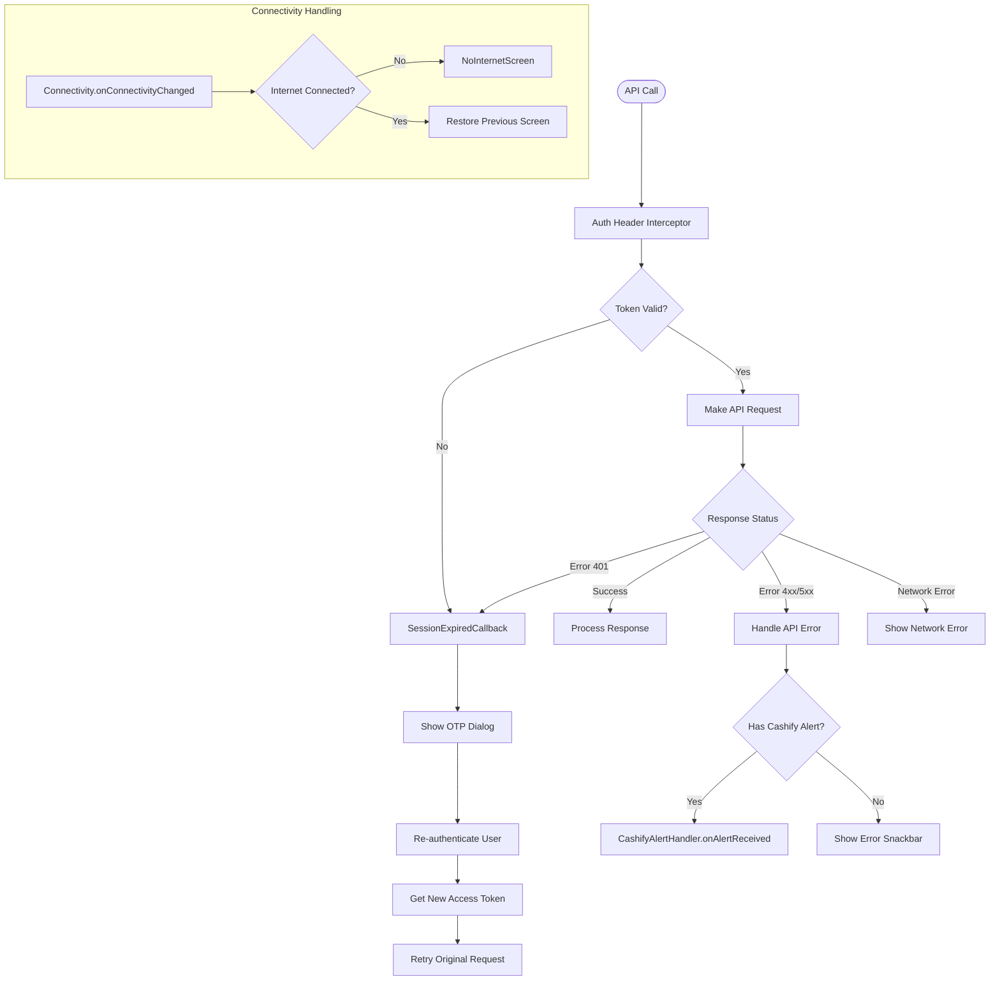

---

## 13. Subscription/SS Pass Flow

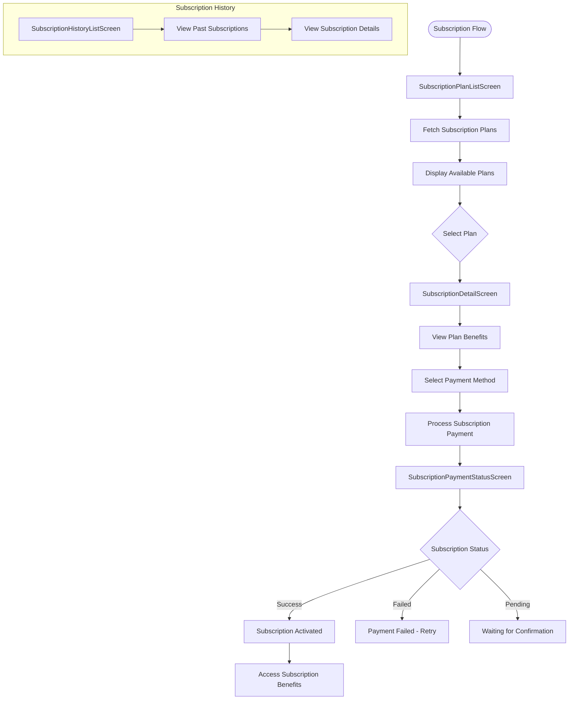