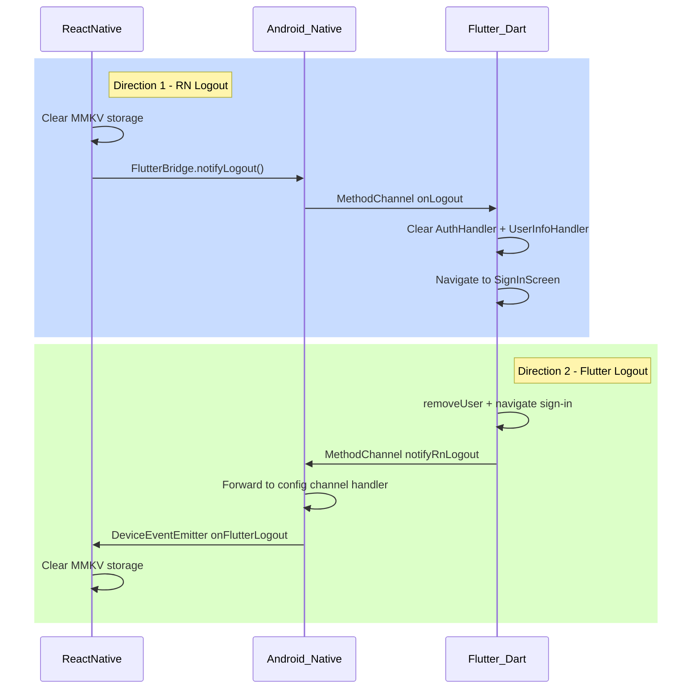

# Bidirectional Logout Sync: RN <-> Flutter

## Architecture




## Direction 1: RN -> Flutter

### 1a. Add `notifyLogout` to Android native bridge

In [FlutterBridgeModule.kt](android/app/src/main/kotlin/in/cashify/supersale/FlutterBridgeModule.kt), add a new `@ReactMethod`:

```kotlin
@ReactMethod
fun notifyLogout() {
    val engine = FlutterEngineManager.getEngine() ?: return
    val messenger = engine.dartExecutor.binaryMessenger
    MethodChannel(messenger, "in.cashify.supersales/config")
        .invokeMethod("onLogout", null)
}
```

### 1b. Register Dart-side MethodChannel handler

In [main.dart](flutter_module/lib/main.dart), inside `main()` after MMKV init (around line 148) and before `runApp`, register a handler on the config channel to receive `onLogout` from native. This is the **Dart-receiving** direction and does not conflict with the **native-receiving** handler in `FlutterEngineManager.registerChannels`.

The handler will:

- Call `AuthHandler().onSessionExpire()` (clears `_userAuth`, sets `_isAlreadyExpired`)
- Call `UserInfoHandler().removeUserDetail()` (clears `response`, removes from storage)
- Call `SharedPreferencesHelper().removeUserLoginCredentials()` (clears PIN, fingerprint, settings)
- Navigate to `SignInScreen` using the global `App.materialKey`

**Important**: Navigation cannot happen in `main()` before `runApp` since `App.materialKey` is not yet set. The handler must be registered in `_SupersaleAppState.initState()` (around line 220) where `App.materialKey` is already initialized.

### 1c. Update RN logout handler

In [src/App.tsx](src/App.tsx), update `handleLogout()` (line 18) to call the native bridge after clearing storage:

```typescript
function handleLogout(): void {
  try {
    LegoAsyncStorage?.shared?.clear?.();
  } catch (e) { /* ... */ }
  FlutterBridge?.notifyLogout?.();
}
```

Also clean up the leftover debug instrumentation in `readUserAuth()` (lines 31-68).

## Direction 2: Flutter -> RN

### 2a. Add `notifyRnLogout` method in native config channel

In [FlutterEngineManager.kt](android/app/src/main/kotlin/in/cashify/supersale/FlutterEngineManager.kt), add a new case `"notifyRnLogout"` in the `CHANNEL_CONFIG` handler (line 103). This method will be called by Flutter Dart when Flutter performs logout. It will forward the event to React Native using `DeviceEventEmitter`.

```kotlin
"notifyRnLogout" -> {
    sendEventToReactNative("onFlutterLogout", null)
    result.success(null)
}
```

### 2b. Add helper to send events to React Native

In [FlutterEngineManager.kt](android/app/src/main/kotlin/in/cashify/supersale/FlutterEngineManager.kt), add a helper method that uses the `ReactApplicationContext` to emit events to RN. This requires storing a reference to the `ReactApplicationContext` from `FlutterBridgeModule`.

Add to `FlutterEngineManager`:

```kotlin
private var reactContext: ReactApplicationContext? = null

fun setReactContext(ctx: ReactApplicationContext?) {
    reactContext = ctx
}

private fun sendEventToReactNative(eventName: String, params: Any?) {
    reactContext
        ?.getJSModule(com.facebook.react.modules.core.DeviceEventManagerModule.RCTDeviceEventEmitter::class.java)
        ?.emit(eventName, params)
}
```

In [FlutterBridgeModule.kt](android/app/src/main/kotlin/in/cashify/supersale/FlutterBridgeModule.kt), pass the `reactApplicationContext` to `FlutterEngineManager` on init:

```kotlin
init {
    FlutterEngineManager.setReactContext(reactContext)
}
```

### 2c. Notify native from Flutter on logout

Create a small utility function that all Flutter logout call sites can invoke. Add it to a new file or alongside `AuthHandler`.

There are **4 active Flutter logout call sites** that call `SharedPreferencesHelper().removeUser()`:

- [sign_out_action.dart](flutter_module/lib/helpers/ssa_actions/actions/sign_out_action.dart) line 23 (drawer sign-out)
- [mpin_login_screen.dart](flutter_module/lib/modules/auth/screens/mpin_login_screen.dart) line 225 (MPIN logout)
- [my_account_redirection.dart](flutter_module/lib/modules/account/screens/my_account_redirection.dart) line 137 (delete account)
- [sign_in.controller.dart](flutter_module/lib/modules/auth/controller/sign_in.controller.dart) line 63 (change number)

After each `removeUser()` call, add:

```dart
const MethodChannel('in.cashify.supersales/config').invokeMethod('notifyRnLogout');
```

Alternatively, embed this call inside `SharedPreferencesHelper.removeUser()` itself so all callers get it automatically (preferred, single point of change).

### 2d. Listen for Flutter logout events in RN

In [src/App.tsx](src/App.tsx), add a `useEffect` (or top-level listener) for the `onFlutterLogout` event:

```typescript
import { DeviceEventEmitter } from 'react-native';

// Inside App component:
useEffect(() => {
  const sub = DeviceEventEmitter.addListener('onFlutterLogout', () => {
    try { LegoAsyncStorage?.shared?.clear?.(); } catch (_) {}
  });
  return () => sub.remove();
}, []);
```

## Files changed (summary)

- [FlutterBridgeModule.kt](android/app/src/main/kotlin/in/cashify/supersale/FlutterBridgeModule.kt) -- add `notifyLogout()` ReactMethod + pass reactContext to FlutterEngineManager
- [FlutterEngineManager.kt](android/app/src/main/kotlin/in/cashify/supersale/FlutterEngineManager.kt) -- add `notifyRnLogout` config handler + `sendEventToReactNative` helper + `setReactContext`
- [main.dart](flutter_module/lib/main.dart) -- register Dart-side MethodChannel handler for `onLogout` in `_SupersaleAppState.initState()`
- [shared_preferences_helper.dart](flutter_module/lib/libraries/shared_preferences/shared_preferences_helper.dart) -- add `notifyRnLogout` call inside `removeUser()`
- [src/App.tsx](src/App.tsx) -- add `FlutterBridge.notifyLogout()` in handleLogout + listen for `onFlutterLogout` event + clean up debug instrumentation

