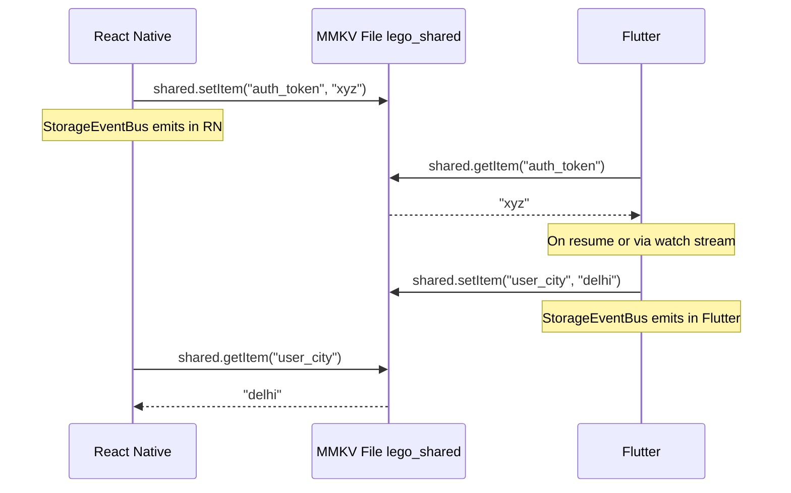

# Dual-Engine Storage with Pub/Sub for React Native and Flutter

## Context

Current state:

- **react-lego-storage** ([react-lego-storage/lib/](react-lego-storage/lib/)): Uses `@react-native-async-storage/async-storage` for persistent storage, JS `Map` for session/memory. No broadcast, no hooks, no engine abstraction.
- **Flutter**: Uses `shared_preferences` via [lib/libraries/shared_preferences/shared_preferences_util.dart](lib/libraries/shared_preferences/shared_preferences_util.dart). No cross-framework awareness.
- **Cross-framework bridge**: Custom native modules ([android/.../SharedStorageModule.kt](android/app/src/main/kotlin/in/cashify/flutter_supersale/SharedStorageModule.kt), [ios/.../SharedStorageModule.swift](ios/Runner/SharedStorageModule.swift)) reading `FlutterSharedPreferences` -- has the `flutter.` key-prefix bug identified earlier.

Goal: Both packages support dual engines (Memory for speed, Persistent for durability), broadcast pub/sub within each framework, and a shared MMKV instance for cross-framework data.

---

## Architecture

```mermaid
graph TB
  subgraph rn [React Native - react-lego-storage]
    RNApp[RN App Code]
    RNHook["useStorageValue(key)"]
    RNBus[StorageEventBus]
    RNLocal[LegoAsyncStorage.local]
    RNSession[LegoAsyncStorage.session]
    RNShared[LegoAsyncStorage.shared]
    RNLRU[LegoAsyncStorage.lru]
    
    RNApp --> RNHook
    RNHook --> RNBus
    RNLocal --> RNBus
    RNSession --> RNBus
    RNShared --> RNBus
  end

  subgraph engines_rn [RN Engines]
    MemEngRN[MemoryEngine]
    MmkvEngRN[MmkvEngine]
    AsyncEngRN[AsyncStorageEngine]
  end
  
  subgraph shared_mmkv [Shared MMKV File on Disk]
    MMKVFile["MMKV ID: lego_shared"]
  end

  subgraph engines_fl [Flutter Engines]
    MemEngFL[MemoryEngine]
    MmkvEngFL[MmkvEngine]
    SPEngFL[SharedPrefsEngine]
  end
  
  subgraph fl [Flutter - flutter_lego_storage]
    FLApp[Flutter App Code]
    FLWatch["storage.watch(key)"]
    FLBus[StorageEventBus]
    FLLocal[LegoStorage.local]
    FLSession[LegoStorage.session]
    FLShared[LegoStorage.shared]
    FLLRU[LegoStorage.lru]
    
    FLApp --> FLWatch
    FLWatch --> FLBus
    FLLocal --> FLBus
    FLSession --> FLBus
    FLShared --> FLBus
  end

  RNSession --> MemEngRN
  RNLocal --> MmkvEngRN
  RNLocal -.-> AsyncEngRN
  RNShared --> MmkvEngRN

  FLSession --> MemEngFL
  FLLocal --> MmkvEngFL
  FLLocal -.-> SPEngFL
  FLShared --> MmkvEngFL

  MmkvEngRN --> MMKVFile
  MmkvEngFL --> MMKVFile
```




Dashed lines = fallback/optional engine. Solid lines = default.

---

## Part 1: Update react-lego-storage

### 1.1 Engine Abstraction

Create `lib/engine/` with a pluggable backend interface:

`**lib/engine/IStorageEngine.ts**` -- unified interface:

```typescript
export interface IStorageEngine {
  getItem(key: string): string | null | Promise<string | null>;
  setItem(key: string, value: string): void | Promise<void>;
  removeItem(key: string): void | Promise<void>;
  clear(): void | Promise<void>;
  getAllKeys?(): string[] | Promise<string[]>;
}
```

`**lib/engine/MemoryEngine.ts**` -- wraps existing `Map` from [lib/storage/memory.storage.ts](react-lego-storage/lib/storage/memory.storage.ts):

```typescript
export class MemoryEngine implements IStorageEngine {
  private store = new Map<string, string>();
  getItem(key: string) { return this.store.get(key) ?? null; }
  setItem(key: string, value: string) { this.store.set(key, value); }
  removeItem(key: string) { this.store.delete(key); }
  clear() { this.store.clear(); }
}
```

`**lib/engine/MmkvEngine.ts**` -- wraps `react-native-mmkv` (optional peer dep):

```typescript
import { MMKV } from 'react-native-mmkv';
export class MmkvEngine implements IStorageEngine {
  private mmkv: MMKV;
  constructor(id: string = 'lego_default', encryptionKey?: string) {
    this.mmkv = new MMKV({ id, encryptionKey });
  }
  getItem(key: string) { return this.mmkv.getString(key) ?? null; }
  setItem(key: string, value: string) { this.mmkv.set(key, value); }
  removeItem(key: string) { this.mmkv.delete(key); }
  clear() { this.mmkv.clearAll(); }
}
```

`**lib/engine/AsyncStorageEngine.ts**` -- wraps current AsyncStorage (fallback):

```typescript
import AsyncStorage from '@react-native-async-storage/async-storage';
export class AsyncStorageEngine implements IStorageEngine {
  async getItem(key: string) { return AsyncStorage.getItem(key); }
  async setItem(key: string, value: string) { await AsyncStorage.setItem(key, value); }
  async removeItem(key: string) { await AsyncStorage.removeItem(key); }
  async clear() { await AsyncStorage.clear(); }
}
```

### 1.2 Broadcast / Pub-Sub

`**lib/broadcast/StorageEventBus.ts**` -- singleton event emitter:

```typescript
type Listener = (key: string, value: string | null, storageType: string) => void;

class StorageEventBus {
  private listeners = new Map<string, Set<Listener>>();
  
  subscribe(key: string, listener: Listener): () => void { /* returns unsubscribe fn */ }
  emit(key: string, value: string | null, storageType: string): void { /* notify listeners */ }
  clear(): void { /* remove all */ }
}

export const storageEventBus = new StorageEventBus();
```

`**lib/broadcast/useStorageValue.ts**` -- React hook:

```typescript
export function useStorageValue(
  storageType: LegoStorageType,
  key: string,
): [string | null, (value: string) => Promise<void>] {
  const [value, setValue] = useState<string | null>(null);
  
  useEffect(() => {
    // Read initial value
    LegoAsyncStorage[storageType].getItem(key).then(setValue);
    // Subscribe to changes
    const unsub = storageEventBus.subscribe(key, (_k, v) => setValue(v));
    return unsub;
  }, [key, storageType]);
  
  const update = useCallback(async (newValue: string) => {
    await LegoAsyncStorage[storageType].setItem(key, newValue);
    // setItem internally fires storageEventBus.emit()
  }, [key, storageType]);
  
  return [value, update];
}
```

### 1.3 Shared Storage Accessor (Cross-Framework)

`**lib/shared/LegoSharedStorage.ts**` -- uses MMKV with ID `"lego_shared"`, no key prefix:

```typescript
export class LegoSharedStorage {
  private engine: MmkvEngine;
  constructor() {
    this.engine = new MmkvEngine('lego_shared');
  }
  getItem(key: string): string | null { return this.engine.getItem(key); }
  setItem(key: string, value: string): void {
    this.engine.setItem(key, value);
    storageEventBus.emit(key, value, 'shared');
  }
  // ... removeItem, getRecord, setRecord, etc.
}
```

This uses the MMKV ID `"lego_shared"` which both RN and Flutter will share.

### 1.4 Modify LegoAsyncStorage.native.ts

Refactor [LegoAsyncStorage.native.ts](react-lego-storage/lib/LegoAsyncStorage.native.ts) to:

- Accept engine config at `init()`
- Route `LocalStorage` / `CookieStorage` through the configured persistent engine
- Route `SessionStorage` through MemoryEngine (keep current `globalThis.__sessionStorage` behavior)
- Fire `storageEventBus.emit()` on every `setItem` / `removeItem`
- Expose `LegoAsyncStorage.shared` as a new `LegoSharedStorage` accessor

```typescript
export interface LegoStorageConfig {
  persistentEngine?: 'mmkv' | 'async-storage' | IStorageEngine;
  mmkvEncryptionKey?: string;
  lruMaxSize?: number;
}

// In init():
public static async init(config: LegoStorageConfig = {}): Promise<void> {
  const engine = resolveEngine(config.persistentEngine ?? 'async-storage');
  // ... wire engine into local/cookie storage paths
}
```

### 1.5 Package.json Changes

Update [react-lego-storage/lib/package.json](react-lego-storage/lib/package.json):

```json
{
  "peerDependencies": {
    "@react-native-async-storage/async-storage": ">=2.0.0",
    "react-native-mmkv": ">=3.0.0",
    "lru-cache": ">=11.0.0",
    "react": ">=18.0.0"
  },
  "peerDependenciesMeta": {
    "@react-native-async-storage/async-storage": { "optional": true },
    "react-native-mmkv": { "optional": true }
  }
}
```

Both MMKV and AsyncStorage are optional. At least one must be installed. Runtime check at `init()`.

---

## Part 2: Create flutter_lego_storage

New Dart package at `flutter_lego_storage/` (project root level, beside `react-lego-storage/`).

### 2.1 Package Structure

```
flutter_lego_storage/
  lib/
    lego_storage.dart                     # public barrel export
    src/
      engine/
        storage_engine.dart               # abstract interface
        memory_engine.dart                # Dart Map-based
        mmkv_engine.dart                  # mmkv package wrapper
        shared_prefs_engine.dart          # shared_preferences wrapper
      storage/
        lego_local_storage.dart           # persistent (engine-backed)
        lego_session_storage.dart         # in-memory (MemoryEngine)
        lego_shared_storage.dart          # cross-framework MMKV
        lego_cache_storage.dart           # LRU cache
        lego_storage_type.dart            # enum
      broadcast/
        storage_event_bus.dart            # StreamController.broadcast
      lego_storage_config.dart            # config class
      lego_storage_main.dart              # static entry point
  pubspec.yaml
  README.md
```

### 2.2 Engine Abstraction

`**lib/src/engine/storage_engine.dart**`:

```dart
abstract class StorageEngine {
  String? getItem(String key);
  void setItem(String key, String value);
  void removeItem(String key);
  void clear();
}
```

`**lib/src/engine/memory_engine.dart**`:

```dart
class MemoryEngine implements StorageEngine {
  final Map<String, String> _store = {};
  String? getItem(String key) => _store[key];
  void setItem(String key, String value) => _store[key] = value;
  void removeItem(String key) => _store.remove(key);
  void clear() => _store.clear();
}
```

`**lib/src/engine/mmkv_engine.dart**`:

```dart
import 'package:mmkv/mmkv.dart';
class MmkvEngine implements StorageEngine {
  late final MMKV _mmkv;
  MmkvEngine({String mmapID = 'lego_default', String? encryptionKey}) {
    _mmkv = MMKV(mmapID, cryptKey: encryptionKey);
  }
  String? getItem(String key) => _mmkv.decodeString(key);
  void setItem(String key, String value) => _mmkv.encodeString(key, value);
  void removeItem(String key) => _mmkv.removeValue(key);
  void clear() => _mmkv.clearAll();
}
```

`**lib/src/engine/shared_prefs_engine.dart**` (fallback):

```dart
import 'package:shared_preferences/shared_preferences.dart';
class SharedPrefsEngine implements StorageEngine {
  late final SharedPreferences _prefs;
  Future<void> init() async { _prefs = await SharedPreferences.getInstance(); }
  String? getItem(String key) => _prefs.getString(key);
  void setItem(String key, String value) => _prefs.setString(key, value);
  void removeItem(String key) => _prefs.remove(key);
  void clear() => _prefs.clear();
}
```

### 2.3 Broadcast / Pub-Sub via Dart Streams

`**lib/src/broadcast/storage_event_bus.dart**`:

```dart
import 'dart:async';

class StorageEvent {
  final String key;
  final String? value;
  final String storageType;
  StorageEvent(this.key, this.value, this.storageType);
}

class StorageEventBus {
  static final StorageEventBus _instance = StorageEventBus._();
  factory StorageEventBus() => _instance;
  StorageEventBus._();

  final _controller = StreamController<StorageEvent>.broadcast();

  /// Watch all storage changes
  Stream<StorageEvent> get stream => _controller.stream;

  /// Watch a specific key
  Stream<String?> watch(String key) =>
      _controller.stream.where((e) => e.key == key).map((e) => e.value);

  void emit(String key, String? value, String storageType) {
    _controller.add(StorageEvent(key, value, storageType));
  }

  void dispose() => _controller.close();
}
```

Usage in Flutter widgets:

```dart
// In a StatefulWidget or with StreamBuilder:
StreamBuilder<String?>(
  stream: LegoStorage.shared.watch('auth_token'),
  builder: (context, snapshot) => Text(snapshot.data ?? 'none'),
)

// Or imperatively:
final sub = LegoStorage.shared.watch('auth_token').listen((value) {
  // handle change
});
```

### 2.4 Storage Accessors

`**lib/src/storage/lego_local_storage.dart**` -- typed wrapper over configured persistent engine (mirrors RN `_LegoAsyncLocalStorage`):

```dart
class LegoLocalStorage {
  final StorageEngine _engine;
  LegoLocalStorage(this._engine);
  
  String? getItem(String key) => _engine.getItem(key);
  void setItem(String key, String value) {
    _engine.setItem(key, value);
    StorageEventBus().emit(key, value, 'local');
  }
  bool? getBoolean(String key) { /* parse */ }
  void setBoolean(String key, bool value) { /* toString + emit */ }
  int? getNumber(String key) { /* parse */ }
  void setNumber(String key, int value) { /* toString + emit */ }
  Map<String, dynamic>? getRecord(String key) { /* jsonDecode */ }
  void setRecord(String key, Map<String, dynamic> value) { /* jsonEncode + emit */ }
  void removeItem(String key) { _engine.removeItem(key); StorageEventBus().emit(key, null, 'local'); }
}
```

`**lib/src/storage/lego_session_storage.dart**` -- always MemoryEngine.
`**lib/src/storage/lego_shared_storage.dart**` -- always MmkvEngine with ID `"lego_shared"`, plus `watch(key)` method.
`**lib/src/storage/lego_cache_storage.dart**` -- LRU cache (Dart `LinkedHashMap` with size limit).

### 2.5 Main Entry Point

`**lib/src/lego_storage_main.dart**`:

```dart
enum LegoEngineType { mmkv, sharedPreferences }

class LegoStorageConfig {
  final LegoEngineType engine;
  final String? mmkvEncryptionKey;
  final int lruMaxSize;
  const LegoStorageConfig({
    this.engine = LegoEngineType.mmkv,
    this.mmkvEncryptionKey,
    this.lruMaxSize = 500,
  });
}

class LegoStorage {
  static late LegoLocalStorage _local;
  static late LegoSessionStorage _session;
  static late LegoSharedStorage _shared;
  static late LegoCacheStorage _lru;

  static Future<void> init([LegoStorageConfig config = const LegoStorageConfig()]) async {
    final persistentEngine = switch (config.engine) {
      LegoEngineType.mmkv => MmkvEngine(encryptionKey: config.mmkvEncryptionKey),
      LegoEngineType.sharedPreferences => SharedPrefsEngine()..await init(),
    };
    _local = LegoLocalStorage(persistentEngine);
    _session = LegoSessionStorage(MemoryEngine());
    _shared = LegoSharedStorage(); // always MMKV with ID "lego_shared"
    _lru = LegoCacheStorage(maxSize: config.lruMaxSize);
  }

  static LegoLocalStorage get local => _local;
  static LegoSessionStorage get session => _session;
  static LegoSharedStorage get shared => _shared;
  static LegoCacheStorage get lru => _lru;
}
```

### 2.6 pubspec.yaml

```yaml
name: lego_storage
description: Cross-platform storage abstraction with dual engines and pub/sub broadcast.
version: 0.1.0

environment:
  sdk: '>=3.0.0 <4.0.0'

dependencies:
  mmkv: ^1.3.9          # optional via conditional import or user-provided
  shared_preferences: ^2.3.0  # optional fallback

dev_dependencies:
  flutter_test:
    sdk: flutter
```

Both `mmkv` and `shared_preferences` as optional -- the user picks which engine at `init()` time. If only one is installed, that one must be selected.

---

## Part 3: Cross-Framework Shared Storage via MMKV

Both frameworks use MMKV ID `"lego_shared"` with raw key names (no `flutter.` prefix, no `_ls_` prefix). This gives true cross-framework read/write with zero key translation.




Cross-framework notifications: Each framework's pub/sub is in-process only. For the other framework to see changes, it re-reads from MMKV on resume (MMKV is memory-mapped, so reads are near-instant). For critical real-time keys, an optional native event bridge can be added later (not in scope for this plan).

---

## Part 4: Migration Path from Current Code

### React Native Side

- Current `LegoAsyncStorage.init(maxSize)` signature changes to `LegoAsyncStorage.init(config)` -- backward compatible by keeping the old signature as an overload
- Current `LegoAsyncStorage.session`, `.local`, `.cookie`, `.lru` accessors remain unchanged
- New `LegoAsyncStorage.shared` accessor added
- Current `globalThis.__sessionStorage` pattern for session storage is preserved (MemoryEngine wraps it)

### Flutter Side

- Replace usage of `SharedPreferencesHelper` / `SharedPreferencesUtil` with `LegoStorage.local` for Flutter-only data
- Use `LegoStorage.shared` for cross-framework data (auth token, user mobile, etc.)
- The old `SharedPreferencesHelper` can be kept temporarily as a thin wrapper that delegates to `LegoStorage`
- Remove custom native `SharedStorageModule.kt` / `SharedStorageModule.swift` -- no longer needed since both frameworks read MMKV directly

---

## File Summary

### Modified Files

- [react-lego-storage/lib/LegoAsyncStorage.native.ts](react-lego-storage/lib/LegoAsyncStorage.native.ts) -- refactor to use engine abstraction, add broadcast emits
- [react-lego-storage/lib/LegoAsyncStorage.ts](react-lego-storage/lib/LegoAsyncStorage.ts) -- same refactor for web (MemoryEngine + localStorage engine)
- [react-lego-storage/lib/storage/lego-storage-type.ts](react-lego-storage/lib/storage/lego-storage-type.ts) -- keep existing types, no breaking changes
- [react-lego-storage/lib/package.json](react-lego-storage/lib/package.json) -- add optional peer deps

### New Files (react-lego-storage)

- `lib/engine/IStorageEngine.ts`
- `lib/engine/MemoryEngine.ts`
- `lib/engine/MmkvEngine.ts`
- `lib/engine/AsyncStorageEngine.ts`
- `lib/engine/index.ts`
- `lib/broadcast/StorageEventBus.ts`
- `lib/broadcast/useStorageValue.ts`
- `lib/broadcast/index.ts`
- `lib/shared/LegoSharedStorage.ts`

### New Package (flutter_lego_storage/)

- Full new Dart package with ~15 files as outlined in section 2.1

