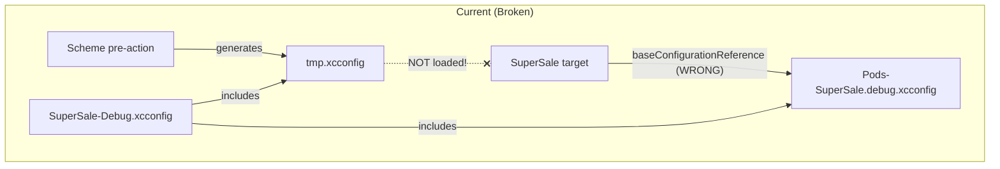
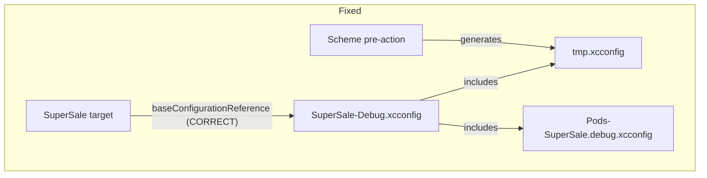

# iOS Config and Flavors Fix

## Root Cause Analysis

The current iOS project has two fundamental issues:

### 1. Broken xcconfig chain

The scheme pre-actions copy the right `.env` file and generate `tmp.xcconfig` with flavor-specific settings (bundle ID, display name, version, etc.). But the target's `baseConfigurationReference` in `project.pbxproj` points directly to `Pods-SuperSale.debug/release.xcconfig`, bypassing `SuperSale-Debug/Release.xcconfig` which includes `tmp.xcconfig`.







### 2. Hardcoded flavor-specific values in pbxproj

Even if the xcconfig chain were fixed, Xcode build settings in `project.pbxproj` override xcconfig values. These must be removed:

- `PRODUCT_BUNDLE_IDENTIFIER = in.cashify.supersales.stage` (hardcoded for ALL targets)
- `MARKETING_VERSION = 23.0.0` / `CURRENT_PROJECT_VERSION = 1` (should come from env files: `22.1.0` / `164`)

---

## Task 1: Copy App Icon images from backup

The current `ios/SuperSale/Images.xcassets/AppIcon.appiconset/` has `Contents.json` with size definitions but **NO actual image files**. The backup has all 10 PNG icons.

- **Copy** all PNG files from `ios_flutter_backup/Runner/Assets.xcassets/AppIcon.appiconset/` to `ios/SuperSale/Images.xcassets/AppIcon.appiconset/`
- **Update** `Contents.json` to include `filename` entries matching the backup's [Contents.json](ios_flutter_backup/Runner/Assets.xcassets/AppIcon.appiconset/Contents.json) (which maps each size/scale to a specific PNG file)

Files to copy:

- `app_ios_29.png`, `app_ios_40.png`, `app_ios_58.png`, `app_ios_60.png`
- `app_ios_80.png`, `app_ios_87.png`, `app_ios_120.png`, `app_ios_120 1.png`
- `app_ios_180.png`, `app_ios_1024.png`

## Task 2: Fix xcconfig chain for SuperSale target

In [project.pbxproj](ios/SuperSale.xcodeproj/project.pbxproj), change `baseConfigurationReference` for the SuperSale target:

- **Debug**: Change from `Pods-SuperSale.debug.xcconfig` to `SuperSale-Debug.xcconfig`
- **Release**: Change from `Pods-SuperSale.release.xcconfig` to `SuperSale-Release.xcconfig`

This works because `SuperSale-Debug.xcconfig` already includes both `tmp.xcconfig` (env values) and `Pods-SuperSale.debug.xcconfig`:

```
#include "tmp.xcconfig"
#include "Pods/Target Support Files/Pods-SuperSale/Pods-SuperSale.debug.xcconfig"
```

## Task 3: Fix xcconfig chain for extension targets

Create 4 new wrapper xcconfig files for the extensions (Debug + Release for each):

- `ios/Extension-NotificationService-Debug.xcconfig` -- includes `tmp.xcconfig`, Pods-NotificationService debug config, sets `PRODUCT_BUNDLE_IDENTIFIER = $(PRODUCT_BUNDLE_IDENTIFIER).NotificationService`
- `ios/Extension-NotificationService-Release.xcconfig` -- same with release Pods config
- `ios/Extension-NotificationViewController-Debug.xcconfig` -- includes `tmp.xcconfig`, Pods-NotificationViewController debug config, sets `PRODUCT_BUNDLE_IDENTIFIER = $(PRODUCT_BUNDLE_IDENTIFIER).NotificationViewController`
- `ios/Extension-NotificationViewController-Release.xcconfig` -- same with release Pods config

Example content for `Extension-NotificationService-Debug.xcconfig`:

```xcconfig
// Wrapper: tmp.xcconfig (flavor) + extension bundle ID + Pods
#include "tmp.xcconfig"
PRODUCT_BUNDLE_IDENTIFIER = $(PRODUCT_BUNDLE_IDENTIFIER).NotificationService
#include "Pods/Target Support Files/Pods-NotificationService/Pods-NotificationService.debug.xcconfig"
```

Then in `project.pbxproj`:

- Add PBXFileReference entries for the 4 new xcconfig files
- Add them to the root PBXGroup (**NOT the Pods group** — see Task 4)
- Change `baseConfigurationReference` for each extension target's Debug/Release configurations to point to the corresponding wrapper xcconfig

## Task 4: Set correct PBXGroup and sourceTree for custom xcconfig files

> **CRITICAL**: This step prevents the "Unable to open base configuration reference file" error that occurs when Xcode resolves paths relative to the wrong parent group.

### Problem

When custom xcconfig file references are placed in the `Pods` PBXGroup (which has `path = Pods`), Xcode resolves their paths as `ios/Pods/<filename>` instead of `ios/<filename>`, because `sourceTree = "<group>"` resolves paths relative to the parent group's location.

### Solution

All custom xcconfig PBXFileReference entries (both the SuperSale wrapper configs and the extension wrapper configs) must:

1. **Be placed in the root PBXGroup** (the `mainGroup`), NOT in the `Pods` PBXGroup
2. **Use `sourceTree = SOURCE_ROOT`** instead of `sourceTree = "<group>"` — this makes the path always resolve relative to `SRCROOT` (the `ios/` directory), regardless of which PBXGroup contains the reference. This eliminates Xcode caching issues.
3. **Include a `name` attribute** alongside the `path` attribute

Example PBXFileReference entry:

```
EXTSVCDB2F4897C500245F8D /* Extension-NotificationService-Debug.xcconfig */ = {
    isa = PBXFileReference;
    lastKnownFileType = text.xcconfig;
    name = "Extension-NotificationService-Debug.xcconfig";
    path = "Extension-NotificationService-Debug.xcconfig";
    sourceTree = SOURCE_ROOT;
};
```

The `Pods` PBXGroup should ONLY contain the Pods-generated xcconfig files (e.g., `Pods-SuperSale.debug.xcconfig`) — these use `sourceTree = "<group>"` correctly because they live inside `ios/Pods/`.

### Root PBXGroup children should include

```
children = (
    ... existing project groups ...,
    BBD78D7AC51CEA395F1C20DB /* Pods */,
    RNC0E1A2B3C4D5E6F7A8B9C0D /* SuperSale-Debug.xcconfig */,
    RNC0E1A2B3C4D5E6F7A8B9C0E /* SuperSale-Release.xcconfig */,
    EXTSVC0012F4897C500245F8D /* Extension-NotificationService.xcconfig */,
    EXTSVCDB2F4897C500245F8D /* Extension-NotificationService-Debug.xcconfig */,
    EXTSVCRL2F4897C500245F8E /* Extension-NotificationService-Release.xcconfig */,
    EXTVWC0012F48985200245F8D /* Extension-NotificationViewController.xcconfig */,
    EXTVWCDB2F48985200245F8D /* Extension-NotificationViewController-Debug.xcconfig */,
    EXTVWCRL2F48985200245F8E /* Extension-NotificationViewController-Release.xcconfig */,
);
```

## Task 5: Remove hardcoded flavor-specific settings from pbxproj

Remove these build settings from the **SuperSale target** (both Debug and Release sections) in `project.pbxproj` so they come from `tmp.xcconfig` instead:

- `PRODUCT_BUNDLE_IDENTIFIER = in.cashify.supersales.stage`
- `MARKETING_VERSION = 23.0.0`
- `CURRENT_PROJECT_VERSION = 1`

Remove from **extension targets** (NotificationService + NotificationViewController, both Debug and Release):

- `PRODUCT_BUNDLE_IDENTIFIER = in.cashify.supersales.stage`

Keep extension-specific `MARKETING_VERSION` and `CURRENT_PROJECT_VERSION` as-is (they are independent from the app's version).

> **IMPORTANT**: If hardcoded `PRODUCT_BUNDLE_IDENTIFIER` remains in `project.pbxproj`, it will **always override** the xcconfig value, breaking the flavor system. The value from `tmp.xcconfig` (populated by the `.env` file) will be ignored.

## Task 6: Fix WebEngage extension bridging headers (pure-Swift pods)

> **Context**: The `WEServiceExtension` (v1.2+) and `WEContentExtension` (v1.1+) pods are now **pure Swift modules** — they no longer ship Obj-C `.h` header files. The old bridging header `#import` directives will fail with "file not found" errors.

### NotificationService

`**ios/NotificationService/ServiceExtension-Bridging-Header.h`** — Remove the Obj-C import:

```objc
// REMOVE this line:
#import <WEServiceExtension/WEXPushNotificationService.h>

// KEEP this line:
#import <UserNotifications/UserNotifications.h>
```

`**ios/NotificationService/NotificationService.swift**` — Add Swift import:

```swift
import UserNotifications
import WEServiceExtension  // ADD this line

class NotificationService: WEXPushNotificationService { }
```

### NotificationViewController

`**ios/NotificationViewController/NotificationViewController-Bridging-Header.h**` — Remove the Obj-C import:

```objc
// REMOVE this line:
#import <WEContentExtension/WEXRichPushNotificationViewController.h>
```

`**ios/NotificationViewController/NotificationViewController.swift**` — Add Swift import:

```swift
import UIKit
import UserNotifications
import UserNotificationsUI
import WEContentExtension  // ADD this line

class NotificationViewController: WEXRichPushNotificationViewController { }
```

### How to detect if this fix is needed

Check whether the installed pod contains `.h` files or only `.swift` files:

```bash
find ios/Pods/WEServiceExtension -name "*.h"    # if empty → pure Swift, needs this fix
find ios/Pods/WEContentExtension -name "*.h"     # if empty → pure Swift, needs this fix
```

If the pods still have `.h` files (older versions), keep the original Obj-C bridging header imports instead.

## Task 7: Disable user script sandboxing for extension targets

> **Context**: Xcode 14+ defaults `ENABLE_USER_SCRIPT_SANDBOXING` to `YES` for new targets. This prevents CocoaPods build scripts from writing files like `resources-to-copy-NotificationService.txt` into the `Pods/` directory, causing "Sandbox: deny(1) file-write-create" errors.

In `project.pbxproj`, set `ENABLE_USER_SCRIPT_SANDBOXING = NO` in all **extension target** build configurations:

- NotificationService Debug
- NotificationService Release
- NotificationViewController Debug
- NotificationViewController Release

This does NOT need to be changed for the main SuperSale target (which typically already has it set to `NO` via CocoaPods).

## Task 8: Patch Firebase iOS SDK 12 compatibility (Podfile)

> **Context**: When using `$FirebaseSDKVersion = '12.8.0'` (to align Flutter Firebase with React Native Firebase), the Flutter `firebase_core` plugin (v3.4.0) fails to compile because Firebase iOS SDK 12 removed `FIROptions.deepLinkURLScheme` (Firebase Dynamic Links was sunset). This is a compile-time error in `FLTFirebaseCorePlugin.m`.

Add a patch function in the `Podfile` that automatically removes `deepLinkURLScheme` references from the Flutter plugin source. This runs at `pod install` time and survives `flutter pub get` (which can restore the original plugin files).

Add this **before** the `target` blocks in the Podfile:

```ruby
# Firebase iOS SDK 12 removed FIROptions.deepLinkURLScheme (Dynamic Links sunset).
# Flutter firebase_core 3.4.0 still references it. Patch until we upgrade to firebase_core 4.x.
def patch_firebase_core_deep_link!
  plugin_path = File.join(__dir__, '../flutter_module/.ios/.symlinks/plugins/firebase_core/ios/Classes/FLTFirebaseCorePlugin.m')
  return unless File.exist?(plugin_path)
  content = File.read(plugin_path)
  return unless content.include?('options.deepLinkURLScheme')
  content = content.gsub(
    '(id)options.deepLinkURLScheme ?: [NSNull null]',
    '[NSNull null]'
  )
  content = content.gsub(
    /^\s*\/\/ kFirebaseOptionsDeepLinkURLScheme\n\s*if \(!\[initializeAppRequest\.deepLinkURLScheme isEqual:\[NSNull null\]\]\) \{\n\s*options\.deepLinkURLScheme = initializeAppRequest\.deepLinkURLScheme;\n\s*\}\n/,
    ''
  )
  File.write(plugin_path, content)
  Pod::UI.puts '[Podfile] Patched firebase_core: removed deepLinkURLScheme (unsupported in Firebase iOS SDK 12)'.yellow
end
patch_firebase_core_deep_link!
```

### When this patch is needed

- `$FirebaseSDKVersion` is set to `12.x` in the Podfile
- Flutter `firebase_core` is version 3.x (which still references `deepLinkURLScheme`)
- This patch is NOT needed once `firebase_core` is upgraded to 4.x+

## Task 9: Verify env files

Both `.env.stage` and `.env.prod` already have the correct iOS build settings at the bottom:


| Setting                             | `.env.stage`                  | `.env.prod`             |
| ----------------------------------- | ----------------------------- | ----------------------- |
| `PRODUCT_BUNDLE_IDENTIFIER`         | `in.cashify.supersales.stage` | `in.cashify.supersales` |
| `DEVELOPMENT_TEAM`                  | `THK9238J7P`                  | `K8KEUS25V9`            |
| `MARKETING_VERSION`                 | `22.1.0`                      | `22.1.0`                |
| `CURRENT_PROJECT_VERSION`           | `164`                         | `164`                   |
| `INFOPLIST_KEY_CFBundleDisplayName` | `Supersale Stage`             | `Supersale`             |


No changes needed here -- values are already correct and match the backup's Flutter configuration.

---

## Post-build checklist

After applying all tasks, verify:

1. **Fully quit Xcode** (Cmd+Q) and clear DerivedData: `rm -rf ~/Library/Developer/Xcode/DerivedData`
2. Open the `**.xcworkspace`** (not `.xcodeproj`) — the workspace includes the Pods project
3. Select the **SuperSaleStage** scheme and build

## Summary of what gets fixed

After these changes:

- **App Icon**: Visible in Xcode General tab (actual PNG files in appiconset)
- **Display Name**: "Supersale Stage" (stage) / "Supersale" (prod) -- loaded from env -> tmp.xcconfig -> Info.plist
- **Build Version**: `22.1.0` from env files
- **Build Number**: `164` from env files
- **Prod flavor**: Works correctly with `in.cashify.supersales` bundle ID, `K8KEUS25V9` dev team
- **Stage flavor**: Continues working with `in.cashify.supersales.stage`
- **Extension bundle IDs**: Automatically derived per flavor (e.g., `in.cashify.supersales.NotificationService` for prod)
- **WebEngage extensions**: Compile correctly with pure-Swift pods
- **CocoaPods scripts**: Run without sandbox restrictions for extensions
- **Firebase compatibility**: Compiles with Firebase iOS SDK 12.x

## Common pitfalls (avoid these)


| Pitfall                                                    | Consequence                                                | Prevention                                           |
| ---------------------------------------------------------- | ---------------------------------------------------------- | ---------------------------------------------------- |
| Placing custom xcconfig refs in the `Pods` PBXGroup        | Xcode resolves paths as `ios/Pods/<filename>`              | Always put in root PBXGroup                          |
| Using `sourceTree = "<group>"` for custom xcconfigs        | Path resolution depends on group hierarchy, caching issues | Use `sourceTree = SOURCE_ROOT`                       |
| Leaving hardcoded `PRODUCT_BUNDLE_IDENTIFIER` in pbxproj   | Overrides xcconfig value, breaks flavor switching          | Remove from all target buildSettings                 |
| Using Obj-C `#import` for pure-Swift pods                  | "header file not found" compile error                      | Check pod for `.h` files; use Swift `import` if none |
| `ENABLE_USER_SCRIPT_SANDBOXING = YES` on extension targets | CocoaPods scripts can't write to `Pods/` directory         | Set to `NO` for extension targets                    |
| Not clearing DerivedData after project changes             | Xcode uses cached old configuration                        | Always clear after scheme/xcconfig changes           |
| Opening `.xcodeproj` instead of `.xcworkspace`             | Pods project not included, missing settings                | Always open `.xcworkspace`                           |


