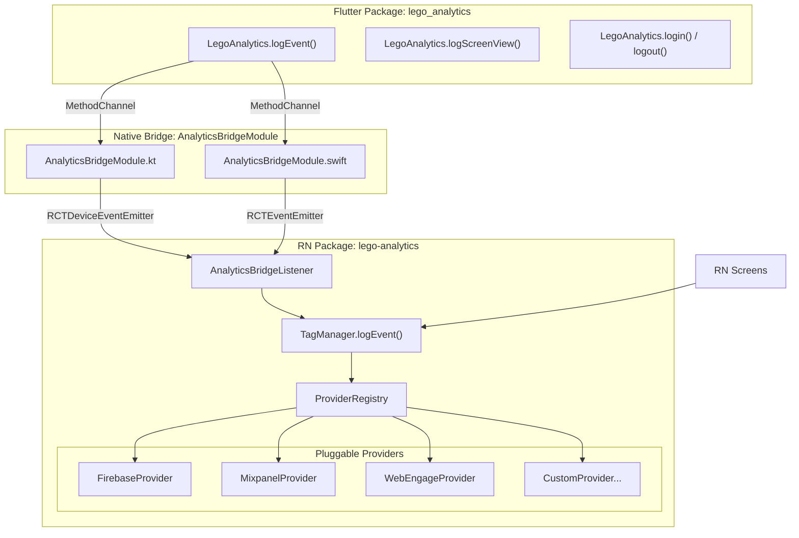
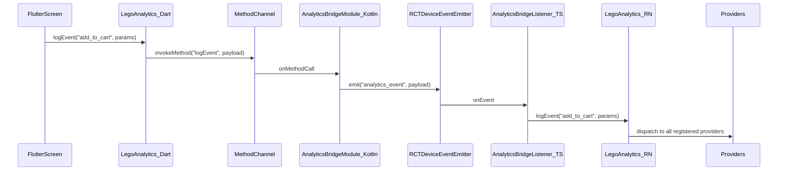
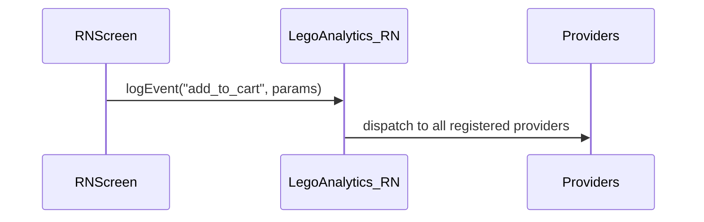

# Reusable Analytics Bridge Package

## Architecture




## Package Structure

### 1. RN Package: `@reglobe/lego-analytics`

Following the same pattern as `@reglobe/lego-storage`:

```
react-lego-analytics/
├── lib/
│   ├── index.ts                        # Public exports
│   ├── LegoAnalytics.ts                # Main static API (init, logEvent, logScreenView, login, logout)
│   ├── LegoAnalytics.native.ts         # Native implementation (platform-specific)
│   ├── provider/
│   │   ├── IAnalyticsProvider.ts        # Provider interface (replaces TagEventManager)
│   │   ├── ProviderRegistry.ts          # Registry to add/remove providers at runtime
│   │   ├── FirebaseProvider.native.ts   # Firebase Analytics provider
│   │   ├── MixpanelProvider.native.ts   # Mixpanel provider (optional)
│   │   ├── WebEngageProvider.native.ts  # WebEngage provider (optional)
│   │   └── index.ts                     # Export all providers
│   ├── bridge/
│   │   ├── AnalyticsBridgeListener.ts   # Listens to events from Flutter via native bridge
│   │   └── constants.ts                 # Channel names, event types
│   ├── screen-tracking/
│   │   └── useScreenTracking.ts         # React Navigation screen tracking hook
│   └── data-layer/
│       └── DataLayer.ts                 # Shared data layer (common params for all events)
├── package.json
└── README.md
```

### 2. Flutter Package: `lego_analytics`

Following the same pattern as `lego_storage`:

```
flutter_lego_analytics/
├── lib/
│   ├── lego_analytics.dart              # Public exports
│   └── src/
│       ├── lego_analytics_main.dart     # Main static API (logEvent, logScreenView, login, logout)
│       ├── lego_analytics_config.dart   # Config (channel name)
│       ├── analytics_channel.dart       # MethodChannel wrapper (sends to native)
│       └── screen_observer.dart         # NavigatorObserver that auto-calls logScreenView
├── pubspec.yaml
└── README.md
```

### 3. Native Bridge (per-project, template code)

```
android/.../AnalyticsBridgeModule.kt     # Receives MethodChannel, emits to RN
ios/.../AnalyticsBridgeModule.swift       # Receives MethodChannel, emits to RN
```

---

## Key Interfaces

### `IAnalyticsProvider` (RN side)

```typescript
export interface IAnalyticsProvider {
  readonly name: string;
  init(config: Record<string, any>): void;
  logEvent(name: string, params: Record<string, any>): void;
  logScreenView(screenName: string, params?: Record<string, any>): void;
  login(identity: { userId?: string; phone?: string; email?: string }): void;
  logout(): void;
  setUserProperties(props: Record<string, any>): void;
}
```

Each project registers only the providers it needs:

```typescript
// In SuperSale app
LegoAnalytics.init({
  providers: [
    new FirebaseProvider(),
    new MixpanelProvider({ token: MIXPANEL_TOKEN }),
    new WebEngageProvider(),
  ],
});

// In another project with only Firebase
LegoAnalytics.init({
  providers: [
    new FirebaseProvider(),
  ],
});
```

### `LegoAnalytics` (Flutter side) -- sender only

```dart
class LegoAnalytics {
  static Future<void> logEvent(String name, Map<String, dynamic> params);
  static Future<void> logScreenView(String screenName, [Map<String, dynamic>? params]);
  static Future<void> login({String? userId, String? phone, String? email});
  static Future<void> logout();
  static Future<void> setUserProperties(Map<String, dynamic> props);
}
```

All methods simply serialize and send via MethodChannel. No SDK dependencies.

---

## Event Flow

### Flutter-originated event:




### RN-originated event (direct, no bridge):




---

## Implementation Steps

### Phase 1: RN Package (`@reglobe/lego-analytics`)

**1a.** Create `react-lego-analytics/` at project root, following the `react-lego-storage` folder structure. Create `package.json` with peer deps for provider SDKs (`@react-native-firebase/analytics`, `mixpanel-react-native`, `react-native-webengage` as optional peer deps).

**1b.** Define `IAnalyticsProvider` interface in `lib/provider/IAnalyticsProvider.ts`. This is the contract every provider must implement.

**1c.** Create `ProviderRegistry` in `lib/provider/ProviderRegistry.ts` -- a simple array that holds registered providers and iterates over them for each event call.

**1d.** Create `FirebaseProvider`, `MixpanelProvider`, `WebEngageProvider` in `lib/provider/` -- each wrapping the respective RN SDK. Port logic from existing [tag-manager.native.ts](react-lego-buy/packages/lego-core/tag-manager/tag-manager.native.ts), [mixpanel-manager.native.ts](react-lego-buy/packages/lego-core/tag-manager/mixpanel/mixpanel-manager.native.ts), and [web-engage-manager.native.ts](react-lego-buy/packages/lego-core/tag-manager/web-engage/web-engage-manager.native.ts) but refactored to implement `IAnalyticsProvider`.

**1e.** Create `LegoAnalytics.native.ts` as the main static API. Methods: `init()`, `logEvent()`, `logScreenView()`, `login()`, `logout()`, `setUserProperties()`. Internally dispatches to `ProviderRegistry`.

**1f.** Create `AnalyticsBridgeListener` in `lib/bridge/AnalyticsBridgeListener.ts`. Uses `DeviceEventEmitter.addListener('analytics_event', ...)` to receive events from the native bridge and forward to `LegoAnalytics`. Should be initialized once in `LegoAnalytics.init()`.

**1g.** Create `useScreenTracking` hook in `lib/screen-tracking/useScreenTracking.ts` for React Navigation `onStateChange` integration. Calls `LegoAnalytics.logScreenView()` on every navigation state change.

### Phase 2: Flutter Package (`lego_analytics`)

**2a.** Create `flutter_lego_analytics/` at project root, following the `flutter_lego_storage` structure. Create `pubspec.yaml` with NO analytics SDK dependencies (Flutter side is a pure sender).

**2b.** Create `AnalyticsChannel` in `lib/src/analytics_channel.dart` -- wraps a `MethodChannel('in.cashify.supersales/analytics')` with methods that serialize events to `Map` and call `invokeMethod`.

**2c.** Create `LegoAnalytics` in `lib/src/lego_analytics_main.dart` as the main static API. Same method signatures as current [AnalyticsController](lib/analytics/analytics_controller.dart) but internally calls `AnalyticsChannel` instead of SDK helpers.

**2d.** Create `AnalyticsScreenObserver` in `lib/src/screen_observer.dart` -- a `NavigatorObserver` that calls `LegoAnalytics.logScreenView(routeName)` on every `didPush`. This replaces `FirebaseAnalyticsObserver` in `MaterialApp.navigatorObservers`. The observer sends screen_view through the bridge, so RN dispatches to all providers.

**2e.** Export public API from `lib/lego_analytics.dart`.

### Phase 3: Native Bridge (Android)

**3a.** Create `AnalyticsBridgeModule.kt` in [android/app/src/main/kotlin/in/cashify/supersale/](android/app/src/main/kotlin/in/cashify/supersale/). It needs access to both:

- Flutter's MethodChannel (receives events from Flutter)
- RN's `ReactApplicationContext` (emits events to RN JS via `RCTDeviceEventEmitter`)

**3b.** Register a new MethodChannel `in.cashify.supersales/analytics` in [FlutterEngineManager.kt](android/app/src/main/kotlin/in/cashify/supersale/FlutterEngineManager.kt) `registerChannels()`. Route incoming calls (`logEvent`, `logScreenView`, `login`, `logout`, `setUserProperties`) to `AnalyticsBridgeModule`.

**3c.** `AnalyticsBridgeModule` emits events to RN JS thread:

```kotlin
reactContext
  .getJSModule(DeviceEventManagerModule.RCTDeviceEventEmitter::class.java)
  .emit("analytics_event", payload)
```

**3d.** Add a small startup queue: if `ReactContext` is not yet available when Flutter sends an event (cold start edge case), buffer events in a list and flush when `ReactContext` becomes available via `ReactContextBaseJavaModule.initialize()`.

### Phase 4: Native Bridge (iOS)

**4a.** Create `AnalyticsBridgeModule.swift` in [ios/SuperSale/](ios/SuperSale/). Same pattern as Android:

- Receives from Flutter's MethodChannel
- Emits to RN via `RCTEventEmitter` (`sendEvent(withName:body:)`)

**4b.** Register the analytics MethodChannel in [FlutterEngineManager.swift](ios/SuperSale/FlutterEngineManager.swift).

**4c.** Same startup queue pattern as Android.

### Phase 5: Integration in SuperSale

**5a.** In [src/App.tsx](src/App.tsx), initialize `LegoAnalytics` before launching Flutter:

```typescript
LegoAnalytics.init({
  providers: [
    new FirebaseProvider(),
    new MixpanelProvider({ token: ENV.MIXPANEL_TOKEN }),
    new WebEngageProvider(),
  ],
});
```

**5b.** In Flutter's [main.dart](lib/main.dart), replace `FirebaseAnalyticsObserver` with the new `AnalyticsScreenObserver` from `lego_analytics`:

```dart
navigatorObservers: [
  CshRouteObserver().instance,
  AnalyticsScreenObserver(),  // replaces FirebaseAnalyticsObserver
],
```

**5c.** Replace all `AnalyticsController.logEvent()` calls in Flutter with `LegoAnalytics.logEvent()`. Since both have the same signature pattern (`eventName, params`), this is a find-and-replace. The `BaseTrackingEvent` pattern can remain -- just change the dispatch target.

**5d.** Replace `WebEngageHelper.onUserLogin()`, `MixPanelHelper.setUserProperties()`, etc. with `LegoAnalytics.login()` / `LegoAnalytics.setUserProperties()`.

**5e.** Remove Flutter SDK dependencies from `flutter_module/pubspec.yaml`: `mixpanel_flutter`, `webengage_flutter`. Keep `firebase_analytics` only if used for non-analytics purposes (like Remote Config, which uses `firebase_core`, not `firebase_analytics`).

### Phase 6: Reusability for Other Projects

**6a.** Extract `react-lego-analytics` and `flutter_lego_analytics` as versioned packages (same as `@reglobe/lego-storage` and `lego_storage`).

**6b.** The native bridge (Android + iOS) is provided as template code in the package README. Each project copies the template and registers the MethodChannel in their own `FlutterEngineManager`. This is necessary because the native bridge needs access to both the Flutter engine and RN ReactContext, which are project-specific.

**6c.** For a new project, the setup is:

1. Install `@reglobe/lego-analytics` (RN side)
2. Install `lego_analytics` (Flutter side)
3. Copy native bridge template (Android + iOS)
4. Call `LegoAnalytics.init({ providers: [...] })` in RN
5. Replace Flutter analytics calls with `LegoAnalytics.logEvent()`
6. Replace `FirebaseAnalyticsObserver` with `AnalyticsScreenObserver`

---

## Critical: WebEngage Regional Data Center Configuration

WebEngage uses regional data centers. If the correct region is not configured, events will be sent to the wrong data center — the SDK will report "Events successfully Logged to server" but events will NOT appear on your dashboard. This is a silent failure that is very hard to debug.

### Android

Add the following `<meta-data>` inside `<application>` in `AndroidManifest.xml`:

```xml
<meta-data android:name="com.webengage.sdk.android.environment"
           android:value="in" />
```

Common values: `"in"` (India), `"saudi"` (Saudi Arabia), `"us"` (US/default — omit the tag entirely for US).

The license key prefix hints at the region: `in~~` = India, `saudi~~` = Saudi.

### iOS

Add the following keys to `Info.plist`:

```xml
<key>WEGEnvironment</key>
<string>IN</string>
```

### Symptoms of missing configuration

- Native SDK logs show `WebEngage Successfully Initialized` and `Events successfully Logged to server`
- But NO events appear on the WebEngage dashboard
- `Error while fetching config` with `EOFException` may appear (wrong regional config endpoint)
- `Returning no-op implementation of WebEngage` during init

### Debugging checklist

1. Check `AndroidManifest.xml` for `com.webengage.sdk.android.environment` meta-data
2. Check `Info.plist` for `WEGEnvironment` key
3. Match the region value with your license key prefix (`in~~` → `"in"` / `"IN"`)
4. Verify in logcat: look for `Environment:` in WebEngage init logs — it should NOT say `aws` (default) if you're on a regional DC

---

## What Stays Unchanged

- **Push notifications**: Remain 100% native. `CloudMessagingService.kt` and WebEngage native SDK initialization in `MainApplication.onCreate()` are untouched. Push has nothing to do with this analytics bridge.
- **WebEngage in-app messages**: Native SDK handles these, unaffected.
- **Firebase Remote Config / Crashlytics**: These are separate Firebase products, not routed through the analytics bridge.

## After Flutter Removal

When all screens are migrated to RN:

1. Delete `flutter_lego_analytics` dependency
2. Delete `AnalyticsBridgeModule.kt` / `.swift` (native bridge)
3. Delete `AnalyticsBridgeListener` from RN package (or leave it -- it just won't receive events)
4. RN `LegoAnalytics` continues working with zero changes

