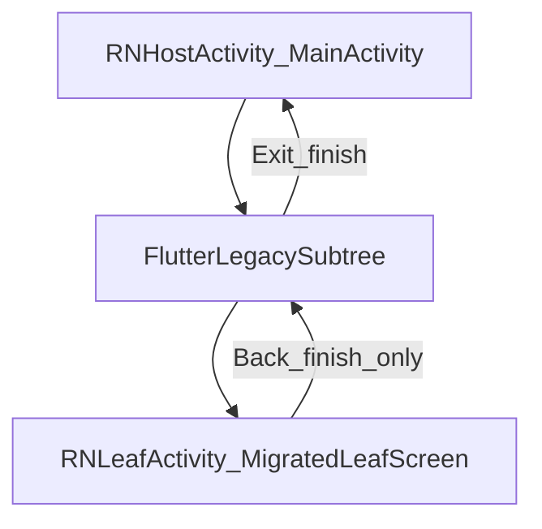
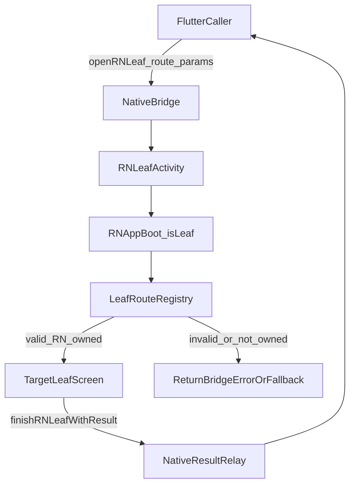

# Reusable Flutter-to-RN Migration Plan

## Target Outcome

- Standardize one migration architecture for all projects: RN host + Flutter legacy subtree + **multi-route** RN leaf re-entry with predictable back behavior.
- Make structure generation repeatable via templates/rules so new projects follow the same layout automatically in **one bootstrap command**.
- Flutter can open **any RN-owned leaf route** (not a single hardcoded screen); route resolution is registry-based with validation and fallback.

## Multi-Route Leaf Architecture

- **LeafRouteRegistry:** Central map `route -> { screenName, paramAdapter?, ownershipCheck }`. Used at RN app boot when `isLeaf=true` to resolve the incoming `route` to the correct Stack screen and typed params.
- **Leaf launch contract validation:** Reject or fallback on `invalid route`, `ownership violation` (route not RN-owned), or `params schema mismatch`; return structured bridge error to Flutter when applicable.
- **Non-goal:** Only one concurrent RN leaf activity per host process (native `BUSY` guard remains). No multi-stack leaf.

## Reference Architecture

## Standard Rules To Apply In Every Project

- **Single host owner:** keep one primary host (`MainActivity` / RN root).
- **No bounce-to-main:** never launch main RN activity from Flutter for leaf migration flows.
- **Leaf bridge activity:** Flutter opens a dedicated RN leaf host activity; Android/iOS back returns naturally to Flutter.
- **Route ownership map:** each route is explicitly `RN` or `Flutter` (never dual-owned).
- **Bridge contract first:** all cross-stack transitions use a typed contract (`route`, `params`, optional `result`).

## Reusable Folder/Module Blueprint

- Android native bridge layer:
  - `[projectRoot]/android/app/src/main/kotlin/.../FlutterBridgeModule.kt`
  - `[projectRoot]/android/app/src/main/kotlin/.../FlutterEngineManager.kt`
  - `[projectRoot]/android/app/src/main/kotlin/.../MainActivity.kt`
  - `[projectRoot]/android/app/src/main/kotlin/.../RNLeafActivity.kt` (standard)
- RN app structure:
  - `[projectRoot]/src/navigation/routes.ts`
  - `[projectRoot]/src/navigation/RouteOwnership.ts`
  - `[projectRoot]/src/navigation/BridgeNavigator.ts`
  - `[projectRoot]/src/navigation/bridge-contract.ts`
  - `[projectRoot]/src/navigation/leaf-route-registry.ts` (multi-route leaf: route → screen + params + ownership)
  - `[projectRoot]/src/components/{module}/{screen}/...`
- Flutter module bridge layer:
  - `[projectRoot]/flutter_module/lib/bridge/bridge_contract.dart`
  - `[projectRoot]/flutter_module/lib/bridge/navigation_bridge.dart`
  - `[projectRoot]/flutter_module/lib/bridge/route_ownership.dart`

## One-Go Bootstrap Outputs (Mandatory)

Running the single bootstrap command must create or merge:

- **RN:** `src/navigation/bridge-contract.ts`, `RouteOwnership.ts`, `BridgeNavigator.ts`, `leaf-route-registry.ts`; optionally `routes.ts` stub if missing. Template dir: `templates/hybrid-migration/src/navigation/`.
- **Android:** `RNLeafActivity.kt` (from template); docs snippets: `docs/hybrid-migration-manifest-snippet.xml`, `docs/hybrid-migration-nav-channel-snippet.kt.txt` for manifest activity and `openRNLeaf`/result relay in `FlutterEngineManager.registerChannels()`.
- **Flutter:** `flutter_module/lib/bridge/bridge_contract.dart`, `navigation_bridge.dart`, `route_ownership.dart` (from `templates/hybrid-migration/flutter/`).
- **Docs:** Playbook and route ownership matrix prefilled (or merged) so the project has `docs/hybrid-migration-playbook.md` and `docs/route-ownership-matrix.md` with starter routes.

Bootstrap script: `scripts/init-hybrid-migration.js` (supports `--dry-run`, `--config path/to/config.json`).

## Leaf Resolution Flow (Runtime)

- When RN app boots with `isLeaf=true` and `route` in launch props, resolve via **LeafRouteRegistry** (do not hardcode a single route).
- **Valid + RN-owned:** Set Stack `initialRouteName` to the registry’s screen name and `initialParams` to the adapter output (include `isLeaf: true`). Deep linking is **disabled** for the leaf container (`linking={undefined}`).
- **Invalid or not RN-owned:** Apply safe fallback: e.g. show a single fallback screen (e.g. Shell) or close activity with error; optionally call native to return a structured bridge error to Flutter. Document the chosen policy in the playbook.
- **Deep linking:** Enabled only on the host NavigationContainer; never on the leaf container to avoid "linking in multiple places" when RNLeafActivity opens.

## Project Portability Contract

The following must be configurable per project so generation is reusable:

- **App package IDs / activity names:** e.g. `packageName`, `packagePath`, `rnLeafActivityClass`, `mainComponentName`.
- **Route prefix and canonical route style:** e.g. path-style routes `/module/screen`; config key optional (e.g. `routePrefix`).
- **Ownership defaults:** New routes default to `Flutter`; migrate to `RN` when screen is implemented.
- **Analytics provider hooks:** Bootstrap does not inject analytics; project wires `bridge-transition-analytics` or equivalent.
- **iOS leaf host parity:** Optional flag (e.g. `iosLeafEnabled`) for one-go iOS leaf controller when needed; Android is required.

Config is passed via `--config path/to/config.json` or defaults in the bootstrap script.

## Verification Matrix (Post-Bootstrap Smoke)

Every new project must pass before considering migration complete:

- [ ] Open **2+ distinct RN leaf routes** from Flutter (e.g. Address and one other); both open the correct RN screen.
- [ ] **Back** from each leaf returns to the prior Flutter state (activity/controller finishes).
- [ ] **Result payload** reaches Flutter for both success and cancel paths when the leaf calls `finishRNLeafWithResult`.
- [ ] **Deep-link warning** is absent when the leaf activity opens (linking disabled in leaf container).
- [ ] **Invalid route** (e.g. unknown path or Flutter-owned route sent to openRNLeaf) returns a structured bridge error and does not crash.

## Implementation Phases

### Phase 1: Migration Contract Pack

- Define a cross-platform schema for:
  - `openFlutter(route, params)`
  - `openRNLeaf(route, params)`
  - `finishWithResult(result)`
- Add versioning (`contractVersion`) for backward compatibility across projects.

### Phase 2: Navigation Ownership Framework

- Introduce a `RouteOwnership` registry in RN and Flutter.
- Add a guard in bridge calls to prevent invalid transitions (e.g., Flutter trying to reopen `MainActivity`).
- Define default back policy:
  - RN leaf screen back => activity/controller `finish`.
  - Flutter flow exit => return to RN host.

### Phase 3: Auto-Structure Generation

- Create project template assets:
  - Native bridge template (`RNLeafActivity`, bridge methods, manifest entries).
  - RN templates (ownership map, bridge navigator helpers, route constants).
  - Flutter templates (method channel wrappers + route handoff helpers).
- Add one bootstrap command in each new project (script/CLI) to generate these files from templates.

### Phase 4: Migration Playbook For Leaf Screens

- For each feature module:
  - Mark route owner to RN.
  - Implement RN screen(s).
  - Keep Flutter route as delegator during transition.
  - Switch owner from Flutter to RN when parity is validated.
- Maintain a project-level migration matrix (screen, owner, status, parity, rollback route).

### Phase 5: Observability + Rollback Safety

- Add analytics around all cross-stack transitions:
  - source stack, target stack, route, success/failure, back path.
- Add runtime kill switch:
  - fallback to Flutter route when RN leaf fails.
- Add smoke checks per release:
  - RN->Flutter->RNLeaf->Back->Flutter resume
  - deep link to RN host then owner-based dispatch

## Project Bootstrap Checklist (Apply To Every New Project)

- Add bridge contract files (RN + Flutter).
- Add leaf host activity/controller and register in platform config.
- Add route ownership map with initial default (`Flutter` except migrated screens).
- Add migration matrix file in docs.
- Enable transition analytics and rollback toggles.

## Suggested Deliverables and References

- **Playbook:** [docs/hybrid-migration-playbook.md](docs/hybrid-migration-playbook.md) (shared process; bootstrap steps, migration steps, back/result, observability).
- **Route status:** [docs/route-ownership-matrix.md](docs/route-ownership-matrix.md) (per-project; keep in sync with RouteOwnership.ts and route_ownership.dart).
- **Templates:** [templates/hybrid-migration/](templates/hybrid-migration/) — Android (`RNLeafActivity.kt.template`, manifest snippet, NavigationChannel snippet), RN (`bridge-contract`, RouteOwnership, BridgeNavigator, leaf-route-registry), Flutter (`bridge_contract`, navigation_bridge, route_ownership).
- **Bootstrap:** [scripts/init-hybrid-migration.js](scripts/init-hybrid-migration.js) — run from repo root; use `--config` for package/channel names.
- **Rule:** [.cursor/rules/hybrid-migration.mdc](.cursor/rules/hybrid-migration.mdc) — AI-enforced conventions for cross-stack navigation and migration structure.

Contributors execute end-to-end from these assets: rule for behavior; playbook for process; matrix for status; bootstrap for one-go structure; templates for generated files.

## Acceptance Criteria

- Any new project can run **one** setup command and get the same hybrid structure including multi-route leaf support.
- Navigation path RN→Flutter→RNLeaf(any RN-owned route)→Back is deterministic and state-safe.
- No duplicate host-activity reopening in migration flows; no duplicate linking (leaf container has linking disabled).
- Route ownership and migration status are visible and enforceable; leaf route resolution is registry-based, not hardcoded.
- iOS and Android follow the same ownership/bridge contract semantics.
- Verification matrix (multi-route open, back, result, no deep-link warning, invalid-route error) passes after bootstrap.

