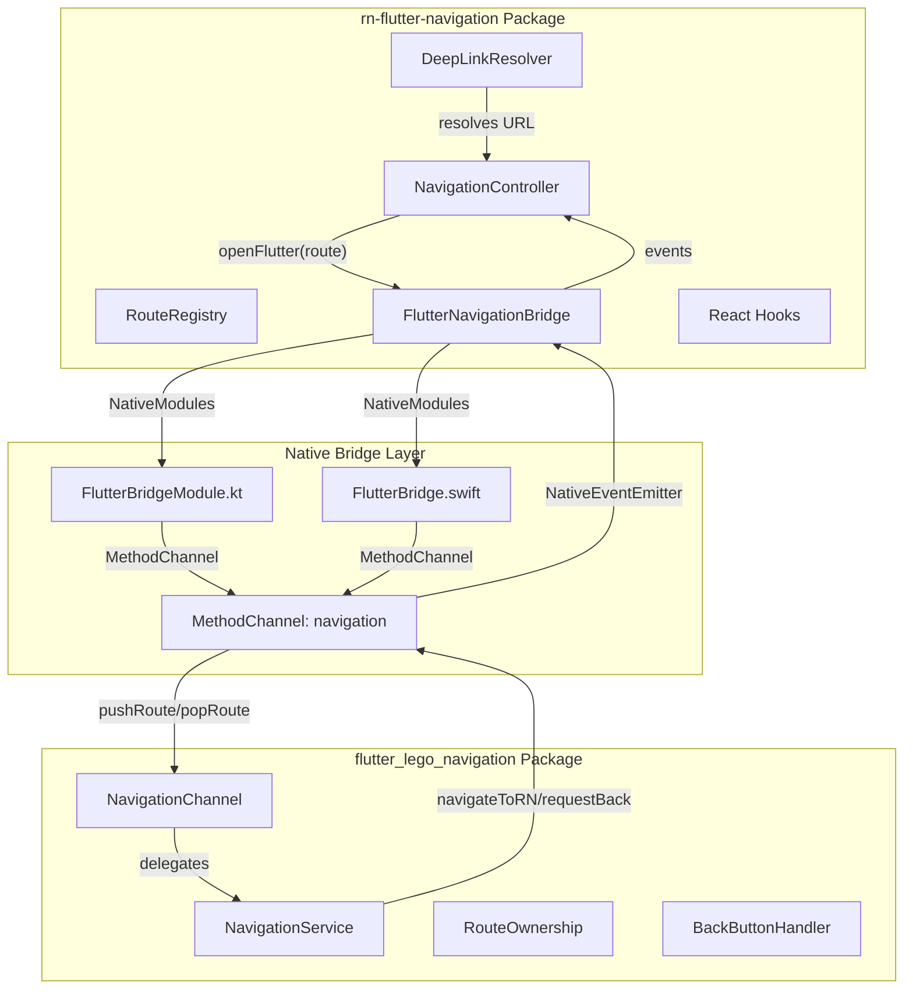
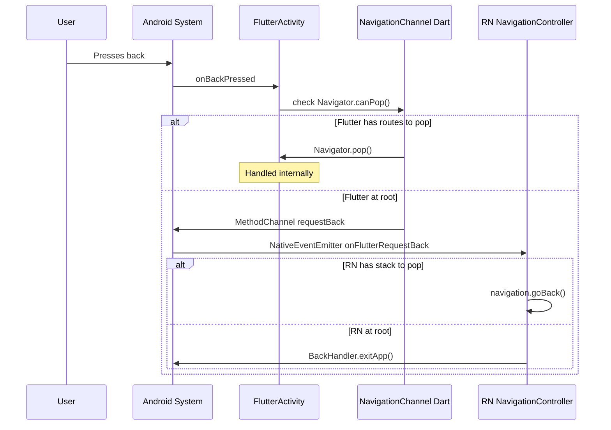
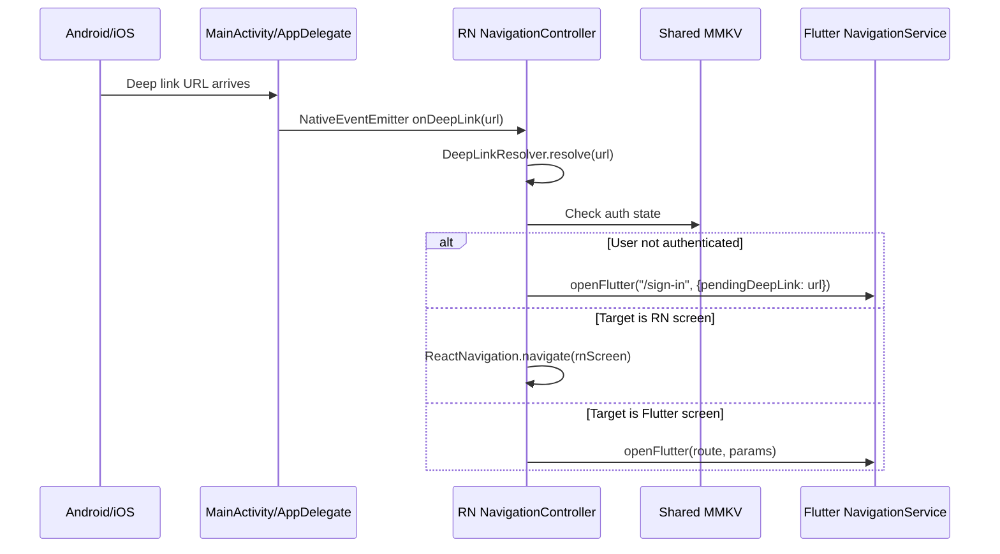

# RN-Flutter Navigation Module

## Architecture Overview




## Back Button Flow




## Deep Link Flow




---

## Package 1: `rn-flutter-navigation/` (TypeScript)

Located at repo root, mirrors the structure of `react-lego-storage/`.

### File Structure

```
rn-flutter-navigation/
  package.json
  tsconfig.json
  README.md
  lib/
    index.ts                          # Public exports
    types.ts                          # All type definitions
    NavigationController.ts           # Central navigation decision maker
    RouteRegistry.ts                  # Route ownership registry
    FlutterNavigationBridge.ts        # NativeModules + NativeEventEmitter bridge
    DeepLinkResolver.ts               # Deep link URL -> route resolution
    hooks/
      useFlutterEvents.ts             # Hook: listen to Flutter->RN navigation events
      useDeepLink.ts                  # Hook: deep link handling
```

### Key Files

`**lib/types.ts**` - All shared types:

- `RouteOwner`: `'rn' | 'flutter'`
- `RouteEntry`: `{ owner, flow?, screen? }`
- `NavigationEvent`: `{ action: 'navigateToRN' | 'flowComplete' | 'requestBack', route, params, result }`
- `DeepLinkConfig`: `{ patterns: Map<RegExp, { route, owner }> }`
- `FlutterBridgeInterface`: typed native module methods

`**lib/RouteRegistry.ts**` - Simple map-based registry:

- `register(route, entry: RouteEntry)` - register a route with its owner
- `registerBatch(entries)` - bulk register
- `getOwner(route): RouteOwner` - lookup owner for a route
- `isFlutter(route): boolean` / `isRN(route): boolean`
- Default: any unknown route returns `'flutter'` (safe fallback during migration)

`**lib/NavigationController.ts**` - Decision maker:

- `navigate(route, params)` - checks registry, delegates to RN navigation or Flutter bridge
- `handleDeepLink(url)` - resolves URL via DeepLinkResolver, then navigates
- `handleFlutterEvent(event)` - processes events from Flutter (navigateToRN, flowComplete, requestBack)
- `setRNNavigator(ref)` - receives React Navigation ref for RN-side navigation
- Accepts a `RouteRegistry` instance and a `FlutterNavigationBridge` instance via constructor

`**lib/FlutterNavigationBridge.ts**` - Native communication:

- Wraps the existing `FlutterBridge` NativeModule (extends current [FlutterBridgeModule.ts](src/native/FlutterBridgeModule.ts))
- `openFlutter(route, params)` - calls native `openFlutterApp`
- `sendRouteToFlutter(route, params)` - pushes a new route into an already-active Flutter engine
- `onFlutterEvent(callback)` - subscribes to NativeEventEmitter for Flutter->RN events
- `dispose()` - cleanup subscriptions

`**lib/DeepLinkResolver.ts**` - URL pattern matching:

- `register(pattern: RegExp, route, paramExtractor)` - register a deep link pattern
- `resolve(url): { route, params, owner } | null` - match URL to route
- Uses regex patterns, not hardcoded URLs (reusable across projects)

`**lib/hooks/useFlutterEvents.ts**`:

- React hook that subscribes to Flutter->RN events
- Auto-cleanup on unmount
- Returns latest event + handler function

`**lib/hooks/useDeepLink.ts**`:

- React hook that listens for deep link events from native
- Passes to NavigationController.handleDeepLink

### package.json

- Name: `@reglobe/rn-flutter-navigation` (following the `@reglobe/lego-storage` pattern)
- Dependencies: `react-native` (peer), no external navigation library required
- The package is navigation-library-agnostic: works with React Navigation, or plain navigator refs

---

## Package 2: `flutter_lego_navigation/` (Dart)

Located at repo root, mirrors `flutter_lego_storage/`.

### File Structure

```
flutter_lego_navigation/
  pubspec.yaml
  README.md
  lib/
    lego_navigation.dart              # Public exports
    src/
      navigation_service.dart         # Central service, wraps Navigator calls
      navigation_channel.dart         # MethodChannel handler for RN communication
      route_ownership.dart            # Checks if route belongs to RN or Flutter
      back_handler.dart               # Back button protocol handler
      types.dart                      # Dart-side type definitions
```

### Key Files

`**lib/src/navigation_channel.dart**` - MethodChannel bridge:

- Channel name: `in.cashify.supersales/navigation`
- **Incoming from RN** (native invokes these on Flutter):
  - `pushRoute(route, params)` - push a named route on Flutter's Navigator
  - `resetToRoute(route, params)` - `pushNamedAndRemoveUntil` to clear stack
  - `popRoute()` - pop current route
  - `setDeepLink(url)` - store pending deep link for Flutter to resolve
- **Outgoing to RN** (Flutter invokes these toward native):
  - `navigateToRN(route, params)` - request RN to open an RN-owned screen
  - `flowComplete(flow, result)` - notify RN that a Flutter flow is done
  - `requestBack()` - Flutter root wants to go back, hand to RN
  - `canGoBack(bool)` - response to back button query
- Registers handler on init, provides static methods for outgoing calls

`**lib/src/navigation_service.dart`** - Central wrapper:

- `NavigationService.init(navigatorKey, routeOwnership)` - initialize with the app's `GlobalKey<NavigatorState>`
- `NavigationService.navigateTo(route, params, context)` - the key method:
  - Checks `RouteOwnership.isRN(route)`
  - If RN: calls `NavigationChannel.navigateToRN(route, params)` (crosses boundary)
  - If Flutter: calls `Navigator.pushNamed(context, route, arguments: params)` (stays internal)
- `NavigationService.handleIncomingRoute(route, params)` - called by NavigationChannel when RN pushes a route
- `NavigationService.handleBack()` - checks `Navigator.canPop()`, pops or sends `requestBack()` to RN

`**lib/src/route_ownership.dart`** - Mirrors RN's RouteRegistry:

- `RouteOwnership.register(route, owner)` - mark route as 'rn' or 'flutter'
- `RouteOwnership.isRN(route): bool`
- `RouteOwnership.isFlutter(route): bool`
- Default: unknown routes are `'flutter'` (safe during migration)
- Can be initialized from a shared config or hardcoded list

`**lib/src/back_handler.dart**` - Back button protocol:

- `BackHandler.init(navigatorKey)` - attaches `WillPopScope` / `PopScope` behavior
- When back is pressed in Flutter:
  - If `Navigator.canPop()` -> pop internally
  - If at root -> `NavigationChannel.requestBack()` to hand control to RN
- Works with Android hardware back button and iOS swipe gesture

`**pubspec.yaml**`:

- Name: `lego_navigation`
- Dependencies: `flutter` SDK only (no external deps)

---

## Native Bridge Changes

### Android - [FlutterEngineManager.kt](android/app/src/main/kotlin/in/cashify/supersale/FlutterEngineManager.kt)

Add a new MethodChannel `in.cashify.supersales/navigation` alongside existing channels:

- **Flutter -> Native handlers**: `navigateToRN`, `flowComplete`, `requestBack`, `canGoBack`
- These emit events via `ReactContext.getJSModule(DeviceEventManagerModule.RCTDeviceEventEmitter::class.java).emit("FlutterNavEvent", data)`
- **Native -> Flutter callers**: `pushRoute`, `resetToRoute`, `popRoute`, `setDeepLink`
- Store reference to the navigation channel so RN can invoke methods on Flutter

### Android - [FlutterBridgeModule.kt](android/app/src/main/kotlin/in/cashify/supersale/FlutterBridgeModule.kt)

Expand the native module with new `@ReactMethod` functions:

- `pushRouteToFlutter(route, params)` - invokes MethodChannel `pushRoute` on Flutter engine
- `resetFlutterToRoute(route, params)` - invokes MethodChannel `resetToRoute` on Flutter engine
- `popFlutterRoute()` - invokes MethodChannel `popRoute` on Flutter engine
- Keep existing `openFlutterApp(route, params)` but make it route-aware (passes initial route to Flutter)

### Android - [MainActivity.kt](android/app/src/main/kotlin/in/cashify/supersale/MainActivity.kt)

- Remove the `onActivityResult` re-launch logic (Flutter re-launch loop)
- Deep links: emit to RN via event emitter instead of calling `FlutterEngineManager.sendDeepLink` directly
- Let RN's NavigationController decide where to route deep links

### Android - [SuperSaleFlutterActivity.kt](android/app/src/main/kotlin/in/cashify/supersale/SuperSaleFlutterActivity.kt)

- Override `onBackPressed` to delegate to the navigation MethodChannel
- If Flutter says it can handle back -> let it
- If Flutter can't -> `finish()` the Activity, returning control to RN's MainActivity

### iOS - [FlutterEngineManager.swift](ios/SuperSale/FlutterEngineManager.swift)

Mirror Android changes:

- Add `navigation` MethodChannel
- Handle Flutter -> RN events (navigateToRN, requestBack, flowComplete)
- Expose native -> Flutter calls (pushRoute, resetToRoute)

### iOS - [FlutterBridge.swift](ios/SuperSale/FlutterBridge.swift)

Mirror Android FlutterBridgeModule changes:

- Add `pushRouteToFlutter`, `resetFlutterToRoute`, `popFlutterRoute` methods
- Emit Flutter events to RN via `RCTEventEmitter`

### iOS - [AppDelegate.swift](ios/SuperSale/AppDelegate.swift)

- Deep links: emit to RN instead of calling `FlutterEngineManager.sendDeepLink` directly

---

## App Integration

### Smart Splash in [src/App.tsx](src/App.tsx)

Replace the transparent shell with a smart splash:

- Show splash animation (matching Flutter's native splash)
- Read auth state from shared MMKV (via `react-lego-storage`)
- Initialize `NavigationController` with `RouteRegistry`
- Check auth state:
  - Not authenticated -> `openFlutter('/sign-in')`
  - Authenticated, vendor approved -> `openFlutter('/home')`
  - Authenticated, vendor pending -> `openFlutter('/registration')`
- Subscribe to deep link events and flutter navigation events

### Route Registry Configuration

A single `routeConfig.ts` file in the app that defines route ownership:

- Phase 1: All routes are `flutter` except future RN screens
- As screens migrate: flip route owner from `flutter` to `rn`
- Default fallback: unknown route -> `flutter`

### Flutter Integration in `flutter_module/`

- Add `lego_navigation` as path dependency in `pubspec.yaml`
- Initialize `NavigationService` in `main.dart` with the existing `_navKey`
- Initialize `RouteOwnership` with the same route map
- Replace direct `Navigator.pushNamed` calls with `NavigationService.navigateTo` in the action dispatch system ([action.type.dart](flutter_module/lib/helpers/ssa_actions/action.type.dart) `executeAction` method)
- Wire `BackHandler` into the app's root widget

---

## MethodChannel Protocol Summary

Channel: `in.cashify.supersales/navigation`


| Direction     | Method         | Args                | Purpose                                |
| ------------- | -------------- | ------------------- | -------------------------------------- |
| RN -> Flutter | `pushRoute`    | `{route, params}`   | Push named route in Flutter            |
| RN -> Flutter | `resetToRoute` | `{route, params}`   | Clear Flutter stack, navigate to route |
| RN -> Flutter | `popRoute`     | none                | Pop top Flutter route                  |
| RN -> Flutter | `setDeepLink`  | `{url}`             | Send deep link for Flutter to resolve  |
| Flutter -> RN | `navigateToRN` | `{route, params}`   | Open RN-owned screen                   |
| Flutter -> RN | `flowComplete` | `{flow, result}`    | Flutter flow finished                  |
| Flutter -> RN | `requestBack`  | none                | Flutter root, hand back to RN          |
| Flutter -> RN | `canGoBack`    | `{canHandle: bool}` | Back button query response             |


