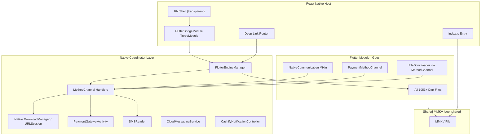

# RN-Host / Flutter-Guest Migration Plan (Complete)

## Architecture




## Project Structure (Final)

```
flutter_supersale/
  package.json                            # RN 0.83.1, Yarn 4.x
  .yarnrc.yml                             # nodeLinker, npmScopes (@reglobe -> GitHub Packages), enableScripts
  index.js                                # RN entry point
  app.json                                # RN app name/display config
  metro.config.js                         # Metro bundler
  tsconfig.json                           # TypeScript
  babel.config.js                         # Babel
  react-native.config.js                  # RN CLI config (autolinking + font asset linking)
  jest.config.js                          # Tests
  Gemfile                                 # Ruby gems (CocoaPods)
  src/                                    # RN TypeScript source
    App.tsx                               # Root (transparent, launches Flutter)
    assets/
      fonts/                              # Symlink -> ../../flutter_module/assets/fonts/
    native/
      FlutterBridgeModule.ts              # JS wrapper for native FlutterBridge
  android/
    app/
      build.gradle                        # RN + Flutter AAR + Firebase + WebEngage deps
      proguard-rules.pro                  # Merged ProGuard (Flutter + PaymentGW JS interface)
      src/main/
        AndroidManifest.xml               # ReactActivity + PaymentGatewayActivity + services
        res/
          mipmap-*/                        # Prod adaptive icons (webp) from Flutter backup
          mipmap-anydpi-v26/              # Adaptive icon XMLs (prod)
          drawable/launch_background.xml   # COPIED from current project
          values/styles.xml                # COPIED launch theme from current project
        kotlin/in/cashify/supersale/
          MainActivity.kt                 # RN ReactActivity (NEW)
          MainApplication.kt              # RN Application + WebEngage init (MERGED)
          FlutterEngineManager.kt         # NEW - Engine lifecycle + MethodChannels + download handler
          FlutterBridgePackage.kt         # NEW - RN native module package
          FlutterBridgeModule.kt          # NEW - RN TurboModule (JS-callable)
          PaymentGatewayActivity.kt       # COPIED from current project
          SMSReader.kt                    # COPIED from current project
          CloudMessagingService.kt        # COPIED from current project
          CashifyNotificationController.kt # COPIED from current project
      src/prod/
        google-services.json
        res/values/strings.xml            # app_name = "Super-Sale"
        res/values/integers.xml
      src/stage/
        google-services.json
        res/mipmap-*/                      # Stage-specific icons (PNG, visually distinct)
        res/mipmap-anydpi-v26/            # Adaptive icon XMLs (stage)
        res/values/strings.xml            # app_name = "Super-Sale Stage"
        res/values/integers.xml
      src/beta/
        google-services.json
        res/mipmap-*/                      # Beta-specific icons (PNG, visually distinct)
        res/mipmap-anydpi-v26/            # Adaptive icon XMLs (beta)
        res/values/strings.xml            # app_name = "Beta-Super-Sale"
        res/values/integers.xml
    build.gradle                          # Project-level (RN + Kotlin + Firebase plugins + credentials loader)
    settings.gradle                       # RN autolinking + Flutter module inclusion
    gradle.properties                     # RN 0.83 defaults + hermesEnabled + newArchEnabled
    local.properties                      # Signing credentials (gitignored, per-machine)
  ios/
    SuperSale/
      AppDelegate.swift                   # RN AppDelegate + WebEngage + deep link routing
      FlutterEngineManager.swift          # NEW - Engine lifecycle + MethodChannels + download handler
      FlutterBridgeModule.swift           # NEW - RN native module
      FlutterBridgeModule.m              # ObjC bridge for RN module registration
      Assets.xcassets/                    # COPIED AppIcon + LaunchImage from current project
    SuperSale.xcodeproj/
    NotificationService/                  # COPIED - WebEngage rich push extension
    NotificationViewController/           # COPIED - WebEngage content extension
    Podfile                               # RN pods + Flutter pod + WebEngage (static linkage)
  flutter_module/
    lib/                                  # ALL existing Dart code (moved from lib/)
    assets/
      fonts/                              # Shared custom fonts (Inter family, single source of truth)
        Inter-Regular.ttf
        Inter-Medium.ttf
        Inter-Bold.ttf
    pubspec.yaml                          # Modified (module template, declares fonts)
    .android/                             # Auto-generated, gitignored
    .ios/                                 # Auto-generated, gitignored
  flutter_lego_storage/                   # Unchanged
  react-lego-storage/                     # Local @reglobe/lego-storage (file: path dep)
  scripts/                                # Updated build scripts
  docs/
    DEVELOPER_WORKFLOW.md                  # NEW - dev workflow guide
```

---

## Phase 1: RN Project Initialization

### 1.1 Prerequisites

- Install Node.js 20+ LTS
- Enable Corepack: `corepack enable`
- Activate Yarn 4: `corepack prepare yarn@4.6.0 --activate`
- Ensure Ruby + CocoaPods installed for iOS
- JDK 17 for Android

### 1.2 Initialize RN Project

Use the React Native Community CLI (NOT Expo):

```bash
npx @react-native-community/cli@latest init SuperSale --version 0.83.1 --pm yarn --directory rn_temp
```

Then:

- Copy RN config files (`package.json`, `metro.config.js`, `tsconfig.json`, `babel.config.js`, `app.json`, `react-native.config.js`, `Gemfile`, `index.js`, `.watchmanconfig`) into the repo root
- Copy `rn_temp/android/` and `rn_temp/ios/` into the repo root (after backing up existing Flutter ones)
- Remove `rn_temp/`

### 1.3 Configure Yarn 4

Create `.yarnrc.yml` at root:

```yaml
enableImmutableInstalls: false
enableScripts: false
nodeLinker: node-modules

npmScopes:
  reglobe:
    npmAlwaysAuth: true
    npmRegistryServer: "https://npm.pkg.github.com"
```

Key settings:

- `nodeLinker: node-modules` -- required for RN (doesn't work with PnP)
- `enableImmutableInstalls: false` -- allows `yarn install` to update the lockfile
- `enableScripts: false` -- **temporarily** disables postinstall scripts; several `@reglobe/lego-`* packages have broken postinstall scripts under Node 23 (`SyntaxError: Named export 'globSync' not found` in lego-cli, `ERR_MODULE_NOT_FOUND: Cannot find package 'xml2js'` in lego-core). This allows `yarn install` to complete. Remove once upstream packages are fixed.
- `npmScopes.reglobe` -- routes all `@reglobe/*` package requests to GitHub Packages registry (`npm.pkg.github.com`)

Verify `package.json` has `"packageManager": "yarn@4.6.0"`. Run `yarn install`.

### 1.4 Verify RN 0.83.1 Template Defaults

The template `android/gradle.properties` already sets:

- `newArchEnabled=true` (mandatory in 0.83)
- `hermesEnabled=true`
- `minSdkVersion=24` (matches Flutter)
- `compileSdkVersion=36` (matches Flutter)
- `targetSdkVersion=36` (bumped from Flutter's 35)
- `kotlinVersion=2.1.20`

No Expo dependencies. Pure RN CLI.

### 1.5 Add @reglobe/lego-* Dependencies and GitHub Packages Auth (Gaps #15, #16)

The project uses private `@reglobe/lego-`* packages hosted on GitHub Packages. These are the shared "lego" libraries used across Cashify RN apps.

**Step 1: GitHub Packages authentication**

Each developer must have a GitHub Personal Access Token (PAT) with `read:packages` scope. Authenticate via npm:

```bash
npm login --scope=@reglobe --registry=https://npm.pkg.github.com
# Username: <github-username>
# Password: <PAT with read:packages>
# Email: <email>
```

This writes the auth token to `~/.npmrc`. Yarn 4 reads the global `.npmrc` for auth when `npmScopes` is configured in `.yarnrc.yml` (see Phase 1.3).

> **Note**: Do NOT put `npmAuthToken` in the project's `.yarnrc.yml`. The project previously had `npmAuthToken: "${GITHUB_NPM_TOKEN}"` which required an environment variable. This was removed in favor of the global `~/.npmrc` approach, which is simpler for local development.

**Step 2: Add dependencies to `package.json`**

```json
"dependencies": {
    "@reglobe/lego-cli": "^3.1.2",
    "@reglobe/lego-common": "^3.1.10",
    "@reglobe/lego-core": "^3.1.7",
    "@reglobe/lego-fetch": "^3.0.8",
    "@reglobe/lego-inspector": "1.0.3",
    "@reglobe/lego-storage": "file:./react-lego-storage",
    "@reglobe/lego-ui": "^3.1.9",
    "react-native-safe-area-context": "^5.5.2"
}
```

Key points:

- `@reglobe/lego-storage` uses a **local path** (`file:./react-lego-storage`) because it contains project-specific customizations
- All other `@reglobe/`* packages are pulled from GitHub Packages registry
- `react-native-safe-area-context` is a peer dependency required by `@reglobe/lego-ui`

**Step 3: Install**

```bash
yarn install
```

If `yarn install` fails with `Usage Error: Environment variable not found (GITHUB_NPM_TOKEN)`, ensure the `npmAuthToken` line is removed from `.yarnrc.yml` and that `~/.npmrc` has the correct token for `npm.pkg.github.com`.

If postinstall scripts fail, ensure `enableScripts: false` is set in `.yarnrc.yml` (see Phase 1.3).

### 1.6 Shared Custom Fonts -- Single Source of Truth (Gap #18)

The Flutter module uses the **Inter** font family (3 weights: Regular 400, Medium 500, Bold 700) declared in `flutter_module/pubspec.yaml`. To avoid duplicating font files and inflating the app binary, a single source of truth approach is used.

**Font files** (canonical location):

```
flutter_module/assets/fonts/
  Inter-Regular.ttf   (weight 400)
  Inter-Medium.ttf    (weight 500)
  Inter-Bold.ttf      (weight 700)
```

**Step 1: Symlink for RN code imports**

A relative symlink lets RN source code reference `src/assets/fonts/` while the real files stay in `flutter_module/`:

```bash
mkdir -p src/assets
ln -s ../../flutter_module/assets/fonts src/assets/fonts
```

**Step 2: `react-native.config.js`** -- points at the real directory (avoids tooling issues with symlinks):

```javascript
module.exports = {
  project: { ios: {}, android: {} },
  assets: ['./flutter_module/assets/fonts/'],
};
```

**Step 3: Link fonts to native projects**

```bash
npx react-native-asset
# or: yarn link-assets
```

This does:

- **Android**: Copies `.ttf` files to `android/app/src/main/assets/fonts/` (standard RN font location)
- **iOS**: Adds font file references to the Xcode project (`project.pbxproj`) pointing at `../flutter_module/assets/fonts/` (no copy, true single source), adds `UIAppFonts` entries to `Info.plist`

A `link-assets-manifest.json` is created in `ios/` to track linked assets.

**Step 4: `react-native-asset` added as devDependency + convenience script**

```json
"devDependencies": {
  "react-native-asset": "^2.2.8"
}
"scripts": {
  "link-assets": "react-native-asset"
}
```

**Usage in RN styles**:

```typescript
// iOS: fontFamily + fontWeight
{ fontFamily: 'Inter', fontWeight: '400' }  // Regular
{ fontFamily: 'Inter', fontWeight: '500' }  // Medium
{ fontFamily: 'Inter', fontWeight: '700' }  // Bold

// Android: use filename-based family if weight mapping doesn't work
{ fontFamily: 'Inter-Regular' }
{ fontFamily: 'Inter-Medium' }
{ fontFamily: 'Inter-Bold' }
```

**Adding more fonts later**: Drop new `.ttf`/`.otf` files into `flutter_module/assets/fonts/`, register them in `flutter_module/pubspec.yaml` (for Flutter), and run `yarn link-assets` (for RN).

> **Note on Android**: `react-native-asset` copies fonts into `android/app/src/main/assets/fonts/`. These copies are derived from `flutter_module/assets/fonts/` and should be re-generated (via `yarn link-assets`) whenever fonts change. The iOS side references fonts in-place from `flutter_module/` without copying.

---

## Phase 2: Convert Flutter App to Module

### 2.1 Create Flutter Module

```bash
flutter create --template module flutter_module
```

### 2.2 Migrate Dart Code

- Move all contents of current `lib/` into `flutter_module/lib/`
- Move `pubspec.yaml` to `flutter_module/pubspec.yaml` and modify it to be a module
- Move `test/` to `flutter_module/test/`
- Move `assets/` to `flutter_module/assets/`
- Move `l10n.yaml` and localization files to `flutter_module/`
- Move `analysis_options.yaml` to `flutter_module/`

### 2.3 Update flutter_module/pubspec.yaml

Add the module descriptor:

```yaml
flutter:
  module:
    androidX: true
    androidPackage: in.cashify.flutter_supersale
    iosBundleIdentifier: in.cashify.supersales
```

### 2.4 Fix flutter_lego_storage Path Reference (Gap #9)

The `flutter_lego_storage` package is referenced via a path dependency. Since `pubspec.yaml` moves into `flutter_module/`, update the relative path:

```yaml
# In flutter_module/pubspec.yaml
dependencies:
  flutter_lego_storage:
    path: ../flutter_lego_storage   # one level up from flutter_module/
```

Verify this resolves correctly from the `flutter_module/` directory.

### 2.5 Environment/Flavor Passing Strategy (Gap #1 -- CRITICAL)

Current code in [lib/app_initializer.dart](lib/app_initializer.dart) line 13:

```dart
const RUNNING_SYSTEM_ENV = String.fromEnvironment('env', defaultValue: 'prod');
```

This uses `--dart-define=env=prod` at build time. In add-to-app, `dart-define` values must be baked into the AAR/framework at build time.

**Strategy: Build per-flavor Flutter AARs/frameworks.**

In [scripts/](scripts/), the build script must run:

```bash
# For each flavor
cd flutter_module
flutter build aar --dart-define=env=prod      # prod AAR
flutter build aar --dart-define=env=beta      # beta AAR
flutter build aar --dart-define=env=stage     # stage AAR
```

The Android `build.gradle` product flavors will reference the corresponding AAR output. On iOS, build separate frameworks or use a runtime approach via MethodChannel:

**Alternative (runtime approach)**: Replace `String.fromEnvironment` with a MethodChannel call that fetches the environment from the RN host's native layer at startup. This is more flexible:

```dart
// In flutter_module/lib/app_initializer.dart
static String? _runningEnv;
static Future<String> getEnvironment() async {
  _runningEnv ??= await MethodChannel('in.cashify.supersales/config')
      .invokeMethod<String>('getEnvironment');
  return _runningEnv ?? 'prod';
}
```

**Recommendation**: Use the runtime MethodChannel approach. It avoids building 3 separate AARs and is simpler for CI/CD. Register the `config` MethodChannel in `FlutterEngineManager` on both platforms.

### 2.6 Fix Jailbreak Detection exit(0) Call (Gap #2 -- BREAKING)

In [lib/main.dart](lib/main.dart) lines 236-257:

```dart
void _jailBreakDetection() async {
  // ... checks root/jailbreak ...
  if (jailBroken) {
    if (Platform.isAndroid) {
      SystemNavigator.pop();   // closes FlutterActivity only, not the RN host
    } else if (Platform.isIOS) {
      exit(0);                  // KILLS the entire process including RN
    }
  }
}
```

**Problem**: `SystemNavigator.pop()` on Android only finishes the `FlutterActivity`, leaving the RN shell visible with nothing to show. `exit(0)` on iOS kills the whole app (which is correct behavior but brutal).

**Solution**: Replace with a MethodChannel call to the native layer that exits the app properly:

```dart
if (jailBroken) {
  // Tell the host app to exit entirely
  await MethodChannel('in.cashify.supersales/config')
      .invokeMethod('exitApp', {'reason': 'rooted_device'});
}
```

In `FlutterEngineManager`, handle `exitApp` by calling:

- Android: `activity.finishAffinity()` (closes all activities including RN)
- iOS: `exit(0)` (same as before, this is the only option on iOS)

### 2.7 Remove flutter_downloader Plugin (Gap #3a -- Plugin Compatibility)

**Rationale**: `flutter_downloader` is the most problematic plugin in add-to-app due to background isolates and `setPluginRegistrantCallback`. Downloads are a native OS operation better owned by the host.

**Action**:

1. Remove `flutter_downloader` from `flutter_module/pubspec.yaml`
2. Replace `FileDownloader` class in [lib/utils/file_downloader.dart](lib/utils/file_downloader.dart) to use a MethodChannel instead:

```dart
class FileDownloader {
  static const _channel = MethodChannel('in.cashify.supersales/downloads');

  Future<String?> requestDownload(String url, {
    String? fileName,
    Map<String, String>? headers,
    bool showNotification = true,
  }) async {
    return await _channel.invokeMethod<String>('enqueue', {
      'url': url,
      'fileName': fileName,
      'headers': headers,
      'showNotification': showNotification,
    });
  }

  Future<void> cancelDownload(String taskId) =>
      _channel.invokeMethod('cancel', {'taskId': taskId});

  // ... pause, resume, open, delete methods similarly bridged
}
```

1. In `FlutterEngineManager`, register the `downloads` MethodChannel:
  - **Android**: Use Android's native `DownloadManager` API (same underlying API that `flutter_downloader` used)
  - **iOS**: Use `URLSession` download tasks
2. **Post-migration (when download screens move to RN)**: Replace with `@kesha-antonov/react-native-background-downloader` (v4.5.2, TurboModules-ready) + `react-native-file-viewer` for opening files

### 2.8 Plugin Compatibility Audit (Gap #3b)

Full audit of all 39 Flutter plugins:

**Tier 1 -- No Issues (31 plugins)**: `connectivity_plus`, `device_info_plus`, `file_picker`, `firebase_analytics`, `firebase_core`, `firebase_crashlytics`, `firebase_remote_config`, `geolocator`, `image_picker`, `local_auth`, `mixpanel_flutter`, `open_file`, `package_info_plus`, `path_provider`, `pdfx`, `permission_handler`, `qr_flutter`, `qr_code_scanner`, `root_checker_plus`, `sensors_plus`, `share_plus`, `shared_preferences`, `sms_autofill`, `sqflite`, `url_launcher`, `vibration`, `video_compress`, `video_player`, `wakelock_plus`, `webview_flutter`, `amplify_auth_cognito`/`amplify_secure_storage`

> **Note**: Some Tier 1 plugins above (e.g. `sensors_plus`, `sqflite`, `permission_handler`, `qr_flutter`, `open_file`) are transitive dependencies pulled in by the `core` or `web_widget` git packages, not direct dependencies in `pubspec.yaml`.

**Tier 2 -- Works But Needs Configuration (4 plugins after flutter_downloader removal)**:

- `**firebase_messaging`**: `getInitialMessage()` will return `null` in add-to-app (RN launched the app, not a notification). `onMessage` and `onMessageOpenedApp` still work. Accept this behavior.
- `**webengage_flutter**`: Ensure WebEngage is initialized in RN host's `MainApplication.kt`/`AppDelegate.swift` **before** `FlutterEngine` starts. The Flutter plugin uses the already-initialized native singleton.
- `**flutter_local_notifications`** (transitive dependency via `core` git package): `getNotificationAppLaunchDetails()` returns `null` in add-to-app. Existing code already handles `null`.
- `**flutter_statusbarcolor_ns**`: May cause brief status bar flash on RN-to-Flutter transitions. Cosmetic only.

**Tier 3 -- Remove (2 plugins)**:

- `**firebase_dynamic_links`**: Zero Dart imports found; deprecated by Google. Remove from `pubspec.yaml`.
- `**flutter_downloader**`: Replaced with native MethodChannel as described in 2.7.

**Tier 4 -- Verify Only (1 plugin)**:

- `**flutter_inappwebview`**: Ensure its `FileProvider` declaration is copied to the RN host's `AndroidManifest.xml` if any Flutter screen uses file uploads via InAppWebView.

### 2.9 Verify Flutter Module Builds

```bash
cd flutter_module
flutter pub get
flutter build aar
flutter build ios-framework
```

---

## Phase 3: Android Integration

### 3.1 Modify android/settings.gradle

**Two integration approaches exist -- the project uses the pre-built AAR approach:**

#### Approach A: Pre-built AAR (CURRENT -- Recommended)

Build the Flutter module as an AAR first (`flutter build aar --no-debug --no-profile --dart-define=env=<env>`), then reference the local Maven repo output from `build.gradle`. The `settings.gradle` does NOT need `include_flutter.groovy`:

```groovy
// RN autolinking (already present from template)
pluginManagement { includeBuild("../node_modules/@react-native/gradle-plugin") }
plugins { id("com.facebook.react.settings") }
// ... standard RN settings ...

// Flutter: using pre-built AAR (run 'cd flutter_module && flutter build aar ...' first)
// No include_flutter.groovy needed
```

> **IMPORTANT**: When using the AAR approach, `FlutterLoader` is NOT auto-initialized by the Gradle plugin. You MUST manually initialize it before creating a `FlutterEngine`. See Phase 3.5.

#### Approach B: Source Inclusion (alternative, not currently used)

```groovy
// Flutter module inclusion (source build -- Flutter is compiled during Android build)
setBinding(new Binding([gradle: this]))
evaluate(new File(settingsDir, '../flutter_module/.android/include_flutter.groovy'))
```

With source inclusion, FlutterLoader is auto-initialized and the NPE described in Phase 3.5 does not occur.

### 3.2 Modify android/app/build.gradle

Add dependencies:

```groovy
dependencies {
    implementation("com.facebook.react:react-android")
    implementation("com.facebook.react:hermes-android")
    implementation project(':flutter')
    implementation platform('com.google.firebase:firebase-bom:30.3.0')
    implementation 'com.google.firebase:firebase-analytics-ktx'
    implementation 'com.google.firebase:firebase-messaging-ktx'
    implementation 'com.google.firebase:firebase-crashlytics-ktx'
    implementation 'com.webengage:android-sdk:4.+'
    implementation 'com.google.android.gms:play-services-auth:19.2.0'
    implementation 'com.google.android.gms:play-services-auth-api-phone:18.0.1'
    implementation 'androidx.appcompat:appcompat:1.6.1'
    implementation 'com.google.android.material:material:1.11.0'
    implementation 'com.google.code.gson:gson:2.10.1'
}
```

Add product flavors:

```groovy
flavorDimensions += "environment"
productFlavors {
    prod {
        dimension "environment"
        applicationId "in.cashify.supersales"
    }
    beta {
        dimension "environment"
        applicationId "in.cashify.supersales.beta"
    }
    stage {
        dimension "environment"
        applicationId "in.cashify.supersales.stage"
    }
}

react {
    debuggableVariants = ["prodDebug", "betaDebug", "stageDebug"]
}
```

### 3.3 Copy Native Kotlin Files

Copy from current `android/app/src/main/kotlin/in/cashify/flutter_supersale/`:

- `PaymentGatewayActivity.kt` -- as-is
- `SMSReader.kt` -- as-is
- `CloudMessagingService.kt` -- as-is (update import if Application class name changes)
- `CashifyNotificationController.kt` -- as-is

### 3.4 Copy App Icons, Launch Assets, and Flavor-Specific Icons/Names (Gaps #5, #17)

The Flutter backup had distinct launcher icons and app names for each flavor (prod, stage, beta). The RN project initially used default icons. All icons and names were copied from the Flutter backup to match the original app.

#### 3.4a Base assets in `src/main/res/` (prod icons)

Replaced the default RN icons with the Flutter backup's **prod** adaptive icons (webp format):

```
src/main/res/
  mipmap-anydpi-v26/
    ic_launcher.xml              # Adaptive icon XML (references foreground + background)
    ic_launcher_round.xml        # Adaptive round icon XML
  mipmap-hdpi/
    ic_launcher.webp
    ic_launcher_background.webp
    ic_launcher_foreground.webp
    ic_launcher_round.webp
  mipmap-mdpi/                   # Same 4 webp files per density
  mipmap-xhdpi/
  mipmap-xxhdpi/
  mipmap-xxxhdpi/
  drawable/launch_background.xml
  drawable-v21/launch_background.xml
  values/styles.xml              # Merged LaunchTheme + NormalTheme
  values-night/styles.xml
```

#### 3.4b Flavor-specific icons and app names (Gap #17)

Each flavor has its own visually distinct launcher icon and app name. Android resource merging gives flavor-specific `src/{flavor}/res/` precedence over `src/main/res/`.

**prod** (`src/prod/res/`):

Uses the icons from `main/res` (no override needed). Only overrides `app_name`:

```
src/prod/res/
  values/
    strings.xml    → app_name = "Super-Sale"
    integers.xml   → source_type_xpress = 125
```

**stage** (`src/stage/res/`):

Distinct stage icon (PNG format, visually different from prod) + stage app name:

```
src/stage/res/
  mipmap-anydpi-v26/
    ic_launcher.xml
    ic_launcher_round.xml
  mipmap-hdpi/
    ic_launcher.png, ic_launcher_background.png,
    ic_launcher_foreground.png, ic_launcher_round.png
  mipmap-mdpi/                  # Same 4 PNG files per density
  mipmap-xhdpi/
  mipmap-xxhdpi/
  mipmap-xxxhdpi/
  values/
    strings.xml    → app_name = "Super-Sale Stage"
    integers.xml
```

**beta** (`src/beta/res/`):

Distinct beta icon (PNG format, visually different from prod and stage) + beta app name:

```
src/beta/res/
  mipmap-anydpi-v26/
    ic_launcher.xml
    ic_launcher_round.xml
  mipmap-hdpi/
    ic_launcher.png, ic_launcher_background.png,
    ic_launcher_foreground.png, ic_launcher_round.png
  mipmap-mdpi/                  # Same 4 PNG files per density
  mipmap-xhdpi/
  mipmap-xxhdpi/
  mipmap-xxxhdpi/
  values/
    strings.xml    → app_name = "Beta-Super-Sale"
    integers.xml
```

**How it works**: Android's resource merging system overlays flavor resources on top of `main`. When building `stageDebug`, the build system uses `src/stage/res/mipmap-*/` icons instead of `src/main/res/mipmap-*/`, and `src/stage/res/values/strings.xml` overrides `app_name`. The `mipmap-anydpi-v26/*.xml` files reference `@mipmap/ic_launcher_background` and `@mipmap/ic_launcher_foreground` which resolve to the flavor's own PNGs.

All icon assets and `strings.xml` / `integers.xml` were copied directly from the Flutter backup's corresponding flavor source sets (`android_flutter_backup/app/src/{main,prod,stage,beta}/res/`).

### 3.5 Create FlutterEngineManager.kt (NEW)

Singleton that:

- **Initializes `FlutterLoader` before creating the engine** (Gap #12 -- CRITICAL for AAR approach):

```kotlin
val loader = FlutterLoader()
loader.startInitialization(appContext)
loader.ensureInitializationComplete(appContext, null)
engine = FlutterEngine(context).apply {
    dartExecutor.executeDartEntrypoint(
        DartExecutor.DartEntrypoint(loader.findAppBundlePath(), "main")
    )
}
```

> **Why**: With the pre-built AAR approach (Phase 3.1 Approach A), `FlutterLoader` is never auto-initialized by the Gradle plugin. Calling `FlutterLoader().findAppBundlePath()` without initialization causes a `NullPointerException` (`FlutterApplicationInfo` is null). You MUST call `startInitialization()` + `ensureInitializationComplete()` first, then use the SAME loader instance for `findAppBundlePath()`.

- Creates and caches a `FlutterEngine` with a pre-warmed Dart entrypoint
- Registers MethodChannels:
  - `in.cashify.supersales/plugin` -- handlers from current [MainActivity.kt](android/app/src/main/kotlin/in/cashify/flutter_supersale/MainActivity.kt)
  - `plugins.in.cashify.supersales/payment` -- payment flow handlers
  - `in.cashify.supersales/config` -- NEW: returns environment string and handles `exitApp`
  - `in.cashify.supersales/downloads` -- NEW: native DownloadManager-based download handler
- Provides `getEngine()` for launching `FlutterActivity`
- Provides `destroyEngine()` for cleanup
- Handles download enqueue/cancel/pause/resume via Android `DownloadManager`

### 3.6 Create FlutterBridgeModule.kt (NEW)

RN Native Module exposing `openFlutterApp()` to RN JavaScript:

- Calls `FlutterEngineManager.getOrCreateEngine()`
- Launches `FlutterActivity.withCachedEngine("main_flutter_engine")`
- Handles Android back button: when `FlutterActivity` finishes (user back-navigated to root), re-launch it or call `finishAffinity()` (see Gap #10 below)

### 3.7 Create FlutterBridgePackage.kt (NEW)

Standard RN `ReactPackage` that registers `FlutterBridgeModule`.

### 3.8 Update MainApplication.kt

Merge WebEngage initialization from [MyApplication.kt](android/app/src/main/kotlin/in/cashify/flutter_supersale/MyApplication.kt). Also:

- Initialize WebEngage **before** pre-warming FlutterEngine (Gap #3b requirement)
- Pre-warm FlutterEngine in `onCreate()`
- Register `FlutterBridgePackage` in `getPackages()`

### 3.9 Update AndroidManifest.xml

- Main launcher: RN's `MainActivity` (ReactActivity)
- Register `PaymentGatewayActivity`
- Register `CloudMessagingService`
- Copy `flutter_inappwebview` `FileProvider` declaration (Gap #3b, Tier 4)
- Deep link handling (see 3.11)
- Preserve all permissions and meta-data

### 3.10 Android Back Button Handling (Gap #10)

When user presses back at Flutter's navigation root, `FlutterActivity` finishes. The RN shell's `MainActivity` receives the result via `onActivityResult`.

**Original (Flutter-first) behavior**: `onActivityResult` immediately re-launched the `FlutterActivity`, creating a loop that prevented the user from ever returning to the RN shell. This was intentional when 100% of the app was Flutter.

**Updated behavior**: `onActivityResult` no longer re-launches Flutter. The user returns to the RN shell screen (`App.tsx`) which has "Open Flutter module" and "Logout" buttons.

```kotlin
// In MainActivity.kt
override fun onActivityResult(requestCode: Int, resultCode: Int, data: Intent?) {
    super.onActivityResult(requestCode, resultCode, data)
    // When user presses back from Flutter, stay on RN screen (no re-launch).
}
```

This is the correct behavior now that RN has its own visible UI. Users can re-enter Flutter by tapping the button.

### 3.11 Deep Link Routing Strategy -- Android (Gap #4)

Move deep link intent filters from Flutter's old MainActivity to RN's `MainActivity`. Create a `DeepLinkRouter` in native code:

```kotlin
// In MainApplication or a dedicated DeepLinkRouter
fun routeDeepLink(uri: Uri) {
    // Phase 1: All screens are in Flutter, forward everything
    FlutterEngineManager.sendDeepLink(uri.toString())
    // The MethodChannel handler for "getDeeplinkUrl" stores the URL
    // and Flutter's splash_screen.dart retrieves it on init
}
```

Registered in RN's `MainActivity.onNewIntent()` and `onCreate()`.

### 3.12 Signing Configs and Keystores

The Flutter backup used `local.properties` to store signing credentials and a `credentials` ext object in the root `build.gradle` to pass them to `app/build.gradle`. The same approach has been replicated for the RN project.

**Step 1: `android/local.properties`** -- Created with signing key paths and credentials (same values as Flutter backup):

```properties
sdk.dir=/Users/vipingupta/Library/Android/sdk
CASHIFY_TEST=/Users/vipingupta/Documents/Developer/deploy_keys/cashify_test_key.jks
CASHIFY_PROD=/Users/vipingupta/Documents/Developer/deploy_keys/deploy_keys_v2.jks
CASHIFY_STAGE=/Users/vipingupta/Documents/Developer/deploy_keys/deploy_keys_v2.jks
SIGNING_CONFIGS_KEY_ALIAS=cashify
SIGNING_CONFIGS_KEY_PASSWORD=asdf1234
SIGNING_CONFIGS_STORE_PASSWORD=asdf1234
```

> **Note**: `local.properties` is gitignored. Each developer / CI machine must provide this file with their own paths. The keystore files themselves (`deploy_keys_v2.jks`, `cashify_test_key.jks`) are stored outside the repo at `~/Documents/Developer/deploy_keys/`.

**Step 2: `android/build.gradle`** -- Added credentials loading block at the top of `buildscript`:

```groovy
buildscript {
    def localPropertiesFile = rootProject.file("local.properties")
    if (localPropertiesFile.exists()) {
        def properties = new Properties()
        localPropertiesFile.withReader("UTF-8") { reader -> properties.load(reader) }
        def storeFileStage = properties.getProperty("CASHIFY_STAGE")
        def storeFileProd = properties.getProperty("CASHIFY_PROD")
        def keyAlias = properties.getProperty("SIGNING_CONFIGS_KEY_ALIAS")
        def keyPassword = properties.getProperty("SIGNING_CONFIGS_KEY_PASSWORD")
        def storePassword = properties.getProperty("SIGNING_CONFIGS_STORE_PASSWORD")
        if (keyAlias != null && storePassword != null && storeFileProd != null && storeFileStage != null) {
            ext.credentials = [
                storeFileStage: storeFileStage,
                storeFileProd : storeFileProd,
                keyAlias      : keyAlias,
                keyPassword   : keyPassword,
                storePassword : storePassword,
            ]
        }
    }
    ext { ... }
}
```

**Step 3: `android/app/build.gradle`** -- Two signing configs (`cashify` for prod/beta, `cashifystage` for stage) conditionally defined when `credentials` exist:

```groovy
signingConfigs {
    debug {
        storeFile file('debug.keystore')
        storePassword 'android'
        keyAlias 'androiddebugkey'
        keyPassword 'android'
    }
    if (rootProject.hasProperty("credentials")) {
        def credentials = rootProject.ext.credentials
        cashifystage {
            keyAlias credentials.keyAlias
            keyPassword credentials.keyPassword
            storeFile file(credentials.storeFileStage)
            storePassword credentials.storePassword
        }
        cashify {
            keyAlias credentials.keyAlias
            keyPassword credentials.keyPassword
            storeFile file(credentials.storeFileProd)
            storePassword credentials.storePassword
        }
    }
}
```

Flavor assignment (falls back to debug keystore when `local.properties` is missing):

```groovy
productFlavors {
    prod {
        dimension "environment"
        applicationId "in.cashify.supersales"
        signingConfig rootProject.hasProperty("credentials") ? signingConfigs.cashify : signingConfigs.debug
    }
    beta {
        dimension "environment"
        applicationId "in.cashify.supersales.beta"
        signingConfig rootProject.hasProperty("credentials") ? signingConfigs.cashify : signingConfigs.debug
    }
    stage {
        dimension "environment"
        applicationId "in.cashify.supersales.stage"
        signingConfig rootProject.hasProperty("credentials") ? signingConfigs.cashifystage : signingConfigs.debug
    }
}
```

This matches the Flutter backup's signing behavior: `prod` and `beta` use the production keystore, `stage` uses the stage keystore. Debug builds fall back to the standard debug keystore if `local.properties` is absent.

### 3.13 Firebase Config

Copy `google-services.json` per flavor: `src/prod/`, `src/beta/`, `src/stage/`. Add Firebase plugins to project-level `build.gradle`.

### 3.14 ProGuard/R8 Rules (Gap #11)

Copy and merge [android/app/proguard-rules.pro](android/app/proguard-rules.pro) into RN's `proguard-rules.pro`. The current rules keep Flutter wrapper classes and suppress Play Core split install warnings.

Additionally add:

```proguard
# PaymentGatewayActivity JavaScript interface
-keepclassmembers class in.cashify.supersale.PaymentGatewayActivity$WebAppInterface {
    @android.webkit.JavascriptInterface <methods>;
}

# React Native
-keep class com.facebook.react.** { *; }
-keep class com.facebook.hermes.** { *; }

# WebEngage
-keep class com.webengage.** { *; }
```

---

## Phase 4: iOS Integration

### 4.1 Modify ios/Podfile -- with CocoaPods Conflict Resolution (Gap #8)

The current Flutter project uses `use_frameworks!` in all targets. RN typically does NOT use `use_frameworks!`. This causes linking conflicts.

**Solution**: Use static frameworks via RN's built-in support:

```ruby
platform :ios, '16.0'

# Enable static frameworks for compatibility with Flutter + WebEngage
ENV['USE_FRAMEWORKS'] = 'static'

target 'SuperSale' do
  use_react_native!(...)

  # Flutter module pods
  flutter_application_path = '../flutter_module'
  load File.join(flutter_application_path, '.ios', 'Flutter', 'podhelper.rb')
  install_all_flutter_pods(flutter_application_path)

  # WebEngage pods
  pod 'WebEngage/Core'
  pod 'WebEngageBannerPush'
end

# Notification extensions
target 'NotificationService' do
  pod 'WebEngageAppEx/ContentExtension', '1.0.2'
end

target 'NotificationViewController' do
  pod 'WebEngageAppEx/ContentExtension', '1.0.2'
end

post_install do |installer|
  react_native_post_install(installer)
  flutter_post_install(installer)
end
```

Key points:

- `ENV['USE_FRAMEWORKS'] = 'static'` replaces the per-target `use_frameworks!`
- `flutter_post_install` is called alongside `react_native_post_install`
- Platform raised to `16.0` (bumped from 13.0)

### 4.2 Copy Notification Extensions

Copy from current `ios/`:

- `NotificationService/` directory -- as-is
- `NotificationViewController/` directory -- as-is
- Their entitlements files (app group: `group.in.cashify.supersales.WEGNotificationGroup`)

Add as targets in Xcode project and Podfile.

### 4.3 Copy App Icons and Launch Assets (Gap #5)

Copy from current `ios/Runner/Assets.xcassets/`:

- `AppIcon.appiconset/` -- all icon sizes
- `LaunchImage.imageset/` -- launch screen images

Into RN's `ios/SuperSale/Assets.xcassets/`.

Also copy any `LaunchScreen.storyboard` if present, or create one matching the Flutter splash visual.

### 4.4 Create FlutterEngineManager.swift (NEW)

Swift singleton that:

- Creates and caches a `FlutterEngine`
- Registers MethodChannels:
  - `in.cashify.supersales/plugin` -- handlers from current [AppDelegate.swift](ios/Runner/AppDelegate.swift)
  - `plugins.in.cashify.supersales/payment` -- payment flow via `SFSafariViewController`
  - `in.cashify.supersales/config` -- returns environment, handles `exitApp`
  - `in.cashify.supersales/downloads` -- native `URLSession` download handler
- Handles deep link URL storage and retrieval

### 4.5 Create FlutterBridgeModule.swift (NEW)

RN Native Module (`RCT_EXTERN_MODULE`) exposing `openFlutterApp()` to RN JavaScript:

- Gets pre-warmed engine from FlutterEngineManager
- Creates and presents a `FlutterViewController`
- Handles dismissal/result

### 4.6 Update AppDelegate.swift

Merge into RN's AppDelegate:

- WebEngage initialization **before** FlutterEngine pre-warming (Gap #3b)
- Push notification delegate setup
- App Tracking Transparency
- Deep link handling (see 4.8)
- Pre-warm FlutterEngine in `didFinishLaunchingWithOptions`

### 4.7 Configure Schemes

Create 3 Xcode schemes:

- `SuperSale` (prod) -- bundle ID `in.cashify.supersales`
- `SuperSaleBeta` (beta) -- bundle ID `in.cashify.supersales.beta`
- `SuperSaleStage` (stage) -- bundle ID `in.cashify.supersales.stage`

Each scheme uses xcconfig or build settings to differentiate:

- Bundle identifier
- WebEngage license code
- Firebase GoogleService-Info.plist (per scheme)
- Display name

### 4.8 Deep Link Routing Strategy -- iOS (Gap #4)

In `AppDelegate.swift`:

```swift
func application(_ app: UIApplication, open url: URL, options: ...) -> Bool {
    // Phase 1: Forward all deep links to Flutter
    FlutterEngineManager.shared.sendDeepLink(url.absoluteString)
    return true
}

func application(_ application: UIApplication,
                 continue userActivity: NSUserActivity, ...) -> Bool {
    guard let url = userActivity.webpageURL else { return false }
    // Phase 1: Forward all universal links to Flutter
    FlutterEngineManager.shared.sendDeepLink(url.absoluteString)
    return true
}
```

### 4.9 Entitlements and Info.plist

- Copy associated domains (`applinks:sup.sale`, `applinks:cashify-super-sales.web.app`)
- Copy URL schemes (`cshsupersale`)
- Copy all permission usage descriptions (camera, location, contacts, etc.)
- Copy WebEngage config keys (`WEGEnvironment`, `WEGLicenseCode`, `WEGLogLevel`)
- Copy background modes (`fetch`, `remote-notification`)
- Copy app group entitlement for notification extensions

---

## Phase 5: RN Shell App -- with Double Splash Fix (Gap #6)

### 5.1 Create Minimal RN Entry Point

`index.js`:

```javascript
import { AppRegistry } from 'react-native';
import App from './src/App';
AppRegistry.registerComponent('SuperSale', () => App);
```

### 5.2 Transparent Shell to Avoid Double Splash (Gap #6)

The problem: Users would see 3 splash screens:

1. Native OS splash (cold start)
2. RN `App.tsx` loading screen
3. Flutter's Lottie splash (`splash_screen.dart` using `assets/json/splash_3.json`)

**Solution**: Make `App.tsx` completely transparent:

```typescript
// src/App.tsx
import { useEffect } from 'react';
import { View, StatusBar } from 'react-native';
import { openFlutterApp } from './native/FlutterBridgeModule';

const App = () => {
  useEffect(() => {
    // Launch Flutter immediately -- engine is already pre-warmed
    openFlutterApp();
  }, []);

  // Render nothing -- Flutter takes over instantly
  return (
    <View style={{ flex: 1, backgroundColor: '#FFFFFF' }}>
      <StatusBar hidden />
    </View>
  );
};

export default App;
```

The background color (`#FFFFFF`) should match Flutter's splash background exactly. Since the FlutterEngine is pre-warmed in `MainApplication`/`AppDelegate`, the Flutter splash appears almost instantly with no visible RN UI gap.

For the native OS splash: on Android, set the launch theme window background to match Flutter's splash color. On iOS, configure `LaunchScreen.storyboard` with the same background.

Result: Users see a seamless flow: native splash -> Flutter Lottie splash (no RN splash visible).

### 5.3 Create JS Bridge Wrapper

```typescript
// src/native/FlutterBridgeModule.ts
import { NativeModules } from 'react-native';
const { FlutterBridge } = NativeModules;

export const openFlutterApp = (route?: string, params?: Record<string, any>) =>
  FlutterBridge.openFlutterApp(route, params);
```

---

## Phase 6: Build Scripts and CI/CD

### 6.1 Update Build Scripts

Create `scripts/build.sh` that handles the combined build:

1. `yarn install` (RN dependencies)
2. `cd flutter_module && flutter pub get`
3. Build Flutter module: `flutter build aar` (Android) / `flutter build ios-framework` (iOS)
4. If using per-flavor AARs: build with `--dart-define=env=$FLAVOR` for each
5. Build RN bundle: `yarn react-native bundle --platform android --dev false --entry-file index.js --bundle-output android/app/src/main/assets/index.android.bundle`
6. Build Android: `cd android && ./gradlew assembleProdRelease`
7. Build iOS: `cd ios && xcodebuild -scheme SuperSale -configuration Release`

### 6.2 Update .gitignore

```
node_modules/
.yarn/cache/
.yarn/install-state.gz
ios/Pods/
ios/build/
android/build/
android/app/build/
flutter_module/.android/
flutter_module/.ios/
.metro-health-check*
```

---

## Phase 7: Developer Workflow (Gap #7 -- NEW)

### 7.1 Working on Flutter Code

```bash
# Terminal 1: Start the RN app
yarn android   # or yarn ios

# Terminal 2: Attach Flutter debugger for hot reload
cd flutter_module
flutter attach
```

`flutter attach` connects to the running FlutterEngine and enables hot reload / hot restart for Dart code changes without rebuilding the full app.

### 7.2 Working on RN Code

Standard RN workflow with Metro:

```bash
yarn start    # Start Metro bundler
yarn android  # or yarn ios
```

RN changes hot-reload via Metro as usual. Flutter module is pre-built.

### 7.3 Working on Native Code

Changes to `FlutterEngineManager`, `PaymentGatewayActivity`, etc. require a full rebuild:

```bash
yarn android  # rebuilds native + runs
```

### 7.4 Key Differences from Current Workflow

- `flutter run` no longer works directly (Flutter is a module, not a standalone app)
- Use `flutter attach` for Dart hot reload
- Android Studio can open both `android/` (for native) and `flutter_module/` (for Dart)
- Xcode opens `ios/SuperSale.xcworkspace`

Create `docs/DEVELOPER_WORKFLOW.md` documenting this.

---

## Phase 8: Validation Checklist

Before declaring Phase 1 complete, verify:

**Core Functionality**:

- RN app launches and immediately shows Flutter splash (no double splash visible)
- All 3 flavors build on Android (prod, beta, stage)
- All 3 schemes build on iOS
- Environment variable (`RUNNING_SYSTEM_ENV`) is correctly passed per flavor

**Dependencies & Auth**:

- `yarn install` succeeds with all `@reglobe/lego-`* packages resolved from GitHub Packages
- `@reglobe/lego-storage` resolves from local `file:./react-lego-storage` path
- GitHub Packages auth works via `~/.npmrc` PAT (no `GITHUB_NPM_TOKEN` env var needed)
- `enableScripts: false` in `.yarnrc.yml` bypasses broken postinstall scripts (temporary)

**Native Features**:

- Deep links work (received by RN host, forwarded to Flutter via MethodChannel)
- Push notifications work (CloudMessagingService, WebEngage)
- Payment flow works (Flutter -> MethodChannel -> PaymentGatewayActivity -> result returns)
- SMS OTP auto-read works (Android)
- File downloads work via native DownloadManager/URLSession (replaces flutter_downloader)

**SDKs and Services**:

- WebEngage initialization works on both platforms
- Firebase Analytics and Crashlytics report events
- Notification extensions render rich push (iOS)

**Security**:

- Jailbreak/root detection triggers proper app exit (not just FlutterActivity close)

**Navigation**:

- Android back button at Flutter root returns to RN shell (no auto re-launch of FlutterActivity)

**Performance**:

- App size is acceptable (both engines loaded)
- Memory usage is within limits
- FlutterEngine pre-warming keeps startup fast

**Development**:

- `flutter attach` hot reload works on Flutter module code
- Metro hot reload works on RN code
- All existing Flutter tests pass (`cd flutter_module && flutter test`)

**Shared Fonts**:

- Inter font renders correctly in RN Text components on both Android and iOS
- Font files exist only in `flutter_module/assets/fonts/` (single source of truth)
- `src/assets/fonts/` is a working symlink
- `yarn link-assets` succeeds and updates Android assets + iOS Xcode project
- Flutter module uses the same font files via `pubspec.yaml` declaration

**Launcher Icons & App Names**:

- Prod builds show the prod icon and app name "Super-Sale"
- Stage builds show the stage-specific icon and app name "Super-Sale Stage"
- Beta builds show the beta-specific icon and app name "Beta-Super-Sale"
- Adaptive icons render correctly on API 26+ (round and squircle variants)
- Icons match the Flutter backup originals for each flavor

**Signing**:

- All flavors are signed with the correct keystore (prod/beta -> cashify, stage -> cashifystage)
- Build succeeds even when `local.properties` is missing (falls back to debug keystore)
- Release builds use proper signing from `local.properties` credentials

**Pods/Gradle**:

- `pod install` succeeds with no `use_frameworks!` conflicts
- ProGuard/R8 build succeeds with merged rules
- No duplicate class errors from Flutter+RN shared dependencies

---

## Key Version Matrix

- React Native: **0.83.1**
- Yarn: **4.6.0** (`nodeLinker: node-modules`)
- Hermes: **enabled** (bundled with RN 0.83)
- New Architecture: **enabled** (mandatory in RN 0.83)
- Expo: **NOT used** (pure RN CLI)
- Android minSdk: **24** (unchanged)
- Android compileSdk: **36** (unchanged)
- Android targetSdk: **36** (bumped from 35)
- Kotlin: **2.1.20** (RN template default, down from 2.2.0)
- Gradle: **8.13** (RN 0.83 template)
- iOS deployment target: **16.0** (bumped from 13.0)
- Flutter SDK: **>=3.4.3** (unchanged in module)
- Node.js: **20+ LTS**
- JDK: **17**

---

## Gap Resolution Summary


| #   | Gap                                 | Where Addressed    | Priority |
| --- | ----------------------------------- | ------------------ | -------- |
| 1   | Environment/flavor passing          | Phase 2.5          | Critical |
| 2   | Jailbreak exit(0) fix               | Phase 2.6          | Critical |
| 3   | Plugin compatibility                | Phase 2.7, 2.8     | Critical |
| 4   | Deep link routing                   | Phase 3.11, 4.8    | High     |
| 5   | App icons/splash assets             | Phase 3.4a, 4.3    | High     |
| 6   | Double splash screen UX             | Phase 5.2          | High     |
| 7   | Developer workflow                  | Phase 7 (new)      | Medium   |
| 8   | CocoaPods conflicts                 | Phase 4.1          | High     |
| 9   | flutter_lego_storage path           | Phase 2.4          | Medium   |
| 10  | Android back button                 | Phase 3.10         | Medium   |
| 11  | ProGuard rules                      | Phase 3.14         | Low      |
| 12  | FlutterLoader init for AAR approach | Phase 3.1, 3.5     | Critical |
| 13  | qr_code_scanner missing from audit  | Phase 2.8 (Tier 1) | Medium   |
| 14  | Android signing configs             | Phase 3.12         | High     |
| 15  | @reglobe/lego-* deps + GitHub auth  | Phase 1.5          | High     |
| 16  | Yarn 4 npmScopes + enableScripts    | Phase 1.3, 1.5     | Medium   |
| 17  | Flavor-specific icons + app names   | Phase 3.4b         | High     |
| 18  | Shared custom fonts (single source) | Phase 1.6          | Medium   |


