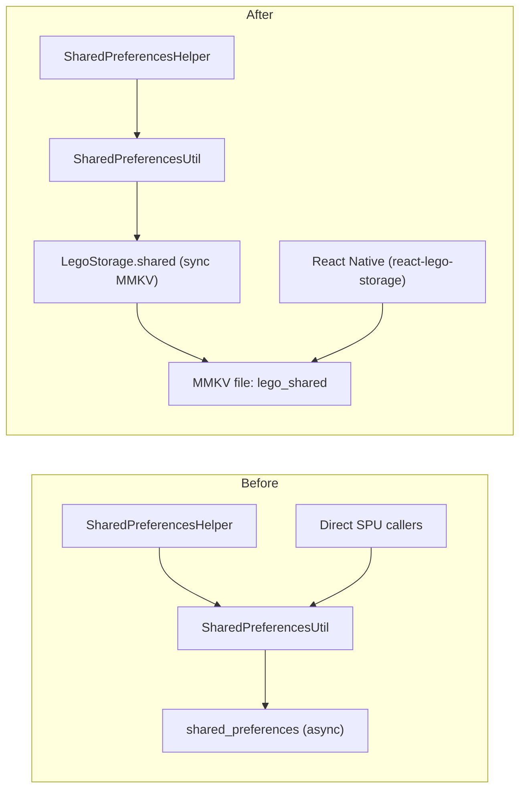

# Replace SharedPreferences with flutter_lego_storage

## Architecture: Before vs After




Both Flutter and React Native read/write the **same MMKV file** (`lego_shared` mmapID), enabling bidirectional storage.

---

## Key Decisions (reference for all projects)

- **Storage type**: `LegoStorage.shared` -- uses MMKV with mmapID `lego_shared`, the same file react-lego-storage reads/writes on the RN side
- **List support**: JSON encode/decode `List<String>` as a single string value
- **API signatures**: Keep all `SharedPreferencesHelper` methods returning `Future` (wrap sync calls in `Future.value(...)`) to avoid changing 28+ consumer files
- **NativeCommunication mixin**: Remove from `SharedPreferencesUtil` -- it is unrelated to storage
- **Direct SharedPreferencesUtil callers**: Move to new methods on `SharedPreferencesHelper`
- **Data migration**: Accept data loss (users will be logged out on update). No migration from old SharedPreferences data.
- **Bidirectional**: RN can set/remove keys via react-lego-storage, and Flutter will see updates on next read (MMKV memory-maps the same file)

---

## Step-by-step Migration

### Step 1: Add MMKV + LegoStorage initialization in main.dart

In the project's `main.dart` (for supersale: [flutter_module/lib/main.dart](flutter_module/lib/main.dart)), add initialization **before** any storage access:

```dart
import 'package:mmkv/mmkv.dart';
import 'package:lego_storage/lego_storage.dart';

void main() async {
  runZonedGuarded(() async {
    WidgetsFlutterBinding.ensureInitialized();
    await MMKV.initialize();     // <-- ADD: required before any MMKV usage
    await LegoStorage.init();     // <-- ADD: uses mmkv engine by default
    await initEnvironment();
    // ... rest unchanged
```

**For other projects**: Find the `main()` function, place these two lines right after `WidgetsFlutterBinding.ensureInitialized()` and before any code that reads/writes storage.

---

### Step 2: Rewrite SharedPreferencesUtil

File: [flutter_module/lib/libraries/shared_preferences/shared_preferences_util.dart](flutter_module/lib/libraries/shared_preferences/shared_preferences_util.dart)

Full rewrite -- delegates to `LegoStorage.shared`, removes `NativeCommunication` mixin, removes `shared_preferences` import:

```dart
import 'dart:convert';
import 'package:lego_storage/lego_storage.dart';

class SharedPreferencesUtil {
  SharedPreferencesUtil._privateConstructor();
  static final SharedPreferencesUtil _instance = SharedPreferencesUtil._privateConstructor();
  factory SharedPreferencesUtil() => _instance;

  LegoSharedStorage get _storage => LegoStorage.shared;

  // --- Getters ---
  Future<int?> getInt(String key) => Future.value(_storage.getNumber(key));

  Future<String?> getString(String key) => Future.value(_storage.getItem(key));

  // Nullable bool: returns null if key not set, true/false otherwise
  Future<bool?> getBool(String key) {
    final raw = _storage.getItem(key);
    if (raw == null) return Future.value(null);
    return Future.value(raw == 'true');
  }

  Future<double?> getDouble(String key) => Future.value(_storage.getDouble(key));

  Future<List<String>?> getStringList(String key) {
    final raw = _storage.getItem(key);
    if (raw == null) return Future.value(null);
    try {
      return Future.value(List<String>.from(jsonDecode(raw)));
    } catch (_) {
      return Future.value(null);
    }
  }

  // --- Setters ---
  Future<bool> setInt(String key, int value) {
    _storage.setNumber(key, value);
    return Future.value(true);
  }

  Future<bool> setString(String key, String value) {
    _storage.setItem(key, value);
    return Future.value(true);
  }

  Future<bool> setBool(String key, bool value) {
    _storage.setBoolean(key, value);
    return Future.value(true);
  }

  Future<bool> setDouble(String key, double value) {
    _storage.setDouble(key, value);
    return Future.value(true);
  }

  Future<bool> setStringList(String key, List<String> value) {
    _storage.setItem(key, jsonEncode(value));
    return Future.value(true);
  }

  // --- Remove / Clear ---
  Future<bool> remove(String key) {
    _storage.removeItem(key);
    return Future.value(true);
  }

  Future<bool> clear() {
    _storage.clear();
    return Future.value(true);
  }
}
```

**Critical: `getBool` nullable behavior** -- `LegoSharedStorage.getBoolean()` returns `false` for missing keys. The rewrite above checks `getItem(key) == null` first to preserve the nullable semantics that existing code relies on (e.g., `getIsDarkTheme()` returns `null` when never set).

---

### Step 3: Add new methods to SharedPreferencesHelper for direct-usage cases

File: [flutter_module/lib/libraries/shared_preferences/shared_preferences_helper.dart](flutter_module/lib/libraries/shared_preferences/shared_preferences_helper.dart)

**For supersale**, these 3 direct-usage patterns exist. Other projects should audit their codebase for any file that imports `SharedPreferencesUtil` directly (search: `import.*shared_preferences_util`).

Add these methods:

```dart
// --- UserInfoHandler support ---
Future<String?> getUserDetail() {
  return util.getString('user_detail');
}

Future<bool> setUserDetail(String value) {
  return util.setString('user_detail', value);
}

Future<bool> removeUserDetailKey() {
  return util.remove('user_detail');
}

// --- QC icon caching support (CartProvider / PdpBaseProvider) ---
Future<String?> getQcIconList() {
  return util.getString(CommonConstant.KEY_QC_ICON);
}

Future<bool> setQcIconList(String value) {
  return util.setString(CommonConstant.KEY_QC_ICON, value);
}

Future<int?> getQcIconLastUpdateTime() {
  return util.getInt(CommonConstant.QC_ICON_LAST_UPDATE_TIME);
}

Future<bool> setQcIconLastUpdateTime(int value) {
  return util.setInt(CommonConstant.QC_ICON_LAST_UPDATE_TIME, value);
}
```

**For other projects**: Run this search to find all direct `SharedPreferencesUtil` callers outside the helper class:

```
grep -rn "SharedPreferencesUtil" lib/ --include="*.dart" | grep -v shared_preferences_util.dart | grep -v shared_preferences_helper.dart
```

For each match, create a corresponding method on `SharedPreferencesHelper` and update the caller.

---

### Step 4: Update direct SharedPreferencesUtil consumers

#### 4a. UserInfoHandler

File: [flutter_module/lib/helpers/user/user_info_handler.dart](flutter_module/lib/helpers/user/user_info_handler.dart)

- Replace import: `shared_preferences_util.dart` -> `shared_preferences_helper.dart`
- `SharedPreferencesUtil().getString(USER_DETAIL)` -> `SharedPreferencesHelper().getUserDetail()`
- `SharedPreferencesUtil().setString(USER_DETAIL, value)` -> `SharedPreferencesHelper().setUserDetail(value)`
- `SharedPreferencesUtil().remove(USER_DETAIL)` -> `SharedPreferencesHelper().removeUserDetailKey()`

#### 4b. CartProvider

File: [flutter_module/lib/modules/checkout/providers/cart_provider.dart](flutter_module/lib/modules/checkout/providers/cart_provider.dart)

- Replace import: `shared_preferences_util.dart` -> `shared_preferences_helper.dart`
- `SharedPreferencesUtil().getString(CommonConstant.KEY_QC_ICON)` -> `SharedPreferencesHelper().getQcIconList()`
- `SharedPreferencesUtil().getInt(CommonConstant.QC_ICON_LAST_UPDATE_TIME)` -> `SharedPreferencesHelper().getQcIconLastUpdateTime()`
- `SharedPreferencesUtil().setInt(CommonConstant.QC_ICON_LAST_UPDATE_TIME, ...)` -> `SharedPreferencesHelper().setQcIconLastUpdateTime(...)`
- `SharedPreferencesUtil().setString(CommonConstant.KEY_QC_ICON, ...)` -> `SharedPreferencesHelper().setQcIconList(...)`

#### 4c. PdpBaseProvider

File: [flutter_module/lib/modules/products/single_device/providers/pdp_base_provider.dart](flutter_module/lib/modules/products/single_device/providers/pdp_base_provider.dart)

Same 4 replacements as CartProvider above.

---

### Step 5: Remove shared_preferences dependency

File: [flutter_module/pubspec.yaml](flutter_module/pubspec.yaml)

- Remove line: `shared_preferences: ^2.3.0` (line 68)
- Keep: `lego_storage: path: ../flutter_lego_storage` (lines 125-126)

**For other projects**: Also check `dependency_overrides` and `dev_dependencies` for `shared_preferences` references.

---

### Step 6: Run flutter pub get and verify

```bash
cd flutter_module && flutter pub get
```

Fix any import/compilation errors.

---

## Checklist for Other Projects

When applying this plan to a different Flutter project:

1. **Audit**: Search for `SharedPreferencesUtil` direct usages outside the helper class. Create wrapper methods in the helper for each.
2. **Audit**: Search for `import.*shared_preferences` across the codebase. Every file should ultimately go through `SharedPreferencesHelper` -> `SharedPreferencesUtil` -> `LegoStorage.shared`.
3. **pubspec.yaml**: Add `lego_storage` dependency (path or git ref). Remove `shared_preferences`.
4. **main.dart**: Add `MMKV.initialize()` + `LegoStorage.init()` before any storage call.
5. **Nullable bools**: If the project uses `getBool` and expects `null` for unset keys, ensure `SharedPreferencesUtil.getBool` checks `getItem(key) == null` first.
6. **List storage**: If `setStringList` / `getStringList` is used, it now JSON-encodes/decodes. RN side must also JSON-parse these values.
7. **Key naming convention**: Ensure Flutter and RN use identical string keys for shared data. Document all shared keys between teams.
8. **Bidirectional reads**: Since MMKV memory-maps the same file, if RN writes or removes a key, Flutter sees the update on the very next `getItem()` call (no refresh needed). Same in reverse.
9. **Test**: After migration, verify login flow, settings persistence, and any feature that reads stored data.

---

## Files Changed (supersale-specific)


| File                                                                                 | Change Type                   |
| ------------------------------------------------------------------------------------ | ----------------------------- |
| `flutter_module/lib/main.dart`                                                       | Add 2 init lines              |
| `flutter_module/lib/libraries/shared_preferences/shared_preferences_util.dart`       | Full rewrite                  |
| `flutter_module/lib/libraries/shared_preferences/shared_preferences_helper.dart`     | Add ~7 new methods            |
| `flutter_module/lib/helpers/user/user_info_handler.dart`                             | Replace 3 direct calls        |
| `flutter_module/lib/modules/checkout/providers/cart_provider.dart`                   | Replace 4 direct calls        |
| `flutter_module/lib/modules/products/single_device/providers/pdp_base_provider.dart` | Replace 4 direct calls        |
| `flutter_module/pubspec.yaml`                                                        | Remove shared_preferences dep |


**No changes needed** to the ~28 files that only import `SharedPreferencesHelper` -- their `Future`-based API is preserved.