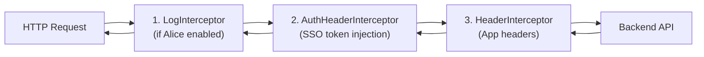
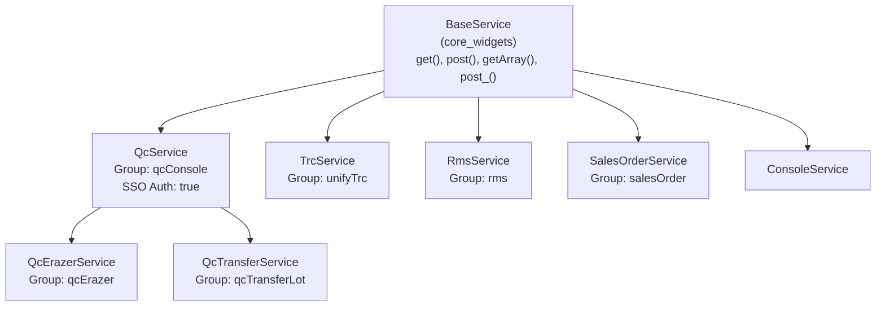
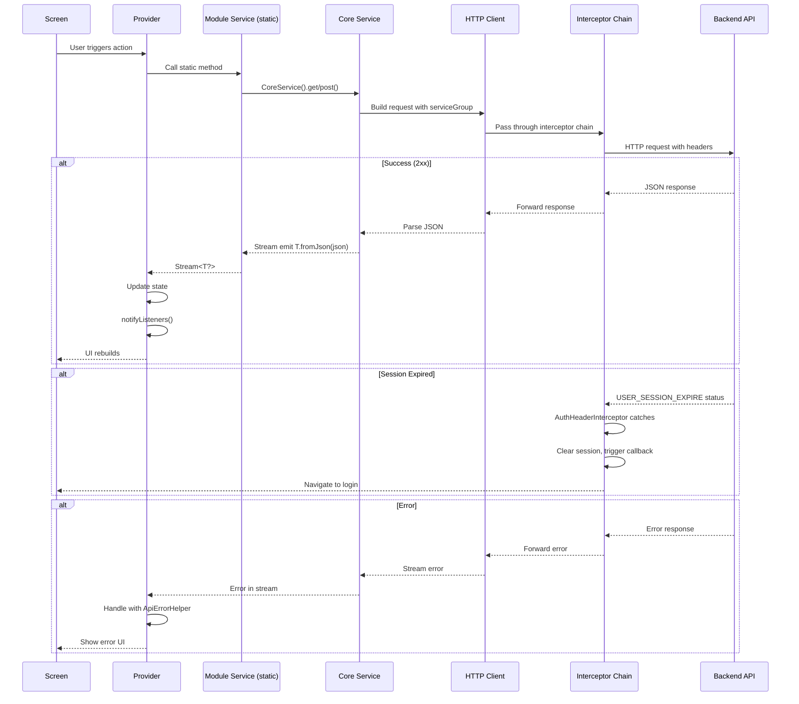

<!-- Document Information -->
<!-- Generated: 2026-02-18 -->
<!-- Version: 6.0.0+83 -->
<!-- Commit: 9ea0c658 -->

# Api Services Reference

## Table of Contents

- [Overview](#overview)
- [HTTP Client Initialization](#http-client-initialization)
- [Interceptor Chain](#interceptor-chain)
- [Service Class Hierarchy](#service-class-hierarchy)
- [Request Response Lifecycle](#request-response-lifecycle)
- [DTO Serialization](#dto-serialization)
- [Stream API Patterns](#stream-api-patterns)
- [Error Codes](#error-codes)
- [Service Locations](#service-locations)
- [Module Service Classes](#module-service-classes)
- [Environment Configuration Per Service](#environment-configuration-per-service)
- [Related Documents](#related-documents)

## Overview

Flutter TRC uses a **Stream-based API pattern** where all API calls return `Stream<T>` types for reactive programming. The HTTP client is provided by the `core_widgets` shared package, with a service hierarchy that maps each service to a backend **service group**. Requests pass through an **interceptor pipeline** that handles authentication, logging, and header injection.

Key characteristics:
- All API methods return `Stream<T>` (not `Future<T>`)
- Services are stateless and created inline (e.g., `QcService().get(...)`)
- Module-level service classes use static methods that internally create core service instances
- DTOs use `json_serializable` with code-generated `fromJson`/`toJson`
- Interceptors automatically handle SSO token injection and session expiry

## HTTP Client Initialization

The HTTP client is initialized in `lib/src/app_initializer.dart` during app startup:

```dart
HttpClient.init(
  baseUrl: environment.baseUrl,
  apiUrl: environment.apiUrl,
  tokenUrl: environment.authUri,
  interceptorFactoryMap: {
    LogInterceptor.key: () => LogInterceptor(),           // Conditional
    AuthHeaderInterceptor.key: () => AuthHeaderInterceptor(), // Always
    HeaderInterceptor.key: () => HeaderInterceptor(),       // Always
  },
);
```

| Property | Source | Description |
|----------|--------|-------------|
| baseUrl | `environment.baseUrl` | Base URL for the environment |
| apiUrl | `environment.apiUrl` | API domain URL |
| tokenUrl | `environment.authUri` | OAuth token endpoint |
| interceptorFactoryMap | Inline map | Interceptor factory registrations |

## Interceptor Chain

Interceptors are registered in `lib/src/app_initializer.dart` and execute in the following order:

| Order | Interceptor | File | Condition | Behavior |
|-------|------------|------|-----------|----------|
| 1 | LogInterceptor | `lib/src/interceptors/log_interceptor.dart` | Non-web platform AND Alice enabled | Logs HTTP request/response details to Alice inspector |
| 2 | AuthHeaderInterceptor | `lib/src/interceptors/auth/auth_header_interceptor.dart` | Always active | Injects SSO token (`CoreHeaders.xSSOToken`), handles session expiry, retries on auth failure |
| 3 | HeaderInterceptor | `lib/src/interceptors/header/header_interceptor.dart` | Always active (when serviceGroup is set) | Adds `X_APP_OS`, `X_APP_LANGUAGE`, `X_APP_VERSION` headers |

### Interceptor Pipeline Diagram



## Service Class Hierarchy



### Core Service Classes

| Service Class | File | Extends | Service Group | Auth |
|--------------|------|---------|---------------|------|
| QcService | `lib/src/services/qc_service.dart` | BaseService | `TRCServiceGroups.qcConsole` | SSO Token |
| QcErazerService | `lib/src/services/qc_erazer_service.dart` | QcService | `TRCServiceGroups.qcErazer` | SSO Token |
| QcTransferService | `lib/src/services/qc_transfer_service.dart` | QcService | `TRCServiceGroups.qcTransferLot` | SSO Token |
| TrcService | `lib/src/services/trc_service.dart` | BaseService | `TRCServiceGroups.unifyTrc` | SSO Token |
| RmsService | `lib/src/services/rms_service.dart` | BaseService | `TRCServiceGroups.rms` | SSO Token |
| SalesOrderService | `lib/src/services/sales_order_service.dart` | BaseService | `TRCServiceGroups.salesOrder` | SSO Token |
| ConsoleService | `lib/src/services/console_service.dart` | BaseService | — | Configurable |

### Service Group Mapping

| Enum Value | Backend Identifier | Used By |
|-----------|-------------------|---------|
| `qcConsole` | "qc-console" | QcService, most QC modules |
| `qcErazer` | "qc-data-erazer" | QcErazerService, data_wipe module |
| `qcTransferLot` | "qc-transfer-lot" | QcTransferService, stock_transfer module |
| `unifyTrc` | "unify-trc" | TrcService, TRC modules |
| `rms` | "sales-rms" | RmsService, RMS modules |
| `salesOrder` | "qc-sales-order" | SalesOrderService |
| `imageOptimiser` | "image-optimizer" | Image optimization service |
| `supersalesOms` | "supersales-oms" | OMS operations |

## Request Response Lifecycle



## DTO Serialization

### Pattern

The project uses `json_serializable` with `build_runner` for code generation:

```dart
import 'package:json_annotation/json_annotation.dart';

part 'my_response.g.dart';

@JsonSerializable()
class MyResponse {
  @JsonKey(name: "api_field_name")
  final String? fieldName;
  
  @JsonKey(name: "nested_object")
  final NestedType? nestedObject;

  MyResponse({this.fieldName, this.nestedObject});

  factory MyResponse.fromJson(Map<String, dynamic> json) =>
      _$MyResponseFromJson(json);

  Map<String, dynamic> toJson() => _$MyResponseToJson(this);
}
```

### Manual fromJson Pattern

Some simpler models use manual fromJson without code generation:

```dart
class SimpleResponse {
  final String? field1;
  final int? field2;

  SimpleResponse({this.field1, this.field2});

  factory SimpleResponse.fromJson(Map<String, dynamic> json) {
    return SimpleResponse(
      field1: json['field1'],
      field2: json['field2'],
    );
  }
}
```

### Code Generation Command

```bash
flutter pub run build_runner build --delete-conflicting-outputs
```

## Stream API Patterns

### GET Single Object

```dart
static Stream<DeviceDetailResponse?> getDeviceDetails(String deviceBarcode) {
  return QcService().get(
    "/device/detail?qrcode=$deviceBarcode",
    DeviceDetailResponse.fromJson,
  );
}
```

### GET Array

```dart
static Stream<List<ScanNormalLotItem>?> fetchNormalScanLotList(
  String lotName,
  {required BaseService service}
) {
  return service.getArray(
    "/v1/store-out/devices",
    ScanNormalLotItem.fromJson,
    params: {"gln": [lotName]},
  );
}
```

### POST with Body

```dart
static Stream<BaseResponse?> submitData(Map<String, dynamic> data) {
  return QcService().post(
    "/endpoint/path",
    BaseResponse.fromJson,
    body: jsonEncode(data),
  );
}
```

### POST Void

```dart
static Stream<void> initiateDataWipe(int id) {
  return QcErazerService().post_(
    "/v1/data-erasure/start-process",
    body: jsonEncode({"id": id}),
  );
}
```

### Query Parameters

```dart
Map<String, List<String>> params = {
  "gln": [groupLotName],
  "lid": [lotId.toString()],
  if (groupName != null) "gn": [groupName],
};
return QcService().get("/endpoint", ResponseType.fromJson, params: params);
```

## Error Codes

| Status Code | Constant | Meaning | Handling |
|-------------|----------|---------|----------|
| USER_SESSION_EXPIRE | `ApiErrorCodes.USER_SESSION_EXPIRE` | SSO session expired | AuthHeaderInterceptor clears session, triggers logout callback |
| 401 | Unauthorized | Invalid or missing token | Retry with refreshed token, then logout |
| 403 | Forbidden | Insufficient permissions | Display permission error |
| 404 | Not Found | Resource not found | Display not found message |
| 500 | Server Error | Backend failure | Display generic error via ApiErrorHelper |

## Service Locations

### Core Services

| Service Class | File Path |
|--------------|-----------|
| QcService | `lib/src/services/qc_service.dart` |
| QcErazerService | `lib/src/services/qc_erazer_service.dart` |
| QcTransferService | `lib/src/services/qc_transfer_service.dart` |
| TrcService | `lib/src/services/trc_service.dart` |
| RmsService | `lib/src/services/rms_service.dart` |
| SalesOrderService | `lib/src/services/sales_order_service.dart` |
| ConsoleService | `lib/src/services/console_service.dart` |
| TRCServiceGroups | `lib/src/services/service_groups.dart` |
| S3Details | `lib/src/services/s3_details.dart` |

## Module Service Classes

| Module | Service Class | File Path | Core Service Used |
|--------|--------------|-----------|-------------------|
| d2c_video | D2CVideoService | `lib/qc/modules/d2c_video/resources/d2c_video_service.dart` | QcService |
| data_wipe | DataWipeService | `lib/qc/modules/data_wipe/resources/data_wipe_service.dart` | QcErazerService |
| dead_repair | DeadRepairServices | `lib/qc/modules/dead_repair/resources/services.dart` | QcService |
| device_details | DeviceDetailService | `lib/qc/modules/device_details/resources/device_detail_service.dart` | QcService |
| device_receive | DeviceReceiveService | `lib/qc/modules/device_receive_module/resources/device_receive_service.dart` | QcService |
| dispatch_lot | DispatchLotServices | `lib/qc/modules/dispatch_lot/resources/services.dart` | QcService |
| external_audit | ExternalAuditService | `lib/qc/modules/external_audit/resources/external_audit_service.dart` | QcService |
| gaurd | GuardService | `lib/qc/modules/gaurd/resources/guard_service.dart` | QcService |
| imei_validator | ImeiValidatorService | `lib/qc/modules/imei_validator/resources/imei_validator_service.dart` | QcService |
| pre_dispatch | PreDispatchServices | `lib/qc/modules/pre_dispatch/resources/services.dart` | QcService |
| qc_actions | QcActionServices | `lib/qc/modules/qc_actions/resources/services.dart` | QcService |
| qc_tester/audit | AuditService | `lib/qc/modules/qc_tester/audit/resources/audit_service.dart` | QcService |
| qc_tester/calculator | CalculatorService | `lib/qc/modules/qc_tester/calculator/resources/calculator_service.dart` | QcService |
| qc_tester/calculator | QcCalculatorService | `lib/qc/modules/qc_tester/calculator/resources/qc_calculator_service.dart` | QcService |
| qc_tester/disputed | DisputeImageCaptureService | `lib/qc/modules/qc_tester/disputed_image_capture/resources/dispute_image_capture_service.dart` | QcService |
| qc_tester/home | TesterHomeService | `lib/qc/modules/qc_tester/home/resources/tester_home_service.dart` | QcService |
| re_qc | ReQcService | `lib/qc/modules/re_qc/resources/re_qc_service.dart` | QcService |
| stock_in_module | StockInService | `lib/qc/modules/stock_in_module/resources/stock_in_service.dart` | QcService |
| stock_transfer | StockTransferService | `lib/qc/modules/stock_transfer/resources/stock_transfer_service.dart` | QcTransferService |
| store_in | StoreInServices | `lib/qc/modules/store_in/resources/services.dart` | QcService |
| store_out | StoreOutServices | `lib/qc/modules/store_out/resources/services.dart` | QcService / BaseService |
| supervisor | SupervisorService | `lib/qc/modules/supervisor/resources/supervisor_service.dart` | QcService |
| warehouse_audit | WarehouseAuditService | `lib/qc/modules/warehouse_audit/resources/warehouse_audit_service.dart` | QcService |

### Common Services

| Service | File Path | Purpose |
|---------|-----------|---------|
| UserService | `lib/src/common/user/user_service.dart` | User details and session |
| MPinService | `lib/src/common/mpin/mpin_service.dart` | MPIN authentication |
| NpsService | `lib/src/common/nps/resources/nps_service.dart` | Net Promoter Score |
| PiiService | `lib/src/common/resources/pii_service.dart` | PII data handling |
| ImageOptimiserService | `lib/src/utils/media_upload/image_optimiser_service.dart` | Image optimization |
| SsoImageOptimiserService | `lib/src/utils/media_upload/sso_image_optimiser_service.dart` | SSO-authenticated image optimization |
| MediaUploaderService | `lib/src/utils/media_upload/media_uploader_service.dart` | Media upload operations |

## Environment Configuration Per Service

| Environment | API URL | Base URL | Auth URI | Alice Enabled |
|-------------|---------|----------|----------|---------------|
| test (prodTest) | api.cashify.in | api.cashify.in | [env-specific] | true |
| stage | api.stage.cashify.in | api.stage.cashify.in | [env-specific] | true |
| beta | api.beta.cashify.in | api.beta.cashify.in | [env-specific] | true |
| prod | api.cashify.in | api.cashify.in | [env-specific] | false |

## Related Documents

- [Data Flow](./Data%20Flow.md) — End-to-end data lifecycle
- [Security](./Security.md) — Auth and interceptor chain detail
- [Error Handling](./Error%20Handling.md) — Error propagation
- [Configuration](./Configuration.md) — Environment configuration
- [Module Reference](./Module%20Reference.md) — Module-to-service mapping
