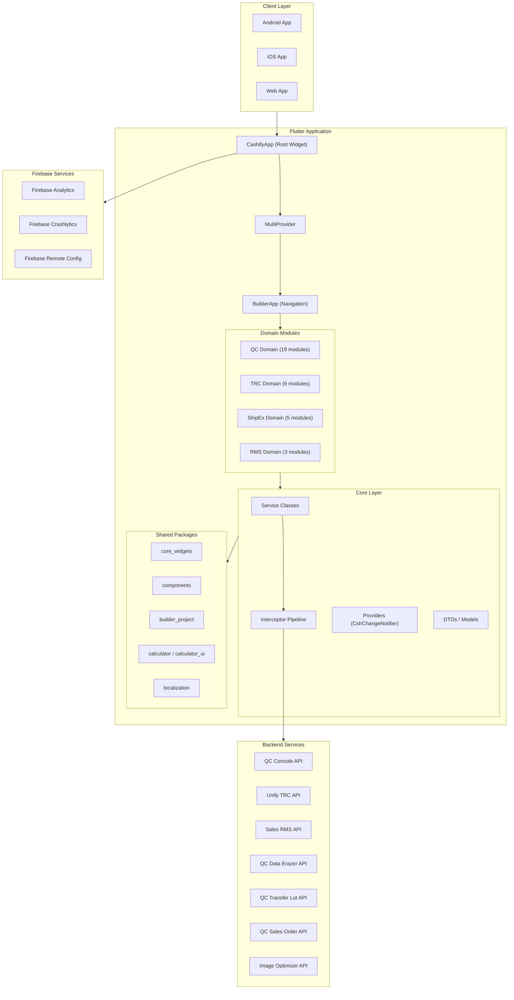
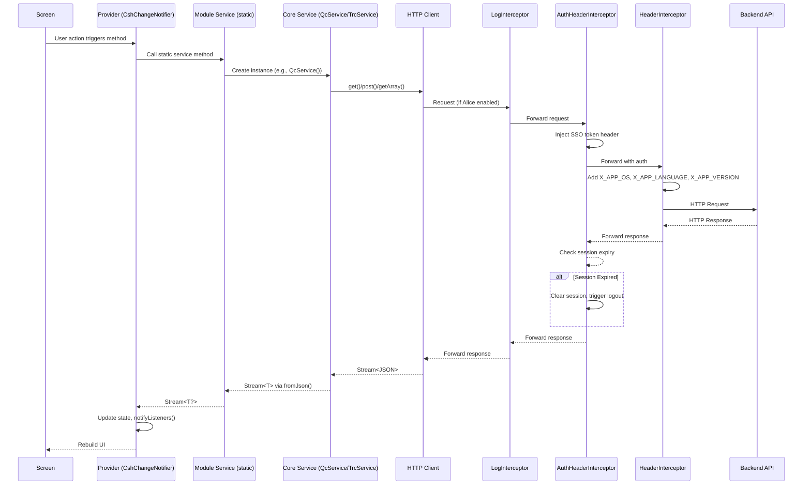
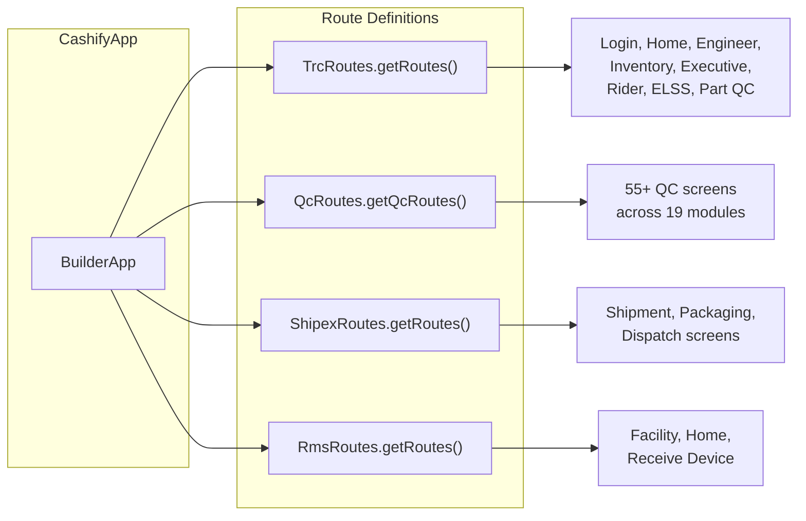
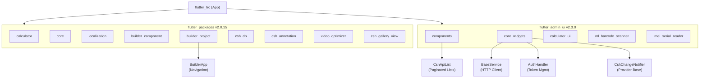
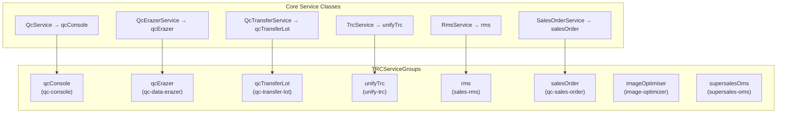
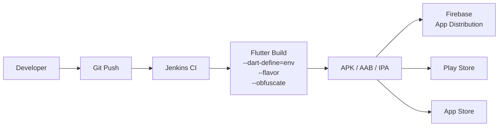

<!-- Document Information -->
<!-- Generated: 2026-02-18 -->
<!-- Version: 6.0.0+83 -->
<!-- Commit: 9ea0c658 -->

# Flutter TRC System Architecture

## Table of Contents

- [Technology Stack](#technology-stack)
- [High-Level Architecture](#high-level-architecture)
- [Directory Structure](#directory-structure)
- [Dependency Boundaries](#dependency-boundaries)
- [Request and Data Flow](#request-and-data-flow)
- [Route Structure](#route-structure)
- [Shared Package Dependency Tree](#shared-package-dependency-tree)
- [Service Group Architecture](#service-group-architecture)
- [Deployment Flow](#deployment-flow)
- [Related Documents](#related-documents)

## Technology Stack

| Layer | Technology | Purpose |
|-------|------------|---------|
| Framework | Flutter 3.4.3+ | UI, routing, platform abstraction |
| Language | Dart 3.4.3+ | Application logic |
| State Management | Provider 6.0.4 + CshChangeNotifier | State management with lifecycle guards |
| HTTP Client | Custom client (core_widgets) | API calls with interceptor pipeline |
| Navigation | BuilderApp (builder_project) + Named Routes | Screen navigation |
| UI Components | components, core_widgets, calculator_ui | Shared widget library |
| Serialization | json_serializable + build_runner | DTO code generation |
| Localization | intl + ARB files | Multi-language support (en, hi) |
| Analytics | Firebase Analytics | User behavior tracking |
| Crash Reporting | Firebase Crashlytics | Production error tracking |
| Remote Config | Firebase Remote Config | Feature flags and remote configuration |
| Debugging | Alice HTTP Inspector | HTTP request/response inspection (non-prod) |
| Local Storage | get_storage, SharedPreferences | Persistent data storage |
| Auth | SSO Token via AuthHandler | Token-based authentication |
| Barcode Scanning | ml_barcode_scanner | ML-based barcode/QR scanning |
| Image Optimization | image_optimizer (S3-based) | Image compression and upload |
| Video | video_optimizer, video_compress | Video recording and compression |
| Charts | fl_chart | Data visualization |
| QR Code | qr_flutter | QR code generation |
| Biometrics | local_auth | Biometric authentication |
| TTS | flutter_tts | Text-to-speech |

## High-Level Architecture



## Directory Structure

```
flutter_trc/
├── lib/
│   ├── main.dart                    # Entry point
│   ├── qc/                          # QC (Quality Control) domain
│   │   ├── modules/                 # 19 QC feature modules
│   │   │   ├── d2c_video/
│   │   │   ├── data_wipe/
│   │   │   ├── dead_repair/
│   │   │   ├── device_details/
│   │   │   ├── device_receive_module/
│   │   │   ├── dispatch_lot/
│   │   │   ├── external_audit/
│   │   │   ├── gaurd/
│   │   │   ├── imei_validator/
│   │   │   ├── pre_dispatch/
│   │   │   ├── qc_actions/
│   │   │   ├── qc_tester/           # 6 submodules
│   │   │   ├── re_qc/
│   │   │   ├── stock_in_module/
│   │   │   ├── stock_transfer/
│   │   │   ├── store_in/
│   │   │   ├── store_out/
│   │   │   ├── supervisor/
│   │   │   └── warehouse_audit/
│   │   ├── qc_common/               # QC shared code
│   │   ├── qc_role_permission/      # QC role-based permissions
│   │   └── qc_routes.dart           # QC route definitions (60+ routes)
│   ├── rms/                         # RMS domain
│   │   ├── modules/                 # 3 RMS feature modules
│   │   └── rms_common/              # RMS shared code
│   ├── shipex/                      # ShipEx domain
│   │   └── modules/                 # 5 ShipEx feature modules
│   ├── src/                         # Core application code
│   │   ├── actions/                 # Project actions (minimal)
│   │   ├── analytics/               # Analytics setup
│   │   ├── app.dart                 # Root widget (CashifyApp)
│   │   ├── app_builder/             # App builder configuration
│   │   ├── app_initializer.dart     # App initialization
│   │   ├── channel/                 # Platform channels
│   │   ├── common/                  # Shared models, widgets, utils, MPIN, NPS
│   │   ├── environments/            # Environment configuration (4 envs)
│   │   ├── header/                  # Header definitions
│   │   ├── interceptors/            # HTTP interceptors (auth, header, log, alert)
│   │   ├── l10n/                    # Localization ARB files
│   │   ├── libraries/               # Third-party integrations
│   │   ├── localization/            # Additional localization
│   │   ├── modules/                 # TRC feature modules (login, engineer, etc.)
│   │   ├── resources/               # Shared resources (S3, user details)
│   │   ├── services/                # Core service classes
│   │   ├── theme/                   # Theme configuration
│   │   ├── types/                   # Type definitions
│   │   └── utils/                   # Utilities (media upload, image, video, etc.)
│   └── trc/                         # TRC-specific code
│       └── my_permissions/          # TRC permissions
├── test/                            # Test files
├── scripts/                         # Build and utility scripts
├── .cursor/rules/                   # Cursor AI rules (7 files)
├── pubspec.yaml                     # Package configuration
└── jenkinfile.groovy                # CI/CD configuration
```

## Dependency Boundaries

| Layer | Can Import From | Cannot Import From |
|-------|----------------|-------------------|
| Screens | Widgets, Providers, Models, Services, Shared Packages | Other module screens |
| Widgets | Models, Shared Packages, Utils | Services directly (use Providers) |
| Providers (CshChangeNotifier) | Services, Models, Utils, Shared Packages | Widgets, Screens |
| Services (BaseService) | Models, Shared Packages (core_widgets) | Providers, Widgets, Screens |
| Models (DTOs) | json_annotation | Services, Providers, Widgets |
| Interceptors | core_widgets, Auth, Headers | Modules, Screens |
| Shared Packages | Dart SDK, Flutter SDK | App-specific code |

## Request and Data Flow



## Route Structure

The application uses **named routes** via `BuilderApp` from the `builder_project` package. Routes are organized by domain and combined in the root widget:



- **Initial Route:** `SplashScreen.route`
- **Navigator Observers:** `CshRouteObserver`, `FirebaseAnalyticsObserver`
- **Session Handling:** `SessionExpiredCallback` triggers logout on session expiry
- **Alert Handling:** `CashifyAlertHandler` for app-wide alert modals

## Shared Package Dependency Tree



## Service Group Architecture



## Deployment Flow



**Build Flavors:**

| Flavor | Environment | API Base URL |
|--------|------------|-------------|
| stage | stage | api.stage.cashify.in |
| beta | beta | api.beta.cashify.in |
| prod | prod | api.cashify.in |
| Runner | prodTest | api.cashify.in |

**Build Command Pattern:**
```
flutter build apk --dart-define=env={flavor} --flavor {flavor} --obfuscate --split-debug-info=mappings
```

**Jenkins Configuration:**
- Parameters: FLAVOR (stage/beta/prod/Runner), PLATFORM (android/ios/web), EXPORT_TYPE (aab/apk)
- Slack notifications to `#console-flutter`
- Automatic Crashlytics symbol upload

## Related Documents

- [Data Flow](./Data%20Flow.md) — Detailed data lifecycle
- [Configuration](./Configuration.md) — Build and environment config
- [Module Reference](./Module%20Reference.md) — Module details
- [Api Services](./Api%20Services.md) — Service architecture
- [Security](./Security.md) — Interceptor pipeline and auth
- [Routing](./Routing.md) — Navigation architecture
