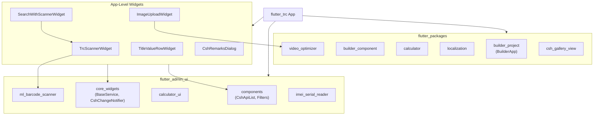

<!-- Document Information -->
<!-- Generated: 2026-02-18 -->
<!-- Version: 6.0.0+83 -->
<!-- Commit: 9ea0c658 -->

# Components and Patterns

## Table of Contents

- [Component Sources](#component-sources)
- [Component Category Index](#component-category-index)
- [Shared Package Components](#shared-package-components)
- [App Level Shared Widgets](#app-level-shared-widgets)
- [Component Dependency Graph](#component-dependency-graph)
- [Widget Guidelines](#widget-guidelines)
- [Related Documents](#related-documents)

## Component Sources

| Source | Package/Path | Description |
|--------|-------------|-------------|
| components | `package:components/components.dart` | Core UI components (CshApiList, filters, list patterns) |
| core_widgets | `package:core_widgets/core_widgets.dart` | Base classes (BaseService, CshChangeNotifier, AuthHandler, CoreHeaders) |
| calculator_ui | `package:calculator_ui/calculator_ui.dart` | Calculator UI components for device grading |
| builder_component | `package:builder_component/builder_component.dart` | Component builder patterns |
| builder_project | `package:builder_project/builder_project.dart` | BuilderApp navigation, project configuration |
| calculator | `package:calculator/calculator.dart` | Calculator logic and computation |
| ml_barcode_scanner | `package:ml_barcode_scanner/ml_barcode_scanner.dart` | ML-based barcode and QR scanning |
| imei_serial_reader | `package:imei_serial_reader/imei_serial_reader.dart` | IMEI and serial number reading |
| csh_gallery_view | `package:csh_gallery_view/csh_gallery_view.dart` | Image/video gallery viewer |
| video_optimizer | `package:video_optimizer/video_optimizer.dart` | Video optimization and compression |
| localization | `package:localization/localization.dart` | Localization utilities and LocaleProvider |
| App common widgets | `lib/src/common/widgets/` | App-level shared widgets |
| App utils widgets | `lib/src/utils/` | Media upload, image, video utility widgets |

## Component Category Index

| Category | Components | Source |
|----------|-----------|--------|
| Lists & Pagination | CshApiList, PaginatedListView | components, lib/src/common/ |
| Scanning | TrcScannerWidget, ImeiScanner, MlBarcodeScanner | lib/src/common/, ml_barcode_scanner |
| Search | MySearchBarWidget, SearchbarWidget, SearchWithScannerWidget, SearchWithDropdownWidget | lib/src/common/widgets/ |
| Media Upload | ImageUploadWidget, VideoUploadCard, GeneralImageUploadCard, GeneralVideoUploadCard | lib/src/utils/media_upload/ |
| Media Capture | VideoRecoderWidget, MultipleImageUploadScreen | lib/src/common/widgets/ |
| Gallery | CshGalleryView | csh_gallery_view |
| Calculator | CalculatorUI components | calculator_ui |
| Navigation | BuilderApp | builder_project |
| Display | TitleValueRowWidget, KeyValueRowWidget, LabeledText, FetchImageWidget | lib/src/common/widgets/ |
| Buttons | MyCounterButton | lib/src/common/widgets/ |
| Dialogs | CshRemarksDialog, CshNoInternetDialog, LoadingDialogWidget | lib/src/common/widgets/, dialogs/ |
| Loading | ShimmerListWidget | lib/src/common/widgets/ |
| Layout | DottedDividerLine, CshExpansionWidget, DropdownViewWidget | lib/src/utils/, lib/src/common/ |
| Permissions | TRCRolePermissionWidget, QcRolePermissionWidget | lib/trc/, lib/qc/ |
| Info Display | PiiInfoWidget, NotRegisteredComponentWidget, AppVersionWidget | lib/src/common/widgets/ |
| User | UserNameWidget, UserProfileActionWidget, LogoutActionWidget, LogoutModalWidget | lib/src/common/user/ |
| NPS | NpsWidget, ShowNpsDialog | lib/src/common/nps/ |

## Shared Package Components

### components (from flutter_admin_ui)

Primary UI component library providing:
- **CshApiList** — Paginated list widget with built-in API integration, filtering, and search
- **CshFilterData** — Filter configuration for CshApiList
- **AdminFilterList / AdminFilterData** — Pre-selected filter configurations
- **ListApiConfig** — API configuration for list widgets
- **FilterPosition / FilterGroupType / CshFilterType / CshFilterValueType** — Filter enums
- **CshListController** — Controller for programmatic list management

### core_widgets (from flutter_admin_ui)

Foundation package providing:
- **BaseService** — HTTP service base class with get/post/getArray/post_ methods
- **CshChangeNotifier** — Enhanced ChangeNotifier with lifecycle guards
- **AuthHandler** — SSO token management
- **CoreHeaders** — Standard header definitions (xSSOToken, xSSOTokenKey)
- **ApiErrorHelper** — Error message extraction
- **ApiErrorCodes** — Error code constants
- **Validator** — Input validation utilities
- **HttpClient** — HTTP client with interceptor support
- **Logger** — Logging utility

### builder_project (from flutter_packages)

- **BuilderApp** — Root app widget providing named-route navigation
- **ProjectConfig** — Project configuration management
- **AbsProjectTheme** — Abstract theme interface

### calculator / calculator_ui

- **Calculator logic** — Device grading calculations
- **Calculator UI** — Calculator interface components for QC testing

### ml_barcode_scanner

- **MlBarcodeScanner** — ML-powered barcode and QR code scanning widget

### localization

- **LocaleProvider** — Locale/language state management
- **CshLocalizationsDelegate** — Localization delegate
- **Localization** — Localization setup utilities

## App Level Shared Widgets

### Scanning Widgets

| Widget | File | Purpose |
|--------|------|---------|
| TrcScannerWidget | `lib/src/common/widgets/trc_scanner_widget.dart` | Barcode/QR scanner with TRC-specific configuration |
| ImeiScanner | `lib/src/common/widgets/imei_scanner.dart` | IMEI-specific scanning |
| CshMlScannerUtil | `lib/src/common/utils/csh_ml_scanner_util.dart` | ML scanner utility wrapper |

### Search Widgets

| Widget | File | Purpose |
|--------|------|---------|
| MySearchBarWidget | `lib/src/common/widgets/my_search_bar_widget.dart` | Legacy search bar (being migrated to CshApiList) |
| SearchbarWidget | `lib/src/common/widgets/searchbar_widget.dart` | Search bar widget |
| SearchWithScannerWidget | `lib/src/common/widgets/search_with_scanner_widget.dart` | Combined search and barcode scan |
| SearchWithDropdownWidget | `lib/src/common/widgets/search_with_dropdown_widget.dart` | Search with dropdown filter |

### Media Widgets

| Widget | File | Purpose |
|--------|------|---------|
| ImageUploadWidget | `lib/src/utils/media_upload/image_upload_widget.dart` | Image capture and upload |
| VideoUploadCard | `lib/src/utils/media_upload/video_upload_card.dart` | Video upload card |
| GeneralImageUploadCard | `lib/src/utils/media_upload/general_image_upload_card.dart` | General-purpose image upload |
| GeneralVideoUploadCard | `lib/src/utils/media_upload/general_video_upload_card.dart` | General-purpose video upload |
| VideoRecoderWidget | `lib/src/common/widgets/video_recoder_widget.dart` | Video recording widget |
| MultipleImageUploadScreen | `lib/src/common/widgets/multiple_image_upload_screen.dart` | Multi-image upload |
| FetchImageWidget | `lib/src/utils/image/fetch_image_widget.dart` | Cached network image display |

### Display Widgets

| Widget | File | Purpose |
|--------|------|---------|
| TitleValueRowWidget | `lib/src/common/widgets/title_value_row_widget.dart` | Key-value display row with title |
| KeyValueRowWidget | `lib/src/common/widgets/key_value_row_widget.dart` | Simple key-value pair display |
| LabeledText | `lib/src/common/widgets/labeled_text.dart` | Text with label |
| PiiInfoWidget | `lib/src/common/widgets/pii_info_widget.dart` | PII (Personal Information) display with masking |
| AppVersionWidget | `lib/src/common/widgets/app_version_widget.dart` | App version display |

### Dialog Widgets

| Widget | File | Purpose |
|--------|------|---------|
| CshRemarksDialog | `lib/src/common/dialogs/csh_remarks_dialog.dart` | Remarks input dialog |
| CshNoInternetDialog | `lib/src/common/dialogs/csh_no_internet_dialog.dart` | No internet connectivity dialog |
| LoadingDialogWidget | `lib/src/common/widgets/loading_dialog_widget.dart` | Loading spinner dialog |
| DialogUtil | `lib/src/common/widgets/dialog_util.dart` | Dialog utility functions |

### Layout Widgets

| Widget | File | Purpose |
|--------|------|---------|
| ShimmerListWidget | `lib/src/common/widgets/shimmer_list_widget.dart` | Loading shimmer placeholder |
| DottedDividerLine | `lib/src/utils/dotted_divider_line.dart` | Dotted line divider |
| CshExpansionWidget | `lib/src/utils/csh_exapansion_widget.dart` | Expandable/collapsible container |
| DropdownViewWidget | `lib/src/common/widgets/dropdown_view_widget.dart` | Dropdown selector |
| MyCounterButton | `lib/src/common/widgets/my_counter_button.dart` | Counter with increment/decrement |
| PaginatedListView | `lib/src/common/widgets/paginated_listview.dart` | Legacy paginated list (being replaced by CshApiList) |

## Component Dependency Graph

## Widget Guidelines

Based on `.cursor/rules/flutter_style_guidelines.mdc` and codebase conventions:

1. **Const constructors** — Prefer `const` constructors where possible for widget optimization
2. **Trailing commas** — Use trailing commas for better auto-formatting
3. **Follow existing patterns** — Match the patterns in the file being modified
4. **Provider access** — Use `Provider.of(context)` or `CustomProvider.of(context)` patterns
5. **listen: false** — Pass `listen: false` when not rebuilding on changes
6. **Widget extraction** — Extract reusable widgets into shared locations
7. **Key usage** — Use keys for widgets in lists or when widget identity matters
8. **Disposal** — Dispose controllers, subscriptions, and timers in widget `dispose()` method
9. **Module organization** — Place module-specific widgets in `widgets/` directory with `index.dart` exports
10. **Component vs Widget** — Use `components/` for larger self-contained UI pieces, `widgets/` for smaller focused parts

## Related Documents

- [Module Reference](./Module%20Reference.md) — Where components are used
- [Architecture](./Architecture.md) — Package boundaries
- [Performance](./Performance.md) — Widget optimization patterns
