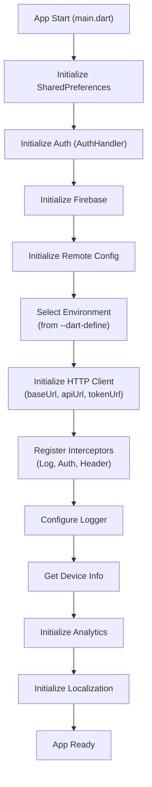
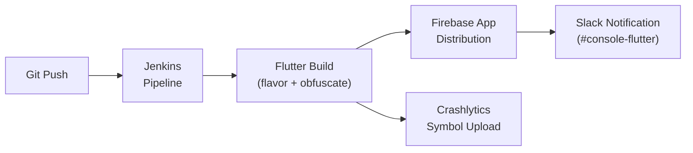

<!-- Document Information -->
<!-- Generated: 2026-02-18 -->
<!-- Version: 6.0.0+83 -->
<!-- Commit: 9ea0c658 -->

# Configuration

## Table of Contents

- [Overview](#overview)
- [Environment Configuration](#environment-configuration)
- [Environment Selection](#environment-selection)
- [Build Commands](#build-commands)
- [Project Configuration](#project-configuration)
- [Firebase Configuration](#firebase-configuration)
- [Code Generation](#code-generation)
- [Logging Configuration](#logging-configuration)
- [CI CD Configuration](#ci-cd-configuration)
- [Build Scripts](#build-scripts)
- [Related Documents](#related-documents)

## Overview

Flutter TRC uses `--dart-define` for environment selection at build time, with four environments (test, stage, beta, prod). Build configuration includes flavor-based builds, code obfuscation, and Firebase integration. CI/CD is handled via Jenkins with automated Firebase App Distribution.

## Environment Configuration

Defined in `lib/src/environments/environments.dart`:

| Environment | Mode | API URL | Base URL | Alice Enabled |
|-------------|------|---------|----------|---------------|
| test | prodTest | api.cashify.in | api.cashify.in | true |
| stage | stage | api.stage.cashify.in | api.stage.cashify.in | true |
| beta | beta | api.beta.cashify.in | api.beta.cashify.in | true |
| prod | prod | api.cashify.in | api.cashify.in | false |

### Environment Properties

Each environment object contains:

| Property | Description | Example |
|----------|-------------|---------|
| mode | Environment identifier | "stage" |
| baseUrl | Base URL for HTTP client | "api.stage.cashify.in" |
| cashifyUrl | Cashify portal URL | Environment-specific |
| casIdentifier | CAS identifier for auth | Environment-specific |
| authUri | OAuth token endpoint | Environment-specific |
| apiUrl | API domain | "api.stage.cashify.in" |
| appVersion | App version string | From pubspec |
| enableAlice | Enable Alice HTTP inspector | true/false |
| sourceIds | Platform source IDs | {android: "...", ios: "...", web: "..."} |

### Environment Types

Defined in `lib/src/environments/types.dart`:

```dart
enum EnvironmentTypes {
  PROD_TEST,  // "prodTest"
  STAGE,      // "stage"
  BETA,       // "beta"
  PROD,       // "prod"
}
```

## Environment Selection

### Build-Time Selection

Environment is selected via `--dart-define=env=<environment>`:

```bash
flutter run --dart-define=env=stage
flutter build apk --dart-define=env=prod
```

### Runtime Resolution

In `lib/src/environments/environment_config.dart`:

```dart
const RUNNING_SYSTEM_ENV = String.fromEnvironment('env', defaultValue: 'prod');
```

The initialization maps the string value to `EnvironmentTypes` enum and selects the corresponding environment configuration. Default is `stage` if an invalid value is provided.

### Initialization Sequence

In `lib/src/app_initializer.dart`:



## Build Commands

### Debug Builds

```bash
# Stage debug
flutter run --dart-define=env=stage

# Beta debug
flutter run --dart-define=env=beta

# Production test debug
flutter run --dart-define=env=prodTest
```

### Release APK Builds

```bash
# Stage APK
flutter build apk --dart-define=env=stage --flavor stage --obfuscate --split-debug-info=mappings

# Beta APK
flutter build apk --dart-define=env=beta --flavor beta --obfuscate --split-debug-info=mappings

# Production APK
flutter build apk --dart-define=env=prod --flavor prod --obfuscate --split-debug-info=mappings
```

### Release App Bundle (AAB) Builds

```bash
# Production AAB
flutter build appbundle --dart-define=env=prod --flavor prod --obfuscate --split-debug-info=mappings
```

### Web Builds

```bash
# Stage web
flutter build web --dart-define=env=stage

# Production web
flutter build web --dart-define=env=prod
```

### iOS Builds

```bash
# Production IPA
flutter build ipa --dart-define=env=prod --flavor prod --obfuscate --split-debug-info=mappings
```

### Build Flags

| Flag | Purpose |
|------|---------|
| `--dart-define=env=<env>` | Select environment configuration |
| `--flavor <flavor>` | Android/iOS build flavor |
| `--obfuscate` | Enable Dart code obfuscation |
| `--split-debug-info=mappings` | Split debug symbols for Crashlytics |
| `--debug` | Debug build (skips obfuscation) |
| `--release` | Release build (default for `build`) |

## Project Configuration

### pubspec.yaml Key Settings

| Setting | Value |
|---------|-------|
| name | flutter_trc |
| version | 6.0.0+83 |
| SDK constraint | >=3.4.3 <4.0.0 |
| Flutter Android minSdkVersion | From AndroidManifest/build.gradle |
| Supported platforms | Android, iOS, Web |

### Shared Package Versions

| Package Source | Version |
|---------------|---------|
| flutter_packages | v2.0.15 |
| flutter_admin_ui | v2.3.0 |

## Firebase Configuration

### Firebase App Distribution Keys

| Environment | Firebase App ID |
|-------------|----------------|
| Stage | 1:81194165828:android:cb0ee785e389584adf3e11 |
| Beta | 1:81194165828:android:83e3d9f031f13326df3e11 |
| Prod | 1:81194165828:android:17cea7d1cfbce40fdf3e11 |

### Firebase Services Used

| Service | Package | Purpose |
|---------|---------|---------|
| Firebase Core | firebase_core: ^3.10.0 | Firebase initialization |
| Firebase Analytics | firebase_analytics: ^11.4.0 | User behavior tracking |
| Firebase Crashlytics | firebase_crashlytics: ^4.3.0 | Crash reporting |
| Firebase Remote Config | firebase_remote_config: ^5.3.0 | Remote configuration flags |

## Code Generation

### build_runner

Used for JSON serialization code generation:

```bash
flutter pub run build_runner build --delete-conflicting-outputs
```

Generates `.g.dart` files for classes annotated with `@JsonSerializable()`.

### Localization

```bash
# Generate localization files
flutter pub run intl_utils:generate
```

ARB files located in `lib/src/l10n/`:
- `intl_messages.arb` — Base messages
- `core/intl_en.arb` — English
- `core/intl_hi.arb` — Hindi

## Logging Configuration

| Setting | Value | File |
|---------|-------|------|
| Log Level | `LogLevel.All` | `lib/src/app_initializer.dart` |
| Alice HTTP Inspector | Enabled in non-prod environments | `lib/src/interceptors/log_interceptor.dart` |
| Firebase Crashlytics | Enabled in all environments | `lib/main.dart` |
| Logger Pattern | `Logger.debug('mydebug-----Class.method', [data])` | Throughout codebase |

## CI CD Configuration

### Jenkins Configuration

File: `jenkinfile.groovy`

| Parameter | Options | Description |
|-----------|---------|-------------|
| FLAVOR | stage, beta, prod, Runner | Build environment/flavor |
| PLATFORM | android, ios, web | Target platform |
| EXPORT_TYPE | aab, apk | Android export format |

### Pipeline Stages



## Build Scripts

Located in `scripts/`:

| Script | Purpose |
|--------|---------|
| `flutter_build.sh` | Main build script — environment selection, APK build, Firebase distribution, Crashlytics symbol upload |
| `version_update.sh` | Version management |
| `publish.sh` | Publishing script |
| `localize.sh` | Localization generation |
| `rebuild.sh` | Clean rebuild |
| `read_current_versions.dart` | Read version from pubspec |
| `upload-file.dart` | File upload utility |
| `merge_db_files.sh` | Database file merge |
| `copy.sh` | File copy utility |
| `_parse_yaml.sh` | YAML parser helper |
| `_logger.sh` | Script logging helper |

## Related Documents

- [Architecture](./Architecture.md) — Build architecture and deployment
- [Local Setup](./Local%20Setup.md) — Development setup and build commands
- [Security](./Security.md) — Environment-specific auth configuration
