<!-- Document Information -->
<!-- Generated: 2026-02-18 -->
<!-- Version: 6.0.0+83 -->
<!-- Commit: 9ea0c658 -->

# Data Flow

## Table of Contents

- [Overview](#overview)
- [End to End Data Lifecycle](#end-to-end-data-lifecycle)
- [DTO Serialization Flow](#dto-serialization-flow)
- [CRUD Sequence Diagrams](#crud-sequence-diagrams)
- [Stream Based Data Flow](#stream-based-data-flow)
- [Interceptor Pipeline in Data Context](#interceptor-pipeline-in-data-context)
- [Error Propagation Path](#error-propagation-path)
- [State Update Flow](#state-update-flow)
- [Media Upload Data Flow](#media-upload-data-flow)
- [Related Documents](#related-documents)

## Overview

Flutter TRC follows a **Stream-based reactive data flow** where all API calls return `Stream<T>` types. Data flows from UI interactions through providers to services, through an interceptor pipeline to backend APIs, and back through JSON deserialization into typed Dart models that update provider state and trigger UI rebuilds.

## End to End Data Lifecycle

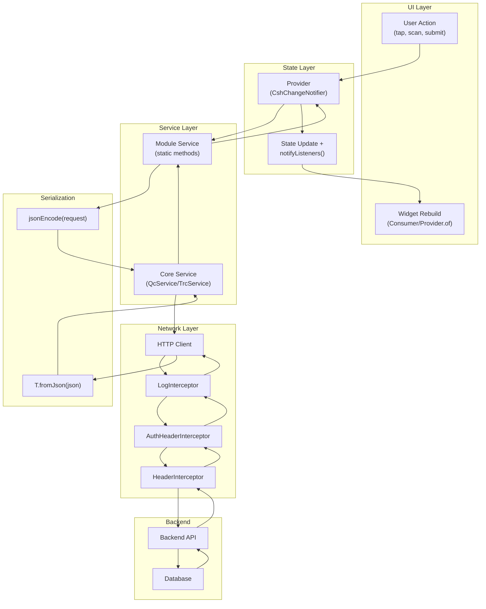

## DTO Serialization Flow

### Request Serialization

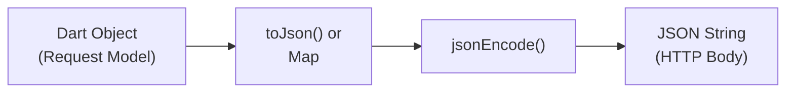

**Patterns:**

1. **Request model with toJson:**
```dart
class StockInSubmitRequest {
  final String awbNumber;
  final int productId;

  Map<String, dynamic> toJson() => {
    'awb': awbNumber,
    'pid': productId,
  };
}

// Usage:
service.post("/endpoint", Response.fromJson, body: jsonEncode(request.toJson()));
```

2. **Inline Map:**
```dart
Map<String, dynamic> req = {
  "qrCode": deviceBarcode,
  "status": status,
  if (!Validator.isNullOrEmpty(remarks)) "remarks": remarks,
};
service.post("/endpoint", Response.fromJson, body: jsonEncode(req));
```

### Response Deserialization

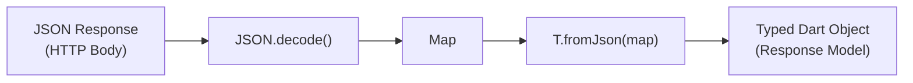

**Patterns:**

1. **Code-generated fromJson:**
```dart
@JsonSerializable()
class DispatchLotsResponse {
  @JsonKey(name: "lot_name")
  String? lotName;
  
  factory DispatchLotsResponse.fromJson(Map<String, dynamic> json) =>
      _$DispatchLotsResponseFromJson(json);
}
```

2. **Manual fromJson:**
```dart
class DeviceDetailResponse {
  final String? barcode;
  
  factory DeviceDetailResponse.fromJson(Map<String, dynamic> json) {
    return DeviceDetailResponse(barcode: json['barcode']);
  }
}
```

## CRUD Sequence Diagrams

### Read (GET) — Device Details

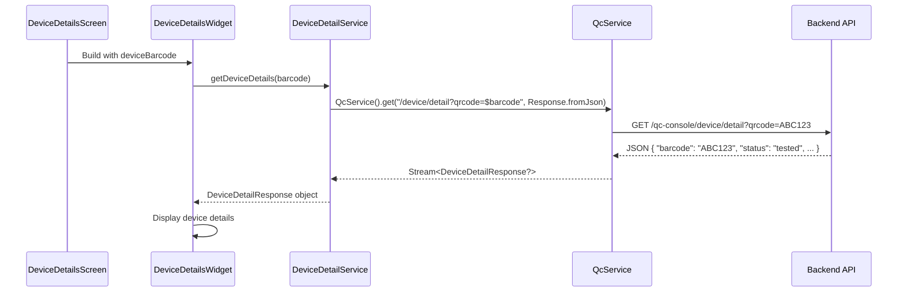

### Create (POST) — Submit Stock-In

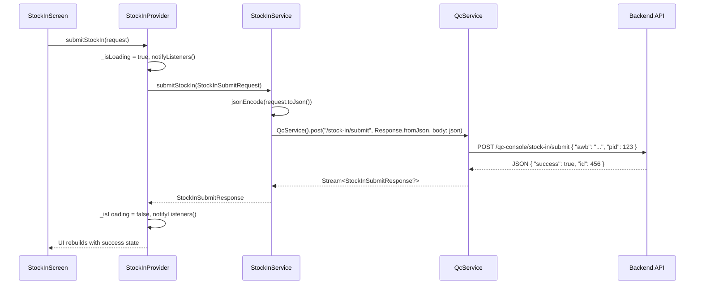

### Update (POST) — Mark Dead Device

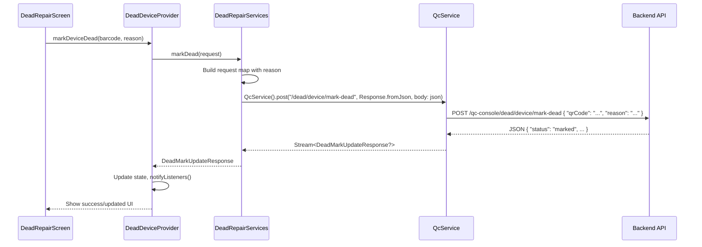

### Delete/Action (POST) — Initiate Data Wipe

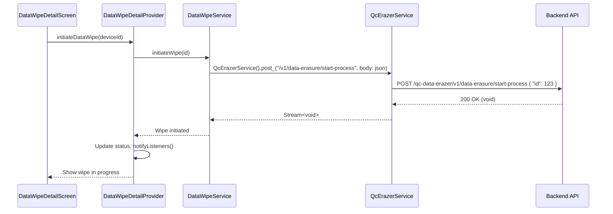

## Stream Based Data Flow

All API calls return `Stream<T>` which integrates with the Provider pattern:

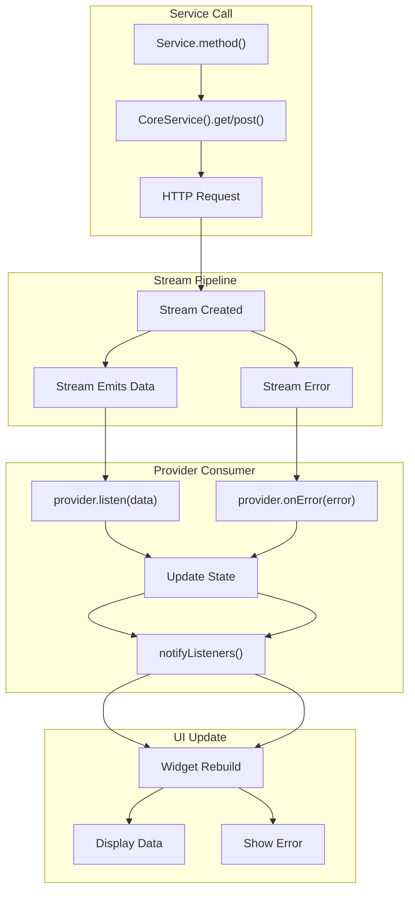

## Interceptor Pipeline in Data Context

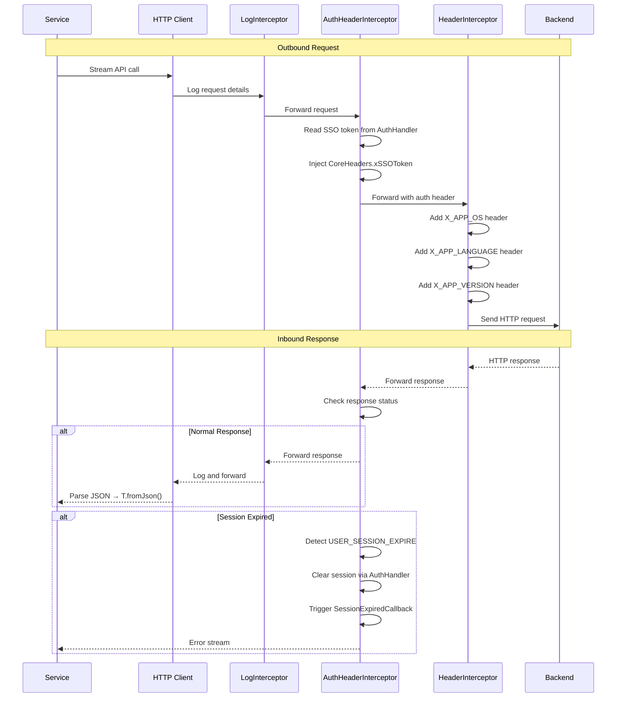

## Error Propagation Path

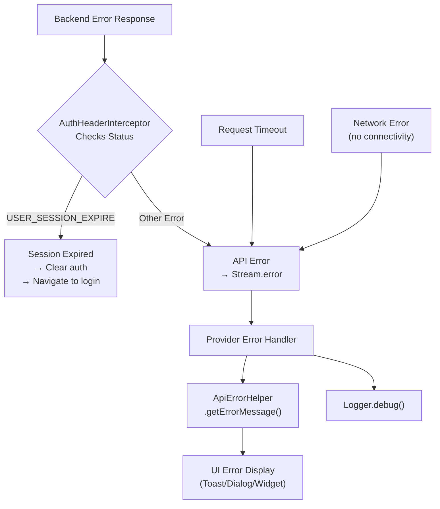

## State Update Flow

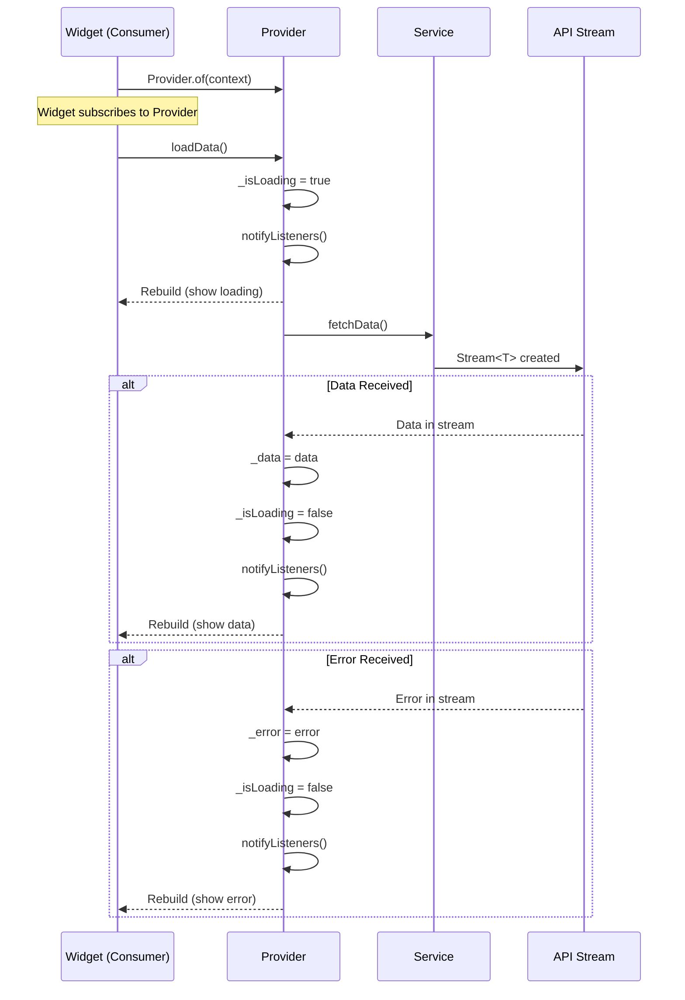

## Media Upload Data Flow

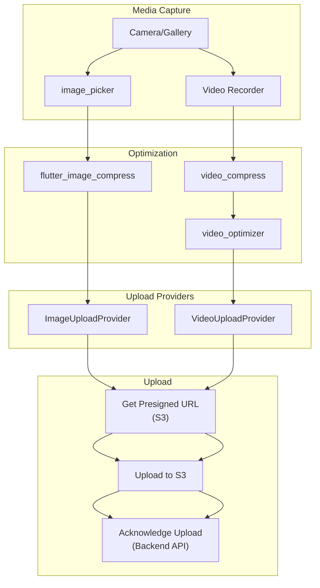

## Related Documents

- [Api Services](./Api%20Services.md) — Service and interceptor details
- [State Management](./State%20Management.md) — Provider state flow
- [Error Handling](./Error%20Handling.md) — Error propagation details
- [Architecture](./Architecture.md) — System architecture
