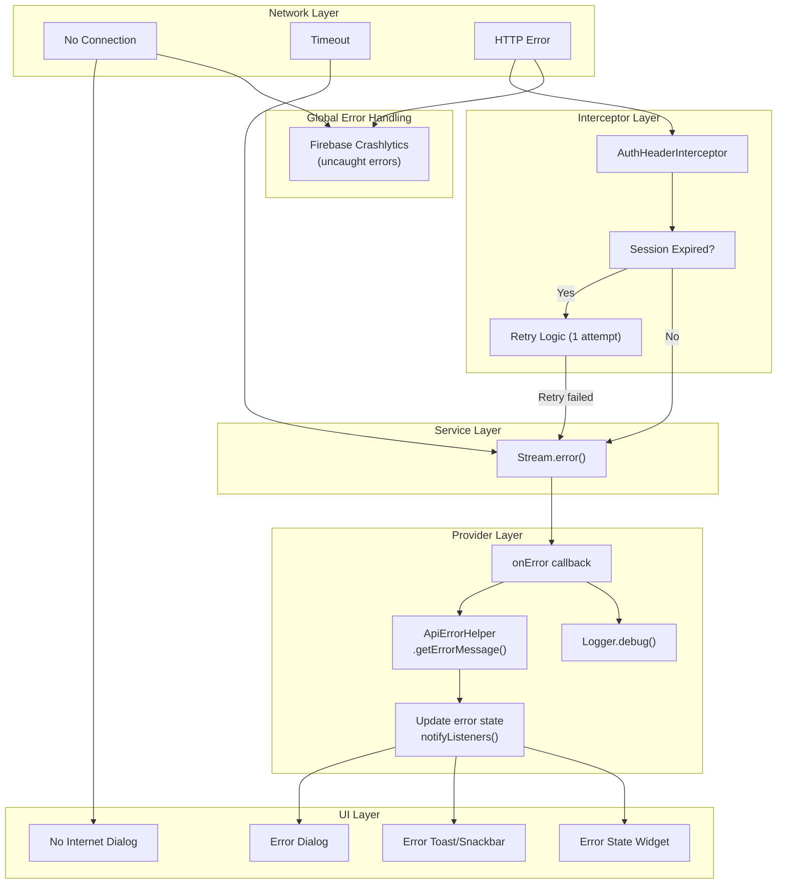
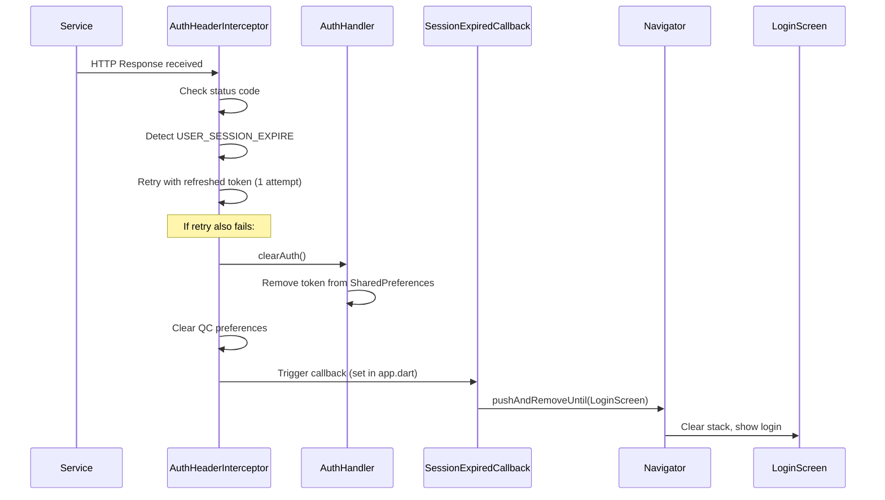

<!-- Document Information -->
<!-- Generated: 2026-02-18 -->
<!-- Version: 6.0.0+83 -->
<!-- Commit: 9ea0c658 -->

# Error Handling

## Table of Contents

- [Overview](#overview)
- [Error Handling Architecture](#error-handling-architecture)
- [Network Failures](#network-failures)
- [HTTP Error Codes](#http-error-codes)
- [Session Expiry](#session-expiry)
- [Error Tracking Integration](#error-tracking-integration)
- [Connectivity Handling](#connectivity-handling)
- [Alert Handlers](#alert-handlers)
- [Logger Usage](#logger-usage)
- [Provider Error Handling Pattern](#provider-error-handling-pattern)
- [Related Documents](#related-documents)

## Overview

Flutter TRC implements error handling at multiple layers:
1. **Interceptor level** — Session expiry detection and auth retry
2. **Service level** — Stream error propagation
3. **Provider level** — Error state management with `ApiErrorHelper`
4. **UI level** — Error dialogs, toasts, and error state widgets
5. **Global level** — Firebase Crashlytics for uncaught errors

## Error Handling Architecture



## Network Failures

| Failure Type | Detection | Handling |
|-------------|-----------|----------|
| No Internet | `connectivity_plus` package | `CshNoInternetDialog` displayed |
| Request Timeout | HTTP client timeout | Stream error propagated to provider |
| DNS Resolution | Network-level failure | Stream error with network message |
| Connection Refused | Backend unavailable | Stream error with server message |

### Connectivity Monitoring

File: `lib/src/utils/connectivity_util.dart`

The app monitors connectivity state using `connectivity_plus` and shows `CshNoInternetDialog` (`lib/src/common/dialogs/csh_no_internet_dialog.dart`) when the device loses connection.

## HTTP Error Codes

| HTTP Code | Constant | Meaning | Handling |
|-----------|----------|---------|----------|
| 200 | OK | Success | Parse response via `fromJson` |
| 401 | Unauthorized | Invalid/expired token | `AuthHeaderInterceptor` retries once, then session expiry |
| 403 | Forbidden | Insufficient permissions | Display permission error |
| 404 | Not Found | Resource not found | Display not found in UI |
| 422 | Unprocessable | Validation error | Extract and display error messages |
| 500 | Server Error | Backend failure | Display generic error via `ApiErrorHelper` |
| USER_SESSION_EXPIRE | Custom status | Session expired | Clear auth, navigate to login |

## Session Expiry

### Detection

`AuthHeaderInterceptor` (`lib/src/interceptors/auth/auth_header_interceptor.dart`) checks each response for `ApiErrorCodes.USER_SESSION_EXPIRE` status code.

### Handling Flow



### Configuration in app.dart

The session expired callback is configured in `CashifyApp` (`lib/src/app.dart`) as part of the `BuilderApp` setup, ensuring all navigation stacks are cleared and the user is redirected to the login screen.

## Error Tracking Integration

### Firebase Crashlytics

File: `lib/main.dart`

```dart
FlutterError.onError = FirebaseCrashlytics.instance.recordFlutterFatalError;

runZonedGuarded(() {
  runApp(CashifyApp());
}, (error, stack) {
  FirebaseCrashlytics.instance.recordError(error, stack, fatal: true);
});
```

| Aspect | Configuration |
|--------|--------------|
| Package | `firebase_crashlytics: ^4.3.0` |
| Flutter errors | `FlutterError.onError` captures framework errors |
| Dart errors | `runZonedGuarded` captures all uncaught Dart errors |
| Fatal flag | Both types recorded as fatal for priority tracking |
| Debug symbols | Uploaded via `--split-debug-info=mappings` build flag |
| Symbol upload | Automated in `scripts/flutter_build.sh` |

### Firebase Analytics

File: `lib/src/app.dart`

- `FirebaseAnalyticsObserver` added to navigator observers
- Automatically tracks screen views on navigation
- Custom events tracked via analytics controller (`lib/src/libraries/analytics/analytics_controller.dart`)

## Connectivity Handling

### ConnectivityUtil

File: `lib/src/utils/connectivity_util.dart`

Monitors network connectivity using `connectivity_plus` and provides:
- Real-time connectivity status
- Connection type detection (WiFi, mobile, none)
- Triggers no-internet dialogs when connection lost

### No Internet Dialog

File: `lib/src/common/dialogs/csh_no_internet_dialog.dart`

Displayed when the device loses network connectivity. Provides retry option and connectivity status information.

## Alert Handlers

### CashifyAlertHandler

Configured in `lib/src/app.dart` — handles app-wide alerts triggered by backend responses through `CashifyAlertInterceptor` (`lib/src/interceptors/cashify_alert_interceptor.dart`).

### CashifyAlertInterceptor

File: `lib/src/interceptors/cashify_alert_interceptor.dart`

Intercepts specific backend alert responses and displays appropriate UI alerts.

## Logger Usage

### Configuration

```dart
Logger.logLevel = LogLevel.All; // Set in app_initializer.dart
```

### Pattern

```dart
Logger.debug('mydebug-----ClassName.methodName', [errorMessage]);
```

### Usage in Providers

```dart
class MyProvider extends CshChangeNotifier {
  void loadData() {
    MyService.fetchData().listen(
      (data) {
        _data = data;
        notifyListeners();
      },
      onError: (error) {
        Logger.debug('mydebug-----MyProvider.loadData', [error]);
        _errorMessage = ApiErrorHelper.getErrorMessage(error);
        notifyListeners();
      },
    );
  }
}
```

### Alice HTTP Inspector

File: `lib/src/interceptors/log_interceptor.dart`

- **Package:** `alice: ^0.4.2`
- **Activation:** Non-web environments where Alice is enabled
- **Purpose:** Visual HTTP request/response inspector for debugging
- **Production:** Disabled (not available in prod)
- **Access:** Shake gesture or notification in debug builds

## Provider Error Handling Pattern

Standard error handling pattern used across all providers:

```dart
class MyProvider extends CshChangeNotifier {
  String? _errorMessage;
  bool _isLoading = false;
  bool _hasError = false;

  String? get errorMessage => _errorMessage;
  bool get isLoading => _isLoading;
  bool get hasError => _hasError;

  void fetchData() {
    _isLoading = true;
    _hasError = false;
    _errorMessage = null;
    notifyListeners();

    MyService.getData().listen(
      (data) {
        _data = data;
        _isLoading = false;
        notifyListeners();
      },
      onError: (error) {
        _isLoading = false;
        _hasError = true;
        _errorMessage = ApiErrorHelper.getErrorMessage(error);
        Logger.debug('mydebug-----MyProvider.fetchData', [error]);
        notifyListeners();
      },
    );
  }
}
```

### ApiErrorHelper

From `core_widgets` package — extracts user-friendly error messages from API error responses. Handles various error formats returned by the backend.

## Related Documents

- [Security](./Security.md) — Session expiry and auth error handling
- [Api Services](./Api%20Services.md) — Interceptor chain and error codes
- [Data Flow](./Data%20Flow.md) — Error propagation paths
- [Configuration](./Configuration.md) — Crashlytics and logging config
