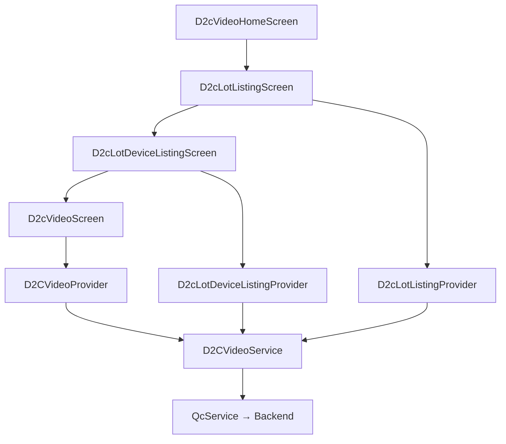
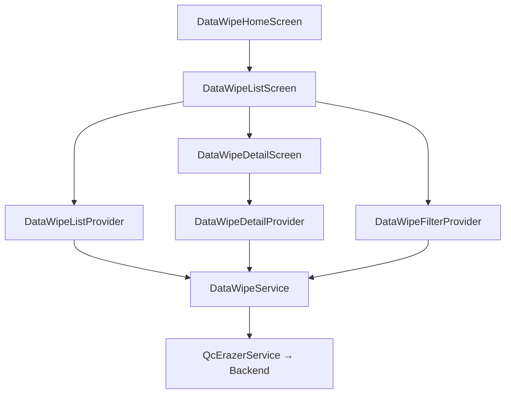
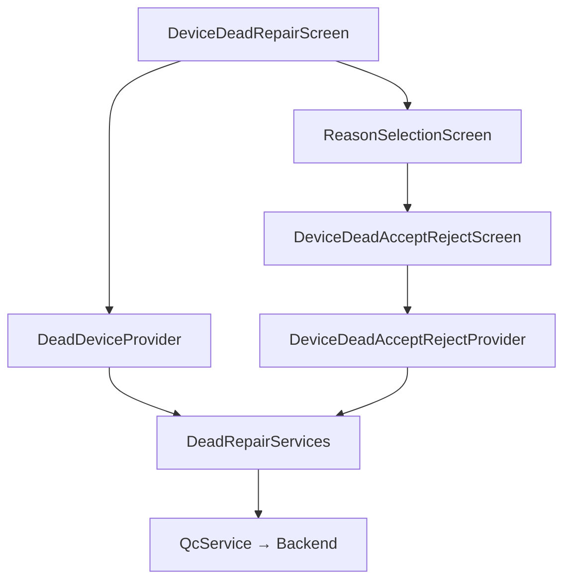
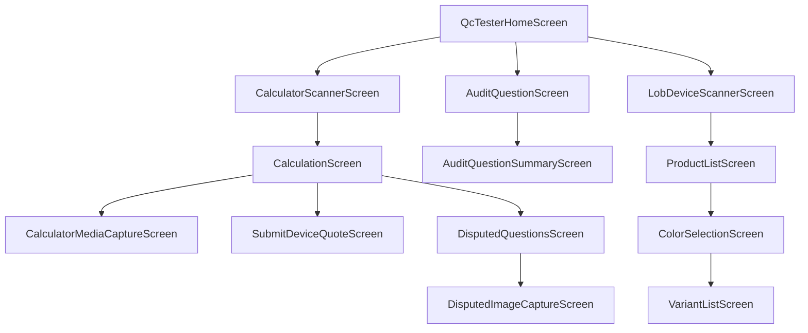

<!-- Document Information -->
<!-- Generated: 2026-02-18 -->
<!-- Version: 6.0.0+83 -->
<!-- Commit: 9ea0c658 -->

# Module Reference

## Table of Contents

- [Overview](#overview)
- [Module Index](#module-index)
- [QC Modules](#qc-modules)
- [RMS Modules](#rms-modules)
- [ShipEx Modules](#shipex-modules)
- [TRC Modules](#trc-modules)
- [Related Documents](#related-documents)

## Overview

| Metric | Count |
|--------|-------|
| QC Modules | 19 |
| RMS Modules | 3 |
| ShipEx Modules | 5 |
| TRC Modules | 10 (under lib/src/modules/) |
| Total Feature Modules | 37 |
| Total Screens | 80+ |
| Total Providers | 105+ |
| Total Module Services | 23+ |

## Module Index

### QC Modules (`lib/qc/modules/`)

| # | Module | Path | Description | Key Screens |
|---|--------|------|-------------|-------------|
| 1 | d2c_video | `lib/qc/modules/d2c_video/` | D2C video recording for product listings | D2cVideoScreen, D2cVideoHomeScreen, D2cLotListingScreen |
| 2 | data_wipe | `lib/qc/modules/data_wipe/` | Device data erasure operations | DataWipeHomeScreen, DataWipeListScreen, DataWipeDetailScreen |
| 3 | dead_repair | `lib/qc/modules/dead_repair/` | Dead device marking and repair tracking | DeviceDeadRepairScreen, ReasonSelectionScreen |
| 4 | device_details | `lib/qc/modules/device_details/` | Device detail viewing | DeviceDetailsScreen |
| 5 | device_receive_module | `lib/qc/modules/device_receive_module/` | Device receiving at warehouse | DeviceReceiveScreen |
| 6 | dispatch_lot | `lib/qc/modules/dispatch_lot/` | Lot dispatch with invoice scanning | DispatchLotScreen, InvoiceScanScreen |
| 7 | external_audit | `lib/qc/modules/external_audit/` | External audit management | ExternalAuditHomeScreen, ExternalAuditPerformScreen |
| 8 | gaurd | `lib/qc/modules/gaurd/` | Guard/security gate operations | QcGuardHomeScreen, GuardDeviceCountingListScreen |
| 9 | imei_validator | `lib/qc/modules/imei_validator/` | IMEI and QR code validation | ImeiValidatorScreen |
| 10 | pre_dispatch | `lib/qc/modules/pre_dispatch/` | Pre-dispatch lot verification | PreDispatchScreen, PreDispatchLotScreen |
| 11 | qc_actions | `lib/qc/modules/qc_actions/` | QC action workflows | QcActionScreen |
| 12 | qc_tester | `lib/qc/modules/qc_tester/` | Device testing hub (6 submodules) | QcTesterHomeScreen, CalculationScreen, AuditQuestionScreen |
| 13 | re_qc | `lib/qc/modules/re_qc/` | Re-quality control for lots | ReQcListScreen, ReQcDetailScreen |
| 14 | stock_in_module | `lib/qc/modules/stock_in_module/` | Stock inward operations | SearchItemScreen, StockInProductDetailScreen |
| 15 | stock_transfer | `lib/qc/modules/stock_transfer/` | Stock transfer between facilities | StockTransferListScreen, StStoreOutScreen |
| 16 | store_in | `lib/qc/modules/store_in/` | Store device inward with location scan | StoreInLocationScanScreen |
| 17 | store_out | `lib/qc/modules/store_out/` | Store device outward, lot/bin management | StoreOutScreen, LotItemsScanScreen |
| 18 | supervisor | `lib/qc/modules/supervisor/` | Supervisor device oversight | SupervisorScreen, SupervisorSearchScreen |
| 19 | warehouse_audit | `lib/qc/modules/warehouse_audit/` | Warehouse audit execution | OnGoingAuditScreen, WarehouseAuditPerformScreen |

### RMS Modules (`lib/rms/modules/`)

| # | Module | Path | Description |
|---|--------|------|-------------|
| 1 | facility_list | `lib/rms/modules/facility_list/` | Facility listing |
| 2 | home | `lib/rms/modules/home/` | RMS home dashboard |
| 3 | receive_device | `lib/rms/modules/receive_device/` | Device receiving with video |

### ShipEx Modules (`lib/shipex/modules/`)

| # | Module | Path | Description |
|---|--------|------|-------------|
| 1 | create_shipment | `lib/shipex/modules/create_shipment/` | Shipment creation |
| 2 | dispatch | `lib/shipex/modules/dispatch/` | Shipment dispatch |
| 3 | packaging | `lib/shipex/modules/packaging/` | Packaging operations |
| 4 | pending_dispatch | `lib/shipex/modules/pending_dispatch/` | Pending dispatch management |
| 5 | shipex_home | `lib/shipex/modules/shipex_home/` | ShipEx home dashboard |

### TRC Modules (`lib/src/modules/`)

| # | Module | Path | Description |
|---|--------|------|-------------|
| 1 | login | `lib/src/modules/login/` | Authentication and MPIN setup |
| 2 | home | `lib/src/modules/home/` | TRC home dashboard |
| 3 | engineer | `lib/src/modules/engineer/` | Device repair and parts management |
| 4 | inventory_manager | `lib/src/modules/inventory_manager/` | Parts inventory management |
| 5 | trc_executive | `lib/src/modules/trc_executive/` | TRC lot and device management |
| 6 | part_qc | `lib/src/modules/part_qc/` | Parts quality control |
| 7 | rider | `lib/src/modules/rider/` | Pickup and delivery |
| 8 | elss | `lib/src/modules/elss/` | Extended lifecycle service support |
| 9 | rubbing | `lib/src/modules/rubbing/` | Device rubbing operations |
| 10 | my_permissions | `lib/trc/my_permissions/` | TRC permission management |

---

## QC Modules

### d2c_video

#### Overview

| Property | Value |
|----------|-------|
| Path | `lib/qc/modules/d2c_video/` |
| Screens | D2cVideoScreen, D2cVideoHomeScreen, D2cLotListingScreen, D2cLotDeviceListingScreen |
| Providers | D2CVideoProvider, D2cLotListingProvider, D2cLotDeviceListingProvider |
| Service | D2CVideoService |

**Purpose:** Enables D2C (Direct-to-Consumer) video recording for device product listings. Operators browse lots, select devices, and record standardized product videos.

**Key files:**
- Screens: `screens/d2c_video_screen.dart`, `screens/d2c_video_home_screen.dart`, `screens/d2c_lot_listing_screen.dart`, `screens/d2c_lot_device_listing_screen.dart`
- Providers: `providers/d2c_video_provider.dart`, `providers/d2c_lot_listing_provider.dart`, `providers/d2c_lot_device_listing_provider.dart`
- Service: `resources/d2c_video_service.dart`
- Models: `resources/d2c_device_detail_response.dart`, `resources/d2c_lot_list_response.dart`, `resources/d2c_lot_device_list_response.dart`
- Components: `components/d2c_video_component.dart`, `components/d2c_video_home_component.dart`

#### Architecture

#### Workflows

| # | Workflow | Trigger | Description |
|---|---------|---------|-------------|
| 1 | Browse Lots | Screen load | Load D2C lot listings for video recording |
| 2 | Browse Devices | Lot selection | Load devices within a selected lot |
| 3 | Record Video | Device selection | Open video recorder for selected device |
| 4 | Submit Video | Recording complete | Upload and submit recorded video |

#### User Journey

| Step | Action | Screen | Expected Result | Failure Scenario |
|------|--------|--------|-----------------|------------------|
| Pre | User authenticated with D2C video role | — | — | Redirect to login |
| 1 | Navigate to D2C Video | D2cVideoHomeScreen | Home screen loads | API error: show error message |
| 2 | Select a lot | D2cLotListingScreen | Device list loads | No lots: show empty state |
| 3 | Select a device | D2cLotDeviceListingScreen | Video recorder opens | Device already recorded: show status |
| 4 | Record and submit video | D2cVideoScreen | Video uploaded successfully | Upload failure: retry option |

---

### data_wipe

#### Overview

| Property | Value |
|----------|-------|
| Path | `lib/qc/modules/data_wipe/` |
| Screens | DataWipeHomeScreen, DataWipeListScreen, DataWipeDetailScreen |
| Providers | DataWipeListProvider, DataWipeDetailProvider, DataWipeFilterProvider |
| Service | DataWipeService (uses QcErazerService) |

**Purpose:** Manages device data erasure operations. Operators view devices pending data wipe, initiate erasure processes, track status, and verify completion with IMEI/serial number validation.

**Key files:**
- Screens: `screens/data_wipe_home_screen.dart`, `screens/data_wipe_list_screen.dart`, `screens/data_wipe_detail_screen.dart`
- Providers: `providers/data_wipe_list_provider.dart`, `providers/data_wipe_detail_provider.dart`, `providers/data_wipe_filter_provider.dart`
- Service: `resources/data_wipe_service.dart`
- Models: `resources/data_wipe_list_response.dart`, `resources/data_wipe_detail_response.dart`, `resources/data_wipe_filter_list_response.dart`
- Widgets: `widgets/data_wipe_card_widget.dart`, `widgets/data_wipe_detail_widget.dart`, `widgets/data_wipe_list_widget.dart`
- Dialogs: `dialogs/show_bulk_erase_initiate_dialog.dart`, `dialogs/show_filter_dialog.dart`, `dialogs/show_imei_status_dialog.dart`

#### Architecture

#### Workflows

| # | Workflow | Trigger | Description |
|---|---------|---------|-------------|
| 1 | View Wipe List | Screen load | Load list of devices pending/completed data wipe |
| 2 | Filter Devices | Filter button | Apply filters (status, date, etc.) |
| 3 | View Detail | Device tap | Show device wipe detail and status |
| 4 | Initiate Wipe | Bulk erase button | Start data erasure process |
| 5 | Check IMEI Status | Dialog action | Validate IMEI/serial number wipe status |

#### User Journey

| Step | Action | Screen | Expected Result | Failure Scenario |
|------|--------|--------|-----------------|------------------|
| Pre | User authenticated with data wipe role | — | — | Redirect to login |
| 1 | Navigate to Data Wipe | DataWipeHomeScreen | Home loads | API error |
| 2 | View device list | DataWipeListScreen | Paginated list with filters | Empty list: no pending wipes |
| 3 | Select device | DataWipeDetailScreen | Device wipe details shown | Device not found |
| 4 | Initiate bulk erase | Dialog | Erasure started, status updates | Erasure failure: error dialog |

---

### dead_repair

#### Overview

| Property | Value |
|----------|-------|
| Path | `lib/qc/modules/dead_repair/` |
| Screens | DeviceDeadRepairScreen, ReasonSelectionScreen, DeviceDeadAcceptRejectScreen |
| Providers | DeadDeviceProvider, DeviceDeadAcceptRejectProvider |
| Service | DeadRepairServices |

**Purpose:** Handles dead device marking, reason selection, and accept/reject workflows for repair routing. Devices marked as dead can be sent for repair or scrapped.

**Key files:**
- Screens: `screens/device_dead_repair_screen.dart`, `screens/reason_selection_screen.dart`, `screens/device_dead_accept_reject_screen.dart`
- Providers: `providers/dead_device_provider.dart`, `providers/dead_device_accept_reject_provider.dart`
- Service: `resources/services.dart`
- Models: `resources/dead_mark_update_response.dart`, `resources/reason_submit_request.dart`, `resources/accept_reject_dead_request.dart`, `resources/add_remove_part_request.dart`

#### Architecture

#### Workflows

| # | Workflow | Trigger | Description |
|---|---------|---------|-------------|
| 1 | Scan Device | Barcode scan | Scan device to mark as dead or for repair |
| 2 | Select Reason | Reason list | Choose reason for dead/repair marking |
| 3 | Submit Marking | Submit button | Submit dead/repair request with reason |
| 4 | Accept/Reject | Approval screen | Supervisor accepts or rejects dead marking |

#### User Journey

| Step | Action | Screen | Expected Result | Failure Scenario |
|------|--------|--------|-----------------|------------------|
| Pre | User with dead/repair role | — | — | No permission |
| 1 | Scan device barcode | DeviceDeadRepairScreen | Device details loaded | Invalid barcode |
| 2 | Select reason | ReasonSelectionScreen | Reasons displayed | API error loading reasons |
| 3 | Submit marking | — | Device marked successfully | Submission failure |
| 4 | Accept/Reject (supervisor) | DeviceDeadAcceptRejectScreen | Status updated | Conflict: already processed |

---

### device_details

#### Overview

| Property | Value |
|----------|-------|
| Path | `lib/qc/modules/device_details/` |
| Screens | DeviceDetailsScreen |
| Service | DeviceDetailService |

**Purpose:** Displays comprehensive device information including specifications, QC history, and stock movement history.

**Key files:**
- Screen: `screens/device_details_screen.dart`
- Widget: `widgets/device_details_widget.dart`
- Service: `resources/device_detail_service.dart`
- Models: `resources/device_detail_response.dart`, `resources/stock_movement_response.dart`

#### Workflows

| # | Workflow | Trigger | Description |
|---|---------|---------|-------------|
| 1 | Load Details | Screen open | Fetch device details by barcode |
| 2 | View Stock Movement | Tab/scroll | Display stock movement timeline |

---

### device_receive_module

#### Overview

| Property | Value |
|----------|-------|
| Path | `lib/qc/modules/device_receive_module/` |
| Screens | DeviceReceiveScreen |
| Providers | DeviceReceiveProvider |
| Service | DeviceReceiveService |

**Purpose:** Handles receiving devices into the warehouse. Operators scan device barcodes to register inbound devices.

**Key files:**
- Screen: `screens/device_receive_screen.dart`
- Provider: `providers/device_receive_provider.dart`
- Service: `resources/device_receive_service.dart`
- Model: `resources/device_receive_response.dart`

#### Workflows

| # | Workflow | Trigger | Description |
|---|---------|---------|-------------|
| 1 | Scan Device | Barcode scan | Scan and register inbound device |
| 2 | Confirm Receipt | Scan success | Device marked as received |

---

### dispatch_lot

#### Overview

| Property | Value |
|----------|-------|
| Path | `lib/qc/modules/dispatch_lot/` |
| Screens | DispatchLotScreen, InvoiceScanScreen |
| Providers | DispatchLotProvider, DispatchCompleteProvider |
| Service | DispatchLotServices |

**Purpose:** Manages lot dispatch operations including lot listing, device scanning, and invoice scanning for dispatch completion.

**Key files:**
- Screens: `screens/dispatch_lot_screen.dart`, `screens/invoice_scan_screen.dart`
- Providers: `providers/dispatch_lot_provider.dart`, `providers/dispatch_complete_provider.dart`
- Service: `resources/services.dart`
- Models: `resources/dispatch_lots_response.dart`, `resources/dispatch_lot_list_request.dart`
- Widgets: `widgets/dispatch_lots_widget.dart`, `widgets/dispatch_lot_container.dart`, `widgets/invoice_scan_widget.dart`, `widgets/lot_widget.dart`

#### Workflows

| # | Workflow | Trigger | Description |
|---|---------|---------|-------------|
| 1 | View Lots | Screen load | List lots ready for dispatch |
| 2 | Select Lot | Lot tap | View lot details and device count |
| 3 | Scan Invoice | Invoice scan | Scan dispatch invoice |
| 4 | Complete Dispatch | Completion action | Mark lot as dispatched |

---

### external_audit

#### Overview

| Property | Value |
|----------|-------|
| Path | `lib/qc/modules/external_audit/` |
| Screens | ExternalAuditHomeScreen, ExternalAuditPerformScreen |
| Providers | ExternalAuditPerformProvider |
| Service | ExternalAuditService |

**Purpose:** External audit management with barcode scanning, image/video upload, and timed audit sessions.

**Key files:**
- Screens: `screens/external_audit_home_screen.dart`, `screens/external_audit_perform_screen.dart`
- Provider: `providers/external_audit_perform_provider.dart`
- Service: `resources/external_audit_service.dart`
- Widgets: `widgets/external_audit_perform_widget.dart`, `widgets/scan_barcode_widget.dart`, `widgets/timer_widget.dart`, `widgets/video_recoder_widget.dart`, `widgets/multiple_image_video_upload_widget.dart`

#### Workflows

| # | Workflow | Trigger | Description |
|---|---------|---------|-------------|
| 1 | Start Audit | Audit selection | Begin external audit session with timer |
| 2 | Scan Devices | Barcode scan | Scan devices for audit |
| 3 | Capture Evidence | Photo/video | Upload images and videos as evidence |
| 4 | Submit Audit | Completion | Submit audit results |

---

### gaurd

#### Overview

| Property | Value |
|----------|-------|
| Path | `lib/qc/modules/gaurd/` |
| Screens | QcGuardHomeScreen, GuardDeviceCountingListScreen, GuardUploadInvoiceScreen, QcGuardAddAgentScreen |
| Providers | QcGuardHomeProvider, GuardDeviceCountingListProvider, UploadInvoiceProvider, QcGuardAddAgentProvider |
| Service | GuardService |

**Purpose:** Security gate operations for warehouse entry/exit, device counting, invoice verification, and agent management.

**Key files:**
- Screens: `screens/qc_guard_home_screen.dart`, `screens/guard_device_counting_list_screen.dart`, `screens/guard_upload_invoice_screen.dart`, `screens/qc_guard_add_agent_screen.dart`
- Providers: `providers/qc_guard_home_provider.dart`, `providers/guardDeviceCountingListProvider.dart`, `providers/upload_invoice_provider.dart`, `providers/qc_guard_add_agent_provider.dart`
- Service: `resources/guard_service.dart`
- Models: `resources/guard_entry_scan_response.dart`, `resources/collected_order_list_response.dart`

#### Workflows

| # | Workflow | Trigger | Description |
|---|---------|---------|-------------|
| 1 | Guard Home | Screen load | Dashboard with entry/exit options |
| 2 | Device Counting | Entry event | Count devices in a shipment |
| 3 | Upload Invoice | Invoice received | Upload and verify invoice |
| 4 | Add Agent | Admin action | Register new delivery agent |

---

### imei_validator

#### Overview

| Property | Value |
|----------|-------|
| Path | `lib/qc/modules/imei_validator/` |
| Screens | ImeiValidatorScreen |
| Service | ImeiValidatorService |

**Purpose:** Validates IMEI numbers and QR codes to verify device authenticity and retrieve device information.

#### Workflows

| # | Workflow | Trigger | Description |
|---|---------|---------|-------------|
| 1 | Scan/Enter IMEI | User input | Enter or scan IMEI/QR code |
| 2 | Validate | Submit | Check IMEI against backend |
| 3 | Display Result | API response | Show validation status and device info |

---

### pre_dispatch

#### Overview

| Property | Value |
|----------|-------|
| Path | `lib/qc/modules/pre_dispatch/` |
| Screens | PreDispatchScreen, PreDispatchLotScreen |
| Providers | PreDispatchProvider, PreDispatchLotProvider |
| Service | PreDispatchServices |

**Purpose:** Pre-dispatch lot verification — scanning and validating devices in lots before final dispatch.

**Key files:**
- Screens: `screens/pre_dispatch_screen.dart`, `screens/pre_dispatch_lot_screen.dart`
- Providers: `providers/pre_dispatch_provider.dart`, `providers/pre_dispatch_lot_provider.dart`
- Service: `resources/services.dart`
- Models: `resources/pre_dispatch_item_response.dart`, `resources/pre_dispatch_lots_response.dart`, `resources/scan_pre_dispatch_response.dart`, `resources/complete_pre_dispatch_response.dart`
- Widgets: `widgets/pre_dispatch_widget.dart`, `widgets/pre_dispatch_lot_widget.dart`, `widgets/pre_dispatch_scan_result_widget.dart`

#### Workflows

| # | Workflow | Trigger | Description |
|---|---------|---------|-------------|
| 1 | View Pre-Dispatch Lots | Screen load | List lots pending pre-dispatch |
| 2 | Select Lot | Lot tap | Open lot for scanning |
| 3 | Scan Devices | Barcode scan | Scan each device in lot |
| 4 | Complete Pre-Dispatch | All scanned | Mark lot pre-dispatch as complete |

---

### qc_actions

#### Overview

| Property | Value |
|----------|-------|
| Path | `lib/qc/modules/qc_actions/` |
| Screens | QcActionScreen |
| Service | QcActionServices |

**Purpose:** QC-specific action workflows including video timestamp operations.

---

### qc_tester

#### Overview

| Property | Value |
|----------|-------|
| Path | `lib/qc/modules/qc_tester/` |
| Submodules | audit, calculator, calculator_media_capture, disputed_image_capture, home, lob_devices |
| Total Screens | 15+ |
| Total Providers | 10+ |
| Total Services | 5 |

**Purpose:** The primary device testing hub. QC testers use calculators for device grading, answer audit questionnaires, capture media evidence, handle disputed images, and manage LOB (Line of Business) device entries.

#### Submodule: home

| Property | Value |
|----------|-------|
| Path | `lib/qc/modules/qc_tester/home/` |
| Screen | QcTesterHomeScreen |
| Service | TesterHomeService |

Displays testing count dashboard and navigation to testing sub-workflows.

#### Submodule: calculator

| Property | Value |
|----------|-------|
| Path | `lib/qc/modules/qc_tester/calculator/` |
| Screens | CalculationScreen, CalculatorScannerScreen, DisputedQuestionsScreen, SubmitDeviceQuoteScreen |
| Providers | CalculatorScannerProvider, DisputedQuestionProvider, SubmitDeviceQuoteProvider |
| Services | CalculatorService, QcCalculatorService |

Device grading calculator — scans devices, runs calculator-based evaluation, and submits device quotes.

#### Submodule: audit

| Property | Value |
|----------|-------|
| Path | `lib/qc/modules/qc_tester/audit/` |
| Screens | AuditQuestionScreen, AuditQuestionSummaryScreen |
| Providers | AuditQuestionsProvider, AuditSubmissionProvider |
| Service | AuditService |

Question-based device audit with summary and submission.

#### Submodule: calculator_media_capture

| Property | Value |
|----------|-------|
| Path | `lib/qc/modules/qc_tester/calculator_media_capture/` |
| Screen | CalculatorMediaCaptureScreen |
| Provider | CalculatorMediaCaptureProvider |

Media capture during calculator-based testing.

#### Submodule: disputed_image_capture

| Property | Value |
|----------|-------|
| Path | `lib/qc/modules/qc_tester/disputed_image_capture/` |
| Screens | DisputedImageCaptureScreen, DisputedImageCaptureBarcodeScannerScreen |
| Provider | DisputeImageCaptureProvider |
| Service | DisputeImageCaptureService |

Captures evidence images for disputed QC assessments.

#### Submodule: lob_devices

| Property | Value |
|----------|-------|
| Path | `lib/qc/modules/qc_tester/lob_devices/` |
| Screens | LobDeviceScannerScreen, ProductListScreen, ColorSelectionScreen, VariantListScreen |
| Providers | LobDeviceScannerProvider, ProductListProvider, ColorSelectionProvider, VariantListProvider |

LOB (Line of Business) device entry — scan device, select product, color, and variant.

#### Architecture

---

### re_qc

#### Overview

| Property | Value |
|----------|-------|
| Path | `lib/qc/modules/re_qc/` |
| Screens | ReQcListScreen, ReQcDetailScreen |
| Providers | ReQcListProvider, ReQcDetailProvider, ReQcQuestionTabProvider |
| Service | ReQcService |

**Purpose:** Re-quality control workflow for re-evaluating lots and devices that need repeat QC assessment.

#### Workflows

| # | Workflow | Trigger | Description |
|---|---------|---------|-------------|
| 1 | View Re-QC List | Screen load | List lots requiring re-QC |
| 2 | Select Lot | Lot tap | View lot devices for re-QC |
| 3 | Re-QC Device | Device selection | Run re-evaluation on device |

---

### stock_in_module

#### Overview

| Property | Value |
|----------|-------|
| Path | `lib/qc/modules/stock_in_module/` |
| Screens | SearchItemScreen, StockInProductDetailScreen, MediaFileUploadScreen |
| Providers | SearchItemProvider, StockInProvider |
| Service | StockInService |

**Purpose:** Stock inward operations — search for items, validate AWB (Air Waybill), capture product details and media, and submit stock-in records.

#### Workflows

| # | Workflow | Trigger | Description |
|---|---------|---------|-------------|
| 1 | Search Item | AWB scan/search | Find item by AWB number |
| 2 | Validate AWB | API check | Verify AWB authenticity |
| 3 | Product Details | Selection | Enter/verify product details |
| 4 | Upload Media | Camera | Capture and upload product images |
| 5 | Submit Stock-In | Submit | Complete stock-in record |

---

### stock_transfer

#### Overview

| Property | Value |
|----------|-------|
| Path | `lib/qc/modules/stock_transfer/` |
| Screens | StockTransferListScreen, StStoreOutScreen, PendingLotDetailScreen, PendingDispatchDetailScreen, StorageDeviceListScreen |
| Providers | StStoreOutProvider, StorageDeviceListProvider, PendingLotDetailProvider, PendingDispatchDetailProvider |
| Service | StockTransferService (uses QcTransferService) |

**Purpose:** Manages inter-facility stock transfers — viewing transfer lots, scanning devices for store-out, and tracking pending transfers.

#### Workflows

| # | Workflow | Trigger | Description |
|---|---------|---------|-------------|
| 1 | View Transfer List | Screen load | List stock transfer requests |
| 2 | Store-Out Scan | Device scan | Scan devices for transfer out |
| 3 | Pending Lot Detail | Lot tap | View pending transfer lot details |
| 4 | Pending Dispatch | Dispatch tap | View pending dispatch for transfer |
| 5 | Storage Devices | Storage view | List devices in storage |

---

### store_in

#### Overview

| Property | Value |
|----------|-------|
| Path | `lib/qc/modules/store_in/` |
| Screens | StoreInLocationScanScreen |
| Providers | StoreInProvider |
| Service | StoreInServices |

**Purpose:** Store device inward operations — scan storage location barcode and assign devices to verified locations.

---

### store_out

#### Overview

| Property | Value |
|----------|-------|
| Path | `lib/qc/modules/store_out/` |
| Screens | StoreOutScreen, LotItemsScanScreen |
| Providers | StoreOutProvider, LotScanProvider |
| Service | StoreOutServices |

**Purpose:** Store device outward operations — manage lot-based and bin-based outward flows, scan devices against lots, and verify outward operations.

**Key files:**
- Screens: `screens/store_out_screen.dart`, `screens/lot_items_scan_screen.dart`
- Providers: `providers/store_out_provider.dart`, `providers/lot_scan_provider.dart`
- Service: `resources/services.dart`
- Models: `resources/store_out_lot_list_response.dart`, `resources/bin_out_verify_response.dart`, `resources/normal_lot_verify_response.dart`, `resources/scan_normal_lot_list_response.dart`, `resources/scan_bin_lot_list_response.dart`
- Widgets: `widgets/store_out_widget.dart`, `widgets/store_out_bin_out_widget.dart`, `widgets/store_out_lot_list_widget.dart`

#### Workflows

| # | Workflow | Trigger | Description |
|---|---------|---------|-------------|
| 1 | View Lots | Screen load | List lots for store-out |
| 2 | Select Lot | Lot tap | View lot devices |
| 3 | Scan Devices | Barcode scan | Scan devices against lot |
| 4 | Verify Out | All scanned | Verify and complete store-out |

---

### supervisor

#### Overview

| Property | Value |
|----------|-------|
| Path | `lib/qc/modules/supervisor/` |
| Screens | SupervisorScreen, SupervisorSearchScreen |
| Providers | SupervisorProvider, SupervisorBaseProvider |
| Service | SupervisorService |

**Purpose:** Supervisor dashboard for device oversight, search, and detail review.

---

### warehouse_audit

#### Overview

| Property | Value |
|----------|-------|
| Path | `lib/qc/modules/warehouse_audit/` |
| Screens | OnGoingAuditScreen, WarehouseAuditPerformScreen |
| Providers | WarehouseAuditPerformProvider |
| Service | WarehouseAuditService |

**Purpose:** Warehouse audit execution — view ongoing audits, perform device scans, and submit audit findings.

#### Workflows

| # | Workflow | Trigger | Description |
|---|---------|---------|-------------|
| 1 | View Ongoing Audits | Screen load | List ongoing warehouse audits |
| 2 | Perform Audit | Audit selection | Scan devices and record findings |
| 3 | Submit Findings | Completion | Submit audit results |

---

## RMS Modules

### facility_list

| Property | Value |
|----------|-------|
| Path | `lib/rms/modules/facility_list/` |
| Purpose | Lists and manages RMS facilities |

### home

| Property | Value |
|----------|-------|
| Path | `lib/rms/modules/home/` |
| Purpose | RMS home dashboard with navigation to RMS features |

### receive_device

| Property | Value |
|----------|-------|
| Path | `lib/rms/modules/receive_device/` |
| Providers | ReceiveDeviceModuleProvider, CreateVideoModuleProvider |
| Purpose | Receives returned devices with video recording for condition documentation |

---

## ShipEx Modules

### create_shipment

| Property | Value |
|----------|-------|
| Path | `lib/shipex/modules/create_shipment/` |
| Providers | CreateShipmentProvider, ManualShipmentProvider, UploadEwayBillProvider, SubOrderGroupListProvider, OrderGroupDetailsProvider, DocumentDownloadProvider |
| Purpose | Shipment creation with manual entry, e-way bill upload, and order group management |

### dispatch

| Property | Value |
|----------|-------|
| Path | `lib/shipex/modules/dispatch/` |
| Providers | ShipexDispatchProvider |
| Purpose | Shipment dispatch with AWB barcode scanning |

### packaging

| Property | Value |
|----------|-------|
| Path | `lib/shipex/modules/packaging/` |
| Providers | PackagingProvider, GroupListProvider |
| Purpose | Packaging operations and group management |

### pending_dispatch

| Property | Value |
|----------|-------|
| Path | `lib/shipex/modules/pending_dispatch/` |
| Providers | CompleteDispatchProvider |
| Purpose | Manages pending dispatch items and completion workflows |

### shipex_home

| Property | Value |
|----------|-------|
| Path | `lib/shipex/modules/shipex_home/` |
| Purpose | ShipEx home dashboard with navigation to shipping features |

---

## TRC Modules

### login

| Property | Value |
|----------|-------|
| Path | `lib/src/modules/login/` |
| Providers | TRCLoginProvider |
| Purpose | User authentication, login, and MPIN setup |

### engineer

| Property | Value |
|----------|-------|
| Path | `lib/src/modules/engineer/` |
| Providers | RetrievedPartListProvider, WIPDeviceDetailProvider, AllDevicesProvider, OrderPartProvider, DeviceReportProvider, and more |
| Purpose | TRC engineering — device repair, parts ordering, consumption, and WIP tracking |

### inventory_manager

| Property | Value |
|----------|-------|
| Path | `lib/src/modules/inventory_manager/` |
| Providers | InventoryHomeProvider, ReturnProvider, PendingDeliveryProvider, AssignedPartDetailsProvider, and more |
| Purpose | Parts inventory management — assignments, returns, deliveries, and tracking |

### elss

| Property | Value |
|----------|-------|
| Path | `lib/src/modules/elss/` |
| Providers | ELssProviderTrc, ELssProviderQc, ChannelOptionProvider, ElssStatusProvider, BrandsListingProvider |
| Purpose | Extended Lifecycle Service Support — device servicing and parts management |

### trc_executive

| Property | Value |
|----------|-------|
| Path | `lib/src/modules/trc_executive/` |
| Providers | TrcExecutiveStoreOutProvider, DeviceScannerProvider, TlListProvider |
| Purpose | TRC executive lot management, device scanning, and store-out |

### part_qc

| Property | Value |
|----------|-------|
| Path | `lib/src/modules/part_qc/` |
| Providers | PartQcProvider, ActionProvider, PartQcRetrievedPartDashboardProvider |
| Purpose | Quality control for parts — inspection and status tracking |

### rider

| Property | Value |
|----------|-------|
| Path | `lib/src/modules/rider/` |
| Providers | PickupReceiveProvider, PickupDeliverProvider, DeliveryReceiveProvider, DeliveryDeliverProvider |
| Purpose | Rider operations — pickup and delivery management |

### rubbing

| Property | Value |
|----------|-------|
| Path | `lib/src/modules/rubbing/` |
| Providers | ReceivedDevicesProvider |
| Purpose | Device rubbing operations |

### home

| Property | Value |
|----------|-------|
| Path | `lib/src/modules/home/` |
| Purpose | TRC home dashboard |

## Related Documents

- [Routing](./Routing.md) — Screen-to-route mapping
- [Api Services](./Api%20Services.md) — API usage by module
- [State Management](./State%20Management.md) — Provider details per module
- [Application Overview](./Application%20Overview.md) — Feature summary
