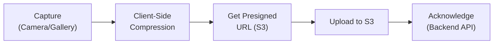

<!-- Document Information -->
<!-- Generated: 2026-02-18 -->
<!-- Version: 6.0.0+83 -->
<!-- Commit: 9ea0c658 -->

# Performance

## Table of Contents

- [Overview](#overview)
- [Widget Optimization](#widget-optimization)
- [Provider Optimization](#provider-optimization)
- [List Performance](#list-performance)
- [Image and Media Optimization](#image-and-media-optimization)
- [Build Optimization](#build-optimization)
- [Resource Disposal](#resource-disposal)
- [Debugging Tools](#debugging-tools)
- [Related Documents](#related-documents)

## Overview

Flutter TRC applies standard Flutter performance optimization patterns across its widget tree, state management, list rendering, media handling, and build configuration. Key practices include const constructors, efficient Provider usage, paginated lists via `CshApiList`, image caching, and proper resource disposal.

## Widget Optimization

### Const Constructors

Per `.cursor/rules/flutter_style_guidelines.mdc`, prefer `const` constructors where possible:

```dart
// Preferred
const SizedBox(height: 8),
const EdgeInsets.all(16),
const Text('Static text'),

// Widget constructors
class MyWidget extends StatelessWidget {
  const MyWidget({super.key});
  // ...
}
```

### Trailing Commas

Use trailing commas for better formatting and smaller diffs:

```dart
Container(
  padding: const EdgeInsets.all(16),
  margin: const EdgeInsets.symmetric(horizontal: 8),
  child: const Text('Content'),
)
```

### Widget Extraction

Extract reusable widget subtrees to reduce rebuild scope:

```dart
// Module widgets in widgets/ directory with index.dart exports
// Components in components/ directory for larger self-contained pieces
```

## Provider Optimization

### listen: false

Use `listen: false` when only calling methods (not subscribing to changes):

```dart
// Reading data (subscribes to changes)
final data = MyProvider.of(context).data;

// Calling methods only (no subscription needed)
MyProvider.of(context, listen: false).loadData();
```

### Selective Rebuilds

Use `Consumer` or `Selector` to limit rebuild scope:

```dart
// Only rebuilds this subtree when Provider changes
Consumer<MyProvider>(
  builder: (context, provider, child) {
    return Text(provider.status);
  },
)
```

### Avoid Unnecessary notifyListeners

Check if state actually changed before notifying:

```dart
set searchQuery(String? value) {
  if (_searchQuery != value) {
    _searchQuery = value;
    notifyListeners();
  }
}
```

## List Performance

### CshApiList (Recommended)

The project is migrating from legacy `iterate()` pattern to `CshApiList` for paginated lists:

```dart
CshApiList<ItemType>(
  apiUrl: "/endpoint/path",
  serviceGroup: TRCServiceGroups.qcConsole,
  filterConfig: _getFilterConfig(provider),
  getRowWidget: (item, index) {
    return ItemWidget(item: item);
  },
)
```

**CshApiList benefits:**
- Built-in pagination (handles pageNo, pageSize automatically)
- Integrated filtering and search
- Efficient list rendering
- Loading and error states built-in

### ListView.builder

For custom lists, use `ListView.builder` for efficient rendering of long lists:

```dart
ListView.builder(
  itemCount: items.length,
  itemBuilder: (context, index) {
    return ItemWidget(item: items[index]);
  },
)
```

### Legacy PaginatedListState

Being deprecated in favor of CshApiList. The `iterate()` pattern uses `PaginatedListState` which handles manual pagination.

## Image and Media Optimization

### Cached Network Images

Using `cached_network_image` for efficient image loading and caching:

```dart
CachedNetworkImage(
  imageUrl: imageUrl,
  placeholder: (context, url) => CircularProgressIndicator(),
  errorWidget: (context, url, error) => Icon(Icons.error),
)
```

### Image Compression

Using `flutter_image_compress` for client-side image optimization before upload.

### Video Optimization

- **video_compress** (v3.1.3) — Client-side video compression
- **video_optimizer** (shared package) — Server-side video optimization via S3
- **VideoCompressionMixin** (`lib/src/common/video/video_compression_mixin.dart`) — Reusable video compression logic

### Media Upload Flow



### Presigned URL Pattern

Media uploads use S3 presigned URLs to avoid routing large files through the backend API:

1. Request presigned URL from backend
2. Upload directly to S3 using presigned URL
3. Acknowledge upload completion to backend

## Build Optimization

### Code Obfuscation

All release builds include `--obfuscate` flag for code protection and smaller binary:

```bash
flutter build apk --obfuscate --split-debug-info=mappings
```

### Debug Symbol Splitting

`--split-debug-info=mappings` separates debug symbols for:
- Smaller APK/AAB size
- Symbols uploaded to Firebase Crashlytics for symbolication

### Tree Shaking

Flutter's default tree shaking removes unused code and assets from release builds.

### Flavor-Based Builds

Flavor configuration ensures only environment-relevant code is included:

```bash
flutter build apk --flavor stage --dart-define=env=stage
```

## Resource Disposal

### Provider Disposal

All providers must properly dispose resources:

```dart
class MyProvider extends CshChangeNotifier {
  StreamSubscription? _subscription;
  Timer? _timer;

  @override
  void dispose() {
    _subscription?.cancel();
    _timer?.cancel();
    super.dispose(); // Always call last
  }
}
```

### Widget Disposal

Widgets with controllers must dispose them:

```dart
class _MyWidgetState extends State<MyWidget> {
  final TextEditingController _controller = TextEditingController();
  final ScrollController _scrollController = ScrollController();

  @override
  void dispose() {
    _controller.dispose();
    _scrollController.dispose();
    super.dispose();
  }
}
```

### Stream Subscription Cancellation

All stream subscriptions must be cancelled:

```dart
StreamSubscription? _dataSubscription;

void loadData() {
  _dataSubscription?.cancel(); // Cancel previous
  _dataSubscription = MyService.getData().listen(
    (data) { /* ... */ },
    onError: (error) { /* ... */ },
  );
}

@override
void dispose() {
  _dataSubscription?.cancel();
  super.dispose();
}
```

## Debugging Tools

### Alice HTTP Inspector (Non-Production)

| Aspect | Value |
|--------|-------|
| Package | alice: ^0.4.2 |
| Activation | Non-web environments with `enableAlice: true` |
| Access | Shake gesture or notification |
| Features | HTTP request/response inspection, search, filtering |
| Production | Disabled |

### Logger

```dart
Logger.logLevel = LogLevel.All; // Configured in app_initializer.dart
Logger.debug('mydebug-----Class.method', [data]);
```

### Flutter DevTools

Standard Flutter DevTools available for:
- Widget inspector
- Performance overlay
- Memory profiling
- Network inspection

### Disk Space Monitoring

Using `disk_space_2: ^1.0.8` — monitors available disk space, important for media-heavy operations (video recording, image capture).

File: `lib/src/common/utils/disk_util.dart`

## Related Documents

- [Components](./Components.md) — Widget optimization patterns
- [State Management](./State%20Management.md) — Provider optimization
- [Configuration](./Configuration.md) — Build optimization flags
- [Error Handling](./Error%20Handling.md) — Debugging and logging
