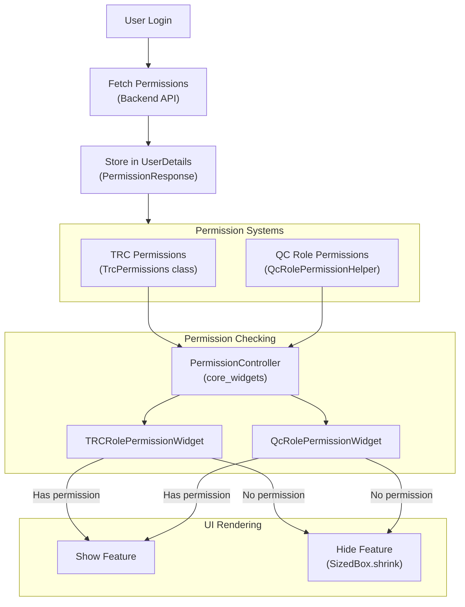
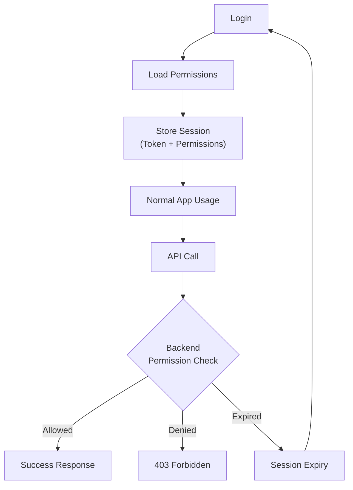

<!-- Document Information -->
<!-- Generated: 2026-02-18 -->
<!-- Version: 6.0.0+83 -->
<!-- Commit: 9ea0c658 -->

# Permissions

## Table of Contents

- [Overview](#overview)
- [Permission Architecture](#permission-architecture)
- [TRC Permissions](#trc-permissions)
- [QC Role Permissions](#qc-role-permissions)
- [Permission Checking](#permission-checking)
- [Permission Widgets](#permission-widgets)
- [Backend Enforced Permissions](#backend-enforced-permissions)
- [Feature Flags](#feature-flags)
- [Session Based Access Control](#session-based-access-control)
- [Related Documents](#related-documents)

## Overview

Flutter TRC implements a dual permission system:
1. **TRC Permissions** — Module-level permissions for TRC domain (12 permission types)
2. **QC Role Permissions** — Role-based permissions for QC domain (17 role types)

Permissions are loaded from the backend during login and stored in `UserDetails`. Both systems use permission guard widgets to conditionally render UI elements.

## Permission Architecture



## TRC Permissions

Defined in `lib/trc/my_permissions/permissions.dart`:

| Permission Key | Permission Values | Role | Module Access |
|---------------|------------------|------|---------------|
| engineer | `["app_engineer"]` | TRC Engineer | Device repair, parts management |
| inventory | `["app_inventory"]` | Inventory Manager | Parts inventory, delivery/pickup |
| executive | `["app_executive"]` | TRC Executive | Lot management, device scanning |
| l4Engineer | `["app_l4_engineer"]` | L4 Engineer | Advanced engineering operations |
| auditor | `["app_auditor"]` | Auditor | Audit operations |
| tester | `["app_tester"]` | Tester | Device testing |
| partQc | `["app_part_qc"]` | Part QC | Parts quality control |
| storeManager | `["app_store_manager"]` | Store Manager | Store operations management |
| rider | `["app_rider"]` | Rider | Pickup and delivery |
| rubbing | `["app_rubbing"]` | Rubbing | Device rubbing operations |
| glassChange | `["app_glass_change"]` | Glass Change | Glass change operations |
| elss | `["app_elss"]` | ELSS | Extended lifecycle service |

**Module identifier:** `"trc-console"`

### Permission Extension Methods

File: `lib/trc/my_permissions/permission_extension.dart`

```dart
// Check if user has a specific module permission
hasPermissionModule(Permission permission)

// Get all permissions for a module
getAllPermission(String moduleName)
```

## QC Role Permissions

Defined in `lib/qc/qc_role_permission/qc_role_permission_helper.dart`:

| QC Role | Value | Module Access |
|---------|-------|---------------|
| ROLE_STORE_IN | QcRole enum | store_in module |
| ROLE_STORE_OUT | QcRole enum | store_out module |
| ROLE_DISPATCH | QcRole enum | dispatch_lot, pre_dispatch modules |
| ROLE_AUDIT | QcRole enum | warehouse_audit, external_audit modules |
| ROLE_PRODUCT_DISCOVERY | QcRole enum | Product discovery features |
| ROLE_STOCK_TRANSFER | QcRole enum | stock_transfer module |
| ROLE_SEMI_TESTING | QcRole enum | Semi testing operations |
| ROLE_TESTING | QcRole enum | qc_tester module (full testing) |
| ROLE_CENTRALISED_AUDIT | QcRole enum | Centralized audit operations |
| ROLE_MANUAL_TESTING | QcRole enum | Manual testing operations |
| ROLE_LOT_RE_QUOTE | QcRole enum | re_qc module |
| ROLE_DEAD_DEVICE | QcRole enum | dead_repair module |
| ROLE_GUARD | QcRole enum | gaurd module |
| QC_ELSS | QcRole enum | QC ELSS operations |
| ROLE_VIDEOGRAPHER | QcRole enum | d2c_video module |
| SUPERVISOR_ROLE | QcRole enum | supervisor module |

## Permission Checking

### PermissionController (from core_widgets)

The central permission checking mechanism from `core_widgets`:

```dart
// Check a single permission
bool hasPermission = PermissionController().hasPermission(permission);

// Used internally by permission widgets
```

### UserDetails Permission Data

File: `lib/src/resources/user_details.dart`

```dart
class UserDetails {
  static final UserDetails _instance = UserDetails._();
  
  PermissionResponse? permissionResponse;
  
  List<String> getListOfPermissions() {
    // Returns list of permission keys
  }
  
  bool isEngineerRole() {
    // Check if user has engineer role
  }
}
```

## Permission Widgets

### TRCRolePermissionWidget

File: `lib/trc/my_permissions/widget/trc_role_permission_widget.dart`

```dart
class TRCRolePermissionWidget extends StatelessWidget {
  final Permission permission;
  final Widget child;

  const TRCRolePermissionWidget({
    required this.permission,
    required this.child,
  });

  @override
  Widget build(BuildContext context) {
    if (PermissionController().hasPermission(permission)) {
      return child;
    }
    return const SizedBox.shrink();
  }
}
```

**Usage:**
```dart
TRCRolePermissionWidget(
  permission: TrcPermissions.engineer,
  child: EngineerDashboardWidget(),
)
```

### QcRolePermissionWidget

File: `lib/qc/qc_role_permission/widget/qc_role_permission_widget.dart`

Similar pattern to TRCRolePermissionWidget for QC-specific role checks.

## Backend Enforced Permissions

| Enforcement | Mechanism | Response |
|-------------|-----------|----------|
| API-level | Backend validates SSO token permissions | HTTP 403 Forbidden |
| Module-level | Backend checks role against module access | Permission denied response |
| Feature-level | Backend validates feature flag + permission | Feature disabled response |

The backend performs its own permission checks on each API call. The client-side permission widgets are a UX optimization to hide unavailable features, not a security boundary.

## Feature Flags

### Firebase Remote Config

Feature flags managed via Firebase Remote Config:

```dart
// Initialized in app_initializer.dart
FirebaseRemoteConfig.instance.fetchAndActivate();
```

Remote config values can enable/disable features at runtime without app updates.

### Build-Time Feature Flags

Environment-based feature control via `--dart-define`:

```dart
const bool isDebug = bool.fromEnvironment('dart.vm.product') == false;
```

## Session Based Access Control

| Aspect | Mechanism |
|--------|-----------|
| Token validation | SSO token validated on each API request by backend |
| Session expiry | `AuthHeaderInterceptor` detects and handles expired sessions |
| Re-authentication | User redirected to login on session expiry |
| Permission refresh | Permissions loaded fresh on each login |
| Token storage | SharedPreferences via AuthHandler |



## Related Documents

- [Security](./Security.md) — Authentication and session management
- [Module Reference](./Module%20Reference.md) — Module-to-role mapping
- [Configuration](./Configuration.md) — Feature flags and remote config
