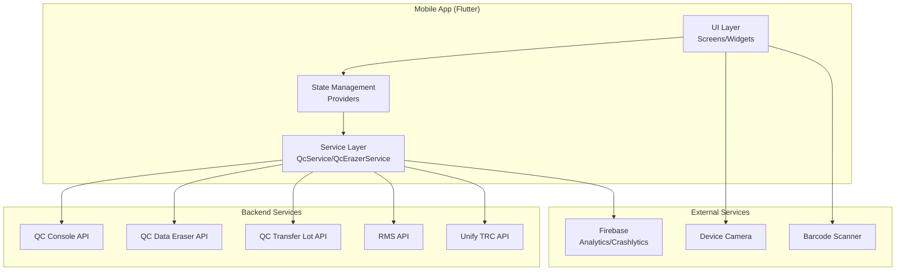
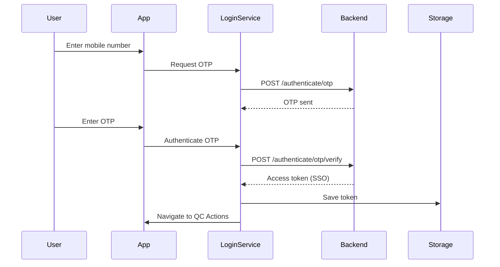
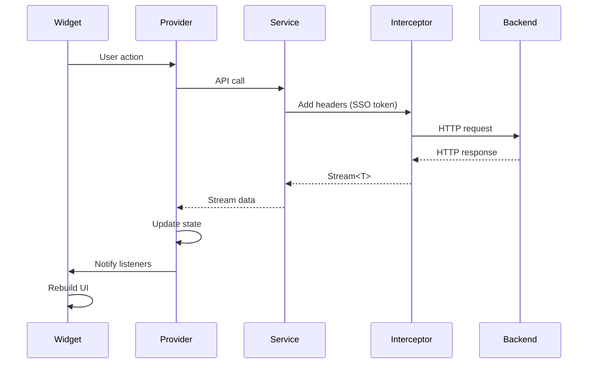
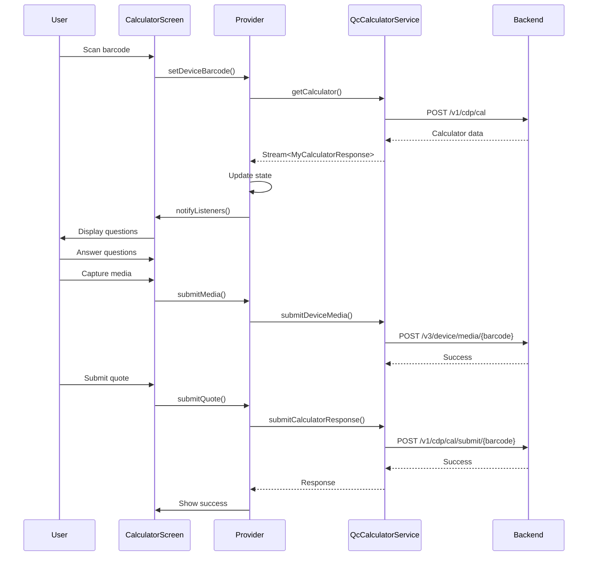
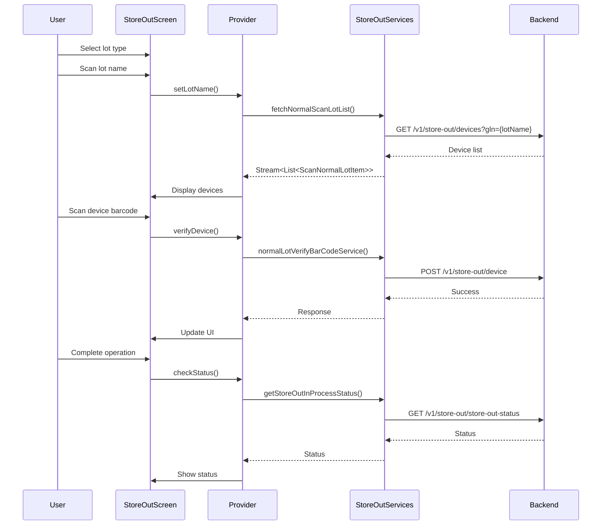
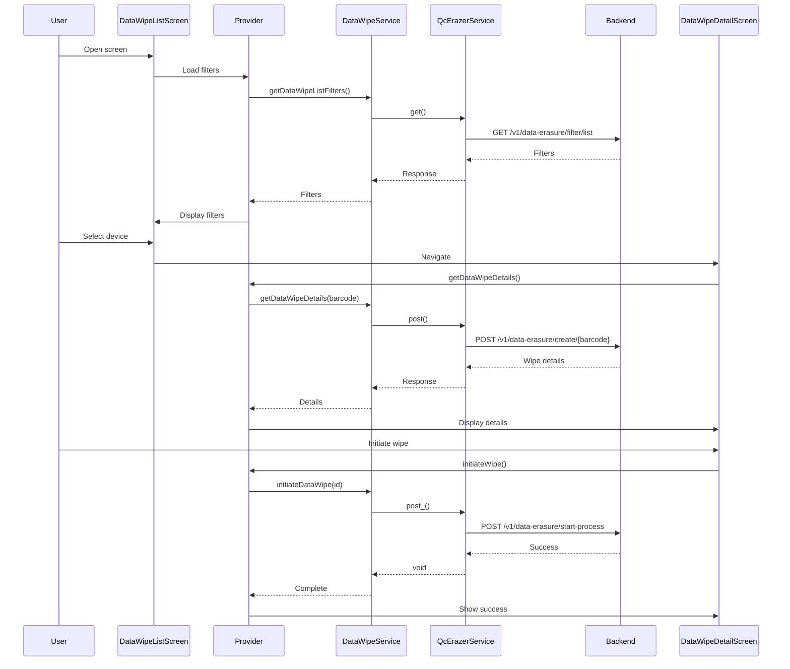

# Application Documentation: QC Module (Flutter TRC)

## Document Information
- **Generated**: 2024-12-19
- **Version**: 6.0.0+83
- **Module**: Quality Control (QC)
- **Platform**: Flutter (Android/iOS Mobile)

## Table of Contents

1. [Application Overview](#1-application-overview)
2. [System Architecture](#2-system-architecture)
3. [Module-wise Flow Documentation](#3-module-wise-flow-documentation)
4. [User Journey Flows](#4-user-journey-flows)
5. [API & Service Flows](#5-api--service-flows)
6. [Data Flow & Storage](#6-data-flow--storage)
7. [State Management](#7-state-management)
8. [Security Flows](#8-security-flows)
9. [Edge Cases & Failure Scenarios](#9-edge-cases--failure-scenarios)
10. [Non-Functional Flows](#10-non-functional-flows)
11. [Platform-Specific Behavior](#11-platform-specific-behavior)
12. [Sequence Flows](#12-sequence-flows)
13. [Configuration & Environment](#13-configuration--environment)
14. [Testing & Quality](#14-testing--quality)
15. [Glossary & Terminology](#15-glossary--terminology)

**📊 For detailed flow diagrams of all operations, see [QC_MODULE_FLOW_DIAGRAMS.md](QC_MODULE_FLOW_DIAGRAMS.md)**

---

## 1. Application Overview

### Purpose

The QC (Quality Control) module is a comprehensive mobile application for managing quality control operations in a Tech Refurbish Center (TRC). It enables QC testers, supervisors, and warehouse staff to perform device testing, lot management, stock operations, data wiping, and audit processes.

### Target Users

- **QC Testers**: Perform device testing, calculator operations, audit checks
- **Supervisors**: Review device reports, approve/reject quality checks
- **Warehouse Staff**: Handle store in/out operations, stock transfers
- **Guard Staff**: Manage entry/exit scanning, invoice collection
- **Auditors**: Perform warehouse and external audits

### Platforms Supported

- **Android**: Primary platform
- **iOS**: Supported platform
- **Mobile-First**: Designed for on-site mobile device operations

### High-Level Business Goals

1. **Device Quality Assurance**: Ensure all devices meet quality standards before dispatch
2. **Lot Management**: Track and manage device lots through pre-dispatch, dispatch, and storage
3. **Stock Operations**: Handle stock in, stock out, and stock transfer operations
4. **Data Security**: Securely wipe device data before resale
5. **Audit Compliance**: Maintain audit trails for warehouse and external audits
6. **Workflow Efficiency**: Streamline QC processes with mobile-first design

### Key Assumptions & Constraints

- **Network Dependency**: Most operations require network connectivity
- **Authentication**: SSO token-based authentication required
- **Offline Capability**: Limited offline functionality
- **Device Permissions**: Camera, storage, and biometric permissions required
- **Service Groups**: Different service groups for different operations (qcConsole, qcErazer, qcTransferLot)

### Version Information

- **Current Version**: 6.0.0+83
- **Flutter SDK**: >=3.4.3 <4.0.0
- **Dependencies**: See [pubspec.yaml](pubspec.yaml)

---

## 2. System Architecture

### High-Level Architecture



### Major Components/Modules

#### 1. **Service Layer** (`lib/src/services/`)
- `QcService`: Default QC console operations (TRCServiceGroups.qcConsole)
- `QcErazerService`: Data erasure operations (TRCServiceGroups.qcErazer)
- `QcTransferService`: Stock transfer operations (TRCServiceGroups.qcTransferLot)
- `RmsService`: RMS operations (TRCServiceGroups.rms)
- `TrcService`: TRC operations (TRCServiceGroups.unifyTrc)

#### 2. **QC Modules** (`lib/qc/modules/`)
20 functional modules organized by feature:
- QC Actions, QC Tester (Calculator, Audit, Media, LOB)
- Store In/Out, Stock In/Transfer
- Pre-Dispatch/Dispatch
- Data Wipe, Dead Repair, Re-QC
- Supervisor, Warehouse Audit
- D2C Video, External Audit
- Guard, IMEI Validator
- Device Details/Receive

#### 3. **State Management** (`lib/qc/modules/*/providers/`)
- Provider pattern using `CshChangeNotifier`
- Module-specific providers for state management
- Stream-based API integration

#### 4. **UI Components** (`lib/qc/modules/*/components/`, `widgets/`, `screens/`)
- Builder-based component system
- Screen-level widgets
- Reusable UI components

### Technology Stack

- **Framework**: Flutter 3.4.3+
- **State Management**: Provider pattern
- **Networking**: Stream-based API calls
- **Storage**: GetStorage, SharedPreferences
- **Authentication**: SSO Token (CoreHeaders.xSSOToken)
- **Analytics**: Firebase Analytics
- **Crash Reporting**: Firebase Crashlytics
- **Image Processing**: flutter_image_compress, image_picker
- **Video**: video_player, video_compress
- **Barcode Scanning**: mobile_scanner, ml_barcode_scanner
- **Localization**: flutter_localizations, intl

### External Dependencies

- **Firebase**: Analytics, Crashlytics, Remote Config
- **Camera**: Device camera for media capture
- **Barcode Scanner**: ML-based and traditional barcode scanning
- **Biometric Auth**: local_auth for device authentication
- **Video Processing**: FFmpeg-based video compression

### Data Flow Between Components

```
User Action → Screen/Widget → Provider → Service → API
                                    ↓
                              State Update
                                    ↓
                              UI Rebuild
```

---

## 3. Module-wise Flow Documentation

### 3.1 QC Actions Module

**Location**: `lib/qc/modules/qc_actions/`

**Purpose**: Main action hub providing navigation to all QC operations

**Entry Points**:
- Screen: `QcActionScreen` (route: `/qc_action_screen`)
- Component: `QcActionComponent`

**Flow**:
1. User opens QC Actions screen
2. System checks user roles and permissions
3. Displays available actions based on permissions
4. User selects an action
5. Navigates to corresponding module screen

**Key Files**:
- `qc_action_screen.dart`: Main screen
- `qc_action_component.dart`: Component implementation
- `qc_action_widget.dart`: Widget with action buttons

**Dependencies**: Role-based permission system

---

### 3.2 QC Tester Module

#### 3.2.1 Calculator Sub-module

**Location**: `lib/qc/modules/qc_tester/calculator/`

**Purpose**: Device calculator for quality assessment and pricing

**Entry Points**:
- `CalculatorScannerScreen`: Device barcode scanning
- `CalculationScreen`: Calculator interface
- `SubmitDeviceQuoteScreen`: Quote submission

**Flow**:
1. **Scan Device**: User scans device barcode
   - Service: `QcCalculatorService.getCalculator()`
   - Endpoint: `POST /v1/cdp/cal`
2. **Load Calculator**: System loads calculator questions
   - Service: `CalculatorService.getCalculator()`
3. **Answer Questions**: User answers quality questions
4. **Capture Media**: User captures device images/videos
   - Service: `CalculatorService.submitDeviceMedia()`
   - Endpoint: `POST /v3/device/media/{deviceBarcode}`
5. **Submit Quote**: User submits final quote
   - Service: `CalculatorService.submitCalculatorResponse()`
   - Endpoint: `POST /v1/cdp/cal/submit/{deviceBarcode}` or `/manual-test/calculator/submit/{deviceBarcode}`

**Key Services**:
- `QcCalculatorService`: Extends `CalculatorService`
- `CalculatorService`: Abstract service with common methods

**State Management**: Calculator-specific providers

#### 3.2.2 Audit Sub-module

**Location**: `lib/qc/modules/qc_tester/audit/`

**Purpose**: Device audit questionnaire and testing

**Entry Points**:
- `AuditQuestionsScreen`: Audit questions interface
- `AuditQuestionSummaryScreen`: Summary before submission

**Flow**:
1. **Scan Device**: User scans device barcode
2. **Load Audit**: System loads audit questionnaire
   - Service: `AuditDataServices.getAuditQuestionnaire()`
   - Endpoint: `GET /device/test/audit/{scannedBarcode}`
3. **Answer Questions**: User answers audit questions
4. **Check Testing**: System checks if testing passed
   - Service: `AuditDataServices.checkIsTestingPass()`
   - Endpoint: `POST /device/test/audit/{scannedBarcode}/check`
5. **Submit Audit**: User submits audit responses
   - Service: `AuditDataServices.submitAutQuestionResponses()`
   - Endpoint: `POST /device/test/audit/{scannedBarcode}`

#### 3.2.3 Home Sub-module

**Location**: `lib/qc/modules/qc_tester/home/`

**Purpose**: QC tester home dashboard

**Entry Points**:
- `QcTesterHomeScreen`: Home screen

**Flow**:
1. User opens tester home
2. System fetches testing counts
   - Service: `TesterHomeService.getTestingCount()`
   - Endpoint: `GET /testing/count`
3. Displays testing statistics
4. User navigates to specific testing flows

---

### 3.3 Store Out Module

**Location**: `lib/qc/modules/store_out/`

**Purpose**: Warehouse store-out operations for device lots

**Entry Points**:
- `StoreOutScreen`: Main store-out screen
- `StoreOutComponent`: Component implementation

**Flow**:
1. **Select Lot Type**: User selects normal or bin lot type
2. **Scan Lot**: User scans lot name/group name
3. **Fetch Devices**: System fetches lot devices
   - Normal: `StoreOutServices.fetchNormalScanLotList()`
     - Endpoint: `GET /v1/store-out/devices`
   - Bin: `StoreOutServices.fetchBinScanLotList()`
     - Endpoint: `GET /bin/lot/store-out/device/list`
4. **Scan Devices**: User scans individual devices
   - Normal: `StoreOutServices.normalLotVerifyBarCodeService()`
     - Endpoint: `POST /v1/store-out/device`
   - Bin: `StoreOutServices.binOutVerifyBarCodeService()`
     - Endpoint: `POST /bin/lot/store-out`
5. **Check Status**: System checks store-out in-process status
   - Service: `StoreOutServices.getStoreOutInProcessStatus()`
   - Endpoint: `GET /v1/store-out/store-out-status`

**State Management**: `StoreOutProvider`

**Key Features**:
- Supports both normal and bin lot types
- Accepts `BaseService` parameter for flexibility
- Real-time status checking

---

### 3.4 Store In Module

**Location**: `lib/qc/modules/store_in/`

**Purpose**: Warehouse store-in operations

**Entry Points**:
- `StoreInLocationScanScreen`: Location scanning screen

**Flow**:
1. **Select Type**: User selects normal or bin store-in
2. **Scan Location**: User scans location barcode
   - Service: `StoreInServices.verifyLocBarCode()`
   - Normal: `GET /store-in/validate-location`
   - Bin: `GET /bin/store-in/verify-cell`
3. **Scan Device**: User scans device barcode
4. **Store Device**: System stores device to location
   - Normal: `POST /v1/store-in/verify-cell`
   - Bin: `GET /bin/store-in/verify-location`

**State Management**: Store-in specific providers

---

### 3.5 Stock Transfer Module

**Location**: `lib/qc/modules/stock_transfer/`

**Purpose**: Stock transfer lot management

**Entry Points**:
- `StockTransferListScreen`: Transfer lot list
- `PendingLotDetailScreen`: Pending lot details
- `StStoreOutScreen`: Store-out screen for transfer

**Flow**:
1. **List Transfer Lots**: User views transfer lot list
   - Service: `StockTransferService.getTransferLotHeader()`
   - Endpoint: `GET /v1/transfer-lot/{lotId}`
2. **Select Lot**: User selects a transfer lot
3. **View Devices**: System displays lot devices
   - Service: `StockTransferService.getPendingLotDetails()`
   - Endpoint: `GET /v1/transfer-lot/device/list`
4. **Scan Device**: User scans device to add/remove
   - Add: `StockTransferService.addDevice()`
     - Endpoint: `POST /v1/transfer-lot/add-device`
   - Remove: `StockTransferService.removeDeviceFromLot()`
     - Endpoint: `POST /v1/transfer-lot/remove-device`
5. **Complete Dispatch**: User completes pending dispatch
   - Service: `StockTransferService.completePendingDispatch()`
   - Endpoint: `POST /v1/transfer-lot/dispatch`

**Service Group**: `QcTransferService` (TRCServiceGroups.qcTransferLot)

---

### 3.6 Data Wipe Module

**Location**: `lib/qc/modules/data_wipe/`

**Purpose**: Device data erasure operations

**Entry Points**:
- `DataWipeHomeScreen`: Home screen
- `DataWipeListScreen`: Device list
- `DataWipeDetailScreen`: Device detail

**Flow**:
1. **List Devices**: User views data wipe device list
   - Service: Uses `CshApiList` with filters
2. **Select Device**: User selects a device
3. **Create Wipe**: System creates data wipe entry
   - Service: `DataWipeService.getDataWipeDetails()`
   - Endpoint: `POST /v1/data-erasure/create/{deviceBarcode}`
4. **Initiate Wipe**: User initiates data wipe
   - Service: `DataWipeService.initiateDataWipe()`
   - Endpoint: `POST /v1/data-erasure/start-process`
5. **Bulk Process**: User can initiate bulk wipe
   - Service: `DataWipeService.bulkInitiate()`
   - Endpoint: `POST /v1/data-erasure/bulk-process`
6. **Report Mismatch**: User reports IMEI/serial mismatch
   - Service: `DataWipeService.reportMisMatch()`
   - Endpoint: `POST /v1/data-erasure/update/{deviceBarcode}`

**Service Group**: `QcErazerService` (TRCServiceGroups.qcErazer)

**State Management**: `DataWipeListProvider`, `DataWipeDetailProvider`

---

### 3.7 Re-QC Module

**Location**: `lib/qc/modules/re_qc/`

**Purpose**: Re-quality check process for devices

**Entry Points**:
- `ReQcListScreen`: Re-QC lot list
- `ReQcDetailScreen`: Re-QC detail with tabs

**Flow**:
1. **List Lots**: User views re-QC lot list
   - Service: `ReQcService.getLotDeviceList()`
   - Endpoint: `GET /lot/v2/devices?gln={lotGroupName}`
2. **Select Lot**: User selects a lot
3. **View Details**: System displays lot device details
   - Tabs: Device Summary, Questions, Scanner
4. **Skip Re-QC**: User can skip re-QC
   - Service: `ReQcService.skipReQc()`
   - Endpoint: `POST /re-qc/v1/skip-re-qc`
5. **Submit Re-QC**: User submits re-QC data
   - Service: `ReQcService.submitReQcData()`
   - Endpoint: `POST /re-qc/v1/device-re-qc/{deviceBarcode}`
6. **Complete Re-QC**: User completes re-QC
   - Service: `ReQcService.completeReQc()`
   - Endpoint: `POST /re-qc/v1/complete?lotId={lotId}`

**State Management**: `ReQcListProvider`, `ReQcDetailProvider`, `ReQcQuestionTabProvider`

---

### 3.8 Pre-Dispatch Module

**Location**: `lib/qc/modules/pre_dispatch/`

**Purpose**: Pre-dispatch lot operations

**Entry Points**:
- `PreDispatchScreen`: Main screen
- `PreDispatchLotScreen`: Lot detail screen

**Flow**:
1. **List Lots**: User views pre-dispatch lots
2. **Select Lot**: User selects a lot
3. **Fetch Details**: System fetches lot device details
   - Service: `DispatchLotServices.fetchPreDispatchItemDetail()`
   - Endpoint: `GET /lot/v2/devices`
4. **Scan Devices**: User scans devices for pre-dispatch
   - Service: `DispatchLotServices.scanPreLotDispatch()`
   - Endpoint: `POST /lot-pre-dispatch/v2`
5. **Complete**: User completes pre-dispatch
   - Service: `DispatchLotServices.completePreLotDispatch()`
   - Endpoint: `POST /lot-pre-dispatch/v2/complete`

**State Management**: `PreDispatchProvider`, `PreDispatchLotProvider`

---

### 3.9 Dispatch Lot Module

**Location**: `lib/qc/modules/dispatch_lot/`

**Purpose**: Lot dispatch operations

**Entry Points**:
- `DispatchLotScreen`: Main dispatch screen
- `InvoiceScanScreen`: Invoice scanning

**Flow**:
1. **Scan Invoice**: User scans invoice number
2. **Complete Dispatch**: User completes dispatch
   - Service: `DispatchLotServices.completeDispatch()`
   - Endpoint: `POST /lot-dispatch/v2`

**State Management**: Dispatch-specific providers

---

### 3.10 Dead Repair Module

**Location**: `lib/qc/modules/dead_repair/`

**Purpose**: Dead device and repair device handling

**Entry Points**:
- `DeviceDeadRepairScreen`: Main screen
- `ReasonSelectionScreen`: Reason selection
- `DeviceDeadAcceptRejectScreen`: Accept/reject screen

**Flow**:
1. **Scan Device**: User scans device barcode
   - Service: `DeviceDeadRepairServices.getScanDeviceDetail()`
   - Endpoint: `GET /dead/device/scan`
2. **Select Reason**: User selects dead/repair reason
   - Service: `DeviceDeadRepairServices.fetchReasonList()`
   - Endpoint: `GET /dead/device/mark-dead/remark` or `/repair/device/mark-repair/remark`
3. **Submit Reason**: User submits reason
   - Service: `DeviceDeadRepairServices.reasonSubmission()`
   - Endpoint: `POST /dead/device/mark-dead` or `/repair/device/mark-repair`
4. **Add/Remove Parts**: User can add/remove parts
   - Service: `DeviceDeadRepairServices.addRemovePart()`
   - Endpoint: `POST /dead/device/add/part-sku` or `/dead/device/remove/part-sku`
5. **Accept/Reject**: Supervisor accepts/rejects dead device
   - Service: `DeviceDeadRepairServices.submitDeadDeviceRequest()`
   - Endpoint: `POST /dead/device/accept-dead`, `/dead/device/reject-dead`, or `/dead/device/mark-repair`

**State Management**: Dead repair providers

---

### 3.11 Supervisor Module

**Location**: `lib/qc/modules/supervisor/`

**Purpose**: Supervisor device report review

**Entry Points**:
- `SupervisorScreen`: Supervisor screen

**Flow**:
1. **Enter Barcode**: User enters device barcode
2. **Fetch Report**: System fetches device report
   - Service: `SupervisorService.getDeviceDetails()`
   - Endpoint: `GET /supervisor/device-report/{deviceBarcode}?idr={isFullResponse}`
3. **Review Data**: Supervisor reviews device data
4. **Submit Changes**: Supervisor submits mismatched data
   - Service: `SupervisorService.submitDeviceData()`
   - Endpoint: `POST /supervisor/device-report/{deviceBarcode}`

**State Management**: `SupervisorProvider`

---

### 3.12 Warehouse Audit Module

**Location**: `lib/qc/modules/warehouse_audit/`

**Purpose**: Warehouse audit operations

**Entry Points**:
- `OnGoingAuditScreen`: Ongoing audit list
- `WarehouseAuditPerformScreen`: Perform audit screen

**Flow**:
1. **List Audits**: User views ongoing audits
   - Service: `WarehouseAuditService.getOngoingAuditList()`
   - Endpoint: `GET /warehouse-audit/list`
2. **Select Audit**: User selects an audit
3. **Scan Device**: User scans device for audit
   - Service: `WarehouseAuditService.scanDeviceForAudit()`
   - Endpoint: `POST /warehouse-audit/scan/{auditId}` or `/warehouse-audit/scan/{auditId}/media`
4. **Capture Media**: User captures device images (optional)
5. **Submit**: System submits audit scan

**State Management**: Warehouse audit providers

---

### 3.13 D2C Video Module

**Location**: `lib/qc/modules/d2c_video/`

**Purpose**: Device-to-customer video recording

**Entry Points**:
- `D2cVideoHomeScreen`: Home screen
- `D2cLotListingScreen`: Lot listing
- `D2cVideoScreen`: Video recording screen

**Flow**:
1. **List Lots**: User views pending lots
   - Service: `D2CVideoService.getLotDeviceList()`
   - Endpoint: `GET /device/recording/pending-lot-device-list?lotId={lotId}`
2. **Select Device**: User selects a device
3. **Record Video**: User records device video
4. **Save Video**: System saves video
   - Service: `D2CVideoService.saveVideo()`
   - Endpoint: `POST /device/recording/{deviceBarcode}/save`
5. **Update Status**: User updates lot status
   - Service: `D2CVideoService.updateLotStatus()`
   - Endpoint: `POST /device/recording/update-group`

**State Management**: `D2CVideoProvider`, `D2cLotListingProvider`

---

### 3.14 External Audit Module

**Location**: `lib/qc/modules/external_audit/`

**Purpose**: External audit recording

**Entry Points**:
- `ExternalAuditHomeScreen`: Home screen
- `ExternalAuditPerformScreen`: Perform audit screen

**Flow**:
1. **Select Audit Type**: User selects audit type
2. **Capture Media**: User captures videos/images
3. **Submit Audit**: User submits external audit
   - Service: `ExternalAuditService.submitExternalAudit()`
   - Endpoint: `POST /recording/external`

**State Management**: External audit providers

---

### 3.15 Guard Module

**Location**: `lib/qc/modules/gaurd/`

**Purpose**: Guard entry/exit operations

**Entry Points**:
- `QcGuardHomeScreen`: Guard home screen
- `GuardDeviceCountingListScreen`: Device counting list
- `GuardUploadInvoiceScreen`: Invoice upload

**Flow**:
1. **Entry Scan**: Guard scans entry barcode
   - Service: `GuardService.entryScanData()`
   - Endpoint: `POST /vendor/wh/entry/scan`
2. **Collect Orders**: Guard views collected orders
   - Service: `GuardService.getCollectedOrderList()`
   - Endpoint: `GET /collect-order/collected-orders`
3. **Submit Invoice**: Guard submits invoice
   - Service: `GuardService.submitInvoice()`
   - Endpoint: `POST /collect-order/collect`

**State Management**: Guard providers

---

### 3.16 IMEI Validator Module

**Location**: `lib/qc/modules/imei_validator/`

**Purpose**: IMEI validation for stock-in

**Entry Points**:
- `ImeiValidatorScreen`: IMEI validator screen

**Flow**:
1. **Validate IMEI**: User validates IMEI1 and IMEI2
2. **Complete Validation**: User completes validation
   - Service: `ImeiValidatorService.completeValidation()`
   - Endpoint: `POST /stock-in/fraud`

**State Management**: IMEI validator providers

---

### 3.17 Device Receive Module

**Location**: `lib/qc/modules/device_receive_module/`

**Purpose**: Device receive for repair

**Entry Points**:
- `DeviceReceiveScreen`: Device receive screen

**Flow**:
1. **Scan Device**: User scans device barcode
2. **Receive Device**: System receives device
   - Service: `DeviceReceiveService.receiveDevice()`
   - Endpoint: `POST /device/repair/receive`

**State Management**: Device receive providers

---

### 3.18 Device Details Module

**Location**: `lib/qc/modules/device_details/`

**Purpose**: Device detail information

**Entry Points**:
- `DeviceDetailsScreen`: Device details screen

**Flow**:
1. **Enter Barcode**: User enters device barcode
2. **Fetch Details**: System fetches device details
   - Service: `DeviceDetailService.getDeviceDetails()`
   - Endpoint: `GET /device/detail?qrcode={deviceBarcode}`
3. **View Stock Movement**: User views stock movement
   - Service: `DeviceDetailService.getDeviceStockMovement()`
   - Endpoint: `GET /device/stock-movement/{deviceBarcode}`

**State Management**: Device detail providers

---

### 3.19 Stock In Module

**Location**: `lib/qc/modules/stock_in_module/`

**Purpose**: Stock-in operations with AWB validation

**Entry Points**:
- `SearchItemScreen`: Search item screen
- `StockInProductDetailScreen`: Product detail screen
- `MediaFileUploadScreen`: Media upload screen

**Flow**:
1. **Validate AWB**: User validates AWB number
   - Service: `StockInService.validateAwb()`
   - Endpoint: `GET /stock-in/validate-awb`
2. **Scan Device**: User scans device barcode
3. **Upload Media**: User uploads device media
4. **Push to QC**: User pushes to QC
   - Service: `StockInService.pushAwb()`
   - Endpoint: `POST /stock-in/push-to-qc`

**State Management**: Stock-in providers

---

### 3.20 QC Common Modules

#### 3.20.1 Lot Type Filter

**Location**: `lib/qc/qc_common/lot_type_filters/`

**Purpose**: Lot type filtering for store-out

**Flow**:
1. **Fetch Filters**: System fetches lot type filters
   - Service: `LotTypeFilterService.storeOutLotTypeFilters()`
   - Endpoint: `GET /store-out/v2/list-lot-types`
2. **Apply Filters**: User applies filters

---

## 4. User Journey Flows

### 4.1 Device Testing Journey

**Preconditions**:
- User is logged in with QC tester role
- Device barcode is available

**Flow**:
1. User opens QC Tester Home
2. User selects "Calculator" or "Audit"
3. User scans device barcode
4. System loads calculator/audit questions
5. User answers questions
6. User captures device media (images/videos)
7. User submits calculator/audit responses
8. System processes and saves data
9. User views submission confirmation

**Screens Involved**:
- `QcTesterHomeScreen`
- `CalculatorScannerScreen`
- `CalculationScreen`
- `AuditQuestionsScreen`
- `SubmitDeviceQuoteScreen`

**Decision Points**:
- Calculator vs Audit flow
- LOB device vs regular device
- Media capture required vs optional

**Failure Scenarios**:
- Network failure: Retry mechanism
- Invalid barcode: Error message, rescan
- Submission failure: Retry with error handling

**Success Criteria**:
- Device quote/audit successfully submitted
- All required media captured
- Data persisted in backend

---

### 4.2 Lot Processing Journey

**Preconditions**:
- User has appropriate lot permissions
- Lot exists in system

**Flow**:
1. User opens Pre-Dispatch or Store Out screen
2. User scans lot group name
3. System fetches lot devices
4. User scans individual devices
5. System validates each device
6. User completes lot operation
7. System updates lot status

**Screens Involved**:
- `PreDispatchScreen`
- `StoreOutScreen`
- `DispatchLotScreen`

**Decision Points**:
- Normal lot vs Bin lot
- Pre-dispatch vs Dispatch
- Store in vs Store out

**Failure Scenarios**:
- Invalid lot: Error message
- Device mismatch: Validation error
- Network failure: Retry operation

**Success Criteria**:
- All devices scanned and validated
- Lot status updated
- Operation completed successfully

---

### 4.3 Stock Transfer Journey

**Preconditions**:
- User has stock transfer role
- Transfer lot exists

**Flow**:
1. User opens Stock Transfer List
2. User selects a transfer lot
3. System displays lot devices
4. User scans devices to add/remove
5. User completes store-out for transfer
6. User completes pending dispatch
7. System updates transfer status

**Screens Involved**:
- `StockTransferListScreen`
- `PendingLotDetailScreen`
- `StStoreOutScreen`
- `PendingDispatchDetailScreen`

**Decision Points**:
- Add device vs Remove device
- Skip device vs Process device
- Complete dispatch vs Save for later

**Failure Scenarios**:
- Device not found: Error message
- Transfer lot full: Validation error
- Dispatch failure: Retry mechanism

**Success Criteria**:
- Devices transferred successfully
- Dispatch completed
- Status updated in system

---

### 4.4 Data Wipe Journey

**Preconditions**:
- User has data wipe permissions
- Device is ready for data wipe

**Flow**:
1. User opens Data Wipe Home
2. User views device list with filters
3. User selects a device
4. System creates data wipe entry
5. User initiates data wipe
6. System processes data wipe
7. User verifies wipe completion

**Screens Involved**:
- `DataWipeHomeScreen`
- `DataWipeListScreen`
- `DataWipeDetailScreen`

**Decision Points**:
- Individual wipe vs Bulk wipe
- Report mismatch vs Continue
- Smart watch action selection

**Failure Scenarios**:
- Wipe initiation failure: Retry
- Mismatch detected: Report and handle
- Network failure: Queue for retry

**Success Criteria**:
- Data wipe initiated successfully
- Device data securely erased
- Status updated in system

---

## 5. API & Service Flows

### 5.1 API Overview

The QC module uses **Stream-based API calls** returning `Stream<T>` types. All API endpoints are documented in [QC_API_ENDPOINTS.md](../QC_API_ENDPOINTS.md).

### 5.2 Service Groups

| Service Group | Service Class | Use Case |
|--------------|---------------|----------|
| `TRCServiceGroups.qcConsole` | `QcService` | Default QC operations |
| `TRCServiceGroups.qcErazer` | `QcErazerService` | Data erasure operations |
| `TRCServiceGroups.qcTransferLot` | `QcTransferService` | Stock transfer operations |
| `TRCServiceGroups.rms` | `RmsService` | RMS operations |
| `TRCServiceGroups.unifyTrc` | `TrcService` | TRC operations |

### 5.3 Authentication Flow



**Authentication Details**:
- **Method**: SSO Token (CoreHeaders.xSSOToken)
- **Storage**: `QcStorage.saveUserAuthToken()`
- **Header**: Automatically added by `AuthHeaderInterceptor`
- **Session Expiry**: Handled by `SessionExpiredCallback`

### 5.4 Request/Response Lifecycle



### 5.5 Error Handling

**Error Codes**:
- `ApiErrorCodes.USER_SESSION_EXPIRE`: Session expired, redirect to login
- Network errors: Retry mechanism
- Validation errors: Display error message

**Error Handling Pattern**:
```dart
Service.getData().listen(
  (data) {
    // Handle success
  },
  onError: (error) {
    String errorMessage = ApiErrorHelper.getErrorMessage(error);
    // Display error to user
  },
);
```

### 5.6 API Versioning

- **v1**: `/v1/store-out/devices`, `/v1/cdp/cal`
- **v2**: `/v2/lot/devices`, `/lot-pre-dispatch/v2`
- **v3**: `/v3/device/media/{deviceBarcode}`

---

## 6. Data Flow & Storage

### 6.1 Data Models

**Request Models**: Located in `lib/qc/modules/*/resources/*_request.dart`
- Follow pattern: `toJson()` method for serialization

**Response Models**: Located in `lib/qc/modules/*/resources/*_response.dart`
- Follow pattern: `fromJson()` factory constructor

### 6.2 Data Storage

**Local Storage**:
- **GetStorage**: Module-specific storage (`QcStorage`)
- **SharedPreferences**: App-wide preferences (`AppStorage`)

**Stored Data**:
- User authentication token
- MPIN for biometric authentication
- User preferences
- Session data

**Storage Locations**:
- `lib/src/libraries/get_storage/qc_storage.dart`: QC-specific storage
- `lib/src/libraries/shared_preferences/app_preferences.dart`: App preferences

### 6.3 Data Persistence

**State Persistence**:
- Provider state: In-memory, cleared on app restart
- Local storage: Persisted across app restarts
- Backend: All business data persisted in backend

**Data Sync**:
- Real-time: Stream-based API calls
- Manual refresh: Pull-to-refresh in lists
- Background sync: Not implemented

### 6.4 Sensitive Data Handling

**Authentication Token**:
- Stored in secure storage (`QcStorage`)
- Automatically added to API requests
- Cleared on session expiry

**Biometric Data**:
- Handled by `local_auth` package
- Not stored locally
- Used for device unlock only

---

## 7. State Management

### 7.1 Provider Pattern

**Base Class**: `CshChangeNotifier` (from `core_widgets`)

**Pattern**:
```dart
class MyProvider extends CshChangeNotifier {
  // State variables
  String? _data;
  
  // Getters
  String? get data => _data;
  
  // Methods
  void loadData() {
    // API call
    // Update state
    notifyListeners();
  }
}
```

### 7.2 State Scope

**Global State**: 
- User authentication state
- App preferences
- Session data

**Module State**:
- Module-specific providers
- Scoped to module screens
- Disposed when module unmounts

**Local State**:
- Widget-level state using `StatefulWidget`
- Form state
- UI state (loading, error)

### 7.3 State Transitions

**Typical Flow**:
1. **Initial**: Provider created, state initialized
2. **Loading**: API call initiated, loading state set
3. **Success**: Data received, state updated, UI rebuilt
4. **Error**: Error state set, error message displayed
5. **Dispose**: Provider disposed, resources cleaned

### 7.4 State Synchronization

**Provider Access**:
```dart
// With listener
Provider.of<MyProvider>(context)

// Without listener
Provider.of<MyProvider>(context, listen: false)

// Using extension
MyProvider.of(context)
```

**State Updates**:
- `notifyListeners()`: Notifies all listeners
- Selective updates: Use `Consumer` or `Selector` for optimization

---

## 8. Security Flows

### 8.1 Authentication Flow

**Login Process**:
1. User enters mobile number
2. System sends OTP
3. User enters OTP
4. System validates OTP
5. System returns SSO token
6. Token stored in secure storage
7. Token added to all API requests

**Files**:
- `lib/src/modules/login/providers/login_provider.dart`
- `lib/src/interceptors/auth/auth_header_interceptor.dart`

### 8.2 Authorization

**Role-Based Access**:
- Roles defined in `QcRole` enum
- Permission check: `QcRolePermissionHelper.hasPermission()`
- Currently returns `true` (TODO: Implement proper check)

**Roles**:
- `ROLE_STORE_IN`, `ROLE_STORE_OUT`
- `ROLE_DISPATCH`, `ROLE_AUDIT`
- `ROLE_TESTING`, `ROLE_MANUAL_TESTING`
- `ROLE_DEAD_DEVICE`, `ROLE_GUARD`
- `SUPERVISOR_ROLE`, etc.

### 8.3 Secure Storage

**Storage Implementation**:
- `QcStorage`: QC-specific secure storage
- `AppStorage`: App-wide secure storage
- Uses `GetStorage` with encryption

**Stored Data**:
- Authentication tokens
- MPIN (encrypted)
- Biometric preference

### 8.4 Session Management

**Session Expiry**:
- Detected by `AuthHeaderInterceptor`
- Status code: `ApiErrorCodes.USER_SESSION_EXPIRE`
- Action: Clear storage, redirect to login

**Session Expiry Handler**:
```dart
SessionExpiredCallback().setCallback(onSessionExpire);
```

---

## 9. Edge Cases & Failure Scenarios

### 9.1 Network Failure

**Scenarios**:
- No internet connection
- Slow network
- Timeout errors

**Handling**:
- Retry mechanism in interceptors
- Error messages to user
- Offline queue (limited support)

### 9.2 Invalid States

**Scenarios**:
- Invalid barcode scanned
- Device not found
- Lot already processed

**Handling**:
- Validation before API calls
- Error messages with retry options
- State reset mechanisms

### 9.3 Partial Execution

**Scenarios**:
- Network failure during operation
- App crash during process
- User cancellation

**Handling**:
- Transaction-based operations where possible
- Status tracking for recovery
- Manual retry options

### 9.4 Concurrent Operations

**Scenarios**:
- Multiple users processing same lot
- Simultaneous device scans

**Handling**:
- Backend validation
- Optimistic locking
- Conflict resolution

### 9.5 Timeout Handling

**Scenarios**:
- API request timeout
- Long-running operations

**Handling**:
- Configurable timeout values
- Progress indicators
- Cancellation support

---

## 10. Non-Functional Flows

### 10.1 Performance Considerations

**Optimizations**:
- Stream-based API (reactive)
- Lazy loading of providers
- Image compression before upload
- Video compression for D2C videos

**Caching**:
- Limited local caching
- Backend caching for static data

### 10.2 Logging & Monitoring

**Firebase Integration**:
- **Analytics**: `FirebaseAnalytics` for user events
- **Crashlytics**: `FirebaseCrashlytics` for error tracking

**Logging**:
- `Logger.debug()` for debug logs
- Error logging in catch blocks

### 10.3 Crash Handling

**Global Error Handler**:
```dart
runZonedGuarded(() async {
  // App code
}, (error, stack) {
  FirebaseCrashlytics.instance.recordError(error, stack, fatal: true);
});
```

**File**: `lib/main.dart`

### 10.4 Feature Flags

**Remote Config**:
- `FirebaseRemoteConfig` for feature toggles
- Runtime configuration updates

### 10.5 Telemetry & Analytics

**Events Tracked**:
- User actions
- Screen navigation
- API calls (via Alice debug tool)
- Error occurrences

### 10.6 Resource Management

**Memory Management**:
- Provider disposal on screen unmount
- Stream subscription cancellation
- Image/video cleanup

**Battery Optimization**:
- Efficient camera usage
- Background processing limits

---

## 11. Platform-Specific Behavior

### 11.1 Android vs iOS Differences

**Camera**:
- Android: `camera_android_camerax`
- iOS: Standard camera plugin

**Permissions**:
- Android: Runtime permissions
- iOS: Info.plist declarations

**Storage**:
- Platform-specific path providers
- `path_provider` handles differences

### 11.2 Device-Specific Differences

**Camera Features**:
- Device-dependent camera capabilities
- Resolution variations

**Biometric Auth**:
- Fingerprint (Android)
- Face ID / Touch ID (iOS)

### 11.3 Permission Handling

**Required Permissions**:
- Camera: For media capture
- Storage: For file operations
- Biometric: For device unlock

**Permission Flow**:
- Request on first use
- Handle denial gracefully
- Show rationale when needed

---

## 12. Sequence Flows

### 12.1 Device Calculator Flow



### 12.2 Store Out Flow



### 12.3 Data Wipe Flow



---

## 13. Configuration & Environment

### 13.1 Environment Variables

**Build Configurations**:
- Development
- Staging
- Production

**Configuration Files**:
- `assets/stage/db.json`: Staging config
- `assets/beta/db.json`: Beta config
- `assets/prodTest/db.json`: Production test config

### 13.2 Build Configurations

**Android**:
- `android/app/build.gradle`: Build configuration
- `google-services.json`: Firebase config

**iOS**:
- `ios/Runner/GoogleService-Info.plist`: Firebase config

### 13.3 Feature Flags

**Remote Config**:
- Firebase Remote Config for runtime flags
- Feature toggles for gradual rollouts

### 13.4 Runtime Configurations

**Service Groups**:
- Configurable service endpoints
- Environment-specific API URLs

---

## 14. Testing & Quality

### 14.1 Test Coverage Areas

**Unit Tests**:
- Service methods
- Provider logic
- Utility functions

**Widget Tests**:
- Component rendering
- User interactions
- State updates

**Integration Tests**:
- End-to-end flows
- API integration
- State management

### 14.2 Critical Paths Requiring Testing

1. **Authentication Flow**: Login, OTP, token management
2. **Device Calculator**: Question flow, media capture, submission
3. **Store Out/In**: Lot scanning, device validation
4. **Data Wipe**: Wipe initiation, status tracking
5. **Stock Transfer**: Device add/remove, dispatch

### 14.3 Mock/Stub Requirements

**API Mocks**:
- Service layer mocks
- Response mocks for testing
- Error scenario mocks

### 14.4 Integration Test Scenarios

1. **Complete Device Testing Flow**
2. **Lot Processing Flow**
3. **Stock Transfer Flow**
4. **Data Wipe Flow**
5. **Error Handling Scenarios**

---

## 15. Glossary & Terminology

### 15.1 Domain Terms

- **QC**: Quality Control
- **TRC**: Tech Refurbish Center
- **Lot**: Group of devices processed together
- **Gln**: Group Lot Name
- **Lid**: Lot ID
- **Did**: Device ID
- **Qr/QrCode**: Device barcode
- **AWB**: Air Waybill Number
- **D2C**: Device-to-Customer (video recording)
- **LOB**: Line of Business (devices)
- **Re-QC**: Re-quality check process

### 15.2 Acronyms & Internal Names

- **SSO**: Single Sign-On
- **MPIN**: Mobile PIN
- **IMEI**: International Mobile Equipment Identity
- **SNO**: Serial Number
- **PMID**: Product Master ID
- **PID**: Product ID
- **VID**: Variant ID

### 15.3 External Service Names

- **Firebase**: Analytics, Crashlytics, Remote Config
- **QC Console**: Main QC backend service
- **QC Data Eraser**: Data wipe backend service
- **QC Transfer Lot**: Stock transfer backend service

### 15.4 Status/State Definitions

**Device Status**:
- Testing: Device under quality testing
- Approved: Device passed QC
- Rejected: Device failed QC
- Wiped: Device data erased

**Lot Status**:
- Pending: Lot awaiting processing
- In Progress: Lot being processed
- Completed: Lot processing finished
- Dispatched: Lot dispatched to customer

---

## Appendix A: Related Documentation

- **[QC_MODULE_FLOW_DIAGRAMS.md](QC_MODULE_FLOW_DIAGRAMS.md)**: Comprehensive flow diagrams for all QC module operations (24 detailed flowcharts)
- **[QC_API_ENDPOINTS.md](../QC_API_ENDPOINTS.md)**: Complete API endpoint reference for all QC modules

## Appendix B: File Reference

### Key Files

**Routes**:
- `lib/qc/qc_routes.dart`: All QC module routes

**Services**:
- `lib/src/services/qc_service.dart`: Main QC service
- `lib/src/services/qc_erazer_service.dart`: Data erasure service
- `lib/src/services/qc_transfer_service.dart`: Stock transfer service

**Storage**:
- `lib/src/libraries/get_storage/qc_storage.dart`: QC storage
- `lib/src/libraries/shared_preferences/app_preferences.dart`: App preferences

**Authentication**:
- `lib/src/interceptors/auth/auth_header_interceptor.dart`: Auth interceptor
- `lib/src/modules/login/providers/login_provider.dart`: Login provider

**Module Services**:
- `lib/qc/modules/*/resources/services.dart`: Module-specific services

**API Documentation**:
- `QC_API_ENDPOINTS.md`: Complete API endpoint reference

---

## Appendix C: Change Log

### Documentation Changes

**2024-12-19**: Initial comprehensive documentation created
- All 20 QC modules documented
- Architecture diagrams added
- User journey flows documented
- API flows documented
- Security and state management documented

---

*End of Documentation*

