# QC Module Flow Diagrams

This document contains comprehensive flow diagrams for all QC module operations using Mermaid syntax.

## Table of Contents

1. [Authentication & Login Flow](#1-authentication--login-flow)
2. [QC Actions Navigation Flow](#2-qc-actions-navigation-flow)
3. [Device Calculator Flow](#3-device-calculator-flow)
4. [Device Audit Flow](#4-device-audit-flow)
5. [Store Out Flow](#5-store-out-flow)
6. [Store In Flow](#6-store-in-flow)
7. [Stock Transfer Flow](#7-stock-transfer-flow)
8. [Pre-Dispatch Flow](#8-pre-dispatch-flow)
9. [Dispatch Lot Flow](#9-dispatch-lot-flow)
10. [Data Wipe Flow](#10-data-wipe-flow)
11. [Re-QC Flow](#11-re-qc-flow)
12. [Dead Repair Flow](#12-dead-repair-flow)
13. [Supervisor Review Flow](#13-supervisor-review-flow)
14. [Warehouse Audit Flow](#14-warehouse-audit-flow)
15. [D2C Video Flow](#15-d2c-video-flow)
16. [External Audit Flow](#16-external-audit-flow)
17. [Guard Operations Flow](#17-guard-operations-flow)
18. [IMEI Validator Flow](#18-imei-validator-flow)
19. [Stock In Flow](#19-stock-in-flow)
20. [Device Receive Flow](#20-device-receive-flow)
21. [Device Details Flow](#21-device-details-flow)
22. [State Management Flow](#22-state-management-flow)
23. [Error Handling Flow](#23-error-handling-flow)
24. [Session Management Flow](#24-session-management-flow)

---

## 1. Authentication & Login Flow

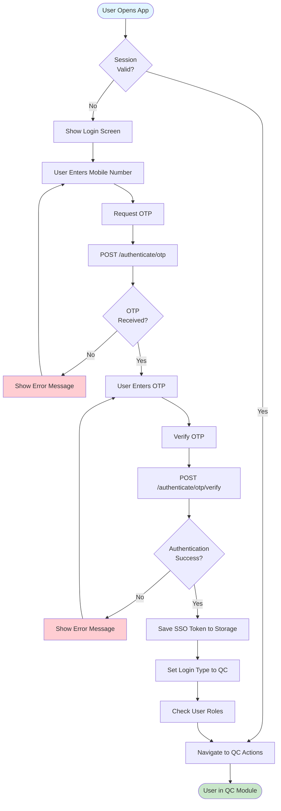

---

## 2. QC Actions Navigation Flow

```mermaid
flowchart TD
    Start([User Opens QC Actions]) --> LoadScreen[Load QC Action Screen]
    LoadScreen --> CheckPermissions[Check User Roles & Permissions]
    CheckPermissions --> DisplayActions[Display Available Actions]
    
    DisplayActions --> UserSelects{User Selects<br/>Action}
    
    UserSelects -->|Calculator| NavCalculator[Navigate to Calculator]
    UserSelects -->|Audit| NavAudit[Navigate to Audit]
    UserSelects -->|Store Out| NavStoreOut[Navigate to Store Out]
    UserSelects -->|Store In| NavStoreIn[Navigate to Store In]
    UserSelects -->|Stock Transfer| NavStockTransfer[Navigate to Stock Transfer]
    UserSelects -->|Data Wipe| NavDataWipe[Navigate to Data Wipe]
    UserSelects -->|Re-QC| NavReQC[Navigate to Re-QC]
    UserSelects -->|Pre-Dispatch| NavPreDispatch[Navigate to Pre-Dispatch]
    UserSelects -->|Dispatch| NavDispatch[Navigate to Dispatch]
    UserSelects -->|Dead Repair| NavDeadRepair[Navigate to Dead Repair]
    UserSelects -->|Supervisor| NavSupervisor[Navigate to Supervisor]
    UserSelects -->|Warehouse Audit| NavWarehouseAudit[Navigate to Warehouse Audit]
    UserSelects -->|D2C Video| NavD2C[Navigate to D2C Video]
    UserSelects -->|External Audit| NavExternalAudit[Navigate to External Audit]
    UserSelects -->|Guard| NavGuard[Navigate to Guard]
    UserSelects -->|IMEI Validator| NavIMEI[Navigate to IMEI Validator]
    UserSelects -->|Stock In| NavStockIn[Navigate to Stock In]
    UserSelects -->|Device Receive| NavDeviceReceive[Navigate to Device Receive]
    UserSelects -->|Device Details| NavDeviceDetails[Navigate to Device Details]
    
    NavCalculator --> End([Module Screen])
    NavAudit --> End
    NavStoreOut --> End
    NavStoreIn --> End
    NavStockTransfer --> End
    NavDataWipe --> End
    NavReQC --> End
    NavPreDispatch --> End
    NavDispatch --> End
    NavDeadRepair --> End
    NavSupervisor --> End
    NavWarehouseAudit --> End
    NavD2C --> End
    NavExternalAudit --> End
    NavGuard --> End
    NavIMEI --> End
    NavStockIn --> End
    NavDeviceReceive --> End
    NavDeviceDetails --> End
    
    style Start fill:#e1f5ff
    style End fill:#c8e6c9
```

---

## 3. Device Calculator Flow

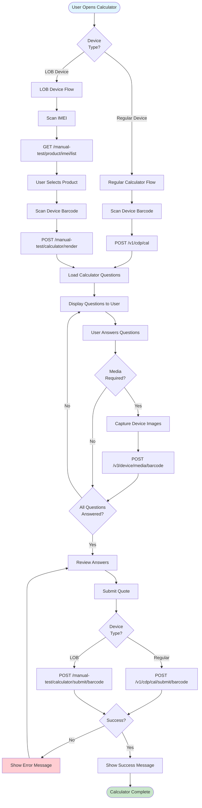

---

## 4. Device Audit Flow

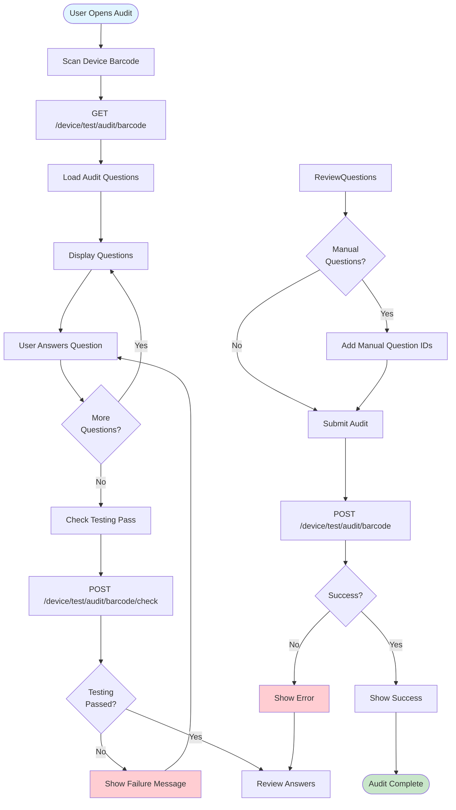

---

## 5. Store Out Flow

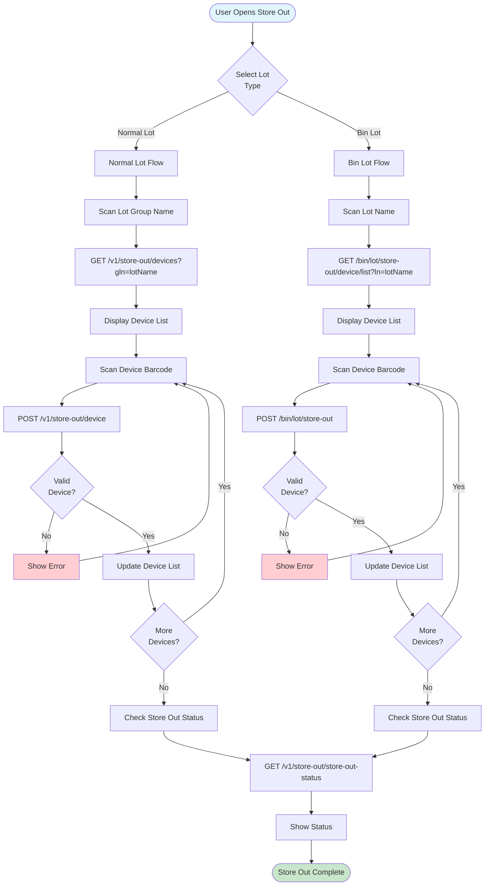

---

## 6. Store In Flow

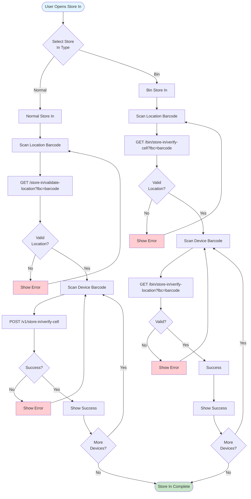

---

## 7. Stock Transfer Flow

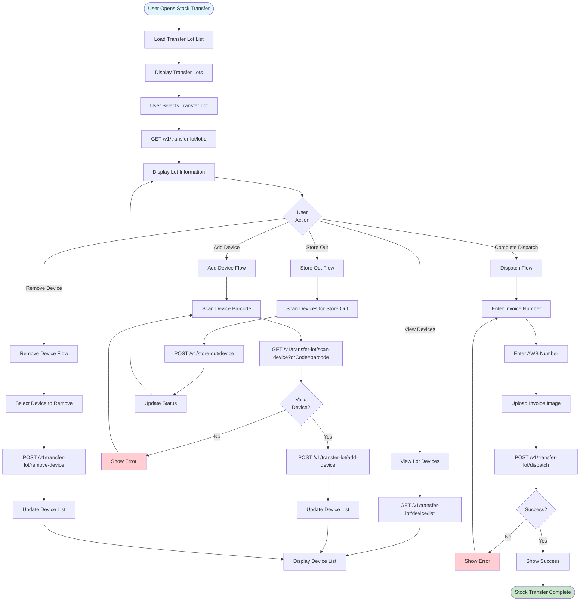

---

## 8. Pre-Dispatch Flow

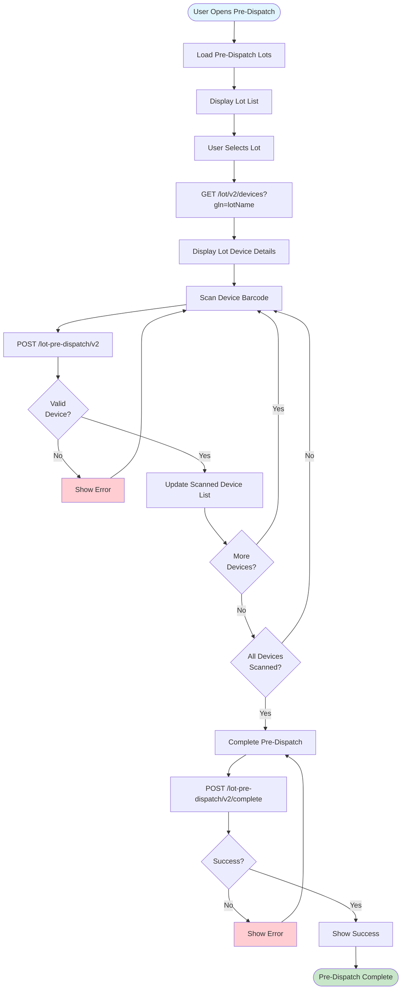

---

## 9. Dispatch Lot Flow

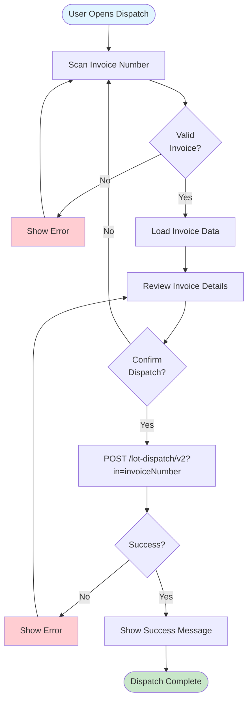

---

## 10. Data Wipe Flow

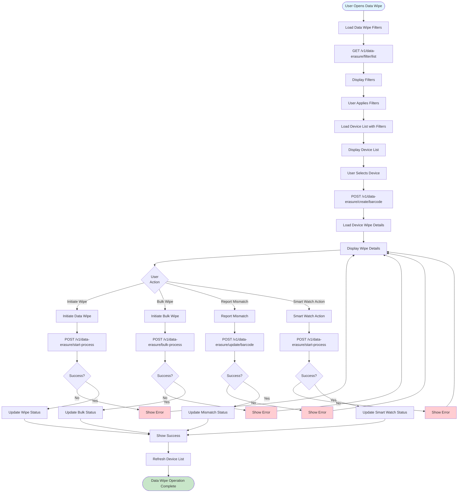

---

## 11. Re-QC Flow

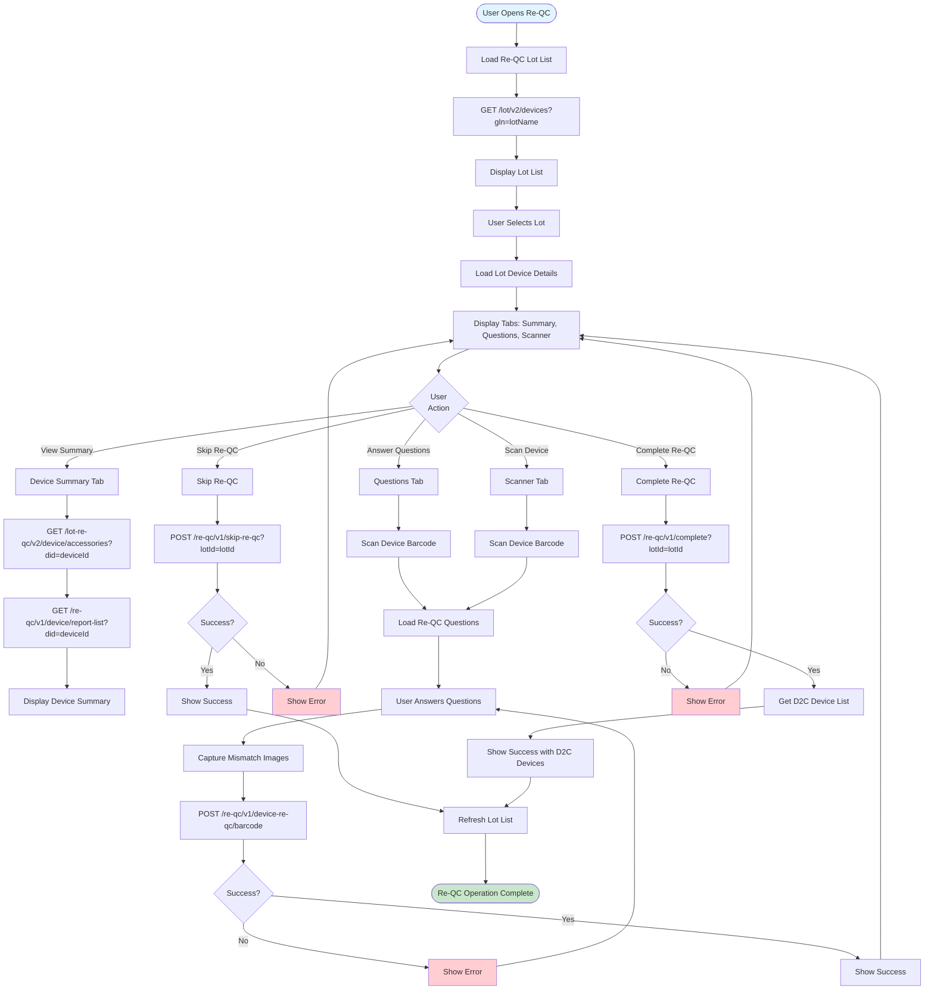

---

## 12. Dead Repair Flow

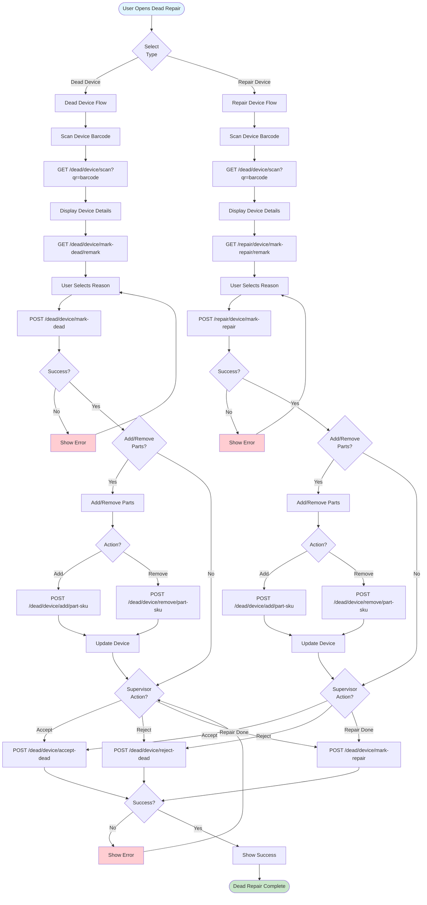

---

## 13. Supervisor Review Flow

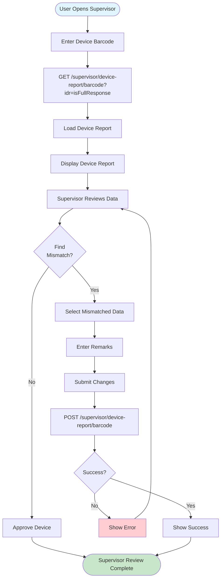

---

## 14. Warehouse Audit Flow

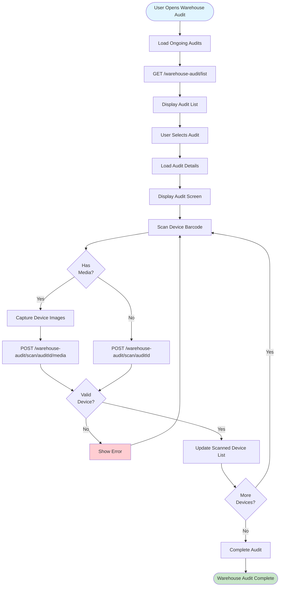

---

## 15. D2C Video Flow

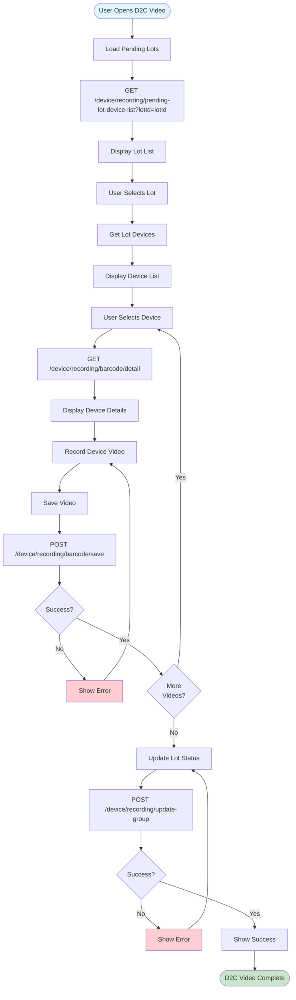

---

## 16. External Audit Flow

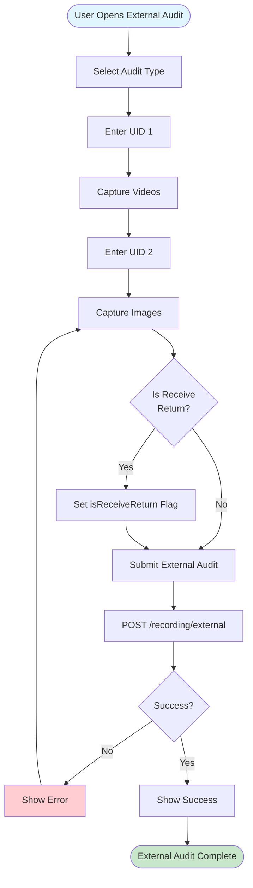

---

## 17. Guard Operations Flow

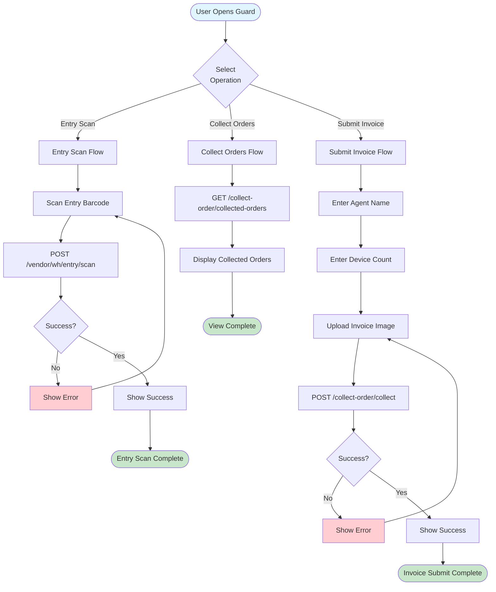

---

## 18. IMEI Validator Flow

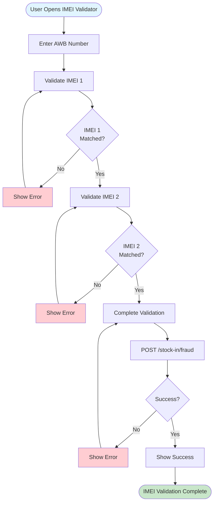

---

## 19. Stock In Flow

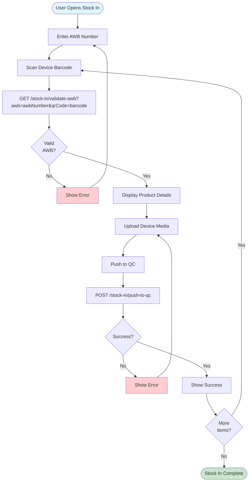

---

## 20. Device Receive Flow

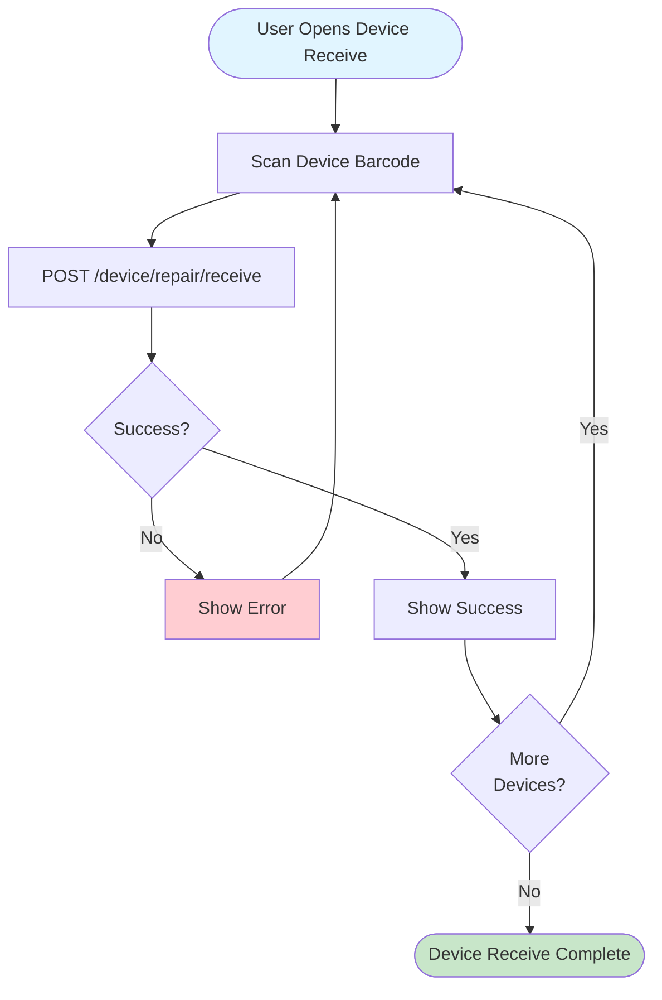

---

## 21. Device Details Flow

```mermaid
flowchart TD
    Start([User Opens Device Details]) --> EnterBarcode[Enter Device Barcode]
    EnterBarcode --> GetDetails[GET /device/detail?qrcode=barcode]
    GetDetails --> DisplayDetails[Display Device Details]
    
    DisplayDetails --> UserAction{User<br/>Action}
    
    UserAction -->|View Stock Movement| GetStockMovement[GET /device/stock-movement/barcode]
    UserAction -->|View Details| ViewDetails[View Device Details]
    
    GetStockMovement --> DisplayMovement[Display Stock Movement History]
    ViewDetails --> End1([View Complete])
    DisplayMovement --> End2([View Complete])
    
    style Start fill:#e1f5ff
    style End1 fill:#c8e6c9
    style End2 fill:#c8e6c9
```

---

## 22. State Management Flow

```mermaid
flowchart TD
    Start([User Action]) --> Widget[Widget Receives Action]
    Widget --> Provider[Provider Method Called]
    Provider --> UpdateLoading[Set Loading State]
    UpdateLoading --> NotifyListeners1[Notify Listeners]
    NotifyListeners1 --> RebuildUI1[Rebuild UI - Show Loading]
    
    RebuildUI1 --> ServiceCall[Service API Call]
    ServiceCall --> StreamResponse[Stream Response]
    
    StreamResponse --> Success{Success?}
    
    Success -->|Yes| UpdateData[Update Provider Data]
    Success -->|No| UpdateError[Update Error State]
    
    UpdateData --> NotifyListeners2[Notify Listeners]
    UpdateError --> NotifyListeners3[Notify Listeners]
    
    NotifyListeners2 --> RebuildUI2[Rebuild UI - Show Data]
    NotifyListeners3 --> RebuildUI3[Rebuild UI - Show Error]
    
    RebuildUI2 --> End1([State Updated])
    RebuildUI3 --> End2([Error Displayed])
    
    style Start fill:#e1f5ff
    style End1 fill:#c8e6c9
    style End2 fill:#ffcdd2
```

---

## 23. Error Handling Flow

```mermaid
flowchart TD
    Start([API Call]) --> Service[Service Method]
    Service --> Interceptor[Auth Header Interceptor]
    Interceptor --> NetworkCall[Network Request]
    
    NetworkCall --> Response{Response<br/>Received?}
    
    Response -->|No| NetworkError[Network Error]
    Response -->|Yes| CheckStatus{Status<br/>Code}
    
    NetworkError --> Retry{Retry<br/>Available?}
    Retry -->|Yes| NetworkCall
    Retry -->|No| ShowNetworkError[Show Network Error]
    
    CheckStatus -->|200-299| Success[Success Response]
    CheckStatus -->|400-499| ClientError[Client Error]
    CheckStatus -->|500-599| ServerError[Server Error]
    CheckStatus -->|401| SessionExpired[Session Expired]
    
    SessionExpired --> ClearStorage[Clear Storage]
    ClearStorage --> RedirectLogin[Redirect to Login]
    
    ClientError --> ParseError[Parse Error Message]
    ServerError --> ParseError
    ParseError --> ShowError[Show Error to User]
    
    Success --> ParseResponse[Parse Response]
    ParseResponse --> ReturnData[Return Data to Provider]
    
    ShowNetworkError --> End1([Error Handled])
    ShowError --> End1
    RedirectLogin --> End2([Session Expired])
    ReturnData --> End3([Success])
    
    style Start fill:#e1f5ff
    style End1 fill:#ffcdd2
    style End2 fill:#ff9800
    style End3 fill:#c8e6c9
```

---

## 24. Session Management Flow

```mermaid
flowchart TD
    Start([App Start]) --> CheckToken{Token<br/>Exists?}
    
    CheckToken -->|No| ShowLogin[Show Login Screen]
    CheckToken -->|Yes| ValidateToken[Validate Token]
    
    ValidateToken --> Valid{Token<br/>Valid?}
    
    Valid -->|No| ClearToken[Clear Token]
    ClearToken --> ShowLogin
    Valid -->|Yes| LoadApp[Load App]
    
    LoadApp --> APIRequest[API Request Made]
    APIRequest --> AddToken[Add Token to Header]
    AddToken --> SendRequest[Send Request]
    
    SendRequest --> Response{Response<br/>Status}
    
    Response -->|200-299| Success[Success - Continue]
    Response -->|401| SessionExpired[Session Expired]
    Response -->|Other| Error[Handle Error]
    
    SessionExpired --> ClearAllStorage[Clear All Storage]
    ClearAllStorage --> RedirectLogin[Redirect to Login]
    RedirectLogin --> ShowLogin
    
    Success --> Continue[Continue Operation]
    Error --> ShowError[Show Error]
    
    ShowLogin --> End1([Login Required])
    Continue --> End2([Operation Continue])
    ShowError --> End3([Error Handled])
    
    style Start fill:#e1f5ff
    style End1 fill:#ff9800
    style End2 fill:#c8e6c9
    style End3 fill:#ffcdd2
```

---

## Summary

This document provides comprehensive flow diagrams for all QC module operations. Each diagram shows:

- **Entry Points**: Where the flow starts
- **Decision Points**: User choices and system validations
- **API Calls**: Backend interactions
- **Error Handling**: Error scenarios and recovery
- **Success Paths**: Successful completion flows

All diagrams use Mermaid syntax and can be rendered in any Markdown viewer that supports Mermaid diagrams.

---

*End of Flow Diagrams*

