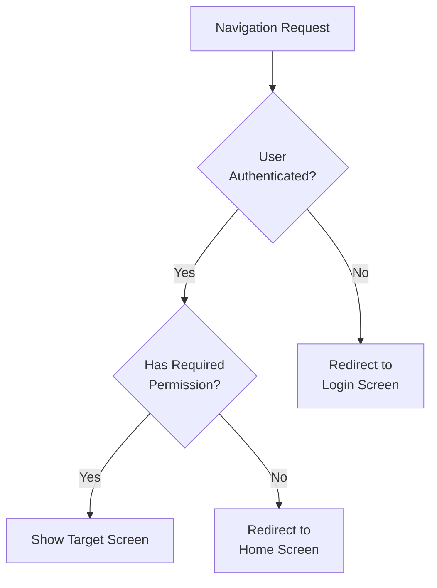
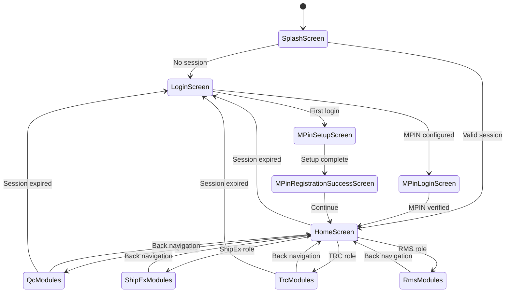

<!-- Document Information -->
<!-- Generated: 2026-02-18 -->
<!-- Version: 6.0.0+83 -->
<!-- Commit: 9ea0c658 -->

# Routing Reference

## Table of Contents

- [Overview](#overview)
- [Navigation Model](#navigation-model)
- [Navigator Observers](#navigator-observers)
- [Route Guard Flow](#route-guard-flow)
- [Navigation State Transitions](#navigation-state-transitions)
- [Redirect Scenarios](#redirect-scenarios)
- [Route Files](#route-files)
- [QC Routes](#qc-routes)
- [TRC Routes](#trc-routes)
- [ShipEx Routes](#shipex-routes)
- [RMS Routes](#rms-routes)
- [Related Documents](#related-documents)

## Overview

Flutter TRC uses **named routes** via `BuilderApp` from the `builder_project` shared package. Routes are defined in separate route files per domain and combined in the root widget `CashifyApp` (`lib/src/app.dart`). Navigation is primarily triggered via direct `Navigator.pushNamed()` calls rather than an action dispatch system.

## Navigation Model

| Concept | Description |
|---------|-------------|
| Routing approach | Named routes via `BuilderApp` from `builder_project` |
| Screen registration | Route maps returned by `TrcRoutes.getRoutes()`, `QcRoutes.getQcRoutes()`, `ShipexRoutes.getRoutes()`, `RmsRoutes.getRoutes()` |
| Navigation trigger | Direct `Navigator.pushNamed(context, route)` calls from providers and widgets |
| Initial route | `SplashScreen.route` |
| Unknown route | Handled by `BuilderApp` default behavior |
| Session handling | `SessionExpiredCallback` triggers navigation to login on expiry |
| Alert handling | `CashifyAlertHandler` for app-wide alert modals |

## Navigator Observers

| Observer | File | Purpose |
|----------|------|---------|
| CshRouteObserver | `lib/src/utils/csh_route_observer.dart` | Custom route observation for analytics and lifecycle tracking |
| FirebaseAnalyticsObserver | Firebase Analytics package | Automatic screen view tracking for Firebase Analytics |

## Route Guard Flow

## Navigation State Transitions

## Redirect Scenarios

| Scenario | Trigger | Result |
|----------|---------|--------|
| Session expired | `AuthHeaderInterceptor` detects `USER_SESSION_EXPIRE` | Clear session, navigate to Login |
| No authentication | App launch without stored session | Navigate to Login via Splash |
| MPIN not configured | First login detected | Navigate to MPIN Setup |
| MPIN configured | Subsequent login | Navigate to MPIN Login |
| Logout | User taps logout | Clear session, navigate to Login |
| Permission denied | Missing role permission | Feature hidden or Home redirect |

## Route Files

| Domain | Route File | Method | Route Count |
|--------|-----------|--------|-------------|
| QC | `lib/qc/qc_routes.dart` | `QcRoutes.getQcRoutes()` | 60+ |
| TRC | `lib/src/modules/` (per module) | `TrcRoutes.getRoutes()` | 30+ |
| ShipEx | `lib/shipex/` | `ShipexRoutes.getRoutes()` | 10+ |
| RMS | `lib/rms/` | `RmsRoutes.getRoutes()` | 5+ |

## QC Routes

Routes defined in `lib/qc/qc_routes.dart`:

| Route Constant | Screen Class | Module |
|---------------|-------------|--------|
| `QcTesterHomeScreen.route` | QcTesterHomeScreen | qc_tester/home |
| `CalculatorScannerScreen.route` | CalculatorScannerScreen | qc_tester/calculator |
| `CalculationScreen.route` | CalculationScreen | qc_tester/calculator |
| `DisputedQuestionsScreen.route` | DisputedQuestionsScreen | qc_tester/calculator |
| `SubmitDeviceQuoteScreen.route` | SubmitDeviceQuoteScreen | qc_tester/calculator |
| `CalculatorMediaCaptureScreen.route` | CalculatorMediaCaptureScreen | qc_tester/calculator_media_capture |
| `AuditQuestionScreen.route` | AuditQuestionScreen | qc_tester/audit |
| `AuditQuestionSummaryScreen.route` | AuditQuestionSummaryScreen | qc_tester/audit |
| `DisputedImageCaptureScreen.route` | DisputedImageCaptureScreen | qc_tester/disputed_image_capture |
| `DisputedImageCaptureBarcodeScannerScreen.route` | DisputedImageCaptureBarcodeScannerScreen | qc_tester/disputed_image_capture |
| `LobDeviceScannerScreen.route` | LobDeviceScannerScreen | qc_tester/lob_devices |
| `ProductListScreen.route` | ProductListScreen | qc_tester/lob_devices |
| `ColorSelectionScreen.route` | ColorSelectionScreen | qc_tester/lob_devices |
| `VariantListScreen.route` | VariantListScreen | qc_tester/lob_devices |
| `DeviceReceiveScreen.route` | DeviceReceiveScreen | device_receive_module |
| `DeviceDetailsScreen.route` | DeviceDetailsScreen | device_details |
| `DeviceDeadRepairScreen.route` | DeviceDeadRepairScreen | dead_repair |
| `ReasonSelectionScreen.route` | ReasonSelectionScreen | dead_repair |
| `DeviceDeadAcceptRejectScreen.route` | DeviceDeadAcceptRejectScreen | dead_repair |
| `PreDispatchScreen.route` | PreDispatchScreen | pre_dispatch |
| `PreDispatchLotScreen.route` | PreDispatchLotScreen | pre_dispatch |
| `DispatchLotScreen.route` | DispatchLotScreen | dispatch_lot |
| `InvoiceScanScreen.route` | InvoiceScanScreen | dispatch_lot |
| `StoreInLocationScanScreen.route` | StoreInLocationScanScreen | store_in |
| `StoreOutScreen.route` | StoreOutScreen | store_out |
| `LotItemsScanScreen.route` | LotItemsScanScreen | store_out |
| `StockTransferListScreen.route` | StockTransferListScreen | stock_transfer |
| `StStoreOutScreen.route` | StStoreOutScreen | stock_transfer |
| `PendingLotDetailScreen.route` | PendingLotDetailScreen | stock_transfer |
| `PendingDispatchDetailScreen.route` | PendingDispatchDetailScreen | stock_transfer |
| `StorageDeviceListScreen.route` | StorageDeviceListScreen | stock_transfer |
| `DataWipeHomeScreen.route` | DataWipeHomeScreen | data_wipe |
| `DataWipeListScreen.route` | DataWipeListScreen | data_wipe |
| `DataWipeDetailScreen.route` | DataWipeDetailScreen | data_wipe |
| `ReQcListScreen.route` | ReQcListScreen | re_qc |
| `ReQcDetailScreen.route` | ReQcDetailScreen | re_qc |
| `OnGoingAuditScreen.route` | OnGoingAuditScreen | warehouse_audit |
| `WarehouseAuditPerformScreen.route` | WarehouseAuditPerformScreen | warehouse_audit |
| `ExternalAuditHomeScreen.route` | ExternalAuditHomeScreen | external_audit |
| `ExternalAuditPerformScreen.route` | ExternalAuditPerformScreen | external_audit |
| `QcGuardHomeScreen.route` | QcGuardHomeScreen | gaurd |
| `GuardDeviceCountingListScreen.route` | GuardDeviceCountingListScreen | gaurd |
| `GuardUploadInvoiceScreen.route` | GuardUploadInvoiceScreen | gaurd |
| `QcGuardAddAgentScreen.route` | QcGuardAddAgentScreen | gaurd |
| `ImeiValidatorScreen.route` | ImeiValidatorScreen | imei_validator |
| `QcActionScreen.route` | QcActionScreen | qc_actions |
| `SupervisorScreen.route` | SupervisorScreen | supervisor |
| `SupervisorSearchScreen.route` | SupervisorSearchScreen | supervisor |
| `SearchItemScreen.route` | SearchItemScreen | stock_in_module |
| `StockInProductDetailScreen.route` | StockInProductDetailScreen | stock_in_module |
| `MediaFileUploadScreen.route` | MediaFileUploadScreen | stock_in_module |
| `D2cVideoHomeScreen.route` | D2cVideoHomeScreen | d2c_video |
| `D2cLotListingScreen.route` | D2cLotListingScreen | d2c_video |
| `D2cLotDeviceListingScreen.route` | D2cLotDeviceListingScreen | d2c_video |
| `D2cVideoScreen.route` | D2cVideoScreen | d2c_video |

## TRC Routes

Routes from `TrcRoutes.getRoutes()` covering TRC domain modules:

| Route Constant | Screen Class | Module |
|---------------|-------------|--------|
| `SplashScreen.route` | SplashScreen | — (initial) |
| `LoginScreen.route` | LoginScreen | login |
| `MPinLoginScreen.route` | MPinLoginScreen | login/mpin |
| `MPinSetupScreen.route` | MPinSetupScreen | login/mpin |
| `HomeScreen.route` | HomeScreen | home |
| `UserProfileScreen.route` | UserProfileScreen | common/user |
| Engineer module routes | Various | engineer |
| Inventory manager routes | Various | inventory_manager |
| TRC executive routes | Various | trc_executive |
| Part QC routes | Various | part_qc |
| Rider routes | Various | rider |
| ELSS routes | Various | elss |
| Rubbing routes | Various | rubbing |

## ShipEx Routes

| Route Constant | Screen Class | Module |
|---------------|-------------|--------|
| `ShipexHomeScreen.route` | ShipexHomeScreen | shipex_home |
| `CreateShipmentScreen.route` | CreateShipmentScreen | create_shipment |
| `PackagingScreen.route` | PackagingScreen | packaging |
| `ShipexDispatchScreen.route` | ShipexDispatchScreen | dispatch |
| `PendingDispatchScreen.route` | PendingDispatchScreen | pending_dispatch |

## RMS Routes

| Route Constant | Screen Class | Module |
|---------------|-------------|--------|
| `RmsHomeScreen.route` | RmsHomeScreen | home |
| `FacilityListScreen.route` | FacilityListScreen | facility_list |
| `ReceiveDeviceScreen.route` | ReceiveDeviceScreen | receive_device |

## Related Documents

- [Architecture](./Architecture.md) — Navigation architecture
- [Security](./Security.md) — Session expiry and auth redirect
- [Module Reference](./Module%20Reference.md) — Screen-to-module mapping
