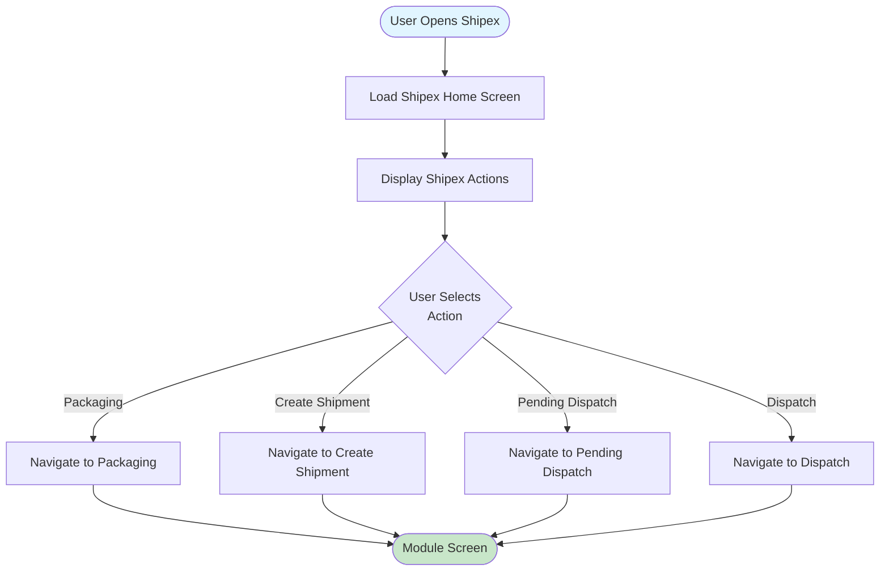
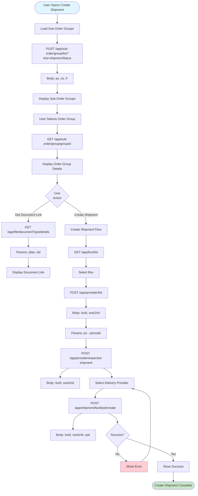
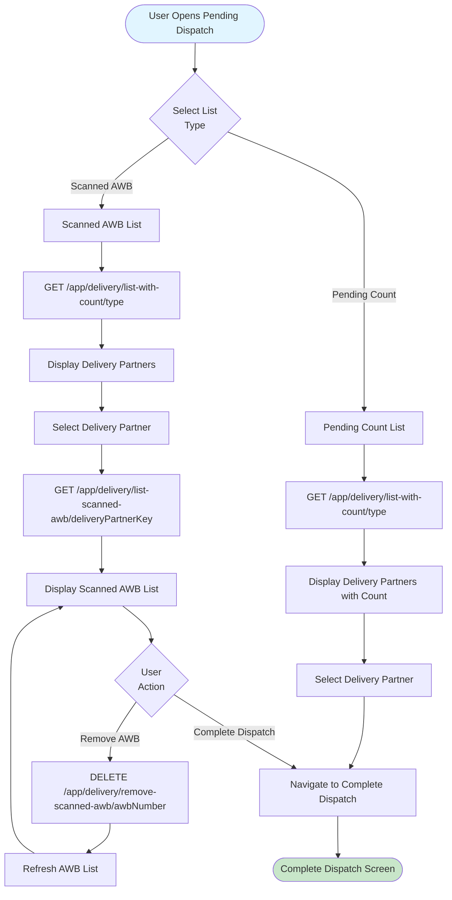
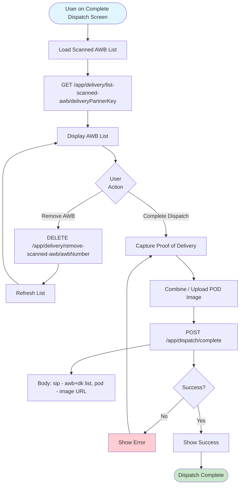
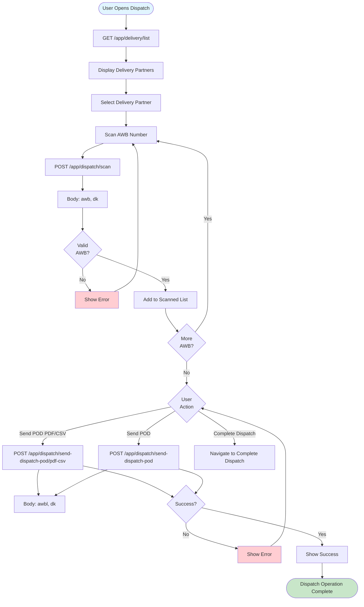
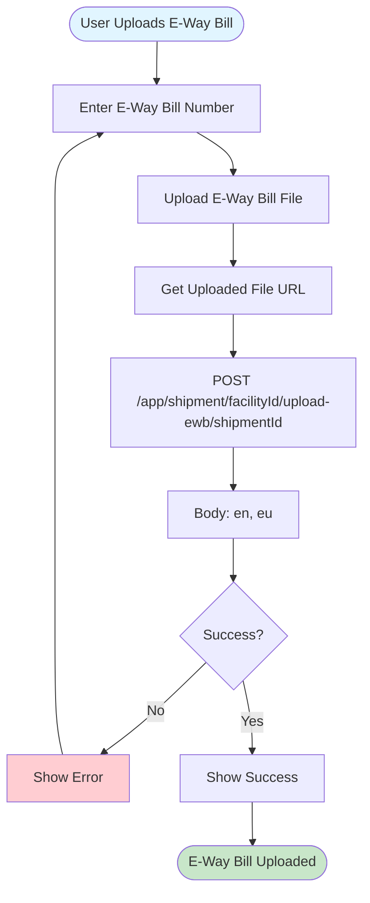
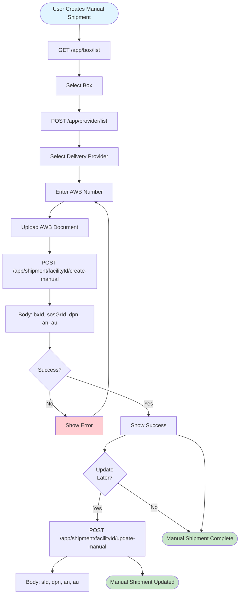
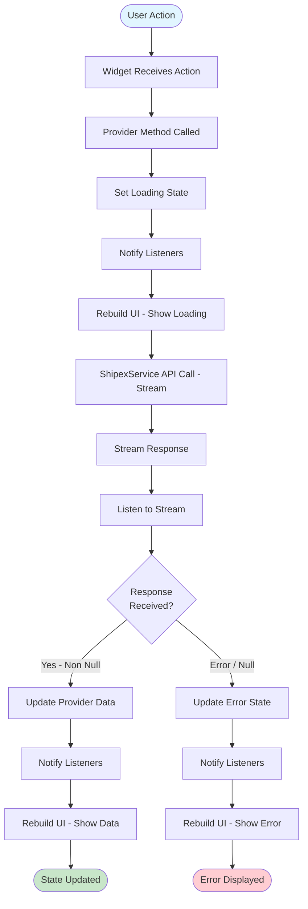
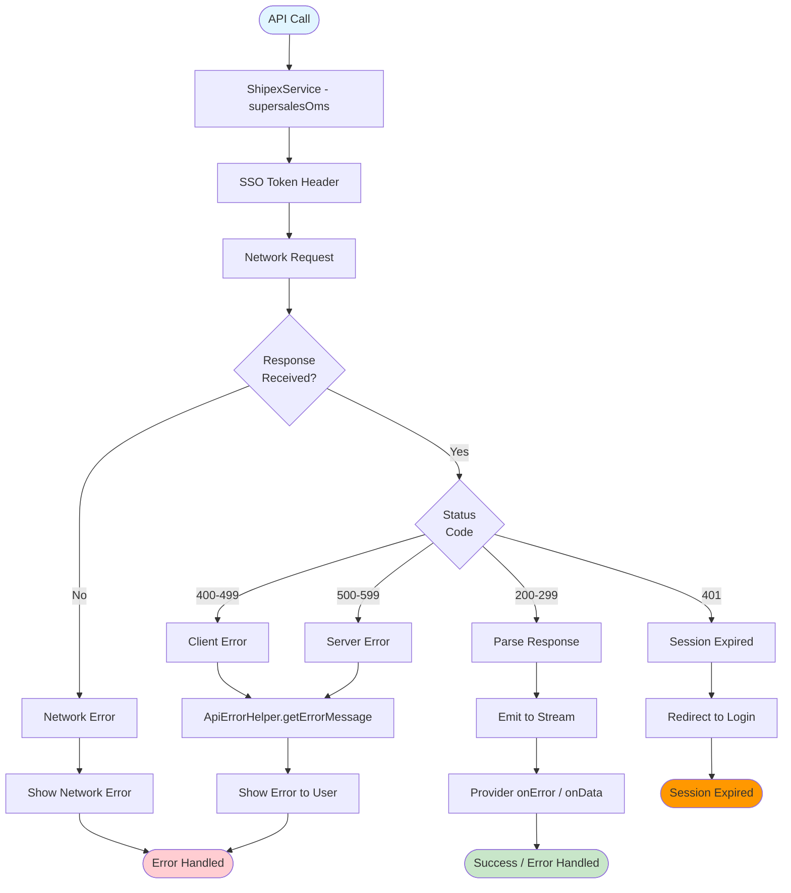

# Shipex Module Flow Diagrams

This document contains flow diagrams for all Shipex module operations using Mermaid syntax.

## Table of Contents

1. [Shipex Home & Navigation Flow](#1-shipex-home--navigation-flow)
2. [Packaging Flow](#2-packaging-flow)
3. [Create Shipment Flow](#3-create-shipment-flow)
4. [Pending Dispatch Flow](#4-pending-dispatch-flow)
5. [Complete Dispatch Flow](#5-complete-dispatch-flow)
6. [Dispatch (AWB Scan) Flow](#6-dispatch-awb-scan-flow)
7. [Upload E-Way Bill Flow](#7-upload-e-way-bill-flow)
8. [Manual Shipment Flow](#8-manual-shipment-flow)
9. [State Management Flow](#9-state-management-flow)
10. [Error Handling Flow](#10-error-handling-flow)

---

## 1. Shipex Home & Navigation Flow

---

## 2. Packaging Flow

```mermaid
flowchart TD
    Start([User Opens Packaging]) --> LoadGroupList[Load Group Lot List]
    LoadGroupList --> PostGroupList[POST /app/packaging/group/list]
    PostGroupList --> Body1[Body: os, ps, fr]
    Body1 --> DisplayGroups[Display Group Lots]
    
    DisplayGroups --> SelectGroup[User Selects Group Lot]
    SelectGroup --> GetSubOrders[GET /app/packaging/group/sub-orders/lotId]
    GetSubOrders --> DisplaySubOrders[Display Sub-Orders]
    
    DisplaySubOrders --> AssignBarcode{Assign<br/>Packaging Barcode?}
    AssignBarcode -->|Yes| ScanInvoiceBarcode[Scan Invoice Barcode]
    ScanInvoiceBarcode --> ScanPackagingBarcode[Scan Packaging Barcode]
    ScanPackagingBarcode --> AssignAPI[POST /app/packaging/v1/group/assign/packaging-barcode]
    AssignAPI --> Body2[Body: bar, lis]
    Body2 --> GetSubOrderItems[GET /app/packaging/group/sub-orders/items/lotId]
    AssignBarcode -->|No| GetSubOrderItems
    
    GetSubOrderItems --> DisplayItems[Display Sub-Order Items]
    DisplayItems --> StartPackaging[Start Packaging]
    StartPackaging --> ScanDevice[Scan Device Barcode]
    ScanDevice --> StartAPI[POST /app/packaging/start/packaging]
    StartAPI --> Body3[Body: bar, lis, qr_code]
    
    StartAPI --> MoreDevices{More<br/>Devices?}
    MoreDevices -->|Yes| ScanDevice
    MoreDevices -->|No| FinishItem[Finish Item Packaging]
    
    FinishItem --> FinishItemAPI[POST /app/packaging/finish/item/packaging]
    FinishItemAPI --> Body4[Body: bar, qr_code]
    FinishItemAPI --> AllItemsFinished{All Items<br/>Finished?}
    AllItemsFinished -->|No| ScanDevice
    AllItemsFinished -->|Yes| AddCamera{Add Monitoring<br/>Camera?}
    
    AddCamera -->|Yes| ScanCameraBarcode[Scan Camera Barcode]
    ScanCameraBarcode --> AddCameraAPI[POST /app/packaging/add-monitoring-camera-barcode]
    AddCamera -->|No| FinishPackaging[Finish Packaging]
    AddCameraAPI --> FinishPackaging
    
    FinishPackaging --> RecordVideo[Record Packaging Video]
    RecordVideo --> FinishPackagingAPI[POST /app/packaging/finish/packaging]
    FinishPackagingAPI --> Body5[Body: bar, v_url]
    FinishPackagingAPI --> Success{Success?}
    
    Success -->|No| ShowError[Show Error]
    ShowError --> FinishPackaging
    Success -->|Yes| ShowSuccess[Show Success]
    ShowSuccess --> End([Packaging Complete])
    
    style Start fill:#e1f5ff
    style End fill:#c8e6c9
    style ShowError fill:#ffcdd2
```

---

## 3. Create Shipment Flow

---

## 4. Pending Dispatch Flow

---

## 5. Complete Dispatch Flow

---

## 6. Dispatch (AWB Scan) Flow

---

## 7. Upload E-Way Bill Flow

---

## 8. Manual Shipment Flow

---

## 9. State Management Flow

---

## 10. Error Handling Flow

---

## Summary

This document provides flow diagrams for all Shipex module operations. Each diagram shows:

- **Entry Points**: Where the flow starts
- **Decision Points**: User choices and validations
- **API Calls**: Backend interactions via `ShipexService` (TRCServiceGroups.supersalesOms)
- **Error Handling**: Stream `onError`, `ApiErrorHelper.getErrorMessage`
- **Success Paths**: Non-null response = success

### Key Shipex Modules

| Module | Location | Key Service |
|--------|----------|-------------|
| Packaging | `modules/packaging` | PackingService |
| Create Shipment | `modules/create_shipment` | CreateShipmentService |
| Pending Dispatch | `modules/pending_dispatch` | PendingDispatchService |
| Dispatch | `modules/dispatch` | DispatchService |
| Shipex Home | `modules/shipex_home` | Navigation entry |

All diagrams use Mermaid syntax and can be rendered in any Markdown viewer that supports Mermaid.

---

*End of Shipex Module Flow Diagrams*
