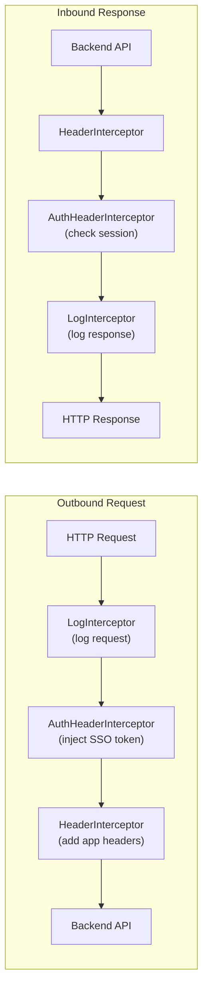
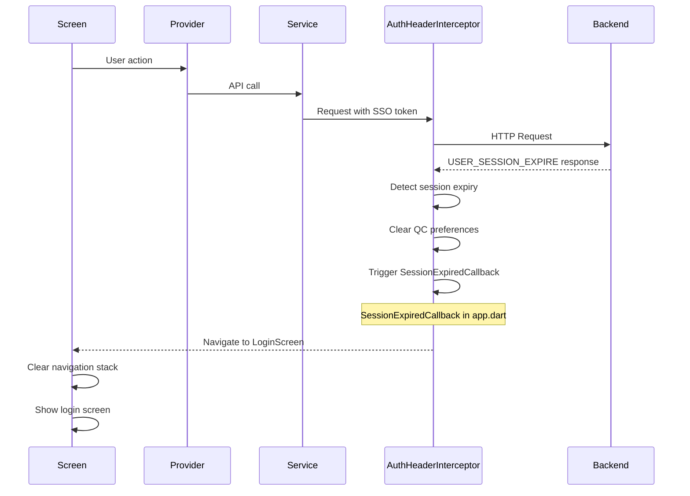
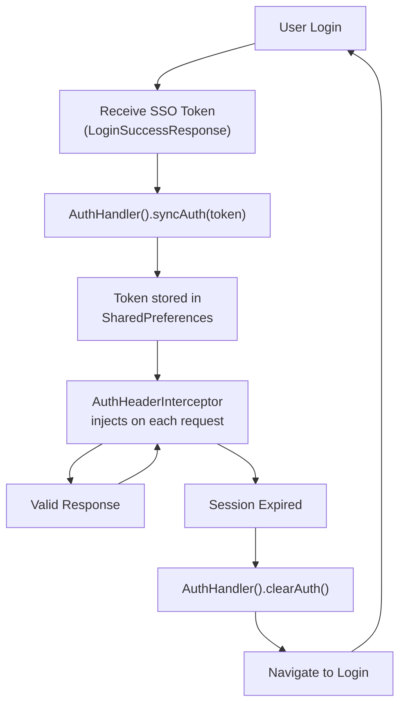
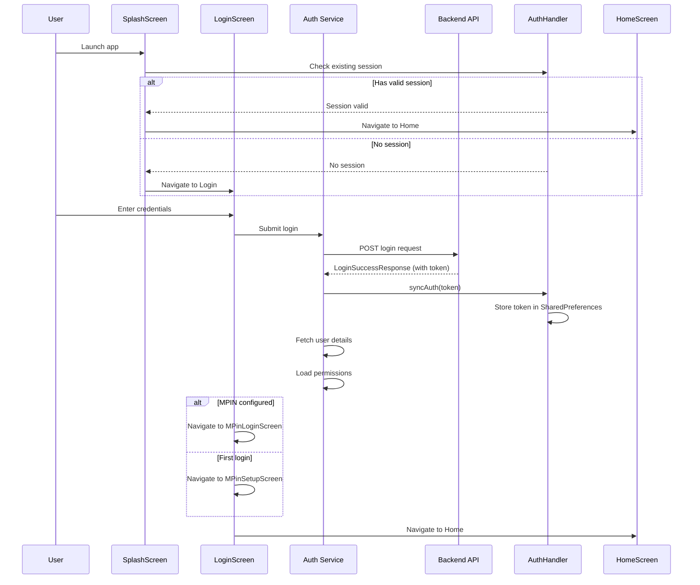

<!-- Document Information -->
<!-- Generated: 2026-02-18 -->
<!-- Version: 6.0.0+83 -->
<!-- Commit: 9ea0c658 -->

# Security

## Table of Contents

- [Overview](#overview)
- [Interceptor Pipeline](#interceptor-pipeline)
- [Per Interceptor Detail](#per-interceptor-detail)
- [Session Expiry Flow](#session-expiry-flow)
- [Token Storage and Management](#token-storage-and-management)
- [Authentication Flow](#authentication-flow)
- [MPIN Authentication](#mpin-authentication)
- [Biometric Authentication](#biometric-authentication)
- [Permission System](#permission-system)
- [Related Documents](#related-documents)

## Overview

Flutter TRC implements a multi-layered security model:
- **SSO Token Authentication** via `AuthHandler` from `core_widgets`
- **Interceptor Pipeline** for automatic token injection and session management
- **MPIN** as a secondary authentication layer
- **Biometric Authentication** via `local_auth` for device-level security
- **Role-Based Permissions** with separate TRC and QC permission systems
- **Session Expiry Handling** with automatic logout and redirect

## Interceptor Pipeline

### Interceptor Chain

| Order | Interceptor | File | Condition | Behavior |
|-------|------------|------|-----------|----------|
| 1 | LogInterceptor | `lib/src/interceptors/log_interceptor.dart` | Non-web AND Alice enabled | Logs HTTP request/response to Alice inspector |
| 2 | AuthHeaderInterceptor | `lib/src/interceptors/auth/auth_header_interceptor.dart` | Always active | SSO token injection, session expiry detection, retry on auth failure |
| 3 | HeaderInterceptor | `lib/src/interceptors/header/header_interceptor.dart` | Always active (when serviceGroup set) | Injects X_APP_OS, X_APP_LANGUAGE, X_APP_VERSION |

### Pipeline Diagram



## Per Interceptor Detail

### 1. LogInterceptor

| Property | Value |
|----------|-------|
| File | `lib/src/interceptors/log_interceptor.dart` |
| Trigger | Non-web platform AND Alice debugging enabled |
| Purpose | HTTP request/response logging for debugging |
| Behavior | Logs full request/response details to Alice HTTP inspector |
| Error Handling | Passes through errors unchanged |
| Production | Disabled (Alice is not enabled in production) |

### 2. AuthHeaderInterceptor

| Property | Value |
|----------|-------|
| File | `lib/src/interceptors/auth/auth_header_interceptor.dart` |
| Extends | `HttpRetryWhenInterceptor` (from core_widgets) |
| Trigger | Always active |
| Purpose | SSO token injection and session expiry handling |
| Token Source | `AuthHandler().userAuth` |
| Header Key | `CoreHeaders.xSSOTokenKey` / `AppHeaders.X_USER_AUTH_KEY` |
| Session Expiry Code | `ApiErrorCodes.USER_SESSION_EXPIRE` |
| Retry Count | 1 retry on auth failure |
| Expiry Action | Clears preferences, triggers `SessionExpiredCallback` |

**Behavior:**
1. On outbound request: Reads SSO token from `AuthHandler().userAuth` and injects it as `CoreHeaders.xSSOToken` header
2. On response: Checks for `USER_SESSION_EXPIRE` status code
3. On session expiry: Clears QC preferences, triggers session expired callback, navigates to login
4. On auth retry: Attempts one retry with refreshed token before failing

### 3. HeaderInterceptor

| Property | Value |
|----------|-------|
| File | `lib/src/interceptors/header/header_interceptor.dart` |
| Trigger | Always active (when `serviceGroup` is set on the request) |
| Purpose | Common app metadata headers |
| Headers Added | `X_APP_OS` (device OS), `X_APP_LANGUAGE` (current locale), `X_APP_VERSION` (app version) |
| Error Handling | Passes through errors unchanged |

## Session Expiry Flow



## Token Storage and Management

| Aspect | Implementation |
|--------|---------------|
| Token Type | SSO Token |
| Storage | SharedPreferences via `AuthHandler` (from `core_widgets`) |
| Injection | Automatic via `AuthHeaderInterceptor` |
| Retrieval | `AuthHandler().userAuth` |
| Sync | `AuthHandler().syncAuth()` after login |
| Clearing | `AuthHandler().clearAuth()` on logout/expiry |
| Header Format | `CoreHeaders.xSSOToken` map with token value |

### Token Lifecycle



## Authentication Flow



## MPIN Authentication

| Aspect | Implementation |
|--------|---------------|
| Service | `MPinService` (`lib/src/common/mpin/mpin_service.dart`) |
| Provider | `MPinSetupProvider` (`lib/src/common/mpin/providers/mpin_setup_provider.dart`) |
| Controller | `MPinController` (`lib/src/common/mpin/mpin_controller.dart`) |
| Screens | `MPinLoginScreen`, `MPinSetupScreen`, `MPinRegistrationSuccessfulScreen` |
| Storage | Backend-verified; local state managed by `MPinController` |

**MPIN Flow:**
1. After SSO login, app checks if MPIN is configured
2. If not configured: Navigate to `MPinSetupScreen` for setup
3. If configured: Navigate to `MPinLoginScreen` for verification
4. MPIN verified against backend service
5. On success: Proceed to home screen

## Biometric Authentication

| Aspect | Implementation |
|--------|---------------|
| Package | `local_auth: ^2.3.0` |
| Usage | Device-level biometric verification |
| Integration | Available as alternative to MPIN |

## Permission System

### TRC Permissions

Defined in `lib/trc/my_permissions/permissions.dart`:

| Permission Key | Permission Values | Role |
|---------------|------------------|------|
| engineer | `["app_engineer"]` | TRC Engineer |
| inventory | `["app_inventory"]` | Inventory Manager |
| executive | `["app_executive"]` | TRC Executive |
| l4Engineer | `["app_l4_engineer"]` | L4 Engineer |
| auditor | `["app_auditor"]` | Auditor |
| tester | `["app_tester"]` | Tester |
| partQc | `["app_part_qc"]` | Part QC |
| storeManager | `["app_store_manager"]` | Store Manager |
| rider | `["app_rider"]` | Rider |
| rubbing | `["app_rubbing"]` | Rubbing |
| glassChange | `["app_glass_change"]` | Glass Change |
| elss | `["app_elss"]` | ELSS |

**Module:** `"trc-console"`

**Widget:** `TRCRolePermissionWidget` (`lib/trc/my_permissions/widget/trc_role_permission_widget.dart`)
- Wraps child widgets based on permission check
- Uses `PermissionController().hasPermission(permission)` from `core_widgets`
- Returns `SizedBox.shrink()` if user lacks permission

### QC Permissions

Defined in `lib/qc/qc_role_permission/qc_role_permission_helper.dart`:

| QC Role | Description |
|---------|-------------|
| ROLE_STORE_IN | Store inward operations |
| ROLE_STORE_OUT | Store outward operations |
| ROLE_DISPATCH | Dispatch operations |
| ROLE_AUDIT | Audit operations |
| ROLE_PRODUCT_DISCOVERY | Product discovery |
| ROLE_STOCK_TRANSFER | Stock transfer |
| ROLE_SEMI_TESTING | Semi testing |
| ROLE_TESTING | Full testing |
| ROLE_CENTRALISED_AUDIT | Centralized audit |
| ROLE_MANUAL_TESTING | Manual testing |
| ROLE_LOT_RE_QUOTE | Lot re-quote |
| ROLE_DEAD_DEVICE | Dead device handling |
| ROLE_GUARD | Guard operations |
| QC_ELSS | QC ELSS operations |
| ROLE_VIDEOGRAPHER | Video recording |
| SUPERVISOR_ROLE | Supervisor operations |

**Widget:** `QcRolePermissionWidget` (`lib/qc/qc_role_permission/widget/qc_role_permission_widget.dart`)

### Permission Checking

```dart
// TRC Permission check
PermissionController().hasPermission(TrcPermissions.engineer)

// Widget-level permission guard
TRCRolePermissionWidget(
  permission: TrcPermissions.engineer,
  child: EngineerFeatureWidget(),
)
```

## Related Documents

- [Configuration](./Configuration.md) — Environment and auth config
- [Error Handling](./Error%20Handling.md) — Session expiry error handling
- [Api Services](./Api%20Services.md) — Interceptor chain in API context
- [Permissions](./Permissions.md) — Detailed permissions documentation
