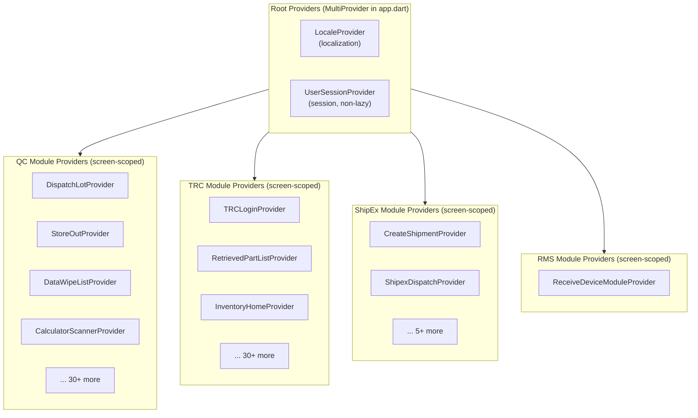
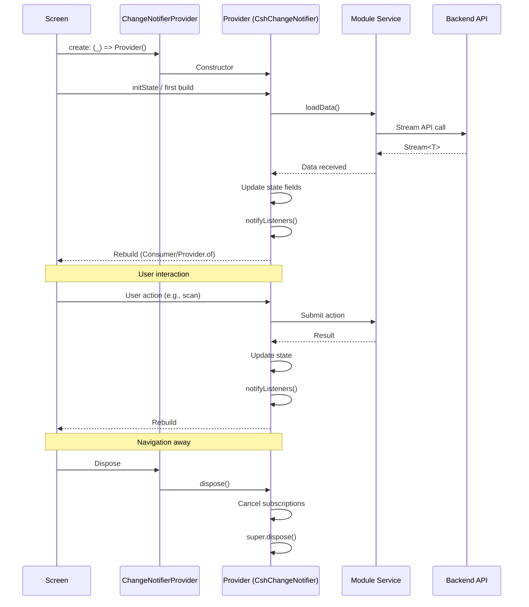

<!-- Document Information -->
<!-- Generated: 2026-02-18 -->
<!-- Version: 6.0.0+83 -->
<!-- Commit: 9ea0c658 -->

# State Management

## Table of Contents

- [Overview](#overview)
- [Provider Architecture](#provider-architecture)
- [Root Level Providers](#root-level-providers)
- [Module Level Providers](#module-level-providers)
- [Provider Pattern](#provider-pattern)
- [Provider Mixins](#provider-mixins)
- [Abstract Base Providers](#abstract-base-providers)
- [Global vs Local State](#global-vs-local-state)
- [Provider Lifecycle](#provider-lifecycle)
- [State Persistence](#state-persistence)
- [Async and Lifecycle Rules](#async-and-lifecycle-rules)
- [Related Documents](#related-documents)

## Overview

Flutter TRC uses **Provider** with **CshChangeNotifier** as the base class for all providers. `CshChangeNotifier` (from `core_widgets` package) extends Flutter's `ChangeNotifier` with lifecycle guards and error handling. Providers follow a consistent pattern with a static `of()` method for access, screen-scoped instantiation via `ChangeNotifierProvider`, and Stream-based API integration.

**Key stats:**
- Root-level providers: 2
- Module-level providers: 105+
- Base class: `CshChangeNotifier` (from `package:core_widgets/core_widgets.dart`)
- Common mixin: `Searchable` (for list/search functionality)
- Access pattern: Static `ProviderName.of(context)` method

## Provider Architecture



## Root Level Providers

Declared in `lib/src/app.dart` via `MultiProvider`:

| Provider Class | File | Purpose | Lazy |
|---------------|------|---------|------|
| LocaleProvider | `package:localization/localization/locale_provider.dart` | Language/locale management | Yes (default) |
| UserSessionProvider | `lib/src/modules/elss/common_providers/user_session_provider.dart` | User session state management | No (`lazy: false`) |

```dart
MultiProvider(
  providers: [
    ChangeNotifierProvider(create: (_) => LocaleProvider()),
    ChangeNotifierProvider(create: (_) => UserSessionProvider(), lazy: false),
  ],
  child: BuilderApp(...),
)
```

## Module Level Providers

### QC Module Providers

| Provider Class | Module | File |
|---------------|--------|------|
| D2CVideoProvider | d2c_video | `lib/qc/modules/d2c_video/providers/d2c_video_provider.dart` |
| D2cLotListingProvider | d2c_video | `lib/qc/modules/d2c_video/providers/d2c_lot_listing_provider.dart` |
| D2cLotDeviceListingProvider | d2c_video | `lib/qc/modules/d2c_video/providers/d2c_lot_device_listing_provider.dart` |
| DataWipeListProvider | data_wipe | `lib/qc/modules/data_wipe/providers/data_wipe_list_provider.dart` |
| DataWipeDetailProvider | data_wipe | `lib/qc/modules/data_wipe/providers/data_wipe_detail_provider.dart` |
| DataWipeFilterProvider | data_wipe | `lib/qc/modules/data_wipe/providers/data_wipe_filter_provider.dart` |
| DeadDeviceProvider | dead_repair | `lib/qc/modules/dead_repair/providers/dead_device_provider.dart` |
| DeviceDeadAcceptRejectProvider | dead_repair | `lib/qc/modules/dead_repair/providers/dead_device_accept_reject_provider.dart` |
| DeviceReceiveProvider | device_receive | `lib/qc/modules/device_receive_module/providers/device_receive_provider.dart` |
| DispatchLotProvider | dispatch_lot | `lib/qc/modules/dispatch_lot/providers/dispatch_lot_provider.dart` |
| DispatchCompleteProvider | dispatch_lot | `lib/qc/modules/dispatch_lot/providers/dispatch_complete_provider.dart` |
| ExternalAuditPerformProvider | external_audit | `lib/qc/modules/external_audit/providers/external_audit_perform_provider.dart` |
| QcGuardHomeProvider | gaurd | `lib/qc/modules/gaurd/providers/qc_guard_home_provider.dart` |
| GuardDeviceCountingListProvider | gaurd | `lib/qc/modules/gaurd/providers/guardDeviceCountingListProvider.dart` |
| UploadInvoiceProvider | gaurd | `lib/qc/modules/gaurd/providers/upload_invoice_provider.dart` |
| QcGuardAddAgentProvider | gaurd | `lib/qc/modules/gaurd/providers/qc_guard_add_agent_provider.dart` |
| PreDispatchProvider | pre_dispatch | `lib/qc/modules/pre_dispatch/providers/pre_dispatch_provider.dart` |
| PreDispatchLotProvider | pre_dispatch | `lib/qc/modules/pre_dispatch/providers/pre_dispatch_lot_provider.dart` |
| AuditQuestionsProvider | qc_tester/audit | `lib/qc/modules/qc_tester/audit/providers/audit_questions_provider.dart` |
| AuditSubmissionProvider | qc_tester/audit | `lib/qc/modules/qc_tester/audit/providers/audit_submission_provider.dart` |
| CalculatorScannerProvider | qc_tester/calculator | `lib/qc/modules/qc_tester/calculator/providers/calculator_scanner_provider.dart` |
| DisputedQuestionProvider | qc_tester/calculator | `lib/qc/modules/qc_tester/calculator/providers/disputed_question_provider.dart` |
| SubmitDeviceQuoteProvider | qc_tester/calculator | `lib/qc/modules/qc_tester/calculator/providers/submit_device_quote_provider.dart` |
| CalculatorMediaCaptureProvider | qc_tester/media | `lib/qc/modules/qc_tester/calculator_media_capture/providers/calculator_media_capture_provider.dart` |
| DisputeImageCaptureProvider | qc_tester/disputed | `lib/qc/modules/qc_tester/disputed_image_capture/providers/dispute_image_capture_provider.dart` |
| LobDeviceScannerProvider | qc_tester/lob | `lib/qc/modules/qc_tester/lob_devices/providers/lob_device_scanner_provider.dart` |
| ProductListProvider | qc_tester/lob | `lib/qc/modules/qc_tester/lob_devices/providers/product_list_provider.dart` |
| ColorSelectionProvider | qc_tester/lob | `lib/qc/modules/qc_tester/lob_devices/providers/color_selection_provider.dart` |
| VariantListProvider | qc_tester/lob | `lib/qc/modules/qc_tester/lob_devices/providers/variant_list_provider.dart` |
| ReQcListProvider | re_qc | `lib/qc/modules/re_qc/providers/re_qc_list_provider.dart` |
| ReQcDetailProvider | re_qc | `lib/qc/modules/re_qc/providers/re_qc_detail_provider.dart` |
| ReQcQuestionTabProvider | re_qc | `lib/qc/modules/re_qc/providers/re_qc_question_tab_provider.dart` |
| SearchItemProvider | stock_in | `lib/qc/modules/stock_in_module/providers/search_item_provider.dart` |
| StockInProvider | stock_in | `lib/qc/modules/stock_in_module/providers/stock_in_provider.dart` |
| StStoreOutProvider | stock_transfer | `lib/qc/modules/stock_transfer/providers/st_store_out_provider.dart` |
| StorageDeviceListProvider | stock_transfer | `lib/qc/modules/stock_transfer/providers/storage_device_list_provider.dart` |
| PendingLotDetailProvider | stock_transfer | `lib/qc/modules/stock_transfer/providers/pending_lot_detail_provider.dart` |
| PendingDispatchDetailProvider | stock_transfer | `lib/qc/modules/stock_transfer/providers/pending_dispatch_detail_provider.dart` |
| StoreInProvider | store_in | `lib/qc/modules/store_in/providers/store_in_provider.dart` |
| StoreOutProvider | store_out | `lib/qc/modules/store_out/providers/store_out_provider.dart` |
| LotScanProvider | store_out | `lib/qc/modules/store_out/providers/lot_scan_provider.dart` |
| SupervisorProvider | supervisor | `lib/qc/modules/supervisor/providers/supervisor_provider.dart` |
| SupervisorBaseProvider | supervisor | `lib/qc/modules/supervisor/providers/supervisor_base_provider.dart` |
| WarehouseAuditPerformProvider | warehouse_audit | `lib/qc/modules/warehouse_audit/providers/warehouse_audit_perform_provider.dart` |

### Common/Utility Providers

| Provider Class | File | Purpose |
|---------------|------|---------|
| QcTrcServiceInitProvider | `lib/src/common/provider/qc_trc_service_init_provider.dart` | Service initialization based on login type |
| MPinSetupProvider | `lib/src/common/mpin/providers/mpin_setup_provider.dart` | MPIN setup state |
| NpsProvider | `lib/src/common/nps/provider/nps_provider.dart` | Net Promoter Score state |
| MediaUploadServiceInitProvider | `lib/src/utils/media_upload/providers/media_upload_service_init_provider.dart` | Media upload service init |
| ImageUploadProvider | `lib/src/utils/media_upload/providers/image_upload_provider.dart` | Image upload state |
| VideoUploadProvider | `lib/src/utils/media_upload/providers/video_upload_provider.dart` | Video upload state |

## Provider Pattern

All providers follow this consistent pattern:

```dart
import 'package:core_widgets/core_widgets.dart';
import 'package:flutter/material.dart';
import 'package:provider/provider.dart';

class MyModuleProvider extends CshChangeNotifier {
  // Static accessor
  static MyModuleProvider of(BuildContext context, {bool listen = true}) {
    return Provider.of<MyModuleProvider>(context, listen: listen);
  }

  // State fields
  String? _deviceBarcode;
  bool _isLoading = false;
  List<MyItem>? _items;

  // Getters
  String? get deviceBarcode => _deviceBarcode;
  bool get isLoading => _isLoading;
  List<MyItem>? get items => _items;

  // Methods
  void loadData() {
    _isLoading = true;
    notifyListeners();

    MyModuleService.fetchData().listen(
      (data) {
        _items = data;
        _isLoading = false;
        notifyListeners();
      },
      onError: (error) {
        _isLoading = false;
        notifyListeners();
        Logger.debug('mydebug-----MyModuleProvider.loadData', [error]);
      },
    );
  }

  @override
  void dispose() {
    // Cancel subscriptions, timers
    super.dispose();
  }
}
```

### Screen-Scoped Provider Instantiation

```dart
class MyScreen extends StatelessWidget {
  static const route = '/my-screen';

  @override
  Widget build(BuildContext context) {
    return ChangeNotifierProvider(
      create: (_) => MyModuleProvider(),
      child: MyScreenWidget(),
    );
  }
}
```

## Provider Mixins

### Searchable Mixin

Used by 15+ providers for search functionality:

```dart
mixin Searchable on CshChangeNotifier {
  String? _searchQuery;
  String? get searchQuery => _searchQuery;
  set searchQuery(String? value) {
    _searchQuery = value;
    notifyListeners();
  }
}
```

**Providers using Searchable:** DispatchLotProvider, DispatchCompleteProvider, D2cLotListingProvider, StorageDeviceListProvider, SupervisorBaseProvider, PickupReceiveProvider, PickupDeliverProvider, DeliveryReceiveProvider, DeliveryDeliverProvider, VariantListProvider, ProductListProvider, and more.

### UrgentRequest Mixin

Used by rider-related providers for urgent request handling. Applied alongside `Searchable`:

```dart
class DeliveryReceiveProvider extends CshChangeNotifier with Searchable, UrgentRequest { }
```

## Abstract Base Providers

| Provider | File | Purpose | Used By |
|----------|------|---------|---------|
| CalculatorServiceInitProvider | `lib/qc/modules/qc_tester/calculator/resources/calculator_service.dart` | Initializes CalculatorService based on login type | VariantListProvider, ProductListProvider |
| MediaUploadServiceInitProvider | `lib/src/utils/media_upload/providers/media_upload_service_init_provider.dart` | Initializes media upload service | Media upload providers |
| BasePartQcRetrievedPartProvider | `lib/src/modules/part_qc/retrieved_part_qc/providers/base_part_qc_retrieved_part_provider.dart` | Base for part QC retrieved part providers | Part QC providers |
| QcTrcServiceInitProvider | `lib/src/common/provider/qc_trc_service_init_provider.dart` | Initializes QC or TRC service based on login type | Service-dependent providers |

## Global vs Local State

| State Type | Technology | When to Use | Example |
|------------|------------|-------------|---------|
| App-wide | Provider (root MultiProvider) | Session, locale, global flags | LocaleProvider, UserSessionProvider |
| Screen-scoped | Provider (ChangeNotifierProvider per screen) | Screen-specific data and operations | DispatchLotProvider, StoreOutProvider |
| Form state | Local state / TextEditingController | Single screen forms and inputs | Search fields, scan inputs |
| Navigation | Named routes via BuilderApp | Current route state | Navigator.pushNamed() |
| Persistent | SharedPreferences / get_storage | User preferences, cached auth | SSO token, MPIN state |

## Provider Lifecycle



## State Persistence

| What Persists | Storage | Lifecycle |
|--------------|---------|-----------|
| SSO Token | SharedPreferences via AuthHandler | Until logout or session expiry |
| MPIN State | SharedPreferences | Until user reset |
| User Preferences | get_storage | Persistent across sessions |
| Locale | LocaleProvider (root) | App lifecycle |
| User Session | UserSessionProvider (root) | App lifecycle |
| Module State | Screen-scoped providers | Screen lifecycle only |
| Form Data | Local widget state | Widget lifecycle only |

## Async and Lifecycle Rules

1. **Check mounted before notifyListeners()** — After async work (Stream listen callbacks), verify the provider is still mounted before calling `notifyListeners()`.
2. **Override dispose()** — Cancel all StreamSubscriptions, timers, and observers in `dispose()`.
3. **Call super.dispose() last** — Always call `super.dispose()` as the final statement.
4. **Use listen: false for methods** — When calling provider methods without subscribing to changes, use `Provider.of<T>(context, listen: false)` or `T.of(context, listen: false)`.
5. **Stream-based API calls** — Use Stream `.listen()` with `onError` handler rather than try-catch.
6. **Logger for debugging** — Use `Logger.debug('mydebug-----ClassName.method', [error])` for debug logging.
7. **ApiErrorHelper for user errors** — Use `ApiErrorHelper.getErrorMessage()` to extract user-facing error messages.

## Related Documents

- [Data Flow](./Data%20Flow.md) — How data flows through state
- [Architecture](./Architecture.md) — Provider layout in architecture
- [Module Reference](./Module%20Reference.md) — Per-module provider details
