# TRC Module Flow Diagrams

This document contains flow diagrams for all `lib/src` (TRC) module operations using Mermaid syntax.

## Table of Contents

1. [TRC Login Flow](#1-trc-login-flow)
2. [Logout Flow](#2-logout-flow)
3. [MPin Flow](#3-mpin-flow)
4. [TRC Module Navigation Flow](#4-trc-module-navigation-flow)
5. [Engineer Module Flow](#5-engineer-module-flow)
6. [Inventory Manager Flow](#6-inventory-manager-flow)
7. [ELSS Flow](#7-elss-flow)
8. [Part QC Flow](#8-part-qc-flow)
9. [Rider Flow](#9-rider-flow)
10. [TRC Executive / Device Scanner Flow](#10-trc-executive--device-scanner-flow)
11. [State Management Flow](#11-state-management-flow)
12. [Error Handling Flow](#12-error-handling-flow)

---

## 1. TRC Login Flow

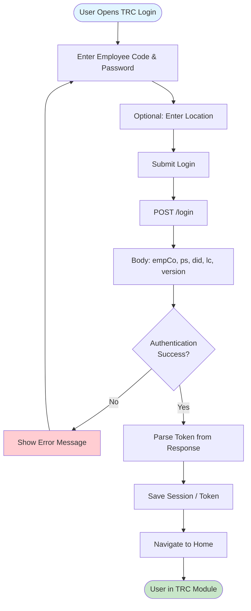

---

## 2. Logout Flow

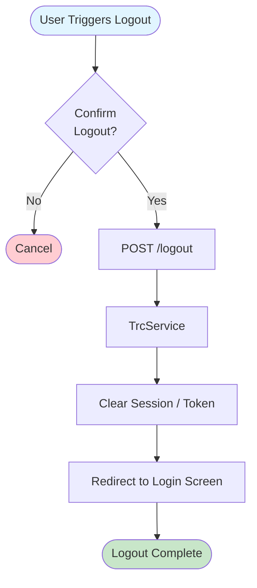

---

## 3. MPin Flow

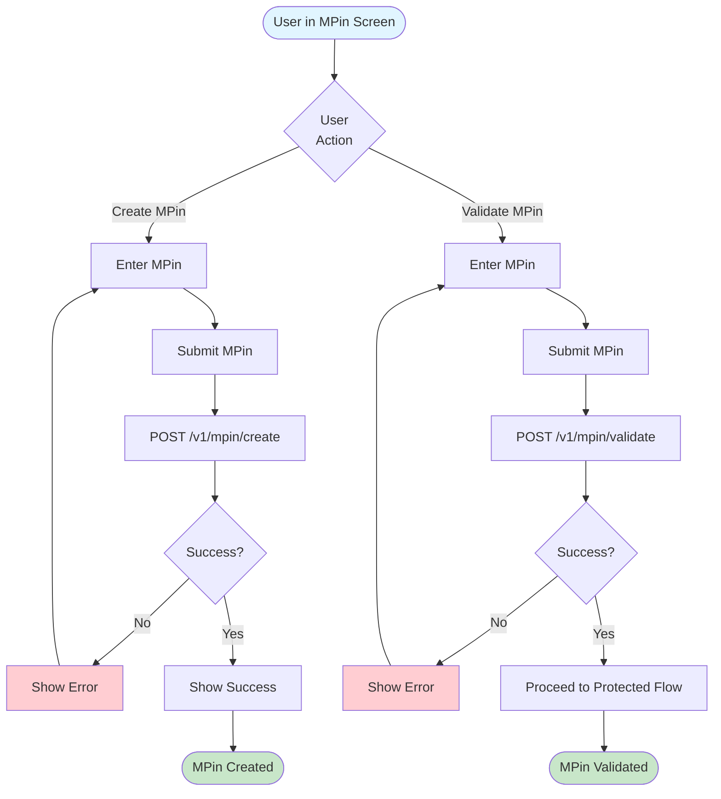

---

## 4. TRC Module Navigation Flow

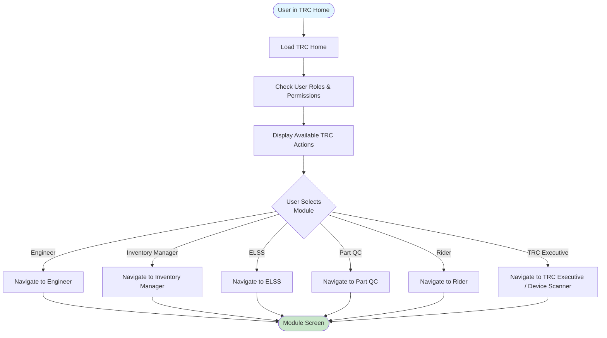

---

## 5. Engineer Module Flow

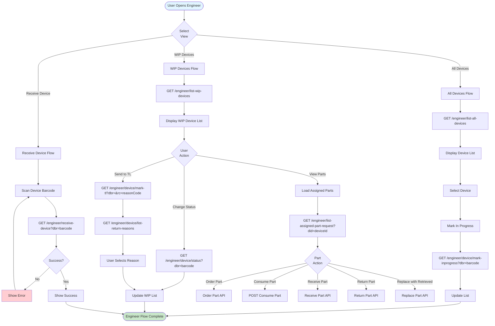

---

## 6. Inventory Manager Flow

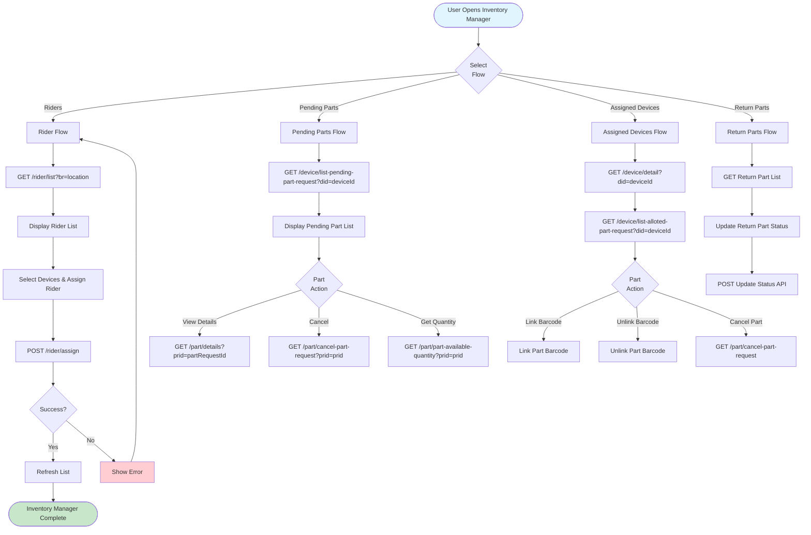

---

## 7. ELSS Flow

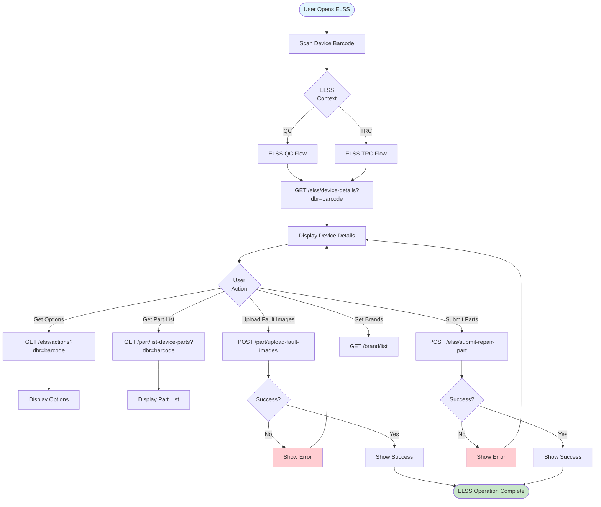

---

## 8. Part QC Flow

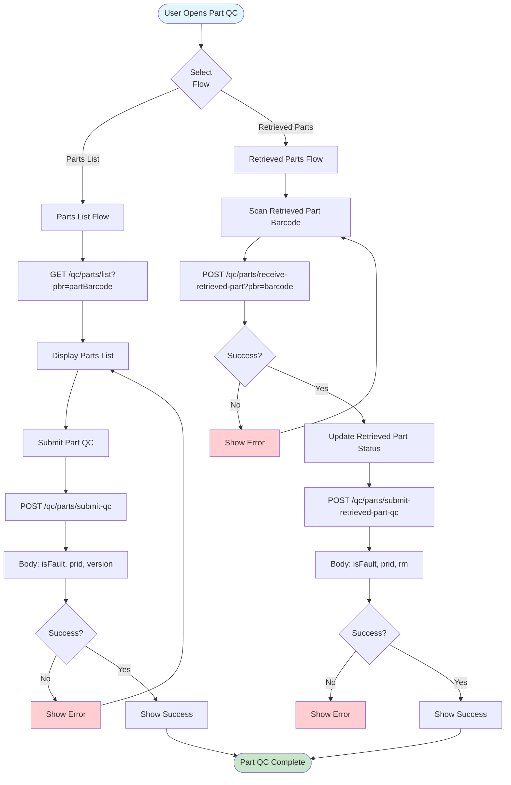

---

## 9. Rider Flow

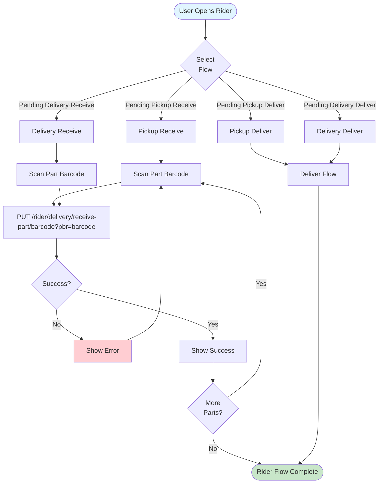

---

## 10. TRC Executive / Device Scanner Flow

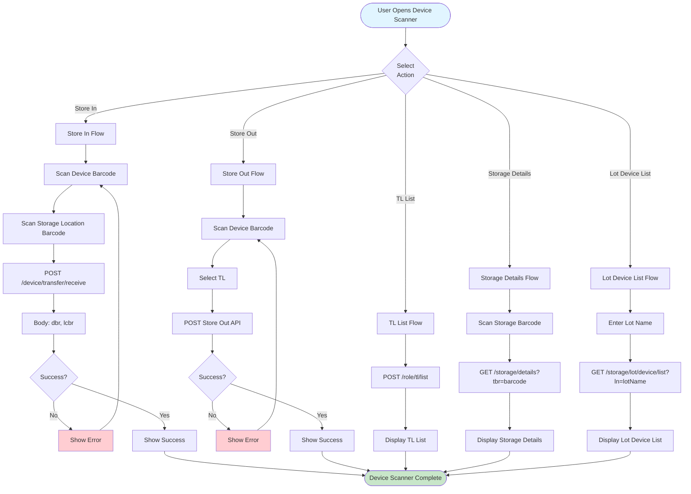

---

## 11. State Management Flow

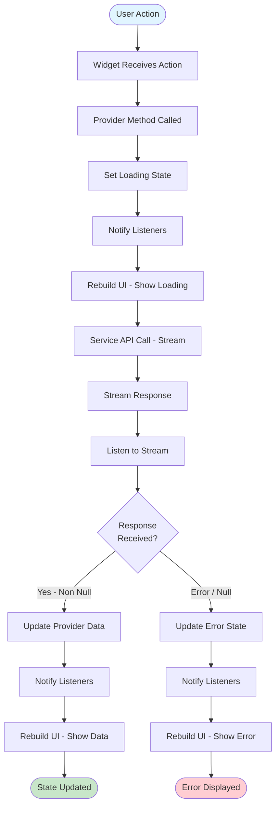

---

## 12. Error Handling Flow

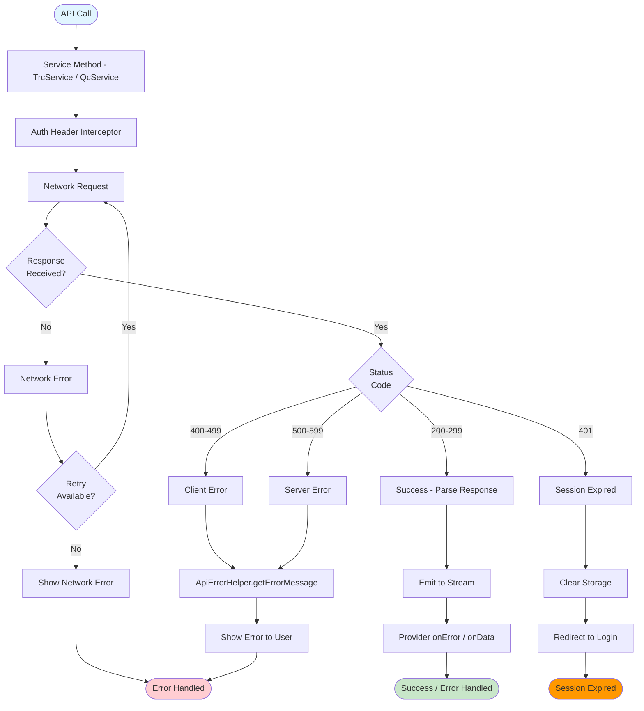

---

## Summary

This document provides flow diagrams for all TRC (`lib/src`) module operations. Each diagram shows:

- **Entry Points**: Where the flow starts
- **Decision Points**: User choices and system validations
- **API Calls**: Backend interactions via `TrcService`, `QcService`, or other services
- **Error Handling**: Error scenarios and recovery (stream `onError`, `ApiErrorHelper.getErrorMessage`)
- **Success Paths**: Successful completion flows (non-null response = success)

### Key TRC Modules

| Module | Location | Key Services |
|--------|----------|--------------|
| Login | `modules/login` | TRCLoginService – POST /login |
| Home | `modules/home` | HomeScreenService – POST /logout |
| MPin | `common/mpin` | MPinService – create/validate MPin |
| Engineer | `modules/engineer` | EngineerAPIService – receive, list, mark in progress, parts |
| Inventory Manager | `modules/inventory_manager` | InventoryService – riders, parts, devices |
| ELSS | `modules/elss` | ElssService – device details, options, parts, submit |
| Part QC | `modules/part_qc` | PartQcServiceElss, RetrievedPartQcService |
| Rider | `modules/rider` | RiderService, pickup/delivery receive/deliver APIs |
| TRC Executive | `modules/trc_executive` | DeviceScannerService – store in/out, TL list, storage |

All diagrams use Mermaid syntax and can be rendered in any Markdown viewer that supports Mermaid diagrams.

---

*End of TRC Module Flow Diagrams*
