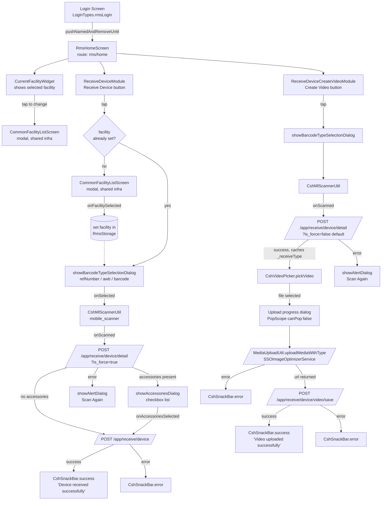

# RMS Module — Full Context & Flow

> **Scope**: This document describes the current Flutter implementation of the **RMS (Receive Management System)** module as-is. It captures every screen, navigation edge, provider, API contract, storage key, and cross-module dependency so that any engineer can understand or extend the module without re-tracing the code.
>
> **Source root**: [flutter_module/lib/rms/](../../flutter_module/lib/rms/)
> **Size**: 24 Dart files (19 non-generated, 5 `.g.dart` codegen artifacts)

---

## 1. Overview

RMS — Receive Management System — is the inbound-device intake module of the Cashify TRC Android app. Its job is narrow and well-defined: a warehouse user, scoped to a single facility at a time, scans an inbound device (by AWB / Reference / Barcode) and either **receives** it into the facility's inventory or **records a video** for that device.

Users enter RMS via the role-based login path (`LoginTypes.rmsLogin`) — there is no in-app navigation tile or deeplink into RMS. Once inside, the home screen exposes exactly two top-level actions, both anchored to the currently-selected facility: **Receive Device** and **Create Video**. Both flows share the same first step (barcode scan + device detail lookup) and diverge after that.

At a glance:

| Dimension | Count |
|---|---|
| Top-level subfolders | 3 ([home/](../../flutter_module/lib/rms/modules/home/), [facility_list/](../../flutter_module/lib/rms/modules/facility_list/), [receive_device/](../../flutter_module/lib/rms/modules/receive_device/)) |
| Screens (`BaseScreen` subclasses) | 2 (`RmsHomeScreen`, `FacilityListScreen`) |
| Builder components (`@CshComponent`) | 2 (`RmsHomeComponent`, `FacilityListComponent`) |
| Providers (`CshChangeNotifier`) | 2 (`ReceiveDeviceModuleProvider`, `CreateVideoModuleProvider`) |
| Dialogs / bottom sheets | 2 (`showBarcodeTypeSelectionDialog`, `showAccessoriesDialog`) |
| Backend endpoints | 3 (all POST under `/app/receive/device*`) |
| Local storage keys | 1 (`facility`) |
| User flows | 2 (Receive Device, Create Video) |

---

## 2. Module structure

All paths relative to repo root.

### Root ([flutter_module/lib/rms/](../../flutter_module/lib/rms/))

| File | Purpose |
|---|---|
| [rms_routes.dart](../../flutter_module/lib/rms/rms_routes.dart) | Static `RmsRoutes.getRoutes()` — registers two named routes into the global router |
| [rms_component_registry.dart](../../flutter_module/lib/rms/rms_component_registry.dart) | `RmsComponentRegistry.getRegisteredComponent(key, jsonConfig)` — resolves component keys to widgets for the builder framework |

### Home submodule ([modules/home/](../../flutter_module/lib/rms/modules/home/))

| File | Purpose |
|---|---|
| [screens/rms_home_screen.dart](../../flutter_module/lib/rms/modules/home/screens/rms_home_screen.dart) | `RmsHomeScreen extends BaseScreen` — thin wrapper around `PageWidget(pageKey: "RMS_home_screen")`. Route: `rms/home` |
| [screens/rms_home_screen.g.dart](../../flutter_module/lib/rms/modules/home/screens/rms_home_screen.g.dart) | Codegen artifact from `@CshPage` annotation |
| [components/rms_home_component.dart](../../flutter_module/lib/rms/modules/home/components/rms_home_component.dart) | `RmsHomeComponent extends StatelessComponent<NoneConfigModel>` — component-key `RMS_home_component`, returns `RmsHomeWidget` |
| [components/rms_home_component.g.dart](../../flutter_module/lib/rms/modules/home/components/rms_home_component.g.dart) | Codegen artifact from `@CshComponent` annotation |
| [widgets/rms_home_widget.dart](../../flutter_module/lib/rms/modules/home/widgets/rms_home_widget.dart) | Actual UI: `CurrentFacilityWidget` + `ReceiveDeviceModule` + `ReceiveDeviceCreateVideoModule` stacked in a padded `Column`. Holds a `GlobalKey<CurrentFacilityWidgetState>` to refresh facility display after selection |

### Facility List submodule ([modules/facility_list/](../../flutter_module/lib/rms/modules/facility_list/))

> All actual facility list UI lives in [src/common/facility_list/](../../flutter_module/lib/src/common/facility_list/) (shared infra). The RMS-side files are thin wrappers that register the screen as an RMS-owned route/component so role-scoped navigation works.

| File | Purpose |
|---|---|
| [screens/facility_list_screen.dart](../../flutter_module/lib/rms/modules/facility_list/screens/facility_list_screen.dart) | `FacilityListScreen extends BaseScreen<FacilityListScreenArg>` — passes `onFacilitySelected` callback through `FacilityListScreenArg` → `BaseArguments` → `PageWidget.initialValue`. Route: `/rms/facility_list`. Static helper `openFacilityScreen(context, onFacilitySelected: ...)` uses `Navigator.pushNamed` |
| [screens/facility_list_screen.g.dart](../../flutter_module/lib/rms/modules/facility_list/screens/facility_list_screen.g.dart) | Codegen artifact |
| [components/facility_list_component.dart](../../flutter_module/lib/rms/modules/facility_list/components/facility_list_component.dart) | `FacilityListComponent` — component-key `RMS_facility_list_component`, delegates rendering to shared `FacilityListWidget` (from `src/common/facility_list/widgets/`) via `paramBuilder` |
| [components/facility_list_component.g.dart](../../flutter_module/lib/rms/modules/facility_list/components/facility_list_component.g.dart) | Codegen artifact |
| `models/`, `resources/`, `widgets/` | Empty directories — placeholders only |

### Receive Device submodule ([modules/receive_device/](../../flutter_module/lib/rms/modules/receive_device/))

| File | Purpose |
|---|---|
| [widgets/receive_device_module.dart](../../flutter_module/lib/rms/modules/receive_device/widgets/receive_device_module.dart) | `ReceiveDeviceModule extends StatelessWidget` — orchestrates the **Receive Device** user flow end-to-end: facility check → barcode type dialog → scanner → `getDeviceDetails` → (conditional) accessories dialog → `receiveDevice`. Wraps itself in a per-button `ChangeNotifierProvider<ReceiveDeviceModuleProvider>` |
| [widgets/receive_device_create_video_module.dart](../../flutter_module/lib/rms/modules/receive_device/widgets/receive_device_create_video_module.dart) | `ReceiveDeviceCreateVideoModule extends StatelessWidget` — orchestrates the **Create Video** user flow: barcode type dialog → scanner → `getDeviceDetails` → video picker → upload (with progress dialog) → `saveVideo` |
| [widgets/barcode_type_selection_dialog.dart](../../flutter_module/lib/rms/modules/receive_device/widgets/barcode_type_selection_dialog.dart) | Top-level function `showBarcodeTypeSelectionDialog(context, onSelected: ...)` — `showCshBottomSheet` with three `CshBigButton`s in UI order: Reference Number, Awb Number, Barcode |
| [providers/receive_device_module_provider.dart](../../flutter_module/lib/rms/modules/receive_device/providers/receive_device_module_provider.dart) | `ReceiveDeviceModuleProvider extends CshChangeNotifier`. Methods: `transformData(Map<String,String>) → List<AccessoriesData>`, `getDeviceDetails(barcode, barcodeType) → Future<List<AccessoriesData>>`, `receiveDevice(barcode, barcodeType, facilityId, accessoriesList) → Future<String>` |
| [providers/create_video_module_provider.dart](../../flutter_module/lib/rms/modules/receive_device/providers/create_video_module_provider.dart) | `CreateVideoModuleProvider extends CshChangeNotifier`. Internal state: `_receiveType: int?`, `_fileUploadProgressStream: StreamController<int>.broadcast()`. Methods: `getDeviceDetails(barcode, barcodeType) → Future<bool>` (caches `_receiveType`), `uploadVideoFile(file, fileName) → Future<String>` (returns uploaded URL), `saveVideo(barcode, barcodeType, videoUrl) → Future<bool>` |
| [resources/receive_device_service.dart](../../flutter_module/lib/rms/modules/receive_device/resources/receive_device_service.dart) | Static methods: `receiveDevice`, `getDeviceDetails`, `saveVideo` — all use `RmsService().post(...)` |
| [resources/receive_device_detail_response.dart](../../flutter_module/lib/rms/modules/receive_device/resources/receive_device_detail_response.dart) | `ReceiveDeviceDetailResponse extends BaseResponse` — JSON fields `rt` (receiveType: int?), `acc` (accessoriesMap: Map<String,String>?). Generated by `@JsonSerializable` |
| [resources/receive_device_detail_response.g.dart](../../flutter_module/lib/rms/modules/receive_device/resources/receive_device_detail_response.g.dart) | Codegen artifact |
| [resources/accessories_data.dart](../../flutter_module/lib/rms/modules/receive_device/resources/accessories_data.dart) | Simple data class — `name: String`, `value: String`, `isSelected: bool = false`. Used by `transformData` and `showAccessoriesDialog` |
| [dialog/show_accessories_dialog.dart](../../flutter_module/lib/rms/modules/receive_device/dialog/show_accessories_dialog.dart) | Top-level function `showAccessoriesDialog(context, list, onAccessoriesSelected: ...)`. `showCshBottomSheet` containing a `StatefulBuilder` with a `ListView.separated` of `CshCheckbox` rows + a "Proceed" `CshBigButton`. On submit, `removeWhere(isSelected == false)` so only checked items are passed to the callback |
| [barcode_types.dart](../../flutter_module/lib/rms/modules/receive_device/barcode_types.dart) | `enum BarcodeTypes { awb(1), refNumber(2), barcode(3) }` |
| [receive_type.dart](../../flutter_module/lib/rms/modules/receive_device/receive_type.dart) | `enum ReceiveType { internal(1), reverse(2), customerRoutedToStore(3) }` with `fromValue(int)` factory. **Note**: defined but not referenced in the current RMS code — see §12 |
| [l10n.dart](../../flutter_module/lib/rms/modules/receive_device/l10n.dart) | `L10n extends BaseL10n` — 4 strings: `receiveDevice`, `createVideo`, `uploadingVideo`, `videoUploadedSuccessfully` |

---

## 3. Entry & routing

### Entry point

A user lands in RMS exclusively through the post-login dispatch in [collector_user_controller.dart](../../flutter_module/lib/src/modules/login/resources/collector_user_controller.dart):

```dart
case LoginTypes.rmsLogin:
  Navigator.of(context).pushNamedAndRemoveUntil(RmsHomeScreen.route, (route) => false);
  break;
```

The `pushNamedAndRemoveUntil` removes all prior login screens from the stack, so `rms/home` becomes the navigation root for an RMS user. There is **no** home dashboard tile, no deeplink, and no inter-module bridge into RMS — role is the only gate.

### Route registration

Routes are merged into the global app router by [app.dart:134](../../flutter_module/lib/src/app.dart):

```dart
routes.addAll(RmsRoutes.getRoutes());
```

`RmsRoutes.getRoutes()` from [rms_routes.dart](../../flutter_module/lib/rms/rms_routes.dart):

| Route name | Screen class | Arguments | Notes |
|---|---|---|---|
| `rms/home` | `RmsHomeScreen` | none | Defined as `static const String route = "rms/home"` — **no leading slash** |
| `/rms/facility_list` | `FacilityListScreen` | `FacilityListScreenArg(onFacilitySelected: Function(FacilityListData))` | Defined as `static const String route = "/rms/facility_list"` — **leading slash present**, inconsistent with the home route |

### Component registry

For the dynamic builder framework, [rms_component_registry.dart](../../flutter_module/lib/rms/rms_component_registry.dart) maps component keys to widget instances:

| Component key | Component class | Returns |
|---|---|---|
| `RMS_home_component` | `RmsHomeComponent` | `RmsHomeWidget` |
| `RMS_facility_list_component` | `FacilityListComponent` | `FacilityListWidget(onFacilitySelected)` from shared `src/common/facility_list/` |

---

## 4. Screen & navigation flow

The diagram below covers every navigable surface in RMS. Solid arrows are user-initiated; dashed arrows are programmatic (callback completion).



### Key navigation calls

- `Navigator.pushNamedAndRemoveUntil(RmsHomeScreen.route, ...)` — login → home
- `FacilityListScreen.openFacilityScreen(context, onFacilitySelected: cb)` — pushes `/rms/facility_list` with `FacilityListScreenArg`. **Currently invoked only indirectly via the shared `CommonFacilityListScreen` flow** in the home widget and receive-device widget
- `CommonFacilityListScreen.openFacilityScreen(context, onFacilitySelected: cb)` — direct push of the shared modal facility picker (from `src/common/facility_list/screens/`)
- `Navigator.pop(context)` — dismisses dialogs (barcode type, accessories), the scanner overlay, the upload progress dialog, and the alert dialog
- No `Navigator.push` of any RMS-specific destination beyond `FacilityListScreen`. The "Receive Device" and "Create Video" buttons run a sequence of dialogs and APIs in place — they do not push new screens

---

## 5. User flow walkthroughs

### 5.1 Flow A — Receive Device

```mermaid
sequenceDiagram
    autonumber
    actor U as User
    participant Home as RmsHomeScreen / ReceiveDeviceModule
    participant Storage as RmsStorage (GetStorage)
    participant Picker as CommonFacilityListScreen
    participant Dlg as showBarcodeTypeSelectionDialog
    participant Scn as CshMlScannerUtil
    participant Prov as ReceiveDeviceModuleProvider
    participant API as RmsService (POST)
    participant AccDlg as showAccessoriesDialog

    U->>Home: tap "Receive Device"
    Home->>Storage: AppPreferences.rms.getFacility()
    alt facility is null
        Home->>Picker: openFacilityScreen(onFacilitySelected)
        U->>Picker: pick facility
        Picker-->>Home: FacilityListData
        Home->>Storage: AppPreferences.rms.setFacility(facility)
    end
    Home->>Dlg: showBarcodeTypeSelectionDialog
    U->>Dlg: pick refNumber | awb | barcode
    Dlg-->>Home: BarcodeTypes
    Home->>Scn: openScanner(BarcodeFormat.all)
    U->>Scn: scan barcode
    Scn-->>Home: onScanned(scannedData, controller)
    Home->>Home: CshLoading.showLoading(); controller.stop()
    Home->>Prov: getDeviceDetails(scannedData, barcodeType)
    Prov->>API: POST /app/receive/device/detail?is_force=true<br/>{v: scannedData, vt: barcodeType.value}
    API-->>Prov: ReceiveDeviceDetailResponse(rt, acc)
    Prov-->>Home: List<AccessoriesData> (empty if acc==null)
    Home->>Home: CshLoading.hideLoading()
    alt accessories non-empty
        Home->>AccDlg: showAccessoriesDialog(list)
        U->>AccDlg: tick accessories + Proceed
        AccDlg-->>Home: selected accessories (isSelected==false filtered out)
    end
    Home->>Prov: receiveDevice(scannedData, barcodeType, facilityId, accessoriesList)
    Prov->>API: POST /app/receive/device<br/>{v, fid, vt, acc?}
    API-->>Prov: BaseActionResponse(successMessage)
    Prov-->>Home: successMessage
    Home->>U: CshSnackBar.success(successMessage)
```

**Notes on the flow**

- `is_force` is hard-coded to `true` for this flow (forces device-detail lookup even if cached/duplicate)
- If `accessoriesMap == null` in the response, the accessories dialog is skipped entirely and `receiveDevice` is called with `accessoriesList = null`. The provider then sends `"acc": null` in the request body
- After the user closes the accessories dialog (whether by Proceed or by dismissing), `controller.start()` is re-invoked after a 500 ms delay to resume the scanner — but the receive call has already fired in the Proceed path, so this start is effectively only for the dismiss-path

### 5.2 Flow B — Create Video

```mermaid
sequenceDiagram
    autonumber
    actor U as User
    participant Home as RmsHomeScreen / ReceiveDeviceCreateVideoModule
    participant Dlg as showBarcodeTypeSelectionDialog
    participant Scn as CshMlScannerUtil
    participant Prov as CreateVideoModuleProvider
    participant API as RmsService (POST)
    participant Vid as CshVideoPicker
    participant Up as MediaUploadUtil + SSOImageOptimizerService
    participant Prog as Upload progress dialog

    U->>Home: tap "Create Video"
    Home->>Dlg: showBarcodeTypeSelectionDialog
    U->>Dlg: pick refNumber | awb | barcode
    Dlg-->>Home: BarcodeTypes
    Home->>Scn: openScanner(BarcodeFormat.all)
    U->>Scn: scan barcode
    Scn-->>Home: onScanned(scannedData, controller)
    Home->>Home: CshLoading.showLoading(); controller.stop()
    Home->>Prov: getDeviceDetails(scannedData, barcodeType)
    Prov->>API: POST /app/receive/device/detail?is_force=false<br/>{v, vt}
    API-->>Prov: ReceiveDeviceDetailResponse(rt, acc)
    Prov->>Prov: _receiveType = response.rt
    Prov-->>Home: true
    Home->>Home: pop scanner; CshLoading.hideLoading(); 500ms delay
    Home->>Vid: pickVideo()
    U->>Vid: pick video file
    Vid-->>Home: File
    Home->>Prog: show progress dialog (StreamController<int>)
    Home->>Prov: uploadVideoFile(file, fileName)
    Prov->>Up: uploadMediaWithType(file, MediaContentType.mp4, onProgress)
    loop progress events
        Up-->>Prov: onProgress(percent)
        Prov-->>Prog: _fileUploadProgressStream.add(percent)
    end
    Up-->>Prov: uploaded url
    Prov-->>Home: url
    Home->>Prog: Navigator.pop (close progress dialog)
    Home->>Prov: saveVideo(scannedData, barcodeType, url)
    Prov->>API: POST /app/receive/device/video/save<br/>{v, vt, rt, vu}
    API-->>Prov: BaseActionResponse
    Prov-->>Home: true
    Home->>U: CshSnackBar.success('Video uploaded successfully')
```

**Notes on the flow**

- `is_force` defaults to `false` here (named parameter not passed)
- The provider caches `_receiveType` from the detail response and reuses it in `saveVideo` as the `rt` request field. `_receiveType!` is force-unwrapped — if the detail response returned `rt == null`, saveVideo will throw at runtime
- The progress dialog uses `PopScope(canPop: false)` so the user cannot back out during upload
- Upload progress percentages above 100 are clamped to 100 in the dialog's `StreamBuilder`

---

## 6. State management

Both providers extend `CshChangeNotifier` (from `package:core/core.dart`, itself a `ChangeNotifier` subclass). They are scoped via `ChangeNotifierProvider` wrapped around each button widget — meaning each button has its **own** provider instance, not a screen-level one.

### 6.1 `ReceiveDeviceModuleProvider`

[providers/receive_device_module_provider.dart](../../flutter_module/lib/rms/modules/receive_device/providers/receive_device_module_provider.dart)

| Aspect | Value |
|---|---|
| Instance scope | Per-button (wrapped in `ChangeNotifierProvider` inside `ReceiveDeviceModule.build`) |
| Mutable state | None — stateless, future-returning |
| Helper | `transformData(Map<String,String>) → List<AccessoriesData>` |
| Async methods | `getDeviceDetails(barcode, barcodeType) → Future<List<AccessoriesData>>`, `receiveDevice(barcode, barcodeType, facilityId, accessoriesList) → Future<String>` |
| Data sources | `ReceiveDeviceService` (API only) — no storage or route-param reads |
| Error path | `Completer.completeError(ApiErrorHelper.getErrorMessage(error).toString())` |
| Lifecycle | No `dispose` override — nothing to clean up |

`receiveDevice` filters by `Validator.isListNullOrEmpty(accessoriesList)` — if the list is null or empty, no `accessoriesMap` is built, and the field is sent as `null` in the request body.

### 6.2 `CreateVideoModuleProvider`

[providers/create_video_module_provider.dart](../../flutter_module/lib/rms/modules/receive_device/providers/create_video_module_provider.dart)

| Aspect | Value |
|---|---|
| Instance scope | Per-button (wrapped in `ChangeNotifierProvider` inside `ReceiveDeviceCreateVideoModule.build`) |
| Mutable state | `_receiveType: int?` (captured from detail response, consumed by `saveVideo`), `_fileUploadProgressStream: StreamController<int>.broadcast()` |
| Exposed getter | `fileUploadProgressStream` |
| Async methods | `getDeviceDetails(barcode, barcodeType) → Future<bool>` (side effect: sets `_receiveType`), `uploadVideoFile(file, fileName) → Future<String>`, `saveVideo(barcode, barcodeType, videoUrl) → Future<bool>` |
| Data sources | `ReceiveDeviceService` + `MediaUploadUtil` + `SSOImageOptimizerService` |
| Error path | Same as above — `Completer.completeError(ApiErrorHelper.getErrorMessage(error).toString())`; upload errors are forwarded raw |
| Lifecycle | **No `dispose` override** — the `StreamController` is never closed. See §12 |

---

## 7. API surface

All three endpoints use the same `RmsService` plumbing — see [src/services/rms_service.dart](../../flutter_module/lib/src/services/rms_service.dart):

- Extends `BaseService`
- Service group: `TRCServiceGroups.rms`
- `isToAddUserAuth() = true` — appends `CoreHeaders.xSSOToken` to outgoing headers
- `isToAddAuthorization()` returns `addAuthorization` (constructor flag, default `false`)
- All RMS calls go through `RmsService().post(path, fromJson, body: jsonEncode(req))` and return a `Stream<T?>`

### 7.1 `POST /app/receive/device/detail?is_force={bool}` — getDeviceDetails

Defined in [receive_device_service.dart](../../flutter_module/lib/rms/modules/receive_device/resources/receive_device_service.dart).

**Request body**

| Field | JSON key | Type | Source |
|---|---|---|---|
| barcode | `v` | `String` | scanned value from `CshMlScannerUtil` |
| barcodeType | `vt` | `int` | `BarcodeTypes.value` (1 / 2 / 3) |

**Query string**: `is_force` — `true` in the Receive Device flow, `false` (default) in the Create Video flow.

**Response** — [receive_device_detail_response.dart](../../flutter_module/lib/rms/modules/receive_device/resources/receive_device_detail_response.dart) (`ReceiveDeviceDetailResponse extends BaseResponse`):

| Field | JSON key | Type | Used by |
|---|---|---|---|
| receiveType | `rt` | `int?` | `CreateVideoModuleProvider._receiveType` (cached) |
| accessoriesMap | `acc` | `Map<String, String>?` | transformed by `ReceiveDeviceModuleProvider.transformData` |
| cashifyAlert (inherited from `BaseResponse`) | per `BaseResponse` | — | shared infra alerting |
| trackUrl (inherited from `BaseResponse`) | per `BaseResponse` | — | shared infra tracking |

**Callers**
- `ReceiveDeviceModuleProvider.getDeviceDetails(...)` — uses both `acc` (transformed to list) and ignores `rt`
- `CreateVideoModuleProvider.getDeviceDetails(...)` — uses only `rt`, ignores `acc`

**Error handling**: stream-based — `.listen(onError: ...)` → `ApiErrorHelper.getErrorMessage(error)` → `completer.completeError(message)`. Surface error rendered as `showAlertDialog(title: "Scanned Value - $scannedData", desc: message, posBtnText: "Scan Again")` in both flows.

### 7.2 `POST /app/receive/device` — receiveDevice

**Request body**

| Field | JSON key | Type | Notes |
|---|---|---|---|
| barcode | `v` | `String` | |
| facilityId | `fid` | `int` | read from `AppPreferences.rms.getFacility()?.id` (defaults to `0` if null) |
| barcodeType | `vt` | `int` | `BarcodeTypes.value` |
| accessoriesMap | `acc` | `Map<String, String>?` | built from selected (`isSelected == true`) accessories only; sent as `null` if list null/empty |

**Response** — `BaseActionResponse.fromJsonWithInt` (from `src/common/model/base_action_response.dart`). The provider returns `event?.successMessage ?? "Device received successfully"`.

**Caller**: `ReceiveDeviceModuleProvider.receiveDevice(...)`.

**Error handling**: same stream pattern; UI shows `CshSnackBar.error(error.toString())`.

### 7.3 `POST /app/receive/device/video/save` — saveVideo

**Request body**

| Field | JSON key | Type | Notes |
|---|---|---|---|
| barcode | `v` | `String` | |
| barcodeType | `vt` | `int` | `BarcodeTypes.value` |
| receiveType | `rt` | `int` | from cached `CreateVideoModuleProvider._receiveType!` — **force-unwrapped** |
| videoUrl | `vu` | `String` | URL returned by `MediaUploadUtil.uploadMediaWithType` |

**Response** — `BaseActionResponse.fromJsonWithInt`. Provider returns `true` on completion (does not read the success message).

**Caller**: `CreateVideoModuleProvider.saveVideo(...)`.

**Error handling**: stream pattern → `CshSnackBar.error(...)`.

---

## 8. Storage

[src/libraries/get_storage/rms_storage.dart](../../flutter_module/lib/src/libraries/get_storage/rms_storage.dart) defines `RmsStorage extends BaseStorage` with a single storage type `StorageType.rmsStorage`. The backend is **GetStorage** (file-based key-value), **not MMKV** — note the package path `lib/src/libraries/get_storage/` and the `BaseStorage` lineage.

### Keys

| Key (string literal) | Type | Serialization | Default |
|---|---|---|---|
| `"facility"` (enum `_RmsPreferencesKeys.facility`) | `FacilityListData` | `jsonEncode(facility)` / `jsonDecode(value)` → `FacilityListData.fromJson` | `null` (no facility selected) |

### Read sites

| Caller | File | Purpose |
|---|---|---|
| `RmsHomeWidget` | [widgets/rms_home_widget.dart](../../flutter_module/lib/rms/modules/home/widgets/rms_home_widget.dart) | Passes `getFacility` reference to `CurrentFacilityWidget` (which reads on `initState` / `refresh`) |
| `ReceiveDeviceModule._onReceiveDeviceButtonClicked` | [widgets/receive_device_module.dart](../../flutter_module/lib/rms/modules/receive_device/widgets/receive_device_module.dart) | Checks if facility is set before proceeding; falls back to selection if null |
| `ReceiveDeviceModule._onProceed` (inside `onScanned`) | same | Reads `facility.id` (defaults to `0`) to pass as `facilityId` in the receive call |

### Write sites

| Caller | File | Purpose |
|---|---|---|
| `RmsHomeWidget` (via `CurrentFacilityWidget`'s `setFacility` ref) | [widgets/rms_home_widget.dart](../../flutter_module/lib/rms/modules/home/widgets/rms_home_widget.dart) | When user changes facility from home |
| `ReceiveDeviceModule._getFacility` | [widgets/receive_device_module.dart](../../flutter_module/lib/rms/modules/receive_device/widgets/receive_device_module.dart) | When user picks facility from the Receive flow first-time path |

Both write sites are wrappers around `AppPreferences.rms.setFacility(facility)`. The lookup helper `AppPreferences.rms` lives in [src/libraries/shared_preferences/app_preferences.dart](../../flutter_module/lib/src/libraries/shared_preferences/app_preferences.dart) and returns the singleton `RmsStorage` instance.

---

## 9. Cross-module dependencies

### 9.1 Shared infrastructure from `flutter_module/lib/src/`

| Symbol | Source | Used for |
|---|---|---|
| `CurrentFacilityWidget` | [src/common/facility_list/widgets/current_facility_widget.dart](../../flutter_module/lib/src/common/facility_list/widgets/current_facility_widget.dart) | The facility chip on the RMS home screen; exposes `CurrentFacilityWidgetState.refresh()` |
| `CommonFacilityListScreen` | [src/common/facility_list/screens/facility_list_screen.dart](../../flutter_module/lib/src/common/facility_list/screens/facility_list_screen.dart) | The actual facility-picker modal; pushed when facility is unset |
| `FacilityListWidget` | [src/common/facility_list/widgets/facility_list_widget.dart](../../flutter_module/lib/src/common/facility_list/widgets/facility_list_widget.dart) | Rendered inside `FacilityListComponent` |
| `FacilityListData`, `FacilityListResponse` | [src/common/facility_list/resources/facility_list_response.dart](../../flutter_module/lib/src/common/facility_list/resources/facility_list_response.dart) | Facility model |
| `FacilityListScreenArg`, `FacilityListPageParamKeys`, `FacilityListPageParamModel` | [src/common/facility_list/models/facility_list_param_model.dart](../../flutter_module/lib/src/common/facility_list/models/facility_list_param_model.dart) | Page-param plumbing for the builder framework |
| `CshMlScannerUtil` | [src/common/utils/csh_ml_scanner_util.dart](../../flutter_module/lib/src/common/utils/csh_ml_scanner_util.dart) | Opens the `mobile_scanner` overlay; provides `ResetLastScannedBarcode` |
| `CshVideoPicker` | [src/common/utils/csh_video_picker.dart](../../flutter_module/lib/src/common/utils/csh_video_picker.dart) | Video selection |
| `ResetLastScannedBarcode`, `trc_scanner_widget` | [src/common/widgets/trc_scanner_widget.dart](../../flutter_module/lib/src/common/widgets/trc_scanner_widget.dart) | Scanner state reset helper used in error paths |
| `MediaUploadUtil`, `MediaContentType`, `SSOImageOptimizerService` | [src/utils/media_upload/](../../flutter_module/lib/src/utils/media_upload/) | Chunked SSO-authenticated media upload with progress callback |
| `BaseService`, `ServiceGroupsMixin`, `TRCServiceGroups` | [src/services/](../../flutter_module/lib/src/services/) | HTTP base class, service group config |
| `RmsService` | [src/services/rms_service.dart](../../flutter_module/lib/src/services/rms_service.dart) | RMS-specific HTTP service; adds `x-sso-token` header via `CoreHeaders.xSSOToken` |
| `BaseActionResponse`, `BaseResponse` | [src/common/model/base_action_response.dart](../../flutter_module/lib/src/common/model/base_action_response.dart) and `core_widgets` | Standard response envelopes |
| `AppPreferences`, `BaseStorage`, `StorageType` | [src/libraries/](../../flutter_module/lib/src/libraries/) | Storage facade + base class |
| `RmsPageGroup`, `RmsComponentGroup`, `NoneConfigModel` | [src/app_builder/app_builder_groups/rms_groups.dart](../../flutter_module/lib/src/app_builder/app_builder_groups/rms_groups.dart) and `src/app_builder/app_headers/` | Builder-framework groupings for `@CshPage` / `@CshComponent` annotations |

### 9.2 External packages

| Package | Used for |
|---|---|
| `builder_project` | `BaseScreen`, `BaseArguments`, `PageWidget` — page lifecycle and arg plumbing |
| `builder_component` | `StatelessComponent`, `paramBuilder` — component framework |
| `csh_annotation` | `@CshPage`, `@CshComponent` — codegen-driven registration |
| `core` | `CshChangeNotifier`, `ApiErrorHelper`, `Validator` |
| `core_widgets` | `CshBigButton`, `CshTextNew`, `CshCheckbox`, `CshSnackBar`, `CshLoading`, `showCshBottomSheet`, `showAlertDialog`, `Dimens`, `BaseL10n`, `BaseResponse`, `CoreHeaders` — UI kit + base classes |
| `calculator_ui` | UI utilities re-exported (used by `ReceiveDeviceModule` and `ReceiveDeviceCreateVideoModule`) |
| `provider` | `ChangeNotifierProvider`, `Provider.of` — DI/state plumbing |
| `mobile_scanner` | `BarcodeFormat.all` constant for the scanner |
| `json_annotation` | `@JsonSerializable`, `@JsonKey` — response codegen |
| `intl` | `Intl.message(...)` — localization strings in `L10n` |
| `path` | `path.basename(file.path)` — filename extraction during upload |

---

## 10. Permissions & native plugins

| Capability | Plugin / Util | Required permission | Owner of runtime request |
|---|---|---|---|
| Barcode scanning | `mobile_scanner` (wrapped by `CshMlScannerUtil`) | `android.permission.CAMERA` | The `mobile_scanner` plugin requests it on `MobileScannerController.start()`; RMS code does not call a permission API directly |
| Video selection | `CshVideoPicker` (wrapper around platform file picker) | iOS: `NSPhotoLibraryUsageDescription` / Android: `READ_EXTERNAL_STORAGE` (`READ_MEDIA_VIDEO` on Android 13+) | Owned by the picker plugin |
| Local key-value storage | `get_storage` package | none — uses app-private storage | n/a |

There is **no explicit permission request code** anywhere under [flutter_module/lib/rms/](../../flutter_module/lib/rms/). All runtime prompts are delegated to the underlying plugins.

---

## 11. Analytics

A repo-wide search across the RMS sources finds **no `logAnalyticsEvent`, `Analytics.track`, `FirebaseAnalytics`, or similar explicit event-fire calls**. RMS does not emit any feature-level analytics events.

Screen-view analytics for `RmsHomeScreen` and `FacilityListScreen` flow passively through the app-level route observers registered at the router (`CshRouteObserver` and `FirebaseAnalyticsObserver` configured by the host app — outside the RMS module). Whether that satisfies the product team's analytics requirements for RMS is unknown and is called out as an open question in §12.

---

## 12. Known gaps & open questions

These are points observed during exploration that any engineer touching RMS should be aware of:

1. **Unused `ReceiveType` enum** — [receive_type.dart](../../flutter_module/lib/rms/modules/receive_device/receive_type.dart) defines `ReceiveType { internal(1), reverse(2), customerRoutedToStore(3) }` with a `fromValue(int)` factory, but no RMS code references it. The provider stores `_receiveType` as a raw `int?` and forwards it as `int` to the `saveVideo` API. Either the enum is dead code or the integration is incomplete.

2. **Force-unwrapped `_receiveType!` in `CreateVideoModuleProvider.saveVideo`** — if the detail response returns `rt == null`, `saveVideo` will throw at runtime. There is no guard between `getDeviceDetails` and `saveVideo` to catch this.

3. **`StreamController<int>` is never closed** — `CreateVideoModuleProvider._fileUploadProgressStream` is allocated in the constructor but the provider has no `dispose()` override. Since the provider lives inside a `ChangeNotifierProvider` scoped to the create-video button widget, it survives across button taps; closing/recreating the controller per-upload is not done.

4. **Route name inconsistency** — `RmsHomeScreen.route = "rms/home"` (no leading slash) vs `FacilityListScreen.route = "/rms/facility_list"` (leading slash). Both work because the global router accepts either form, but the inconsistency is a smell.

5. **Empty placeholder directories** — `flutter_module/lib/rms/modules/facility_list/models/`, `.../resources/`, and `.../widgets/` are present but empty. They suggest planned-but-not-built structure.

6. **GetStorage vs MMKV** — RMS uses GetStorage (file-based) via `BaseStorage(StorageType.rmsStorage)`. Other parts of the app appear to use MMKV (e.g., [src/libraries/shared_preferences/app_preferences.dart](../../flutter_module/lib/src/libraries/shared_preferences/app_preferences.dart)). The split is intentional today but worth re-evaluating if storage is ever unified.

7. **No analytics events emitted from RMS** — see §11. Is this an intentional product decision (rely on passive screen-view tracking) or a gap to fill?

8. **`facilityId` defaults to `0` when facility is null** — in [receive_device_module.dart](../../flutter_module/lib/rms/modules/receive_device/widgets/receive_device_module.dart):

   ```dart
   int facilityId = AppPreferences.rms.getFacility()?.id ?? 0;
   ```

   The code path that reaches this line first guarantees a facility is set, so the `?? 0` should be unreachable — but it would silently pass `fid: 0` to the API if the guarantee were ever broken.

9. **Shared `CurrentFacilityWidget` and `CommonFacilityListScreen` live outside `rms/`** — they are imported from `src/common/facility_list/`. RMS depends on them but does not own them. Any change to those shared widgets affects RMS and any other module that uses them.

10. **No unit or widget tests** — there is no `__test__` or `test/` subtree under `flutter_module/lib/rms/`, and a search of `flutter_module/test/` finds no RMS-specific tests.
